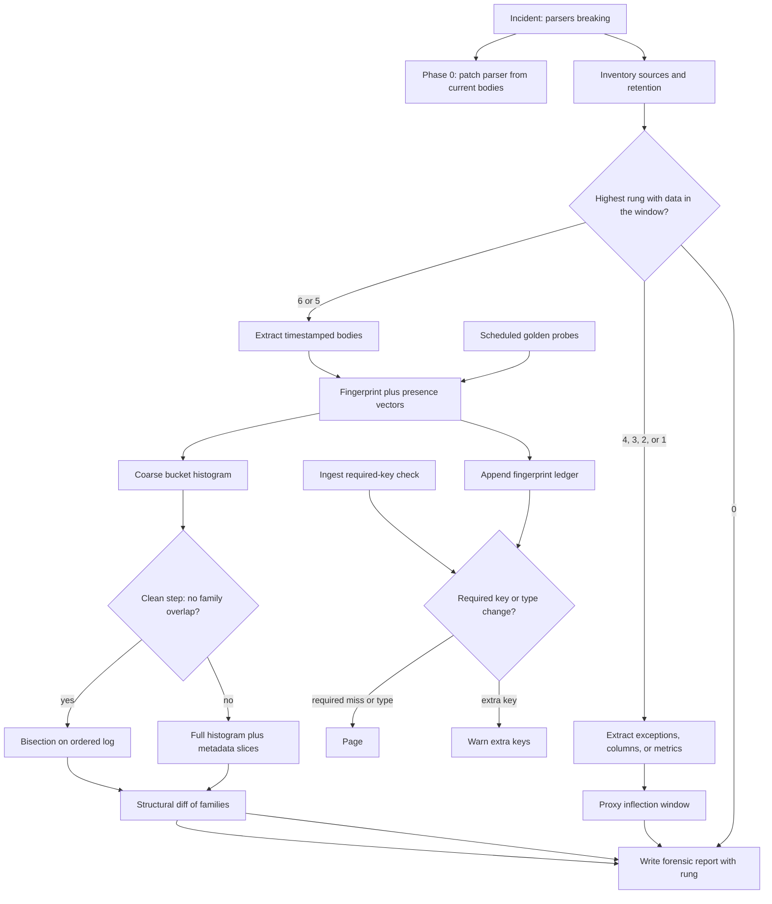

# LLM Schema Drift Forensics — System Design
> - **Document Status**: Draft
> - **Last Updated**: 2026 Aug 29
> - **Author**: Paul Serban

This document is the mechanical *how* for the system described in the [Architecture Document](./02_architecture_document.md). It specifies fingerprinting, the monotonicity check, bisection, histogram fallback, structural diff, degraded-evidence paths, and the contract monitor. It does not specify code.

## 1. Control Flow

Two paths that share a fingerprint function and almost nothing else.

**Invariant:** Phase 0 does not enter the analyzer. Current traffic is enough to see the new keys. Dating them is a different job.

## 2. Schema Fingerprint

The fingerprint is the comparable identity of a response **shape**. Values are discarded on purpose.

### 2.1 Path+type extraction

Walk the JSON value recursively.

- Object: for each key, emit path `parent.child` (dot-separated; keys containing dots are escaped, not split). Recurse.
- Array: emit the path with a `[]` suffix meaning "array of," then recurse into **element-type union**, not per index. A three-element array of objects with keys `{a}` and `{a,b}` and `{a}` contributes paths `p[].a` and `p[].b`, both optional at the element level.
- Primitives: emit `(path, type)` where type is one of `string`, `number`, `boolean`, `null`.
- Empty array: `(path, array_empty)` — distinct from "array of objects," because `[]` carries no element schema. A flip from `array_empty` to `array<object>` on a field that is *sometimes* empty is not a schema change; a flip from `array<object>` to `string` is.
- Empty object: `(path, object_empty)` similarly.

Canonical form: sort the `(path, type)` pairs lexicographically, encode, hash (any collision-resistant hash; the hash is an identity, not a security boundary). Store both the hash and the path-set (the set is needed for diffs; the hash is needed for grouping).

Do **not** include:

- values
- object key insertion order
- array length (length is data; type of elements is schema — except if you have a documented fixed-length tuple, which LLM JSON almost never is)
- whitespace / JSON encoding differences

### 2.2 Presence, because optional keys are not drift

A single body's fingerprint that includes every present key will **churn** on any optional field. That churn is the default LLM behavior.

Alongside the hash of the *observed* path-set, compute a **presence vector** against a **baseline path universe**:

1. In a baseline window believed to be pre-change (the inventory's last-known-good side, or the earliest third of the lookback if you do not yet know), collect every path seen at least once.
2. For each later body, mark each baseline path present/absent, and record any **novel** paths not in the baseline.
3. Aggregate presence **rates** per path per time bucket: `present_count / bodies_in_bucket`.

Interpretation rules:

| Observation | Treat as |
| --- | --- |
| Path rate stable in a band (e.g. 30–70%) across the whole lookback | Optional field. Not a change. |
| Path rate drops from ~high (e.g. >90%) to ~0 and stays there | Removal (or type-change that made it unparseable as this path). |
| Novel path rate rises from 0 to ~high and stays there | Addition. |
| Path rate drops from ~high to mid and a novel path of the same type rises complementarily | **Candidate rename.** |
| Path type at the same path flips (string → object) and stays flipped | Type change. |
| One-bucket spike then return | Noise, canary blip, or a bad deploy of *your* parser. Do not call it *the* change without looking at neighboring buckets. |

The **required-key fingerprint** used by the monitor is a hash of the subset of paths declared required in the contract, each with an expected type. Optional paths do not enter that hash. That is how the monitor avoids paging on ordinary optionality. [ADR-003](./04_architecture_decision_records.md#adr-003).

### 2.3 Wrapper vs model JSON

Many LLM HTTP APIs wrap the model output:

- envelope keys: `id`, `choices`, `usage`, `model`, `system_fingerprint`, …
- the actual structured payload: often a **string** at `choices[0].message.content` that is itself JSON, or a structured object if the vendor's JSON-mode / tool-call API is used

Fingerprint **both layers**, separately:

- **Envelope fingerprint**: vendor HTTP schema. A change here is a platform API change.
- **Payload fingerprint**: the parsed inner JSON (or tool-call `arguments` object) that *your* code keys into.

The incident in the prompt is usually the inner payload. Envelope changes do happen (token-usage field renames are a known genre). Mixing the two layers into one hash will blame the model for an envelope change and vice versa.

If inner content is a non-JSON string (markdown, free text), payload fingerprinting does not apply. That is a different product. This design covers **JSON you parse**.

### 2.4 Invalid and truncated bodies

- Unparseable JSON: fingerprint `INVALID`. Track rate. A surge in `INVALID` can *be* the incident (they started returning YAML, or a markdown fence around the JSON). Include it as a family.
- Truncated responses (length limit): often drop trailing keys. A fingerprint family that is a prefix of another, correlated with `finish_reason=length`, is **not** a vendor schema change. Filter these before the overlap check or they will fake a second family.

## 3. Timeline Reconstruction: Bisection and Its Kill Switch

### 3.1 Coarse histogram first, always

Before any binary search, bucket the lookback (illustrative: 6-hour buckets; re-bucket to 1-hour if the interesting region is small). For each bucket compute:

- counts per fingerprint hash (full observed shape)
- presence rates for baseline and novel paths
- share of `INVALID` and truncated

This view answers: is there a step, a ramp, a mixture, or nothing?

### 3.2 Overlap check (the kill switch)

Pick the two (or few) **dominant** families after discarding truncated and one-off hashes below a noise floor (illustrative: <0.5% of the bucket, unless that 0.5% is the entire canary — judgment, recorded).

**Monotonic step (bisection licensed)** if and only if:

- there exists a time T such that family A dominates before T and family B after T, **and**
- the number of B samples before T and A samples after T is explainable by clock skew / in-flight requests (illustrative: a handful, clustered at the boundary), **not** a multi-hour mixed regime.

**Overlap (bisection forbidden)** if both families appear at non-trivial rates in the same buckets for longer than the skew margin. This is the canary / regional / alias case.

Record the decision in the report. Running bisection after a failed overlap check is a defect, not a shortcut. [ADR-002](./04_architecture_decision_records.md#adr-002).

### 3.3 Bisection (only if licensed)

Input: the ordered list of retained bodies (or fingerprint rows) in the lookback, sorted by response timestamp.

Predicate `isNew(sample)`: sample's family is B (the post-change dominant family).

Procedure: classic binary search for the **first** index where `isNew` is true, with the extra rule that if a mid-point is truncated/`INVALID`/noise, skip to a neighbor rather than treating it as signal.

Output: timestamp T of that first new sample, plus the previous old sample's timestamp. The bound is `[T_last_old, T_first_new]`. On a dense log this can be seconds. On a sparse log it is the gap between those two retained samples — **do not interpolate**. If you sampled at 1% and the two bounding samples are four hours apart, the bound is four hours. Claiming "T ± 30s" because bisection is O(log n) is confusing algorithmic steps with clock resolution.

Cost: O(log n) predicate evaluations if you compute fingerprints lazily off stored bodies; O(n) if fingerprints are already materialized, in which case bisection is optional theater and you can just scan for the first new. **Once fingerprints are in a table, a scan is simpler and equally correct.** Bisection earns its keep when fingerprinting a body is expensive (huge payloads, cold object storage GET per body) and n is large. That is the realistic "replay log in S3" case. If the week already fits in a parquet file, scan it.

### 3.4 Histogram fallback

For each bucket and each metadata slice (model, region, endpoint, system_fingerprint):

- proportion of each family
- presence-rate series for the paths that moved

Output: a window from last bucket that is still "old-like" to first bucket that is "new-like," plus a description of the mixture ("~20% new in us-east from Tue 00:00, ~100% new globally by Thu 18:00"). That **is** the answer. Tightening it to a single T would be a lie.

If slices disagree (region A flipped, region B did not), the report has **per-slice bounds**, not one global T. Downstream parsers in only one region will have seen a different "when."

### 3.5 Proxy inflection (rungs 1–4)

No bodies, or only extracted columns:

- **Exception logs**: time of first `KeyError: 'foo'` (and last log line that successfully read `foo`, if success was logged — often it was not). Bound: `[last_success_or_unknown, first_exception]`. The replacement key is **not** in this data.
- **Columns**: null-rate series per extracted field. Inflection on a field you stored. New fields you did not store remain invisible. The report must say "fields we tracked" not "the schema."
- **Metrics**: parse-fail % inflection. Widest useful bound; no key names.
- **Tickets**: anecdotal bounds; treat as rung 1 even if the ticket is assertive.

Inflection detection: do not overfit a CUSUM on 5-minute noise. A human-visible step on the dashboard you already have is enough. The value of the forensic exercise at these rungs is **naming the bound and the rung**, plus using **current** bodies (which you do have) for the structural diff of *now vs nothing*. You can still diff current schema against *documented* expected keys (your parser's required set). That answers **what** (now) without answering **when** precisely.

## 4. Structural Diff

Given path-sets of family A and family B (union of paths with presence rate above a floor in each family, to drop one-off optional noise):

| Set | Meaning |
| --- | --- |
| In A, not B (high presence in A) | Removed or renamed-away |
| In B, not A (high presence in B) | Added or renamed-to |
| In both, type differs | Type change |
| In both, type same | Unchanged (may still have value-format changes — **out of scope**) |

**Candidate rename** if there is a pair (p_old, p_new) such that:

- p_old in removed, p_new in added
- same type
- presence rates in the transition window are complementary (p_old + p_new ≈ the old p_old rate)
- optionally, similar names (edit distance, shared suffix) — this is supporting color, not a requirement. `summary` → `brief` will pass; `a` → `completely_different_object` might still be a rename semantically and will look like remove+add. **Do not claim rename without complementarity.** With complementarity, claim **candidate rename**.

Produce a short table in the report. Attach one redacted example body from each family (if policy allows) so a reader can see the shape without re-running the job.

## 5. Metadata Correlation

Join fingerprint rows to request metadata. Typical fields worth slicing, when present:

| Field | Why it matters |
| --- | --- |
| Model alias (`gpt-4o`, `latest`, …) | Floating aliases are the usual trigger. |
| Snapshot / version id / `system_fingerprint` | A flip here coincident with the schema step is the strongest *your-data* explanation. |
| Endpoint / API version (`/v1/chat/completions` vs a new API) | Envelope vs payload. |
| Region | Staged cloud rollouts. |
| Account / project id | Per-tenant flags. |
| Task / prompt-template id | Schema change only on one product surface — might be *your* prompt change, not the vendor. **Check your own deploys in the same window.** |
| Temperature / JSON-mode / tool-call flags | Different code paths at the vendor; a "schema change" that only appears when JSON-mode is off is a you-problem. |

**Your own deploys.** The prompt says the LLM API changed. Before concluding that, diff *your* serving-path releases in the lookback: parser changes, prompt changes, a library bump that started wrapping keys. A forensic pipeline that cannot distinguish "we shipped a prompt that asked for `brief` instead of `summary`" from "the vendor renamed a key" will spend a week blaming OpenAI. The inventory includes **your** git/deploy timeline as a first-class source. It is not request/response data, but it is data you have, and excluding it is how you write a confident wrong postmortem.

## 6. Evidence-Source Extraction Notes

### 6.1 Application logs / APM traces

Bodies may be truncated by log max-size. A truncated body is not a schema. Prefer traces that stored the payload as a blob/object over log lines that interpolated JSON into a 16 KB message.

Timestamps: use **provider response time** if logged, else ingest time, and record which. Mixing them smears T.

### 6.2 Object-storage replay logs

Best case for bisection-as-optimization: one object per request, cold GETs. Fingerprint lazily during bisection; after finding T, fingerprint a dense neighborhood and a sample of both sides for the diff.

### 6.3 Warehouse columns

Each column is a path you cared about *last month*. Query `COUNT(*) FILTER (field IS NULL) / COUNT(*)` by day. Do not UNION a "schema" from `information_schema` and call it the vendor schema.

### 6.4 Exception logs

Parse the missing key out of the exception message. Group by key name over time. First-seen per key is an upper bound on *that key's* disappearance. Multiple keys disappearing on different days may be two incidents, or a rolling rollout, or two parsers.

### 6.5 Current traffic

Always available. Always used for "what does it look like **now**." Never sufficient by itself for "when," unless you also have history.

## 7. Contract Monitor Mechanics

### 7.1 Required contract

Per serving surface, a declared list of required `(path, type)` that the product cannot function without. This list is **yours**, not the vendor's. Extra keys are allowed. Optional keys may be listed separately for metrics, not for paging.

Updating the contract is a deliberate change when you accept a vendor schema change (or when you stop using a field).

### 7.2 Ingest validation

After parse, for each required path: exists and type-matches. On failure:

- increment `schema_required_miss{surface,path}`
- emit structured log (path, model, request id) — **this log is next time's rung 3, and it is cheap**
- action per surface: pass / drop-from-downstream / hedge. Default pass+alert.

Do not attempt a "fuzzy match" of renamed keys on the hot path in v1. Fuzzy matching is how you silently accept `brief` as `summary` without noticing the contract moved. The monitor's job is to **notice**. Mapping new keys onto old is a parser patch, reviewed.

### 7.3 Golden probes

- Count: one (or few) prompt(s) per distinct contract. A prompt that forces the structured output you parse (JSON mode / tool call / response_format).
- Cadence: 15–60 minutes. Faster burns tokens and rate limit for no forensic gain; the SLO is "same day," actually "same hour."
- Isolation: skip application semantic caches; hit the provider (or the gateway's real path with cache bypass).
- Comparison: required-key fingerprint vs last-known-good. Extra keys → warn. Required miss or type change → page. Full-shape hash change with required keys intact → warn (optional fields shifted).
- Last-known-good updates **only** via explicit accept after a human looked at the diff.

### 7.4 Ledger retention

- Every probe: full fingerprint row + optional body (probes can use synthetic non-PII prompts, so retaining probe bodies is cheap and useful).
- Live traffic: fingerprint sample (0.1–1%) ; bodies only if policy allows, sampled harder.
- Retention: 90 days unless legal shortens. If shortened below the "we notice a week later" horizon, the business has chosen to be unable to date the next incident. Write that down.

## 8. Error Handling

| Class | Examples | Behavior |
| --- | --- | --- |
| **No evidence in window** | Retention 3 days, incident 7 days ago | Report rung 0/1/2 as applicable. Stop. Do not widen the query into unrelated older data from a different schema era and call it baseline. |
| **Retention gap inside the window** | Bodies for Mon–Wed deleted, Thu–now present | Do not interpolate fingerprints across the gap. Bound may include the gap as "unknown." |
| **Clock mess** | Mixed TZ, ingest vs response time | Normalize in inventory; widen the bound by the max plausible skew; do not bisect across mixed clocks. |
| **Truncation family** | Many prefix-shaped fingerprints | Filter via finish_reason/length; if you cannot, treat as noise floor. |
| **Your deploy coincides** | Prompt/parser release in the window | Investigate in parallel; the report must mention it even if the vendor also changed something. |
| **Probe auth fail** | 401 on golden probe | Page as probe-down, not as schema change. |
| **Vendor 5xx on probe** | Transient | Retry with backoff; do not flip last-known-good. Consecutive failures → probe-down. |
| **PII policy blocks body extract** | Legal says no | Fall back to fingerprints if already computed; else proxies. Do not copy bodies to a laptop "just for the investigation." |
| **Multiple new families** | A → B and C | Cluster; do not bisection-search a binary predicate. Histogram. |

## 9. Stop / Done Conditions

**Forensic job is done** when a report exists that states:

- the rung
- the algorithm (bisection / histogram / proxy inflection / cannot date)
- the bound (possibly unbounded on the left)
- the structural diff from the best available "what" (current vs parser contract, and vs historical families if bodies exist)
- caveats, including "new keys we never stored are invisible"

It is allowed to be done at rung 2 with a three-day window. It is not allowed to be done with a Tuesday 14:03 and no rung.

**Monitor is done** (Phase 4) when probes are scheduled, ingest validation is on the hot path, the ledger is retaining, and a drill (deliberately break a required key on a staging probe) pages.

## 10. Observability (minimum)

Forensic: the report *is* the observability. Plus the working queries saved next to it so they are rerunnable.

Monitor:

- `probe_success`, `probe_schema_mismatch`, `required_miss` (live), `extra_key` (live)
- ledger freshness (last probe time)
- alert: required miss, probe-down, ledger stale > 2 intervals

No new APM required. Use the channel that already pages the serving owner.

## 11. Security and privacy (brief)

- Bodies are customer content. Forensic extracts are production data: access-controlled, time-bounded, not in git, not in the report if the report is widely shared — the report contains **paths and types**, not values.
- Redacted example bodies in the report, if any, go through the same redaction as production logs.
- Probe prompts are synthetic. Do not replay a real user prompt as a "golden" probe.
- Production API keys in the probe runner: same secret store as serving. A dedicated key is better for attribution and blast radius.
