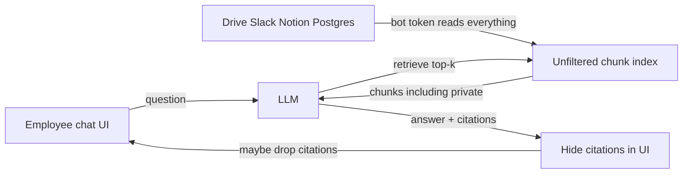
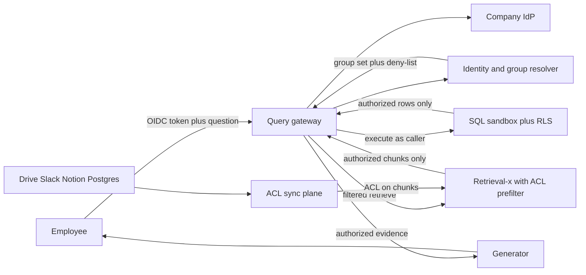
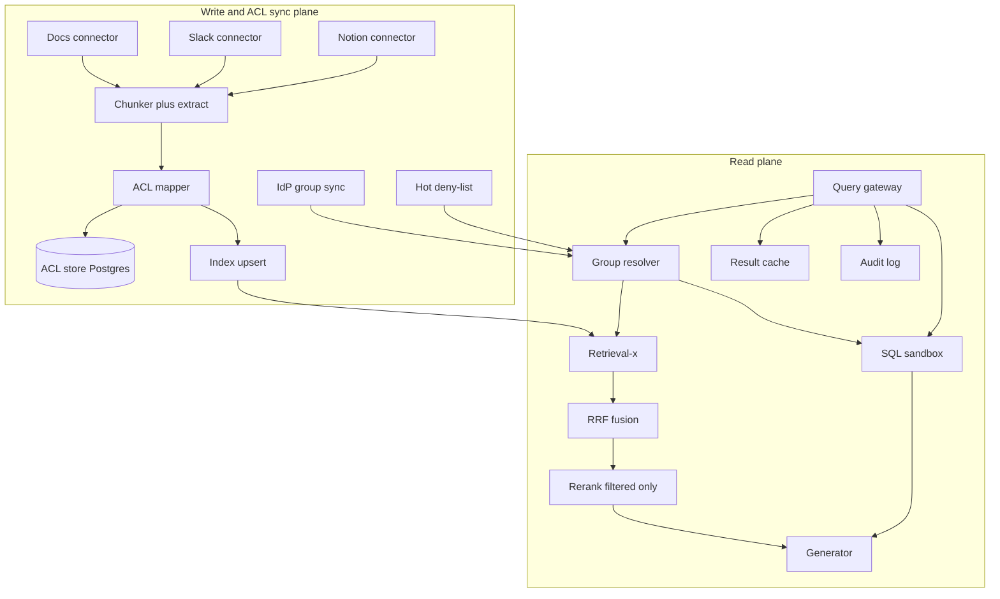

# Multi-Source RAG with Access Control — Architecture Document
> - **Document Status**: Draft
> - **Last Updated**: 2026 Aug 29
> - **Author**: Paul Serban

A retrieval-augmented assistant that federates a SQL database, a document store, and Slack/Notion-class sources, and **enforces the querying user's permissions inside the retrieval pipeline**. This document covers *what* the system is and *why* it is shaped this way; see [System Design](./03_system_design.md) for *how* ACL normalization, group-fanout pre-filters, cache keys, fusion, and RLS-backed SQL actually work, [Security and Access Control](./04_security_and_access_control.md) for the leakage analysis, and [Trade-offs and Honest Assessment](./06_tradeoffs_and_honest_assessment.md) for what this costs and when to buy instead of build.

## Overview

**Brief description**: An internal, identity-aware knowledge retrieval plane. It is not a chatbot skin, not a second copy of the hybrid retriever, and not "RAG plus a `user_id` column." Ingest connectors crawl sources **as a privileged indexer** and attach **end-user ACLs** to chunks. Query serving resolves the caller to groups, pre-filters the Tier 1.1 retrieval backend, federates SQL under the caller's database role, and refuses to put unauthorized bytes in the generator context.

**Business Context**
- See [Scenario and Requirements](./01_scenario_and_requirements.md) for the full framing. In short: four ACL languages, RAG-specific leakage (cache, rerank, multi-hop, chunk boundaries), and a revocation window that is a security SLA.
- Target users: platform architect, security/IAM, source owners, assistant on-call, legal/HR for corpus-inclusion policy.

## Requirements

### Functional Requirements

- **Authenticate**: every query carries a verified IdP token. Principal is taken from the token, not from the body.
- **Resolve identity**: expand nested groups to a bounded `group_id` set; attach a `principal_id` for share-to-person grants; attach a versioned `acl_context_hash` used in cache keys and audit.
- **Ingest documents and messages**: connectors pull docs/Slack/Notion (export or API), extract text, chunk with a versioned chunker, persist raw + chunks.
- **Ingest ACLs**: the same connectors (or a sibling ACL crawler) map source permissions into the normalized ACL model and denormalize **group IDs** (plus sparse user IDs) onto each chunk.
- **Index**: push chunks + ACL metadata into the Tier 1.1 retrieval service (BM25 + ANN, both filterable).
- **Retrieve**: query-time pre-filter `acl_group_ids ∩ user.groups OR acl_user_ids ∋ user`. Fail closed on missing ACL.
- **Federate**: run source retrieval in parallel (docs index, Slack index or partition, Notion partition, SQL tool), fuse ranked evidence, bound the context window.
- **SQL**: text-to-SQL or canned semantic layer; **execute** as the user (RLS). Never as a shared superuser.
- **Generate**: LLM sees only authorized evidence. Citations are a subset of that evidence, not a second, wider fetch.
- **Cache safely**: exact (and any future semantic) cache keys include `acl_context_hash`.
- **Audit**: log principal, acl context, chunk IDs, SQL fingerprint, cache hit/miss.
- **Revoke**: consume IdP and source webhooks where they exist; poll where they do not; maintain a hot deny-list for offboarding that is shorter than the general SLO.

### Non-Functional Requirements

**Performance Requirements:**
- Retrieval p99 is inherited from the Tier 1.1 backend **plus** identity resolution (must be a cache hit in the common case: low single-digit ms) **plus** SQL (separate budget; a warehouse query is not a 200 ms ANN lookup).
- Identity-resolution miss (cold group expand) may cost tens to low hundreds of ms and is **not** allowed to fail open.
- Live vendor ACL APIs are **not** on the query p99 path.

**Reliability Requirements:**
- ACL sync is at-least-once. Duplicate ACL upserts are idempotent. **Missing deletes are security bugs** (stale allow). Missing adds are quality bugs (false deny).
- If identity service or ACL metadata store is down: **fail closed** (503 or empty authorized set), not "search anyway."
- Source connector outage: that source's chunks age out of the "ACL fresh" watermark and **drop from retrieval** when past SLO, rather than serving maybe-stale allows. See [ADR-006](./05_architecture_decision_records.md#adr-006).

**Infrastructure Constraints:**
- Stack class: Python or TypeScript services, Postgres as the system of record for identities/ACL tuples/audit, the existing hybrid retrieval service as the search backend, company IdP, source vendor APIs.
- Hosting: internal VPC. The indexer credentials are crown jewels; they do not live in a laptop `.env` on demo day.
- Compliance: the corpus will contain PII, customer names, and accidentally-indexed secrets. Embeddings inherit classification. Query logs are a second copy of questions about those secrets.

**The defining constraint:**
- **The indexer can read more than any user.** If ACL metadata is wrong, the system is a privileged dump dressed as a helpful assistant. Architecture that treats ACL as "metadata we'll add later" is not architecture; it is a scheduled incident.

## Executive Summary

The scarce resource is not ANN RAM. It is **a correct, bounded, fail-closed function from (principal, chunk) → {allow, deny, unknown}**, maintained under four vendor ACL models, and applied on **every** path that can move source text toward a model.

**Architecture Style:** CQRS-ish: a write/sync plane that materializes ACL onto chunks; a read plane that only queries already-authorized views. Federated retrieval, not a single mega-index of "all company bytes." Not a plugin that asks Slack live. Not microservices-for-their-own-sake — the cuts follow **trust boundaries** (identity, ACL sync, retrieval, SQL execution, generation).

**Key Components:**
- **Query gateway**: authn, rate limit, orchestrates retrieve → generate; never bypasses the retrieval contract.
- **Identity / group resolver**: IdP groups, nested expansion, deny-list, `acl_context_hash`.
- **ACL store** (Postgres): normalized grants, per-source sync watermarks, `acl_generation`.
- **Source connectors**: Drive/Confluence-class, Slack, Notion, plus a SQL catalog crawler (for *what exists*, not for row ACLs — rows are RLS).
- **ACL sync workers**: webhook + poll; translate vendor ACL → normalized tuples; enqueue chunk ACL patches.
- **Indexing pipeline**: extract, chunk, attach ACL, upsert into retrieval-x. Privileged ingest identity.
- **Retrieval backend (Tier 1.1)**: hybrid search with **mandatory metadata filters**. This project does not reimplement it.
- **Federation / fusion**: per-source (or per-partition) retrieve, RRF, optional rerank **on already-filtered candidates only**.
- **SQL execution sandbox**: bind caller role, statement timeout, column/table allowlist, RLS.
- **Generation + context assembler**: authorized chunks only, token budget.
- **Result cache**: keyed on `(normalized_query, model, acl_context_hash, index_generation, prompt_version)`.
- **Audit log**: append-only retrieval events.
- **Quality / security observer**: over-filter rate, `acl_unknown`, revocation-drill probes, leakage canaries.

**Technology Stack (illustrative, class not SKU):**
- Identity: company IdP (OIDC) + SCIM or Graph/Directory API for group expansion.
- ACL + identity cache + audit: Postgres.
- Retrieval: existing `retrieval-x` (pgvector + Postgres FTS, or OpenSearch, as already chosen there) with filterable metadata fields.
- Queue: any at-least-once job queue for ACL patches and ingest.
- Secrets: company KMS; connector tokens rotated; no long-lived Slack user tokens in git.
- Observability: per-stage latency, ACL watermark lag per source, deny-list hit count, cache key collision tests.

**Architecture Principles:**
- **Retrieved text is disclosure.** If it can reach the model, it was authorized — or you have a bug.
- **Index-time denormalize, query-time intersect.** Do not walk Drive APIs per chunk at p99.
- **Groups, not user lists, as the default ACL atom.** User IDs only for share-to-person.
- **Fail closed on unknown.** Empty is legal. Leak is not.
- **The SQL database is the SQL ACL system of record.** We do not reimplement RLS in the prompt.
- **Cache is an ACL surface.** Keys that omit principal context are vulnerabilities.
- **Do not fork retrieval-x.** Consume it. ACL is a filter contract on that API.
- **Over-filter and under-filter are different severities.** Tune recall without relaxing deny.

**Key Architectural Decisions:**
1. Group-fanout pre-filter over per-user ACL lists. [ADR-001](./05_architecture_decision_records.md#adr-001)
2. Pre-filter over post-filter as the control; source-scoped indices as optional coarse cut. [ADR-002](./05_architecture_decision_records.md#adr-002)
3. Normalized ACL model, per-source connectors. [ADR-003](./05_architecture_decision_records.md#adr-003)
4. RLS-enforced SQL execution over prompt-restricted SQL. [ADR-004](./05_architecture_decision_records.md#adr-004)
5. Authorization context in every cache key. [ADR-005](./05_architecture_decision_records.md#adr-005)
6. Bounded revocation SLO + hot deny-list; not live vendor checks. [ADR-006](./05_architecture_decision_records.md#adr-006)
7. Consume Tier 1.1 retrieval; do not rebuild the funnel. [ADR-007](./05_architecture_decision_records.md#adr-007)
8. Fail closed on stale/unknown ACL. [ADR-008](./05_architecture_decision_records.md#adr-008)

### Context Diagram — current path (the anti-pattern)

The model already consumed private chunks. The UI filter is theater. A shared DB role makes SQL a second unfiltered index.

### Context Diagram — target path

### Component Diagram — write/sync plane vs read plane

## System Architecture (the two planes)

### Write / ACL sync plane

Connectors are **privileged**. They must see enough of each source to index it. That privilege is the blast radius of a stolen bot token. Compensating controls: scoped tokens per source, network egress allowlists to vendor APIs, rotation, and **never** exposing the connector identity as a query principal.

Each connector emits:

1. **Content events**: document/message/page created, updated, deleted.
2. **ACL events**: share changed, membership changed, inherited permission changed.

Content without ACL is **not searchable**. It may sit in the document lake as `unsearchable_pending_acl`. This is how you avoid the race "chunk went live, ACL arrives later" (that race is fail-open). See [System Design §2](./03_system_design.md#2-acl-model-and-index-time-denormalization).

ACL events patch metadata on existing chunks without re-embedding when text is unchanged. Membership-only changes should not cost an embedding call. Text changes re-chunk and must **re-attach** ACL (chunk IDs may change; old IDs deleted).

IdP sync is a separate connector: users, groups, memberships, nested edges. The resolver materializes a per-user group set. Offboarding publishes to the **hot deny-list** immediately (HR/IdP webhook), which the resolver consults **before** group cache. Deny-list is how you get a tighter SLO than full ACL re-crawl.

### Read plane

1. Gateway verifies OIDC, rejects forged identity.
2. Resolver returns `{principal_id, group_ids, deny, acl_context_hash, resolved_at}` or error → fail closed.
3. Cache lookup with that hash. Hit: still audit. Do not skip audit on cache hit.
4. Miss: parallel
   - filtered hybrid retrieve on docs/Slack/Notion partitions,
   - optional SQL path if the router says the question is structured,
5. Fusion on **authorized** lists only. Rerank on **authorized** lists only.
6. Context assembler (token budget) → generator.
7. Audit write (async, but must not be best-effort to `/dev/null`; lost audit is a compliance hole).

There is **no** "retrieve first, authorize later" helper available to the generator as a tool. If an agent loop needs a second retrieve, it calls the same gateway contract with the same principal. [Security — multi-hop](./04_security_and_access_control.md#rag-specific-leakage-vectors).

## Where the permission check lives

This is the architecture angle the scenario asks for. The comparison is the product.

| Placement | What it does | Leakage / failure | Verdict in this design |
| --- | --- | --- | --- |
| **UI only** | Hide citations / disable click-through | Model already saw text; answers paraphrase secrets; API clients skip the UI | Forbidden as the control |
| **Post-filter** | Retrieve k, drop unauthorized, maybe backfill | Unauthorized text in candidate set (rerank, logs, traces); existence via counts/scores; under-filled k; one missed `if` is a leak with no other control | Forbidden as the **sole** control. May exist as a **defense-in-depth assert** that should never fire (and pages if it does) |
| **Pre-filter** | Metadata predicate inside BM25 and ANN | Relies on index ACL freshness; filtered-ANN recall/latency at awkward selectivity; cannot express what you did not denormalize | **Default control** |
| **Source-scoped indices** | Separate index per Slack workspace / per Drive OU / per "secret" library | Coarse. Cannot express "this one file shared with three people" without a matching index (absurd) or falling back to metadata | **Optional coarse cut** (e.g. HR index that *no* general assistant queries; private-channel partition that still has membership filters) |
| **Live source check** | Ask Slack/Drive for each hit | p99 death; 429 fail-open temptation; still need an index of *what* to check | Not the primary path. Allowed as a **rare step-up** for a tiny, ultra-sensitive class if product insists — not v1 |
| **Prompt instruction** | "Don't reveal private data" | Models comply until they don't | Never a control |

**Hybrid that this architecture actually uses:** source-scoped partitions where the boundary is real and coarse (HR corpus not in the default index; Slack private vs public as partitions) **plus** group-fanout pre-filter on every partition **plus** a post-filter **assertion** that pages on violation **plus** RLS for SQL.

That is four mechanisms. They are not redundant fashion. They fail differently. See [Security](./04_security_and_access_control.md#pre-filter-vs-post-filter-vs-source-scoped-indices).

## Federation model

Sources are **not** flattened into one undifferentiated chunk soup without source identity. They are retrieved as **legs**:

- `docs` (Drive/Confluence-class)
- `slack` (public partition vs private partition)
- `notion`
- `sql` (not chunks; a tool result)

Each unstructured leg hits retrieval-x with the **same** ACL filter and a `source` term filter (or a physical partition). Fusion is Reciprocal Rank Fusion across legs, same as hybrid fusion inside a leg — ranks, not incomparable scores. SQL results enter the context assembler as structured evidence with their own citation type, not as fake chunks with a cosine score.

A source that is past its ACL freshness watermark is **dropped from the federation for that request** (fail closed on that leg), not searched "anyway." The user may get a degraded answer and a `sources_omitted: [slack]` flag. Silent omission of a source that is *usually* searched can itself leak ("why didn't it mention the incident channel?") — product choice: show degradation, do not search stale-allow.

## SQL path (architecturally the clean one)

The unstructured ACL problem is "mirror someone else's sharing model into a search index." The SQL problem is "the database already has a sharing model." **Use it.**

- Map IdP principal → database role (or a session user the RLS policies key off).
- Constrain statements: timeout, row cap, no multiple statements, read-only transaction, allowlisted schemas.
- Execute. RLS hides rows. Column grants hide salary.
- If the organization has no RLS today, **text-to-SQL is out of v1** for sensitive schemas. A semantic layer of curated, already-scoped views is the alternative. Do not invent application-layer row filters that duplicate RLS poorly.

This is why the honest assessment says: SQL+RLS is the *clean* subsystem; Slack/Notion/Drive sync is the *hard* one. Architecture should not spend hero energy re-implementing Postgres policies in Python while leaving Slack membership as a CSV dumped once.

## Caching

Allowed:

- Query-embedding cache: **not** principal-specific (the vector of the question is not a secret in the same way; still treat logs carefully).
- Retrieval result cache: **must** include `acl_context_hash`.
- Final-answer cache: **must** include `acl_context_hash` and prompt/model versions.

Forbidden:

- Caching "top chunks for this question" globally.
- Caching generator output globally because "the question is the same."
- A "public FAQ" cache mixed into the same keyspace without a dedicated `acl_context = public_only` that is actually a documented group.

See [ADR-005](./05_architecture_decision_records.md#adr-005).

## Scaling Strategy

This corpus is not 300M vectors. Scale pressure is:

- **ACL patch rate**: Drive share storms, Slack workspace invites, Notion page trees. The workers must keep watermarks inside SLO. Scale the sync workers and Postgres, not the ANN, first.
- **Group expansion**: cache per user; invalidate on SCIM events. Nested expansion is O(edges); bound it.
- **Filtered search**: high-cardinality `user_id` filters are the failure mode we avoid with groups. If a user is in 500 groups, the `OR` filter is wide; retrieval-x must be load-tested at that width. If it dies, the fix is **group compaction** (see System Design), not post-filter.
- **SQL**: the warehouse/OLTP will dominate p99 when the router chooses SQL. Do not hide that in the "RAG latency" SLO. Split SLOs: unstructured retrieve vs SQL tool.

## Cost Analysis

**Engineering time dominates.** Four connectors with ACL fidelity is the bill. Slack's permission model (workspace, channel, guest, Slack Connect, shared channels) is a product. Drive inheritance + domain-link + broken inheritance is a product. Notion's page tree is a product. Budget **quarters**, not a hackathon.

**Infra** is modest relative to [prj--rag-pipeline-at-scale](../../prj--rag-pipeline-at-scale/_docs/02_architecture_document.md): Postgres, a retrieval cluster sized for low millions of chunks, a worker fleet. The expensive infra mistake is **embedding the entire Slack history including DMs** you then cannot legally serve — wasted embed dollars *and* a data-retention problem.

**Vendor API rate limits** are a real cost: ACL crawls can 429 and fall behind SLO. That is an operational and possibly a **paid API** line item.

**LLM tokens** are the usual tax; authorization does not make generation cheaper. Over-filtering can *increase* retries and cost if the assistant keeps re-asking. Measure it; do not "fix" by loosening ACL.

**Buy-vs-build** may dominate the cost conversation. See [Trade-offs §4](./06_tradeoffs_and_honest_assessment.md#4-build-vs-buy).

## Observability (architecture-level)

If you cannot see these, you cannot operate a security-sensitive retriever:

- Per-source **ACL watermark lag** vs SLO.
- `acl_unknown` count (chunks skipped).
- **Assertion-fired** count (post-filter caught a pre-filter miss) — this is a sev-1 class metric even at 1.
- Resolver p99, deny-list size, group-set size histogram (p50/p95 groups per user).
- Cache hit rate **split by** whether `acl_context_hash` is present (a hit rate on a broken key is a leak indicator).
- Retrieval audit completeness (drops).
- Golden **canary queries**: a user who must never see fixture-doc X; run in prod continuously.

## What this architecture refuses to be

- A LangChain demo with `VectorStoreRetriever` and a note that "you should add auth."
- A single shared Slack bot token used as the query identity.
- An "admin toggle" in the chat UI that searches the unfiltered index.
- A promise of zero revocation lag.
- A second ANN cluster "for security."

## Unresolved by this document (Phase 0)

- Exact source SKUs (Google Drive vs Confluence vs SharePoint — the *shape* is the same; the API hell is not).
- Whether Slack is export-batch or Events API. Webhook completeness changes the SLO.
- Whether Postgres RLS already exists on the schemas the assistant must query.
- Legal: DMs, "anyone with the link," retention of Slack, training-use of prompts.
- The written revocation number (15 minutes is a stake in the ground, not a law).
