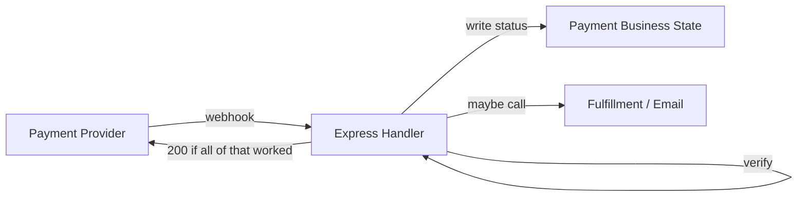
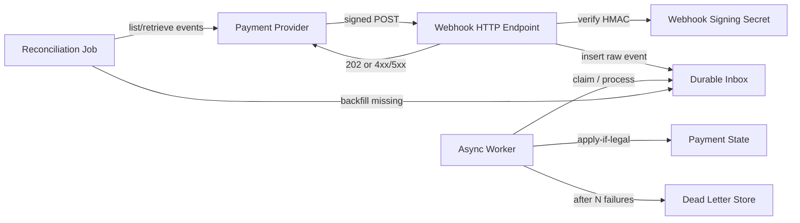
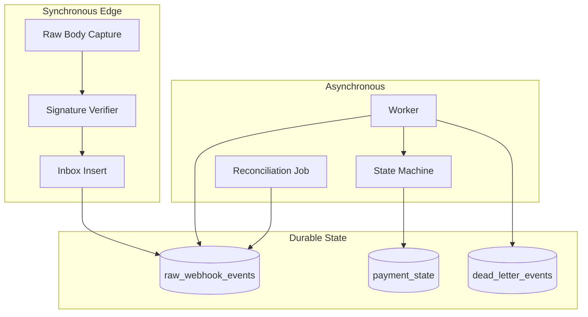
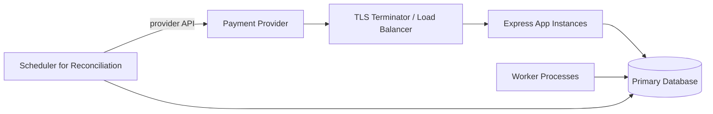

# Payment Webhook Ingestion — Architecture Document
> - **Document Status**: Draft
> - **Last Updated**: 2026 Aug 29
> - **Author**: Paul Serban

An Express webhook endpoint that receives events from a payment provider. The provider retries on any non-2xx, sometimes delivers the same event twice, and occasionally delivers events out of order. The system verifies authenticity, durably accepts the raw event, acknowledges immediately with `202 Accepted`, and applies business state asynchronously using the provider's event ID as an idempotency key.

## Overview

**Brief description**: This is not a payments product. It is the ingestion path that sits in front of whatever payment-state and fulfillment logic already exists, so that the provider's delivery semantics (at-least-once, unordered, retry-on-non-2xx) cannot corrupt that logic.

**Business Context**
- Owner: the team that already "owns an Express endpoint" for this provider (see [Scenario and Requirements](./01_scenario_and_requirements.md)).
- Current state: a synchronous handler that treats "HTTP 200" as "we processed the payment event." That coupling is the defect.
- Desired future state: the HTTP response means only "we have a durable, authentic copy of this event." Processing is a separate, retryable, idempotent pipeline.
- Goal: zero double-applies, zero silent drops after ack, correct final state despite out-of-order arrival — at the cost of eventual consistency and more moving parts.
- Target users: the owning engineer, payments on-call, and whoever runs reconciliation against the provider.

## Requirements

### Functional Requirements

- **Verification**:
  - The system must reject any request whose HMAC signature does not match the raw body and the configured webhook secret.
  - The system must reject requests whose timestamp falls outside a configured replay window.
  - The system must never persist an unverified payload as a trusted inbox row.
- **Acceptance**:
  - The system must persist the raw payload (and metadata: event ID, type, resource ID, received-at) before returning 2xx.
  - The system must treat a unique constraint collision on `(provider, event_id)` as success: the event was already accepted.
- **Processing**:
  - A worker, not the HTTP handler, applies the event to payment business state.
  - Application of an event is idempotent on `event_id`.
  - Application of an event is a no-op if it would move a payment object backward or into an illegal state (out-of-order / stale).
- **Failure**:
  - If the durable insert fails, the handler returns 5xx so the provider retries.
  - If processing fails after 2xx, the inbox row remains retryable; the provider is not involved.
  - After a bounded number of processing attempts, the event is dead-lettered and a reconciliation path can re-drive from the provider's API.

### Non-Functional Requirements

**Performance Requirements:**
- HTTP handler budget: verify + one insert. Target: well under the provider's timeout (typically 5–15 seconds; treat 1 second p99 for the handler as the design intent, not a measured SLA).
- Processing lag: eventual. Seconds is acceptable; minutes during an incident is recoverable; hours without a DLQ alert is not.
- Throughput: designed first for a single-node inbox table (see [ADR-004](./04_architecture_decision_records.md#adr-004)). Retry storms from the provider are expected and must not collapse the handler (the unique constraint turns storms into cheap no-ops once the first insert succeeded).

**Service Level Agreement (SLA):**
- System Criticality: money-adjacent. A lost `charge.succeeded` or a double fulfill is an incident, not a log line.
- The HTTP endpoint's availability matters because the provider's retry budget is finite. If the handler is down long enough, events can expire on the provider side. Reconciliation exists *because* that can happen; it is not a license to ignore handler availability.
- Recovery Time Objective (RTO) for processing: workers can be down for minutes if the inbox is intact. RTO for the handler itself is tighter — that is what stops the provider's retries from succeeding.
- Recovery Point Objective (RPO): once `202` is returned, RPO for that event is zero (it is in the inbox). Events never acked are the provider's problem until retries exhaust, then they become a reconciliation problem.

**Infrastructure Constraints:**
- Technology shape (not an implementation mandate): an HTTP server (Express is the scenario's given), a relational database used as the Phase 1 inbox, an async worker process, a dead-letter table or queue, a scheduled reconciliation job. A dedicated broker is a Phase 5 scale-out, not a day-one dependency ([ADR-004](./04_architecture_decision_records.md#adr-004)).
- The webhook secret is a credential. It lives in a secret store, is rotatable, and is never committed. Verification details are in this document and [System Design](./03_system_design.md); there is no separate security-architecture file because verification *is* the security architecture of this scenario.

## Executive Summary

The architecture is **Verify → Persist-Fast → Ack → Process-Async**. The HTTP handler is a narrow, synchronous, fail-closed acceptor. Everything that mutates payment state, talks to fulfillment, or sends email happens off the request path.

**Architecture Style:** Accept-and-defer (durable inbox + idempotent consumer), with a per-resource state machine as the ordering guard.

**Key Components:**
- **Signature Verifier**: HMAC over raw bytes, timing-safe compare, timestamp window.
- **Raw Event Store (durable inbox)**: unique on `(provider, event_id)`.
- **Async Worker**: claims inbox rows, applies events, records outcome.
- **Idempotency Guard**: unique constraint at insert; "already applied" check at process time.
- **Payment State Machine**: apply-if-newer / legal-transition only.
- **Dead-Letter Queue**: bounded retries, then isolation.
- **Reconciliation Job**: provider API as source of truth when the inbox and reality diverge.

**Architecture Principles:**
- **Ack means received, not processed.** A 2xx is a statement about the inbox, not about payment status.
- **The provider is not the retry mechanism for our internals.** Once we have acked, retries are our problem.
- **Duplicates are a success case.** They are not errors. The unique constraint is the feature.
- **Order is reconstructed, not assumed.** Delivery order is a rumor; the object's version is the fact.
- **Webhooks are hints.** Reconciliation against the provider's retrieve/list-events API is part of the architecture, not an incident procedure invented later.

**Key Architectural Decisions:**
1. Return `202 Accepted` after durable inbox insert; never write business state on the request path ([ADR-001](./04_architecture_decision_records.md#adr-001)).
2. Idempotency key is the provider `event_id`; payload hash is a secondary defense ([ADR-002](./04_architecture_decision_records.md#adr-002)).
3. Out-of-order handling is a state-machine guard, not a FIFO-everywhere requirement ([ADR-003](./04_architecture_decision_records.md#adr-003)).
4. Phase 1 inbox is a database table, with a documented trigger to a broker ([ADR-004](./04_architecture_decision_records.md#adr-004)).
5. HMAC is computed over the raw body; JSON parse-then-restringify is a signature bug waiting to happen ([ADR-005](./04_architecture_decision_records.md#adr-005)).

### The Anti-Pattern This Design Exists to Kill

This fails because:

- Handler latency is now the sum of verification, DB writes, and any side effects. The provider retries the whole chain.
- A timeout after commit looks like non-delivery. The retry double-applies unless every write and side effect is already perfectly idempotent — which the first version never is.
- Out-of-order events are applied as they arrive because there is no place to hold them against an object version.

### Context Diagram

## Runtime Architecture

1. **Synchronous edge (the Express route)**
   - Disable JSON body parsing for this route; capture raw bytes ([ADR-005](./04_architecture_decision_records.md#adr-005)).
   - Verify signature and timestamp.
   - Insert into the inbox, or detect duplicate.
   - Return status per [Status-Code Policy](#status-code-policy).
2. **Asynchronous processing**
   - Worker claims `received` / `failed_retryable` rows.
   - Loads the target payment object, evaluates the transition, applies or no-ops, marks the inbox row `applied` / `ignored_stale` / `failed_retryable`.
3. **Isolation and recovery**
   - Bounded attempts, then DLQ.
   - Reconciliation job compares provider events to the inbox and backfills gaps; it does not blindly re-apply.

## Components

### 1. Signature Verifier

**Purpose**: Decide, on the request path, whether this HTTP request is a genuine provider event or garbage/attack/replay.

**Responsibilities:**
- Read the signature header and timestamp header the provider specifies (names vary; the mechanism is HMAC-SHA256 over a canonical string that includes the timestamp and the raw body).
- Compute the expected HMAC over the *raw* body bytes, using the current webhook secret (and, during rotation, the previous secret).
- Compare using a constant-time function. A naive `===` on hex strings is a timing oracle; it is also how people ship "verification" that is not verification.
- Reject timestamps older (or newer) than the replay window. Without this, a captured valid request can be replayed indefinitely. The unique constraint still makes a *successful* replay harmless after first insert, but an attacker should not be able to use the endpoint as a free insert oracle forever, and events that arrive hours late are more likely stale than useful.
- On failure: no insert, 4xx, structured log (no raw secret, no full payload in logs by default — payloads contain PAN-adjacent and PII-adjacent data).

**Interactions:**
- Reads: raw request, secret store.
- Writes: nothing durable.

### 2. Raw Event Store (Durable Inbox)

**Purpose**: Be the system of record for "we have seen this event." This is the table whose existence is what makes `202` honest.

**Responsibilities:**
- Insert `(provider, event_id)` uniquely, storing raw payload, event type, resource ID, received_at, status, attempt count.
- Serve as the queue the worker polls (Phase 1) or the outbox that a broker publisher reads (Phase 5).
- Preserve the original bytes / parsed payload so processing can be replayed without asking the provider again.

**Interactions:**
- Written by: HTTP handler (insert-only).
- Read and status-updated by: worker, reconciliation job.

**Honesty about this component:** using a relational table as a queue works until it does not. Polling `WHERE status = 'received' ORDER BY received_at` under contention will hurt. That is accepted for Phase 1 and is the entire point of [ADR-004](./04_architecture_decision_records.md#adr-004). Do not pretend a `SELECT ... FOR UPDATE SKIP LOCKED` loop is Kafka.

### 3. Async Worker / Processor

**Purpose**: Turn accepted events into payment-state changes and side effects, with retries that do not involve the provider.

**Responsibilities:**
- Claim a row (lease/lock so two workers do not process the same event concurrently).
- Decode event type and resource ID.
- Run the state-machine transition.
- Perform side effects *after* the state write, using an idempotency key derived from `event_id` for any external call that supports one.
- Record the outcome on the inbox row.

**Interactions:**
- Inbox, payment state, outbound APIs, DLQ.

**Honesty about this component:** the worker is where most production bugs will live — not the HMAC. Partial side effects (state updated, email not sent; or email sent, state write rolled back) are the hard part. The design does not make those disappear; it makes them *retryable without the provider's involvement* and *detectable via inbox status*. Anyone who claims "idempotency key" and stops there has not designed the side-effect story.

### 4. Idempotency Guard

**Purpose**: Make duplicate delivery a no-op at two layers, because one layer is not enough.

**Two layers, both required:**
- **Accept-time**: unique constraint on `(provider, event_id)`. A concurrent duplicate insert loses the race and is treated as "already accepted." This is what makes returning `202` on duplicates correct.
- **Process-time**: before applying, the worker checks whether this `event_id` is already `applied`. Required because a worker crash after applying but before marking the inbox row will retry the event. The unique constraint does not help there — the row already exists.

If only accept-time exists, worker retries double-apply. If only process-time exists, two concurrent HTTP duplicates can both pass "not applied yet" and both insert. Both layers.

### 5. Payment State Machine (Ordering Guard)

**Purpose**: Produce a correct object state without assuming delivery order.

**Responsibilities:**
- Define legal transitions (e.g. `requires_payment → succeeded → refunded`; `requires_payment → failed`). Exact graph is provider-specific; the architecture requires that the graph exists and is enforced, not that this document invent Stripe's.
- Compare a monotonic version or `provider_created` timestamp on the event against the object's last-applied version ([ADR-003](./04_architecture_decision_records.md#adr-003)).
- If the event is older than what is already applied: record `ignored_stale`, do not mutate.
- If the event is newer but the transition is illegal given current state (e.g. refund before any success has been recorded): either (a) hold as `deferred` until a predecessor arrives, with a timeout into DLQ, or (b) apply a compensating interpretation if the provider's object snapshot on the event is authoritative. Option (b) is often more honest: many providers send the *current object* on every event, not a delta. If the payload contains the object's current status, applying the snapshot with apply-if-newer is simpler than reconstructing a delta log. See [System Design](./03_system_design.md#ordering-strategy).

**Interactions:**
- Reads/writes payment state; writes inbox status.

### 6. Dead-Letter Store

**Purpose**: Stop retrying poison events without deleting the evidence.

**Responsibilities:**
- After N attempts (or on a classified permanent processing error), move or mark the row dead-lettered.
- Alert. A DLQ nobody pages on is a silent money leak.
- Remain re-driveable after a human or a code fix.

### 7. Reconciliation Job

**Purpose**: Close the gap the webhook contract does not close: events the provider thinks it sent that we never acked, or acked and then failed to apply.

**Responsibilities:**
- Periodically list events (or objects) from the provider for a lookback window.
- For each provider event ID missing from the inbox, insert it as if it had arrived (still verifying via API authenticity, not HMAC — this is a pull, not a webhook).
- For inbox rows stuck in `received` / `failed_retryable` / `dead_lettered` beyond SLO, alert and optionally re-drive.
- Never mark business state from reconciliation without going through the same state machine as the worker. Reconciliation is another producer into the inbox, not a second write path to payment state.

**Honesty about this component:** if this job does not exist, the design is lying about "recovery." Provider retry budgets expire. Networks partition. A handler outage of 30 minutes can drop events even with perfect HMAC and a perfect unique constraint. Pull-based reconciliation is the actual durability story for "we did not lose money." It is also easy to skip because it is unglamorous and requires provider API access, rate-limit budget, and a lookback that does not miss delayed events.

### Communication Patterns

**Synchronous:**
- Provider ↔ HTTP handler: HTTPS, one request, one status code.
- Handler ↔ inbox DB: one insert, short transaction.
- Handler ↔ secret store: read webhook secret (cached, with rotation-aware dual-key verify).

**Asynchronous:**
- Worker polling or being notified of new inbox rows.
- Reconciliation on a schedule.
- Alerts from DLQ depth and processing lag.

There is no synchronous call from the handler to fulfillment. That is the whole point.

## Status-Code Policy

The status code is the contract with the provider's retry engine. Getting it wrong is how you either lose events or DDoS yourself.

| When | Status | Provider should retry? | Durable effect |
| --- | --- | --- | --- |
| HMAC valid, timestamp ok, insert succeeded | `202 Accepted` | No | New inbox row `received` |
| HMAC valid, timestamp ok, row already exists (unique violation) | `202 Accepted` | No | None (duplicate) |
| Missing/malformed body, missing event id after parse of an otherwise well-formed envelope | `400 Bad Request` | No | None |
| Invalid HMAC, or timestamp outside replay window | `401 Unauthorized` or `403 Forbidden` | No | None |
| Durable insert failed (DB down, timeout, disk) | `503 Service Unavailable` (or `500`) | Yes | None — safe for provider to retry |
| Handler overloaded, shedding load *before* insert | `503 Service Unavailable` | Yes | None |

**Why `202` and not `200`:** `200 OK` implies the request was processed. `202 Accepted` implies it was accepted for processing. That is the actual semantics. Some providers treat any 2xx as success and never inspect the code; using `202` is still the right signal for *our* logs, metrics, and future readers. Returning `200` after a mere insert is how the next engineer reintroduces business writes onto the request path "because we already return 200 so we must have processed it."

**Why 4xx for bad signatures:** a retry will not fix a wrong secret or a tampered body. Returning 5xx here causes a retry storm of invalid requests and can mask a real secret-mismatch (we rotated, they have not) as "our DB is down." Distinguish "not genuine" from "we could not persist."

**Why 5xx only before ack:** once `202` is on the wire, the provider's job is done. Subsequent failure is an internal retry. Returning 5xx *after* a successful insert is the worst of both worlds: the provider retries, we insert a duplicate that we then no-op, and we have trained operators to think 5xx means "not stored."

**Do not return 2xx before commit.** An optimistic `202` followed by an insert is exactly the failure mode the problem asks about, except you have now lied. If the process dies after the response and before the insert, the event is gone and the provider will not retry.

## Brutal Honesty

This pattern is **materially more complex** than a naive handler. It adds:

- A second data model (inbox) distinct from payment state
- An async worker, including claiming/locking semantics
- Two-layer idempotency
- A state machine you must actually specify, not wave at
- A DLQ and the operational habit of looking at it
- A reconciliation job and provider API credentials/rate limits
- An eventual-consistency window: after `202`, a `GET /payments/:id` may still show the old status for seconds (or longer, if workers are down)

**When this is justified:** lost or double-applied payment events cost real money, chargebacks, or fulfillment errors; volume or provider retry behavior makes synchronous processing miss timeouts; you already have (or will have) more than one consumer of the event.

**When this is overkill:** a low-volume, non-financial webhook (e.g. "user updated their avatar") where a duplicate is harmless and a missed event is a refresh away. Shipping this whole machine for that is architecture theater. A synchronous handler with a unique constraint on `event_id` and a short timeout can be the *correct* design there — with the failure modes documented, not ignored.

**The consistency window is a product fact.** Downstream systems that need "paid" to be true before they ship goods cannot read-your-write against the webhook handler. They must either wait on payment-state (which lags) or poll the provider. If the product requirement is "the HTTP response to the provider is when we ship," this architecture **cannot meet that requirement**. That requirement is incompatible with safe webhook handling. The product has to change, or you accept the trap.

**Complexity you will actually pay:**
- Express middleware order: one global `express.json()` will break HMAC. This is a one-line mistake with a production outage shape.
- Secret rotation: dual-key verify or you drop events during rotation.
- Worker crashes between side effects: you will debug this at 2am. Design the side-effect idempotency *before* the first refund email goes out twice.
- Inbox-as-queue: it will be fine until a backlog + a full table scan is the polling query. Measure `received` row age. Have the Phase 5 trigger in writing before you need it.
- Reconciliation: easy to write a job that double-inserts or that hammers the provider API. Lookback windows and cursors are real design, not a cron one-liner.

## Scaling Strategy

**Current (Phase 1–4):** one inbox table, `SKIP LOCKED` (or equivalent) claiming, horizontal worker processes. Handler scales like any stateless HTTP service.

**Bottlenecks:**
- Primary: inbox write contention and duplicate unique-violation rate during a provider retry storm. Unique violations are cheap compared to double-processing; they are still load.
- Secondary: worker polling against a large `received` set without a proper partial index.
- Tertiary: reconciliation lookback vs provider rate limits.

**Scale-out (Phase 5, conditional):** dedicated broker (SQS / Kafka / equivalent), HTTP handler writes inbox *and/or* publishes to the broker. The unique constraint remains on the inbox — the broker is not the idempotency mechanism (brokers do at-least-once too). See [ADR-004](./04_architecture_decision_records.md#adr-004) and [Phased Implementation Plan — Phase 5](./05_phased_implementation_plan.md#phase-5--conditional-scale-out-to-a-dedicated-broker).

### Component Diagram (Logic View)

### Deployment Diagram (Physical View)

Workers may run in the same process as Express in the first mile (a loop in the same Node service). That is an operational convenience, not an architectural one. A crash of the HTTP process then also stops processing. Splitting them is recommended before this handles real money; it is not required to prove the inbox pattern. The [phased plan](./05_phased_implementation_plan.md) keeps them logically separate from Phase 1 even if they share a runtime.

## Data Architecture

See [System Design](./03_system_design.md) for field-level description. Summary:

- **Inbox** is append-mostly, keyed by `event_id`. It is the audit log of receipt.
- **Payment state** is the current object, keyed by provider resource ID, with `last_applied_version` / `last_applied_event_id`.
- **DLQ** is inbox rows that exhausted retries, or a separate table copying them — same information, isolated so poison does not block polling.

The platform does not treat the inbox as payment truth. Two rows can exist for events that were applied in an order that left payment state reflecting only the newer snapshot. That is correct.

## Cost Analysis

This is not an AWS bill exercise. The cost that matters is **engineering and operational**:

- Extra datastore load (inbox writes on every webhook, including retries that unique-violate).
- Worker compute, which is near-zero at low volume and the thing you forgot to autoscale during a catch-up.
- Reconciliation API calls (provider rate limits are the real quota).
- On-call for DLQ and lag alerts — if you will not staff this, do not return `202` and then drop the worker.

The naive synchronous handler is cheaper until the first double-fulfillment. Price the architecture against that incident, not against "one extra table."

## Risks and Mitigation

| Risk | Likelihood | Impact | Mitigation | Owner |
| --- | --- | --- | --- | --- |
| Naive `express.json()` breaks HMAC | High | High | Dedicated raw-body route; test with a real signed payload, not a reconstructed one ([ADR-005](./04_architecture_decision_records.md#adr-005)) | Owning engineer |
| 2xx returned before insert commits | Medium | High | Status policy: 2xx only after commit; crash tests in Phase 1 gate | Owning engineer |
| Worker double-applies after crash | High | High | Process-time idempotency + side-effect keys ([ADR-002](./04_architecture_decision_records.md#adr-002)) | Owning engineer |
| Out-of-order refund/success corrupts state | Medium | High | State machine / snapshot apply-if-newer ([ADR-003](./04_architecture_decision_records.md#adr-003)) | Owning engineer |
| Inbox-as-queue collapses under backlog | Medium | Medium | Partial index, SKIP LOCKED, Phase 5 trigger | Owning engineer |
| Handler outage exhausts provider retries | Medium | High | Reconciliation job is mandatory in Phase 3, not optional | Payments on-call |
| DLQ ignored | High | High | Page on DLQ depth, not just log | Payments on-call |
| Eventual consistency surprises product | High | Medium | Document the lag; do not let checkout "success" depend on the webhook returning | Product + engineer |
| Treating this design as required for every webhook | Medium | Low (waste) | Non-goals: not for harmless notifications | Architect |

## Future Enhancements

Covered by phases rather than a separate wishlist: processing, recovery, observability, then conditional broker. See [Phased Implementation Plan](./05_phased_implementation_plan.md).

**Known/Accepted Trade-offs:**
- Eventual consistency of payment state vs provider truth, by design.
- Inbox-as-queue until measured pain.
- `202` vs some providers' docs saying "return 200" — any 2xx satisfies them; we still use `202` internally as the semantic guardrail.
- Replay window vs delayed legitimate retries: too tight and we 4xx a slow retry that we actually needed; too loose and we accept very stale events. The unique constraint makes late duplicates safe; the window is for *unseen* stale replays. Tune against provider retry schedule, not a guess.
