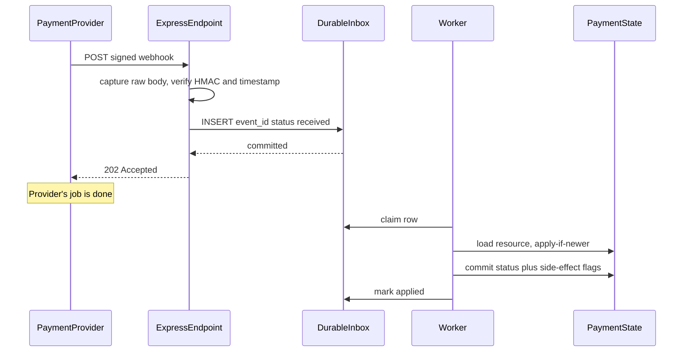
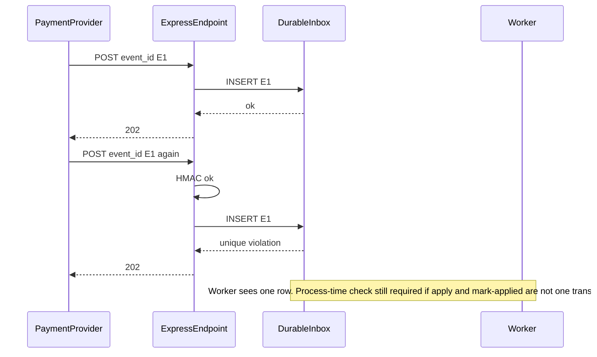
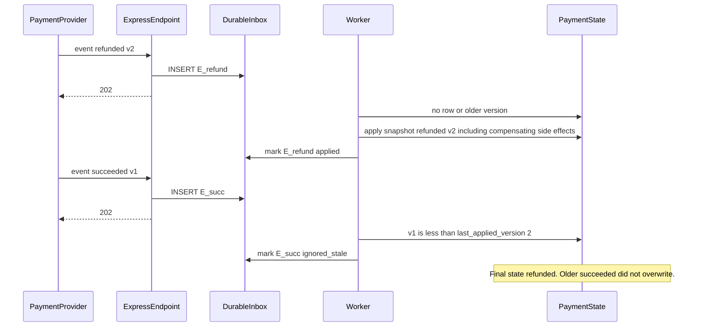
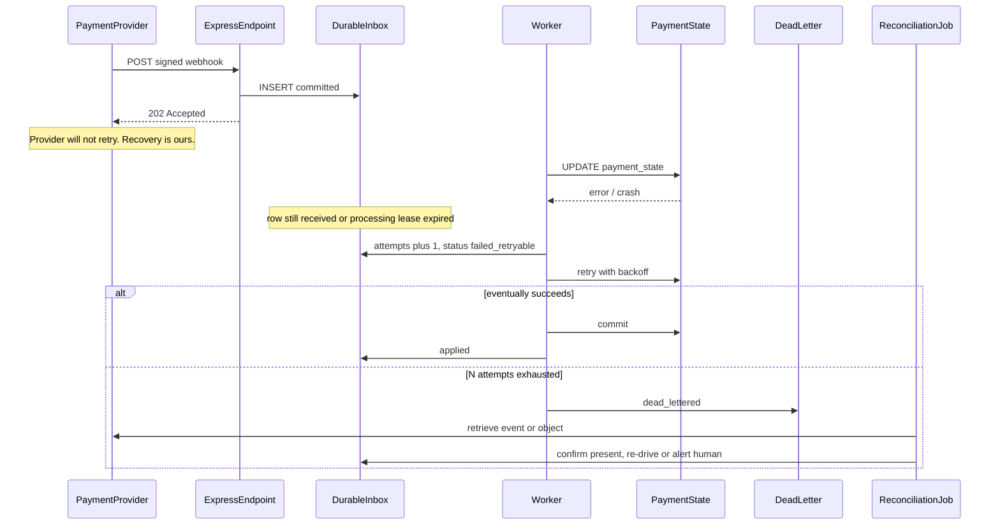

# Payment Webhook Ingestion — System Design

This document describes *how* the ingestion path works internally: the data model, the HTTP handler steps, ordering, and the four sequences that actually answer the scenario (happy path, duplicate, out-of-order, post-ack failure). It complements the [Architecture Document](./02_architecture_document.md), which covers *what* the system is and *why* it is shaped this way.

> This is a design specification. No Express, SQL, or worker code is implemented as part of this documentation deliverable. Numbered steps are the intended handler/worker behavior, not a source file.

## 1. Data Model

Three logical stores. They may live in one database in Phase 1. They must not be collapsed into "just update the payments row from the handler."

### 1.1 `raw_webhook_events` (durable inbox)

The idempotency backbone. One row per accepted event.

| Field | Role |
| --- | --- |
| `provider` | Discriminator if a second provider is ever added; for this scenario a constant is enough. Part of the unique key. |
| `event_id` | Provider's event identifier. Unique with `provider`. |
| `event_type` | e.g. `charge.succeeded`, `charge.refunded`. Used by the state machine. |
| `resource_id` | The payment/charge/intent ID the event is about. Index this; workers and "events for this payment" lookups need it. |
| `payload` | The verified body (raw bytes or parsed JSON stored after verification). Needed for replay without the provider. |
| `payload_hash` | Secondary idempotency / forensic field ([ADR-002](./04_architecture_decision_records.md#adr-002)). |
| `signature_valid` | Always true for inserted rows; unverified requests never land here. Stored so a future reader does not wonder. |
| `received_at` | Server time at insert. |
| `provider_created_at` | From the payload, if the provider supplies it. Ordering input. |
| `object_version` | Provider object version or event sequence, if supplied. Ordering input. |
| `status` | `received` \| `processing` \| `applied` \| `ignored_stale` \| `deferred` \| `failed_retryable` \| `dead_lettered` |
| `attempts` | Processing attempts. Incremented by the worker, not the handler. |
| `locked_at` / `locked_by` | Lease for claiming. Null when unclaimed. |
| `last_error` | Last processing error, truncated, no secrets. |
| `applied_at` | When business state was successfully committed (or the no-op was recorded). |

**Unique constraint:** `(provider, event_id)`. This is not optional. An application-level "select then insert" is a race.

**Partial index (Phase 1 polling):** rows where `status IN ('received', 'failed_retryable')`, optionally `ORDER BY received_at`. Without this, the worker query becomes a table scan the first time the table is large.

### 1.2 `payment_state` (business state)

Separate from the inbox on purpose. The handler never writes this table.

| Field | Role |
| --- | --- |
| `resource_id` | Primary key (provider's payment/charge/intent id). |
| `status` | Current business status in *our* model. |
| `last_applied_event_id` | Last event that mutated (or snapshot-applied to) this row. |
| `last_applied_version` | Monotonic compare key (provider version or timestamp). |
| `fields...` | Amount, currency, customer refs — whatever the product needs. Not specified here. |

### 1.3 `dead_letter_events`

Either a status on the inbox row (`dead_lettered`) or a copy table. A separate table is useful if the polling query must stay tiny; a status flag is simpler. Pick one and do not do both without a sync story.

Minimum contents: the inbox primary key, payload (or a pointer), attempt count, last error, dead-lettered-at, alert-fired flag.

### 1.4 What is *not* a table

There is no `processed_event_ids` cache distinct from the inbox. The inbox *is* that cache. A Redis "seen IDs" set without the payload is how you ack without being able to replay.

## 2. HTTP Handler: What Happens Before Responding

The handler is a procedure with a hard ceiling on what it is allowed to do. Numbered so an implementation can be traced 1:1.

1. **Capture raw body.** This route does not use the app-wide JSON parser. The body is a Buffer. See [ADR-005](./04_architecture_decision_records.md#adr-005).
2. **Read signature and timestamp headers.** If either is missing: `400` or `401` (pick one and use it consistently; missing signature is closer to `401`).
3. **Verify timestamp window.** If outside the replay window: `401`/`403`. Do not insert.
4. **Verify HMAC** of the provider's canonical string (typically timestamp + raw body) against the current secret; if fail, try the previous secret if rotation is in progress. Timing-safe compare. If fail: `401`/`403`. Do not insert.
5. **Parse JSON from the already-verified bytes.** If parse fails: `400`. The signature matched but the body is not JSON — that is abnormal; do not 5xx.
6. **Extract `event_id` (and type, resource_id).** If `event_id` is missing: `400`.
7. **Insert inbox row** in a single transaction, status `received`.
   - Success: continue.
   - Unique violation: treat as success (duplicate). Do not 409. Do not 409. The provider would retry a 409, which is pointless, or worse, some operators map 409 to 5xx.
   - Any other DB error: `503`. Do not return 2xx.
8. **Commit.** Only after commit: `202 Accepted`. Empty body is fine. Do not wait for a worker.

**Deferred (explicitly not in this list):** payment_state updates, emails, fulfillment calls, analytics, anything that talks to another team.

**Process-level crash between 7-commit and 8-flush:** the row exists, the provider may retry, the retry unique-violates, we return `202` again. Safe.

**Process-level crash before 7-commit:** no row, no 2xx (or the response never left). Provider retries. Safe.

The failure the problem statement asks about — write fails *after* 200 — cannot happen on the *inbox* write if step 8 is after commit. It *can* happen on the *business* write, which is why that write is not on this path. See [§6](#6-the-post-ack-database-failure).

## 3. Worker: Claiming and Applying

1. **Claim:** `UPDATE ... SET status = 'processing', locked_by = worker, locked_at = now() WHERE id IN (SELECT ... WHERE status IN ('received','failed_retryable') AND (locked_at IS NULL OR locked_at < now() - lease) FOR UPDATE SKIP LOCKED LIMIT N)`.
2. **Load payment_state** for `resource_id` (or initialize a new row if this is the first event).
3. **Idempotency check:** if this `event_id` is already `applied` or `ignored_stale`, release the claim and stop. (Should not happen if claiming excludes those statuses; it *will* happen if a previous run applied and died before status update — so the apply path itself must be transactional with the status update, see step 6.)
4. **Ordering / transition decision** ([§4](#4-ordering-strategy)):
   - Snapshot-newer or legal forward transition → apply.
   - Stale → `ignored_stale`.
   - Predecessor missing and snapshot not authoritative → `deferred` (or DLQ if held too long).
5. **Side effects:** only after the state write is committed, or in the same transaction if the side effect is itself a DB write. External side effects use `Idempotency-Key: <provider>:<event_id>` or a "side_effect_sent" flag on the inbox row so a retry does not send twice.
6. **Single transaction (preferred):** update `payment_state` + set inbox `applied` (or `ignored_stale`). If that commit fails, status remains `processing` until lease expiry, then retry. If you split "update payment" and "mark applied" into two commits, you will re-enter the crash window the whole design exists to close.

**Lease length:** longer than the slowest legitimate processing, shorter than "stuck forever." Expired leases are how you recover a worker that died in `processing`. If processing can include a slow third-party call, either keep that call *out* of the lease-critical section (commit state first) or make the lease long enough and accept slower reclaim.

## 4. Ordering Strategy

Do not rely on delivery order. Do not globally serialize all webhooks. Correctness is per resource.

### 4.1 Primary: apply-if-newer against object version

Most payment providers include either:

- a monotonic `event` timestamp / `created` on the event, and/or
- the **full current object** (status, amount captured, etc.) on the event, not a delta.

If the payload carries the object snapshot, the worker should **apply the snapshot when `object_version` (or `provider_created_at`) is greater than `payment_state.last_applied_version`**. A late `charge.pending` after `charge.succeeded` then becomes a no-op, which is the correct outcome if the object is already succeeded.

This is more robust than trying to replay a delta log you do not actually have.

### 4.2 Legal transition graph (still required)

Snapshot-apply does not excuse illegal business actions. If a snapshot says `refunded` but our side effects for `succeeded` never ran (fulfillment), applying "refunded" as a row update without noticing the missed `succeeded` side effects is how you refund a shipment that never shipped *and* never recorded the sale.

So the worker, on a snapshot apply, should still ask: "which transitions did we skip?" If skipped transitions have side effects, those side effects must be driven from the new snapshot (e.g. "we are now refunded" implies cancel fulfillment if it was in progress) rather than assuming every predecessor event arrived.

This is the uncomfortable part. **Out-of-order webhooks plus side effects means you cannot implement "on `charge.succeeded`, ship" as the only trigger.** You need "on current object status, reconcile our side-effect state with that status." That is more work than a switch/case on `event_type`. It is also the only design that survives missing and reordered events.

### 4.3 Deferred events (optional, use sparingly)

If the payload is a delta *without* a usable snapshot, a `charge.refunded` with no known `payment_state` row may be `deferred` until a `charge.succeeded` (or a create) arrives, with a timeout to DLQ + reconciliation (pull the object from the provider).

Do not build a general event-reordering buffer as a first feature. It is a state machine of its own and it deadlocks when the predecessor never comes.

### 4.4 Optional: per-resource FIFO (not required for correctness)

A broker FIFO group ID = `resource_id` (e.g. SQS FIFO) gives *relative* order per payment and parallelism across payments. This reduces how often the stale path fires. It does **not** replace the state-machine guard:

- FIFO is per-queue, not a promise about the provider's send order (they may have already unordered their send).
- Replays and DLQ re-drives reintroduce disorder.
- A second consumer (reconciliation) will not share the FIFO group unless you force it to.

Treat FIFO as a Phase 5 performance/nicety, not as the ordering design. [ADR-003](./04_architecture_decision_records.md#adr-003).

## 5. Sequence Diagrams

### 5.1 Normal flow

### 5.2 Duplicate delivery (harmless)

Two cases: provider retry because it never saw our 202, or genuine double send. Both look the same.

If the duplicate arrives *while* the first insert is in flight, one transaction commits, the other unique-violates, both return `202`. Two workers will not both apply if claiming uses `SKIP LOCKED` on a single row.

### 5.3 Out-of-order delivery

Example: `charge.refunded` (newer snapshot) arrives before `charge.succeeded` (older). Using snapshot apply-if-newer.

If `succeeded` has a side effect that never ran because we jumped to refunded: the apply of v2 must include "do not ship / cancel if shipping was never requested" — status-driven reconciliation of side effects, not event-type-driven. If that is not implemented, out-of-order is *not* actually handled; only the status column is.

### 5.4 Business-state write fails after 202 (the exam question)

The inbox insert already committed. `202` already returned. The worker's update to `payment_state` fails (deadlock, timeout, node death).

## 6. The Post-Ack Database Failure

Split the question. "Database write fails after we returned 200" is two different bugs depending on *which* write.

### 6.1 Inbox write fails before any 2xx

This is not "after 200." The handler never got to step 8. Return `503`. The provider retries. No row, or a rolled-back insert. No duplicate-apply risk because nothing was applied. This is the *healthy* failure mode.

If an implementation returns `200`/`202` here, it has invented data loss.

### 6.2 Inbox write succeeded, 202 returned, payment_state write fails

This is the case the problem is aiming at.

**What is true:**
- The provider will not retry (it got 2xx).
- The event is not lost: it is in `raw_webhook_events`.
- Payment state is unchanged (or, if the worker committed payment_state and then crashed before marking applied, payment state *is* changed and the retry must no-op — hence one transaction, or a process-time idempotency check that looks at `last_applied_event_id`).

**Recovery, in order of preference:**
1. **Automatic worker retry** with backoff on `failed_retryable` / expired lease. This handles transient DB errors. This is the primary recovery path.
2. **Dead letter after N attempts** plus paging. Poison payloads (schema we cannot parse, missing resource, bug in the state machine) must not block the inbox forever.
3. **Reconciliation job** pulls from the provider: if our inbox is missing an event the provider has, insert and let the worker process; if our inbox has a dead-lettered event, a human or a fixed worker re-drives. Reconciliation also covers the case this retry loop cannot: **the insert never happened and the provider gave up** (handler down, retries exhausted). That is a different write-failure (the 5xx path) that outlives the provider's retry budget.

**What recovery is not:**
- Asking the provider to resend because we returned 2xx. They will not.
- A human SQL-updating `payment_state` from a dashboard as the *default* path. That is how you get a row that the next webhook then no-ops against incorrectly.
- Re-processing by event_type without checking `last_applied_event_id`.

### 6.3 The lie to refuse

"We return 200 after writing business state, and if that write fails we return 500 so they retry" is exactly the trap: now a *slow* success (write committed, response timed out) retries and double-applies. Moving the business write off the request path is what makes "DB write failed after 202" a *contained* worker problem instead of a split-brain with the provider.

## 7. Side Effects (Email, Fulfillment)

These are where idempotency slogans die.

- If the downstream API supports idempotency keys, pass `provider + event_id` (or `provider + resource_id + effect_name` if the effect should happen once per resource, not per event).
- If it does not, record `effect_name` + `event_id` in a `side_effects` table in the same transaction as `applied`, and skip if present. "Send email then write the flag" is the same trap at smaller scale; write the flag in `pending` first or accept at-least-once email.
- At-least-once email is often acceptable; at-least-once "capture additional funds" or "ship" is not. Classify each effect.

## 8. Observability (Minimum)

Metrics that change behavior, not dashboards for their own sake:

- Handler: count by status code, HMAC failure rate, insert latency, unique-violation count (retry-storm indicator).
- Inbox: age of oldest `received`/`failed_retryable`, depth by status, DLQ depth.
- Worker: apply latency, `ignored_stale` rate (if this spikes, ordering is common, not rare — check the provider), lease timeouts.
- Reconciliation: events backfilled per run, provider API errors.

Logs: `event_id`, `resource_id`, status transition, not full PAN/PII payloads.

## 9. Mapping Back to the Scenario Questions

| Question | Answer in this design |
| --- | --- |
| How do you verify the request is genuine? | HMAC-SHA256 over raw body + timestamp window + timing-safe compare; dual-key during rotation. Unverified: 401/403, no insert. |
| What do you do before responding, and what do you defer? | Verify, parse, insert inbox, commit. Defer all payment_state and side effects. |
| What status code, and when? | `202` after durable accept or duplicate; `400` malformed; `401`/`403` auth/replay; `503` if accept itself failed. |
| How is duplicate delivery harmless? | Unique `(provider, event_id)` at accept; process-time check / single transaction at apply. |
| How are out-of-order events handled? | Apply-if-newer snapshot + legal transitions; stale events `ignored_stale`; side effects status-driven, not purely event-type-driven. |
| DB write fails after 200? | Inbox write cannot fail *after* 202 if 202 is post-commit. Business write can; worker retries, then DLQ, then reconciliation. Provider is not used as the retry bus. |
