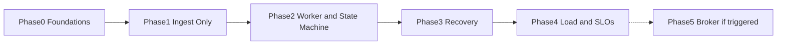

# Payment Webhook Ingestion — Phased Implementation Plan

Each phase has an **Objective**, **Deliverables**, and an **Exit Gate** that must pass before the next phase begins. Phases 0–4 are sequential. Phase 5 is conditional and may never trigger.

The order is load-bearing: **Phase 1 does not mutate payment business state.** If Phase 1 is skipped ("we will ingest and apply in the same PR"), the trap is back — you cannot prove accept-vs-process isolation if they never existed as separate systems.

## Phase 0 — Foundations

**Objective**: Freeze the secrets, raw-body, and inbox-schema decisions before anyone writes a handler that parses JSON first.

**Deliverables**:
- Webhook signing secret stored in the team's secret manager, not in env files committed to Git. Rotation procedure drafted (dual-key verify: current then previous).
- Max body size for the webhook route agreed (DoS bound).
- Inbox / payment_state / DLQ field list reviewed against [System Design — Data Model](./03_system_design.md#1-data-model). Unique constraint `(provider, event_id)` is in the schema, not a "we will add it later."
- Replay-window duration chosen against the provider's documented retry schedule (if they retry for 24 hours, a 5-minute window will 4xx legitimate late retries that we have *not* yet inserted — that is data loss). Document the number and why.
- Provider's retrieve/list-events API access confirmed (credentials, rate limits, lookback). If this does not exist, Phase 3 cannot be honest.

**Exit Gate**:
- [ ] Secret rotation plan written and dual-key verify specified.
- [ ] Schema review signed off: unique constraint present; handler will not write `payment_state`.
- [ ] Replay window documented against provider retry policy.
- [ ] Raw-body capture constraint written down as a test requirement (Phase 1 will enforce it).

## Phase 1 — Minimal Safe Ingestion

**Objective**: Prove that the edge can verify, persist, and ack — and that duplicates and auth failures behave per [status-code policy](./02_architecture_document.md#status-code-policy) — **without** applying business state. Inbox rows accumulate as `received` and stay there. That is success for this phase, not an incomplete feature.

**Deliverables**:
- Express route with raw-body capture; app-wide JSON parser does not consume this path ([ADR-005](./04_architecture_decision_records.md#adr-005)).
- HMAC + timestamp verification; 401/403 on failure; no inbox row.
- Insert with unique constraint; unique violation → `202`; other DB errors → `503`.
- `202` only after commit.
- Structured logs: `event_id`, status code, unique-violation vs insert. No full payloads in default logs.
- Tests (not production traffic): provider-signed fixture (or local signer over unmodified bytes); duplicate POST; invalid HMAC; DB down.

**Exit Gate**:
- [ ] A signed fixture verifies; the same payload after `JSON.parse` + `JSON.stringify` is **not** used as the HMAC input in tests.
- [ ] Duplicate delivery of the same `event_id` yields one row and `202` both times.
- [ ] Invalid HMAC yields 4xx and zero rows.
- [ ] Induced inbox-DB failure yields 5xx and zero committed rows; provider-retry simulation then succeeds when DB is back.
- [ ] No code path in the handler updates `payment_state` (review: the table may not even be written to by this service yet).

**Honesty gate:** if product refuses to ship an endpoint that "doesn't process payments yet," they are asking to skip to Phase 2 under schedule pressure. The compromise is a short Phase 1 on a staging endpoint pointed at the provider's test webhooks — not skipping the proof.

## Phase 2 — Async Processing and State Machine

**Objective**: Consume the inbox, apply guarded transitions, and prove out-of-order streams converge. Duplicates remain harmless end-to-end (HTTP duplicate *and* worker retry).

**Deliverables**:
- Worker claiming via lease / `SKIP LOCKED` (or equivalent).
- `payment_state` writes only from the worker; apply + mark-applied in one transaction where possible ([System Design — Worker](./03_system_design.md#3-worker-claiming-and-applying)).
- Apply-if-newer + legal transitions ([ADR-003](./04_architecture_decision_records.md#adr-003)). `ignored_stale` is a success status.
- Side-effect classification: which effects are at-least-once-ok vs need an idempotency key / `side_effects` row.
- Simulated event streams: in-order happy path; duplicate `event_id`; `refunded` before `succeeded`; worker kill after apply-before-mark (if the transaction split exists, this test fails until it is fixed).

**Exit Gate**:
- [ ] Out-of-order simulated stream ends in the same `payment_state` as the in-order stream for the same final provider snapshot.
- [ ] Worker crash/retry of an already-applied event does not double-run a non-idempotent side effect (or that effect is explicitly classified as at-least-once and accepted).
- [ ] Handler still does not write `payment_state` (regression check).

## Phase 3 — Failure Recovery

**Objective**: Make "DB write failed after 202" a boring, automatic path — and cover the case the worker cannot see (event never ingested, provider retries exhausted).

**Deliverables**:
- Retry/backoff on `failed_retryable`; bounded `attempts`; then DLQ.
- Alert on DLQ depth and on oldest `received` age (lag).
- Reconciliation job: lookback against provider list/retrieve; missing `event_id`s inserted into the inbox (not written straight to `payment_state`); dead-lettered rows surfaced, not silently re-driven without a reason.
- Chaos: kill DB or worker mid-processing after `202`; confirm inbox row survives; confirm recovery without a human SQL patch.

**Exit Gate**:
- [ ] Chaos test: after 202, payment_state write fails or worker is killed; system converges to applied (or DLQ + alert if the failure is made permanent) with **zero** lost inbox rows.
- [ ] A webhook that is dropped before insert (handler down) is recovered by reconciliation within the lookback window, then applied by the same worker path.
- [ ] DLQ alert fires in a drill, not only in production.

If the provider has no list/retrieve API, this phase's exit gate is blocked. The honest fallback is: extend logging and on-call, and accept a residual loss window equal to "handler downtime beyond provider retry budget." Write that down; do not pretend DLQ covers events that never arrived.

## Phase 4 — Observability and Load Validation

**Objective**: Know whether the design holds under the failure mode it was built for: a retry storm.

**Deliverables**:
- Metrics from [System Design — Observability](./03_system_design.md#8-observability-minimum): status-code counts, HMAC failures, unique-violation rate, inbox depth/age, DLQ depth, apply latency, `ignored_stale` rate.
- Load test: N copies of the same `event_id` plus a burst of distinct events, mixed valid/invalid HMAC.
- SLO drafts: handler p99 vs provider timeout; processing lag under normal load; alert thresholds.

**Exit Gate**:
- [ ] Under simulated retry storm, handler p99 stays below the provider timeout and unique violations do not become 5xx.
- [ ] Inbox polling query does not time out at 10x expected steady-state depth (or the query is fixed before calling Phase 1 "done in production").
- [ ] SLOs and alerts are written with numbers from this test, not from this document's guesses.

## Phase 5 — Conditional Scale-Out to a Dedicated Broker

**Objective**: Introduce SQS/Kafka/equivalent only when the inbox-as-queue is the measured bottleneck — not because "webhooks should use a queue." [ADR-004](./04_architecture_decision_records.md#adr-004).

**Entry Gate (any one of):**
- [ ] Inbox polling or `SKIP LOCKED` wait is a measurable fraction of apply latency at normal (not storm) load.
- [ ] Oldest `received` age exceeds the Phase 4 SLO while workers are scaled out and the DB CPU/lock graph shows queue-query contention (not under-provisioned workers).
- [ ] Handler insert p99 degrades under retry storm due to table contention after query/index work in Phase 4 failed to fix it.

**Deliverables**:
- Broker as delivery to workers; inbox table remains the idempotency source of truth (insert still happens before `202`, or a transactional outbox from that insert).
- Consumers still process-time idempotent. At-least-once from the broker is assumed.
- Optional: FIFO group = `resource_id` as an optimization, not a replacement for apply-if-newer.
- Runbook for broker outage: handler must still be able to persist inbox even if publish fails (outbox), or must return `503` so the provider retries — **not** `202` with a message that never published and no inbox row.

**Exit Gate**:
- [ ] Duplicate and out-of-order tests from Phase 2 still pass.
- [ ] Chaos: broker down — either events still land in the inbox and drain when the broker returns, or the handler correctly 503s; no silent drop after 202.
- [ ] Phase 4 SLOs hold at the load that triggered this phase.

This phase can be deferred indefinitely. A well-indexed inbox table and a few worker processes will carry a surprising amount of payment-webhook volume. Shipping Kafka on day one for this problem is usually costume.

## Phase Dependency Graph

Phases 2–4 may be compressed in calendar time on a small team; they must not be collapsed into one deploy that first sees production traffic. Phase 1 should take real test-webhook traffic (provider sandbox) before Phase 2 owns money-adjacent state.
