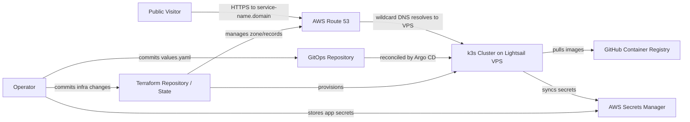
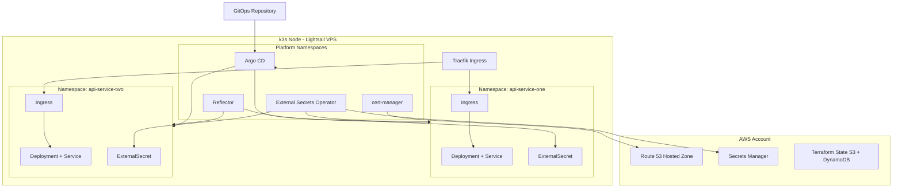
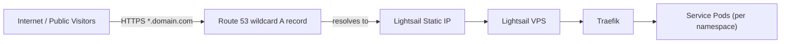

# Personal Cloud Platform — Architecture Document
> - **Document Status**: Draft
> - **Last Updated**: 2026 Aug 29
> - **Author**: Paul Serban

A self-service Kubernetes platform, running k3s on a single AWS Lightsail VPS, that hosts many low-traffic personal/portfolio API services. Each service gets its own namespace, its own subdomain with a valid TLS certificate, and its own secrets synced from AWS Secrets Manager — all driven by a Git commit. AWS infrastructure is provisioned by Terraform from day one, so the same codebase can provision a bigger VPS later instead of being rewritten.

## Overview

**Brief description**: This is not an end-user product — it is internal platform infrastructure for one operator, built so that hosting "yet another portfolio API" never again requires bespoke server setup.

**Business Context**
- Operator: single owner/operator (see [Business Overview](./01_business_overview.md)).
- Current state: no shared hosting platform; each portfolio project would otherwise need its own ad-hoc deployment.
- Desired future state: one AWS account, one k3s cluster, one GitOps repository as the onboarding path for every future service.
- Goal: minimize recurring cost and operational effort while keeping a documented, deliberate path to scale up when needed.
- Target users: the operator (as platform admin and as "customer" onboarding services) and the public visitors of each hosted API.

## Requirements

### Functional Requirements

- **Cluster platform**:
  - The system must run a Kubernetes distribution (k3s) on an AWS Lightsail VPS.
  - The system must support creating a new, isolated namespace for each API service.
  - The system must assign each API service a unique subdomain of a single base domain.
  - The system must serve every subdomain over valid HTTPS/TLS.
- **Infrastructure provisioning**:
  - The system must provision all AWS infrastructure (compute, networking, DNS) via Terraform.
  - The Terraform codebase must be reusable, without a rewrite, to provision a larger VPS when traffic/capacity requires it.
- **Application delivery**:
  - The system must package deployable services using Helm charts.
  - The system must support deploying "any" containerized API service to a chosen namespace through a repeatable, self-service mechanism (no bespoke per-service cluster surgery).
- **Secrets management**:
  - The system must store application secrets in AWS Secrets Manager.
  - The system must sync secrets from AWS Secrets Manager into the correct Kubernetes namespace automatically.

### Non-Functional Requirements

**Performance Requirements:**
- Traffic profile: low-traffic, non-critical personal/portfolio workloads — not designed for sustained high concurrency.
- Response Time: no hard SLA; targets are "reasonable for a personal site" rather than production-grade percentile targets.
- Concurrent Services: expected to host on the order of single-digit to low double-digit services on the initial VPS bundle.

**Service Level Agreement (SLA):**
- System Criticality: Nice-to-have / portfolio-grade, not mission-critical.
- Maximum Downtime: best-effort; no paid on-call. Node is a single point of failure by design (see [Scaling Strategy](#scaling-strategy) and [ADR-001](./04_architecture_decision_records.md#adr-001)).
- Recovery Time Objective (RTO): a full cluster rebuild on a fresh node, from Terraform + GitOps repos, is the documented recovery path (target: a few hours, rehearsed — see [Operations Runbook](./07_operations_runbook.md)).
- Recovery Point Objective (RPO): near-zero for cluster/service *configuration* (Git is the source of truth); depends on each service's own data-persistence choices for *application data* (see [Data Architecture](#data-architecture)).

**Infrastructure Constraints:**
- Technology Stack: k3s, Helm, Argo CD, Terraform, AWS (Lightsail, Route 53, Secrets Manager, S3/DynamoDB for Terraform state).
- Hosting: single AWS Lightsail VPS (Phase 1+); Terraform-driven resize/replace path for a bigger VPS later; no managed Kubernetes (EKS) in the initial design.
- Compliance Requirements: none formal; secrets hygiene and least-privilege IAM are still enforced as good practice (see [Security Architecture](./05_security_architecture.md)).

## Executive Summary

The Personal Cloud Platform is a single-operator hosting platform designed to make onboarding a new low-traffic API service a one-commit operation. The system follows a **GitOps-driven, layered infrastructure architecture**:

**Architecture Style:** Infrastructure-as-Code (Terraform) + GitOps (Argo CD) driving a lightweight Kubernetes distribution (k3s), with a shared Helm chart abstraction for "any API service."

**Key Components:**
- **AWS account boundary**: Route 53 DNS, a Lightsail VPS + static IP, Lightsail firewall, Secrets Manager, and a Terraform remote-state backend.
- **k3s cluster**: single control-plane+worker node, built-in Traefik ingress.
- **Platform add-ons**: Argo CD (GitOps controller), External Secrets Operator (AWS Secrets Manager sync), cert-manager (TLS via Route 53 DNS-01), Reflector (secret replication across namespaces).
- **Workload namespaces**: one per onboarded API service, each rendered from a single shared Helm chart.
- **GitOps repository**: the single source of truth for "what is deployed" — onboarding a service means adding a folder to this repo.

**Technology Stack:**
- Orchestration: k3s (Kubernetes)
- Packaging: Helm
- Delivery: Argo CD (GitOps, `ApplicationSet` git-directory generator)
- IaC: Terraform (AWS provider)
- Secrets: AWS Secrets Manager + External Secrets Operator
- DNS/TLS: AWS Route 53 + cert-manager (DNS-01) + Reflector
- Container registry: GitHub Container Registry (GHCR)
- Compute: AWS Lightsail

**Architecture Principles:**
- **Git is the source of truth**: both cluster add-ons and every workload are described declaratively in Git; nothing is deployed by hand.
- **The node is disposable**: no unique state is kept only on the k3s node itself; a bigger/replacement node can be rebuilt from Terraform + GitOps.
- **One onboarding path for every service**: there is exactly one mechanism ("add a folder + values file, push") to go from code to a live subdomain, regardless of what the service does.
- **Secrets never touch Git**: application secrets live in AWS Secrets Manager and are pulled into the cluster; the *only* credential ever created by hand is the one bootstrap credential the secrets-syncing controller itself needs.
- **Deliberate, staged cost**: infrastructure cost changes only at explicit, Terraform-driven scale-out events, not per onboarded service.

**Key Architectural Decisions:**
1. Run **k3s on a single Lightsail VPS** rather than a managed Kubernetes service, to minimize cost for a low-traffic personal platform ([ADR-001](./04_architecture_decision_records.md#adr-001)).
2. Use **Terraform from day one**, sized for the current VPS, so the exact same codebase provisions a bigger instance later ([ADR-002](./04_architecture_decision_records.md#adr-002)).
3. Use **GitOps (Argo CD)**, not CI-triggered `helm upgrade`, as the self-service deployment mechanism ([ADR-003](./04_architecture_decision_records.md#adr-003)).
4. Bootstrap the External Secrets Operator with a **single least-privilege IAM access key** (Lightsail cannot attach IAM instance roles), with a documented migration trigger to IRSA-style auth if the platform ever moves to EKS ([ADR-004](./04_architecture_decision_records.md#adr-004)).
5. Use a **wildcard DNS record + one shared wildcard TLS certificate**, replicated per namespace, instead of per-service DNS/TLS automation ([ADR-005](./04_architecture_decision_records.md#adr-005)).

### Context Diagram

## Runtime Architecture

1. **Infrastructure layer (Terraform + AWS)**
   - Provisions the Lightsail VPS, static IP, firewall rules, Route 53 hosted zone/records, and the Terraform remote-state backend.
   - Is the *only* sanctioned path for changing what AWS resources exist (see [System Design](./03_system_design.md)).
2. **Cluster platform layer (k3s + Argo CD + add-ons)**
   - k3s provides the Kubernetes API, scheduling, and built-in Traefik ingress on the single node.
   - Argo CD continuously reconciles both platform add-ons and workload namespaces against the GitOps repository.
3. **Cross-cutting platform services**
   - External Secrets Operator: syncs AWS Secrets Manager values into namespace-scoped Kubernetes `Secret` objects.
   - cert-manager: issues and renews the shared wildcard TLS certificate via a Route 53 DNS-01 solver.
   - Reflector: replicates the wildcard TLS secret into each new workload namespace.
4. **Workload layer (per-service namespaces)**
   - Each onboarded API service runs in its own namespace, deployed from the shared `service-api` Helm chart, fronted by an Ingress bound to `<service-name>.<domain>`.

## Components

Based on [the requirements](#requirements), the following components comprise the system architecture:

### 1. AWS Account Boundary
**Purpose**: Own all cloud resources the platform depends on, provisioned exclusively through Terraform.

**Responsibilities:**
- Host the Lightsail VPS, static IP, and firewall rules.
- Host the Route 53 hosted zone and DNS records for the base domain.
- Host AWS Secrets Manager entries for every service's secrets.
- Host the Terraform remote-state backend (S3 + DynamoDB lock table).

**Interactions:**
- Provisioned by: Terraform.
- Consumed by: the k3s cluster (DNS resolution, Secrets Manager reads).

### 2. k3s Cluster
**Purpose**: Run all platform add-ons and every onboarded API service on a single, low-cost node.

**Responsibilities:**
- Provide the Kubernetes control plane and container runtime for the whole platform.
- Route external HTTPS traffic to the correct namespace via its built-in Traefik ingress controller.

**Interactions:**
- Receives desired state from: Argo CD (reading the GitOps repository).
- Sends traffic to: per-namespace Services/Pods.
- Dependencies: the Lightsail VPS provisioned by Terraform; Route 53 for inbound DNS resolution.

### 3. Platform Add-ons (Argo CD, External Secrets Operator, cert-manager, Reflector)
**Purpose**: Provide the shared, cross-cutting capabilities every workload namespace relies on, so individual services never need to reimplement delivery, secrets, or TLS handling.

**Responsibilities:**
- Argo CD: continuous reconciliation of both add-ons and workloads from Git; the `ApplicationSet` git-directory generator is what turns "a new Git folder" into "a new namespace."
- External Secrets Operator: authenticates to AWS Secrets Manager and syncs values into `Secret` objects per namespace.
- cert-manager: issues/renews the one shared wildcard certificate using a Route 53 DNS-01 challenge.
- Reflector: copies the wildcard TLS secret into every new workload namespace.

**Interactions:**
- Receives desired state from: the GitOps repository (`platform/` path).
- Depends on: one manually-created bootstrap AWS credential (see [Security Architecture](./05_security_architecture.md)).

### 4. Workload Namespaces (Onboarded API Services)
**Purpose**: Isolate each portfolio API service's resources, secrets, and network exposure from every other service, while all being deployed the exact same way.

**Responsibilities:**
- Run the service's container(s) via a Deployment rendered from the shared `service-api` Helm chart.
- Expose the service internally via a Service and externally via an Ingress bound to its assigned subdomain.
- Hold an `ExternalSecret` that pulls that service's secrets from `portfolio/<service-name>/*` in Secrets Manager.
- Enforce a `ResourceQuota` and a default-deny `NetworkPolicy` so one service cannot starve or reach into another.

**Interactions:**
- Receives desired state from: the GitOps repository (`apps/<service-name>/` path).
- Receives its TLS secret from: Reflector.
- Receives its application secrets from: External Secrets Operator.
- Receives inbound traffic from: Traefik, based on its Ingress host rule.

### 5. GitOps Repository
**Purpose**: Serve as the single, versioned source of truth for everything running in the cluster — both platform add-ons and every onboarded service.

**Structure (see [System Design](./03_system_design.md) for full detail):**
- `platform/`: add-on Applications (Argo CD app-of-apps, sync-waved).
- `apps/<service-name>/values.yaml`: one folder per onboarded service, discovered automatically by the `ApplicationSet` generator.

### Communication Patterns

**Synchronous Communication:**
- Public Visitor ↔ Traefik Ingress: HTTPS, terminated using the shared wildcard certificate.
- Traefik ↔ Service Pod: HTTP, internal cluster networking.
- External Secrets Operator ↔ AWS Secrets Manager: HTTPS (AWS API), on a periodic refresh interval.
- cert-manager ↔ Route 53: HTTPS (AWS API), during certificate issuance/renewal DNS-01 challenges.

**Asynchronous / Reconciliation-based Communication:**
- Argo CD → Git repository: polls/webhooks for changes, then reconciles cluster state (this *is* the "deployment" mechanism — there is no push-based CI/CD pipeline).
- Reflector → workload namespaces: watches for new namespaces and replicates the shared TLS secret automatically.

## Scaling Strategy

**Current Scale Requirements:**
- Single Lightsail VPS, single k3s node.
- On the order of single-digit to low double-digit low-traffic API services.
- Best-effort availability; no HA requirement.

**Scaling Strategy:**

**Vertical (primary path):**
- The Lightsail instance bundle size is a Terraform variable. Because Lightsail does not support live in-place resizing, "scaling up" means: Terraform provisions a **new**, larger instance; the node is re-bootstrapped (k3s + Argo CD reconcile the exact same GitOps state); the static IP/DNS is cut over; the old instance is decommissioned. This is deliberately a *repeat* of the same Terraform + GitOps codebase, not new IaC (see [ADR-002](./04_architecture_decision_records.md#adr-002)).

**Horizontal (future, not implemented now):**
- Adding a second k3s node (agent) to the same cluster, or migrating to a managed multi-node Kubernetes service (e.g., EKS), are documented as future paths only if the operator's needs materially change (many more services, need for real HA). Not required for the current low-traffic personal use case.

**Bottleneck Analysis:**
- Primary bottleneck: node CPU/memory once enough services are co-located on one small VPS.
- Secondary bottleneck: disk (container images, logs, any local-path persistent volumes).
- Mitigation: per-namespace `ResourceQuota`s prevent one runaway service from starving the others before the node itself is at capacity.

**Monitoring and Triggers:**
- Monitor: node CPU/memory/disk utilization, count of onboarded services vs. quota headroom.
- Scaling trigger thresholds and the conditional scale-out phase are defined in [Phased Implementation Plan — Phase 6](./06_phased_implementation_plan.md#phase-6--conditional-scale-out-terraform-reuse).

**Future Scaling Milestones:**
- **Current**: single small Lightsail bundle, single-digit services.
- **Trigger event**: sustained resource pressure or service count exceeding documented thresholds → Terraform-driven resize (Phase 6).
- **Longer-term (not committed)**: multi-node k3s or migration to EKS, only if the platform's purpose changes from "personal portfolio hosting" to something with real availability requirements.

### Component Diagram (Logic View)

### Deployment Diagram (Physical View)

## Data Architecture

### Data Model

The *platform* itself is stateless by design; the meaningful "entities" are configuration, not business data:

**Key Entities:**
- **Terraform State**: the AWS infrastructure that exists (Lightsail instance, static IP, Route 53 records) — stored remotely in S3, locked via DynamoDB.
- **GitOps Repository State**: every platform add-on and every onboarded service's desired Kubernetes state — this is the platform's real "database."
- **Secrets Manager Entries**: one path per onboarded service (`portfolio/<service-name>/*`), plus the platform's own bootstrap-adjacent secrets (e.g., Route 53 credentials for cert-manager).

**Entity Relationships:**
- One GitOps `apps/<service-name>/` folder maps 1:1 to one Kubernetes namespace, one Ingress host, and one Secrets Manager path prefix.

### Data Lifecycle

**Create**: a new service is "created" by adding a folder + values file to the GitOps repository and, separately, its secrets under its Secrets Manager path.

**Read**: Argo CD continuously reads the GitOps repository; External Secrets Operator continuously reads Secrets Manager on a refresh interval.

**Update**: changing a service's image tag, resources, or subdomain is a Git commit to its `values.yaml`; changing a secret's value is an update in Secrets Manager, picked up on the next ESO refresh.

**Delete**: removing a service's folder from the GitOps repository de-provisions its namespace (via Argo CD's pruning); its Secrets Manager entries are deleted separately as a deliberate, explicit step (not automatic, to avoid accidental data loss).

**Application data**: any actual business/application data a hosted API needs (e.g., a small database) is each service's own concern, not the platform's. Because the k3s node is treated as disposable (see [Scaling Strategy](#scaling-strategy)), services that need real persistence should use an externally-managed store (e.g., a managed database, S3) rather than a node-local volume, so that a node rebuild/resize does not risk data loss. This constraint is called out explicitly so future service onboarding doesn't quietly depend on local-path storage.

## Cost Analysis

### Infrastructure Costs (rough order of magnitude for the initial, low-traffic setup)

**Compute:**
- One small-to-medium Lightsail instance bundle: low single-digit to ~$10-20/month depending on chosen size.

**Networking/DNS:**
- Route 53 hosted zone: fixed small monthly fee per zone.
- Route 53 query charges: negligible at personal-portfolio traffic levels.

**Secrets:**
- AWS Secrets Manager: small per-secret monthly fee, multiplied by the number of onboarded services (one secret path per service) plus a handful of platform bootstrap secrets.

**State backend:**
- S3 + DynamoDB for Terraform state: negligible at this scale (pennies/month).

**Total Estimated Monthly Cost:** low tens of USD/month at the initial scale, dominated by the Lightsail bundle size — with the explicit design goal that this cost only increases at a deliberate Phase 6 scale-out event, not per onboarded service.

### Cost Optimization

**Strategies:**
- Prefer the smallest Lightsail bundle that comfortably fits the current number of services; resize only when [Phase 6](./06_phased_implementation_plan.md#phase-6--conditional-scale-out-terraform-reuse) thresholds are hit.
- Consolidate secrets where reasonable (e.g., one Secrets Manager entry per service holding multiple key/value pairs, rather than one entry per key) to minimize per-secret charges.
- Avoid provisioning any AWS resource (Route 53 zone aside) outside of Lightsail for the initial phase — no NAT gateways, load balancers, or managed databases unless a specific service requires one.

## Risks and Mitigation

| Risk                                                                 | Likelihood | Impact | Mitigation Strategy                                                                                          | Owner    |
| --------------------------------------------------------------------- | ---------- | ------ | --------------------------------------------------------------------------------------------------------------- | -------- |
| Single node is a single point of failure                              | High       | Medium | Accepted trade-off for a low-traffic personal platform; mitigated by fast, rehearsed rebuild via Terraform + GitOps | Operator |
| Bootstrap AWS access key leaks                                        | Low        | High   | Least-privilege scoping, rotation policy, CloudTrail auditing ([Security Architecture](./05_security_architecture.md)) | Operator |
| One service's resource usage starves others on the shared node        | Medium     | Medium | Per-namespace `ResourceQuota`s and requests/limits enforced by the shared Helm chart                            | Operator |
| A service is onboarded with a local-path volume, blocking future node replacement | Medium     | Medium | Explicit data-architecture guidance against node-local persistence; call out in onboarding runbook               | Operator |
| Let's Encrypt rate limits during certificate issuance/renewal churn    | Low        | Low    | Single shared wildcard certificate replicated via Reflector instead of per-service certs ([ADR-005](./04_architecture_decision_records.md#adr-005)) | Operator |

## Future Enhancements

### Phase 1 (Current)
**Focus**: Get a single VPS, a working k3s cluster, GitOps, secrets, and subdomain-per-service onboarding all working end-to-end (see [Phased Implementation Plan](./06_phased_implementation_plan.md)).

### Phase 2 (Post-launch hardening)
**Focus**: Observability, backup/DR rehearsal, network policy hardening.

Enhancements:
1. **Metrics/log shipping**: lightweight, low-cost observability appropriate for a single node.
2. **Backup/restore drills**: rehearsed Lightsail snapshot restore and full GitOps-driven cluster rebuild.
3. **Network policy rollout**: default-deny between all workload namespaces.

### Phase 3 (Conditional, only if triggered)
**Focus**: Scale-out via the existing Terraform codebase, or a migration path to multi-node/EKS if the platform's purpose changes materially.

Strategic Initiatives:
1. **Terraform-driven resize**: bigger Lightsail bundle, same codebase.
2. **IRSA migration**: if moving to EKS, replace the access-key-based secrets bootstrap with IAM Roles for Service Accounts.

### Technical Debt

**Known/Accepted Trade-offs:**
- Single node, no HA: accepted for the platform's stated scope; revisit only if the scope changes.
- Access-key-based AWS auth for the External Secrets Operator bootstrap (Lightsail has no IAM instance-role support): accepted interim design, with a documented migration trigger in [ADR-004](./04_architecture_decision_records.md#adr-004).
