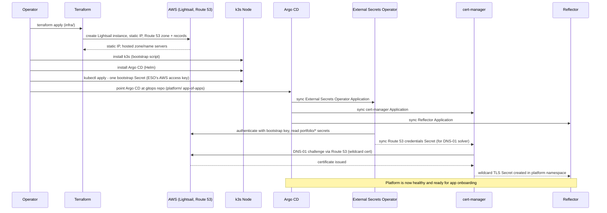
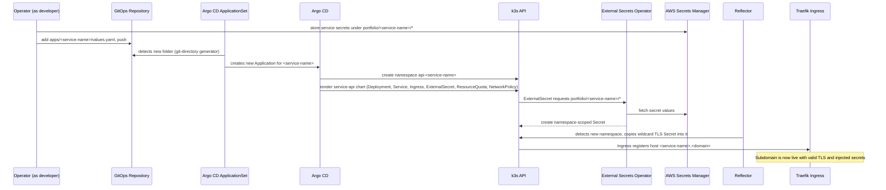

# Personal Cloud Platform — System Design

This document describes *how* the platform works internally: the Terraform layout, the Helm chart strategy, the GitOps repository layout, the subdomain/TLS mechanism, and the secrets bootstrap sequencing. It complements the [Architecture Document](./02_architecture_document.md), which covers *what* the system is and *why* it is shaped this way.

> This is a design specification. No Terraform, Helm, or application code is implemented as part of this documentation deliverable — folder/file names below describe the intended future implementation.

## 1. Terraform Layout

```
infrastructure/terraform/
  bootstrap/                 # applied once, manually, before remote state exists
    main.tf                  # S3 bucket (state) + DynamoDB table (state locking)
  infra/
    main.tf                  # root module, wires the modules below together
    variables.tf             # instance_bundle_id, domain_name, admin_ip_cidr, region, etc.
    outputs.tf                # static_ip, hosted_zone_id, name_servers
    modules/
      lightsail/
        main.tf              # aws_lightsail_instance, aws_lightsail_static_ip,
                              # aws_lightsail_static_ip_attachment,
                              # aws_lightsail_instance_public_ports (22, 80, 443 only)
      dns/
        main.tf               # aws_route53_zone, apex A record, wildcard "*.<domain>" A record
                              # both pointed at the Lightsail static IP
```

**Why `instance_bundle_id` is a variable, not a hardcoded value:** Lightsail instances cannot be resized in place. "Scaling up" (see [Architecture Document — Scaling Strategy](./02_architecture_document.md#scaling-strategy) and [Phased Implementation Plan — Phase 6](./06_phased_implementation_plan.md#phase-6--conditional-scale-out-terraform-reuse)) means changing this one variable and running `terraform apply` to provision a **new** instance, then cutting over the static IP/DNS to it, then destroying the old instance. The module structure is written once and reused for that event — it is not rewritten.

**State backend bootstrapping order:** the `bootstrap/` configuration is applied first, with local state, to create the S3 bucket and DynamoDB table that `infra/` then uses as its remote backend. This avoids a circular dependency (you cannot store Terraform state in a bucket that the same Terraform run is creating).

## 2. Helm Chart Strategy

**One shared chart for every workload — `service-api`:**

```
helm/service-api/
  Chart.yaml
  values.yaml                 # sane defaults (1 replica, small resource requests, TLS on)
  templates/
    deployment.yaml
    service.yaml
    ingress.yaml               # host: {{ .Values.subdomain }}.{{ .Values.baseDomain }}
    externalsecret.yaml        # pulls from portfolio/{{ .Values.serviceName }}/*
    networkpolicy.yaml         # default-deny except from Traefik + DNS
    resourcequota.yaml
```

Every onboarded API service reuses this **one** chart; what differs per service is only its `values.yaml` (image, port, subdomain, resource sizing, secrets path). This is the mechanism that fulfills "deploy any API service to a specific namespace and assign it a new subdomain": there is no per-service chart to author.

**Platform add-ons** (Argo CD itself, External Secrets Operator, cert-manager, Reflector) are installed from their respective upstream Helm charts, version-pinned, and wrapped as Argo CD `Application` resources rather than custom charts.

## 3. GitOps Repository Layout

```
gitops/
  platform/
    argocd-app-of-apps.yaml         # bootstraps the platform namespace's own Applications
    external-secrets/
      application.yaml               # points at upstream chart + values
    cert-manager/
      application.yaml
      cluster-issuer.yaml             # Route 53 DNS-01 solver, references synced secret
      wildcard-certificate.yaml       # single Certificate for *.{{ domain }}
    reflector/
      application.yaml
  apps/
    hello-api/
      values.yaml                     # serviceName, image, port, subdomain, secretsPath
    <service-name>/
      values.yaml
  applicationset.yaml                 # git-directory generator watching apps/*
```

**Onboarding mechanism**: the `applicationset.yaml` uses Argo CD's `ApplicationSet` git-directory generator pointed at `apps/*`. Every subfolder under `apps/` automatically becomes one Argo CD `Application`, rendered from the shared `service-api` chart with that folder's `values.yaml`, deployed into a namespace named after the service (e.g. `api-hello-api`), with `CreateNamespace=true`. **Onboarding a new service is: create `apps/<service-name>/values.yaml`, commit, push.** No other step touches the cluster directly.

**Sync ordering (`platform/` before `apps/`)**: Argo CD sync waves ensure External Secrets Operator, cert-manager, and Reflector are healthy before any workload namespace is synced, since workload namespaces depend on all three (secrets, TLS, and the reflected certificate, respectively).

## 4. Subdomain and TLS Design

**DNS — wildcard record, provisioned once:**
Terraform creates a single `*.{{ domain }}` A record (plus an apex record) pointing at the Lightsail static IP. Because there is only one node/IP for the whole platform, this one wildcard record makes **every** future subdomain resolve immediately — no DNS automation (e.g., ExternalDNS) is needed per onboarded service.

**TLS — one shared wildcard certificate, replicated per namespace:**
cert-manager issues a single `Certificate` for `*.{{ domain }}` using a Route 53 **DNS-01** solver (required for wildcard certs; HTTP-01 cannot issue wildcards). The resulting TLS secret is created once, in the platform namespace, and **Reflector** watches for new namespaces and automatically copies that secret into each one, where the service's Ingress references it.

This is deliberately chosen over issuing a separate certificate per service (see [ADR-005](./04_architecture_decision_records.md#adr-005)): it means onboarding a new service never waits on an ACME transaction, and it keeps Let's Encrypt API usage to one renewal every ~60–90 days regardless of how many services exist.

## 5. Secrets Flow and Bootstrap Sequencing

The core design challenge: **External Secrets Operator (ESO) itself needs AWS credentials before it can sync anything else out of Secrets Manager** — so its own credential cannot come from Secrets Manager. Additionally, **AWS Lightsail instances cannot use IAM instance roles/IRSA** (confirmed against current AWS documentation — this is an EC2/EKS-only feature), so the usual "no static keys anywhere" pattern isn't directly available here.

The design minimizes this to a **single** manually-created credential:

1. **One manual step, ever**: create an IAM user (e.g. `eso-secrets-reader`) scoped to `secretsmanager:GetSecretValue` and `secretsmanager:DescribeSecret` on `arn:aws:secretsmanager:<region>:<account-id>:secret:portfolio/*` only. Its access key is stored as a single Kubernetes `Secret`, created once during cluster bootstrap, and referenced by ESO's `SecretStore`.
2. **Everything else flows through Secrets Manager, synced out by ESO**:
   - The Route 53 credentials cert-manager's DNS-01 solver needs are themselves stored in Secrets Manager and synced into a `Secret` by ESO — cert-manager never receives a manually-typed AWS key.
   - Each service's application secrets live under `portfolio/<service-name>/*` and are synced into that service's namespace by its `ExternalSecret`.

This means the *only* AWS credential ever placed into the cluster by hand is the one ESO bootstrap key. Everything downstream of that (DNS-01 credentials, every service's app secrets) is centrally managed in Secrets Manager and pulled automatically.

**Migration note**: if the platform ever migrates to EKS, this bootstrap key should be replaced by IAM Roles for Service Accounts (IRSA), which is the AWS-recommended pattern but requires an EKS (or self-hosted OIDC-federated) cluster — not available on a bare Lightsail-hosted k3s node today ([ADR-004](./04_architecture_decision_records.md#adr-004)).

### Sequence Diagram — Cluster Bootstrap



### Sequence Diagram — Deploy a New API Service



## 6. Design Constraints Carried Into Other Docs

- Least-privilege IAM policy text for the bootstrap credentials, network exposure rules, and namespace isolation controls are specified in [Security Architecture](./05_security_architecture.md).
- The bootstrap and onboarding sequences above map directly to gated phases (2 and 3) in the [Phased Implementation Plan](./06_phased_implementation_plan.md).
- The onboarding sequence above is restated as an operator-facing checklist in the [Operations Runbook](./07_operations_runbook.md).
