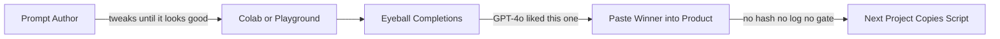
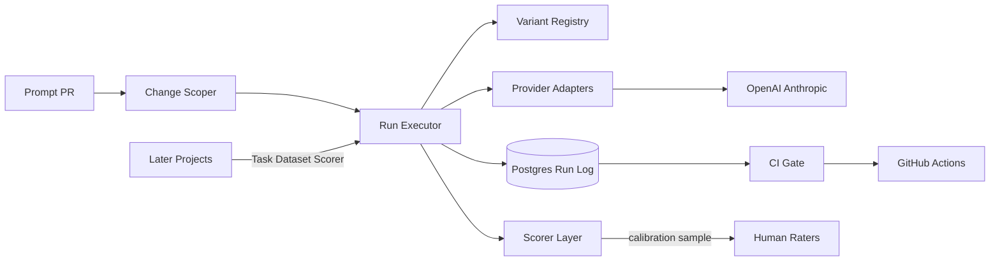
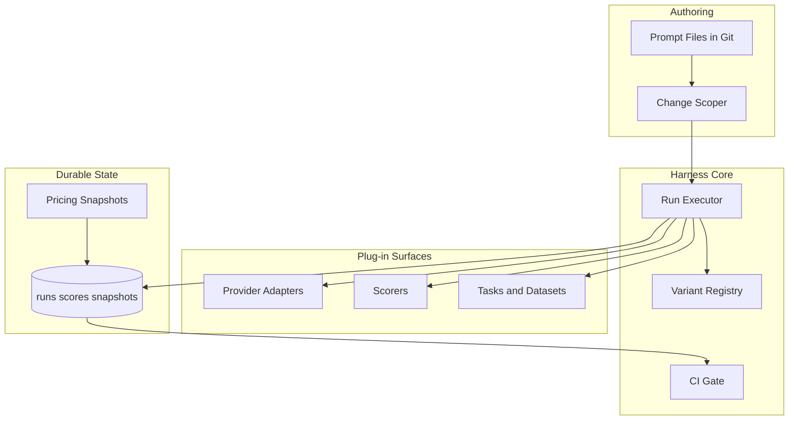
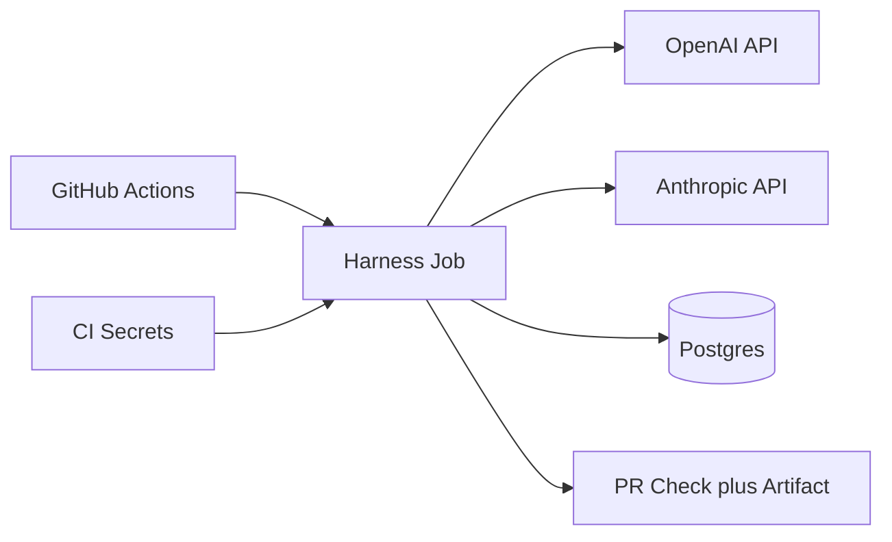

# Prompt Lab — Architecture Document
> - **Document Status**: Draft
> - **Last Updated**: 2026 Aug 29
> - **Author**: Paul Serban

A prompt-and-eval harness that treats a prompt change like a code change: content-addressable variants, provider-agnostic *enough* adapters, heterogeneous scorers, immutable run logs, and a CI gate that can block a merge. The harness is the measurement path later projects are supposed to plug into. The architecture's job is to make that true for a **narrow core contract** without becoming an eval SaaS, a prompt optimizer, or a fantasy of provider uniformity.

## Overview

**Brief description**: This is not a playground and not a platform company. It is the eval backbone: Task → Variant matrix → Provider adapters → Scorers → immutable Runs → a change-scoped gate. "We evaluated it" means a named run against a pinned dataset and scorer ids. "The prompt got better" is a paired comparison, not a screenshot.

**Business Context**
- Owner: the eval / prompt engineer who is tired of one-off scripts, and whoever will be blamed when a prompt PR ships a regression.
- Current state: notebooks, unversioned strings, single-model vibe checks, no merge gate. See [Scenario](./01_scenario_and_requirements.md).
- Desired future state: one harness core; two or three provider adapters; exact-match and LLM-judge scorers; Postgres as the run ledger; GitHub Actions running a smoke matrix on PR and a full matrix on a schedule. Downstream projects plug in a Task. RAGAS remains dark until a retrieval consumer exists.
- Goal: make prompt regressions visible and blockable **before merge**, and make cross-technique / cross-model comparisons *reproducible* — at the cost of combinatorial spend, adapter leakage, judge noise, and a standing CI bill.
- Target users: prompt/eval engineer, downstream project teams, PR reviewers.

## Requirements

### Functional Requirements

- **Variant registry**:
  - The system must identify a variant by a composite content hash, not by a filename or a monotonic `v3`.
  - Aliases (`cot-default`, `fewshot-refunds`) are allowed; they resolve to hashes. Moving an alias is a recorded event, not a silent rewrite of history.
  - Dataset version is pinned on every run. Changing labeled answers is a new dataset version; old runs stay comparable against the version they used.
- **Execution**:
  - A matrix cell is `(task, variant, model/provider, dataset_version)`.
  - The executor calls a provider adapter, records usage/latency/raw output, then calls declared scorers.
  - Failures (provider 5xx, parse failure, timeout) are first-class cell outcomes, not dropped rows.
- **Scoring**:
  - Exact-match (and close relatives: normalized match, schema-valid) where the task has a canonical target.
  - LLM-as-judge with a pinned judge identity, after (and with) calibration — see [System Design — Scoring](./03_system_design.md#4-scoring).
  - RAGAS (or any retrieval metric) is not invoked until optional context fields are present and a consumer opts in.
- **Logging**:
  - Every cell writes an immutable `runs` row and `scores` rows. Cost uses a pinned `pricing_snapshot_id`.
- **Gating**:
  - CI consumes a gate artifact: pass / fail / inconclusive per scorer family, plus harness-error fail-closed.
  - Change-scoper selects smoke cells from the PR diff. Full matrix is scheduled or release-gated.
- **Failure**:
  - If the provider or the judge is unavailable, the gate fails closed (do not merge on a skipped eval).
  - If the smoke matrix would be empty because the scoper could not map the diff, the gate fails closed or runs a documented default smoke set — never "nothing changed, skip."

### Non-Functional Requirements

**Performance Requirements:**
- PR smoke matrix: fast enough that people will not learn to skip CI. Design intent: **minutes, not an hour**, for a small pinned smoke set (tens of cells, not hundreds). Exact SLA is a Phase 4 measurement. Shrinking the smoke set below the cells the change actually touches is not a performance win; it is a disabled gate.
- Full matrix: overnight or on release candidate is acceptable. It is a bill and a batch job, not a PR check.
- Gate latency must not be "optimized" by dropping the second provider, dropping the judge, or dropping n below the sample size the statistics require.

**Service Level Agreement (SLA):**
- System criticality: quality-adjacent to whatever product consumes the prompts. A merged prompt regression is a product incident delayed until production. The *harness* does not need five-nines. It needs "Friday's prompt PR did not skip eval because Actions was out of minutes and we merged anyway."
- CI minutes and model TPM are capacity budgets. A matrix that cannot finish inside the Actions timeout is an architecture bug (scoper too wide, set too big, or missing cache of baseline cells).

**Infrastructure Constraints:**
- Technology shape (not an implementation mandate): Python or TypeScript runner, OpenAI/Anthropic SDKs behind adapters, Postgres for runs, object store optional for large outputs, GitHub Actions for PR/schedule, secrets store for keys. This is not an excuse to buy LangSmith on day one — [Trade-offs §4](./05_tradeoffs_and_honest_assessment.md#4-build-vs-buy) is the live question, not a footnote.
- The runner should be invocable locally with the same variant hashing as CI. A harness that only exists in Actions cannot be debugged.

## Executive Summary

The architecture is **Harness Core + Provider Adapters + Scorer Layer + Change-Scoped CI Gate**.

1. **Authoring loop:** engineer changes a template / exemplar set / schema / system prompt → content hashes change → scoper selects affected smoke cells.
2. **Execute loop:** adapter completes → usage/latency recorded → scorers write scores → run row immutable.
3. **Gate loop:** pair smoke (or full) results against a declared baseline → per-scorer-family pass/fail/inconclusive → CI.

The authoring loop without the gate is a notebook. The gate without composite identity is a check that cannot say *what* shipped. The adapters without labeled leakage are a fake abstraction. The scorers without statistical separation are a blended vanity number.

**Architecture Style:** Batch experiment runner with a versioned artifact registry and a CI control plane. Not a request-path service. Not a multi-tenant SaaS.

**Key Components:**
- **Prompt / Variant Registry**: templates, techniques, exemplars, schemas, composite hashes.
- **Task + Dataset Store**: items, labels where they exist, dataset versions.
- **Provider Adapter Layer**: OpenAI, Anthropic, (later a third); normalized result + leakage fields.
- **Run Executor**: matrix expansion, retries for harness 5xx only, concurrency vs TPM.
- **Scorer Layer**: exact-match family, LLM-judge family, reserved RAGAS slot.
- **Run Log (Postgres)**: runs, scores, pricing snapshots, gate results.
- **Change Scoper + CI Gate**: GitHub Actions, smoke vs full, fail-closed.

**Architecture Principles:**
- **Bytes are the version.** Names are aliases.
- **A named run is the unit of evidence.** "We tried it" is not a run.
- **Do not average unlike instruments.** Exact-match is not a judge score.
- **The adapter is thin and leaky on purpose.** Hide differences and you will debug ghosts.
- **Smoke is not the product.** Full matrix is the product; smoke is the merge tax.
- **Platform last.** Second consumer first. Kill the SPI if nobody plugs in.

**Key Architectural Decisions:**
1. Composite content-addressable variant identity over a flat version string ([ADR-001](./04_architecture_decision_records.md#adr-001)).
2. Change-scoped smoke matrix on PR, full matrix on schedule — not always-full and not author-picked cells ([ADR-002](./04_architecture_decision_records.md#adr-002)).
3. Thin adapters for 2–3 providers, copy-paste the next, no plugin SPI ([ADR-003](./04_architecture_decision_records.md#adr-003)).
4. Pluggable scorers with separate gate statistics, not a blended quality index ([ADR-004](./04_architecture_decision_records.md#adr-004)).
5. RAGAS deferred; optional context fields only ([ADR-005](./04_architecture_decision_records.md#adr-005)).

### The Anti-Pattern This Design Exists to Kill

This fails because:

- The variant is an unnamed string in a cell.
- The dataset is whatever the author remembered to paste.
- There is no baseline run to pair against.
- There is no second provider, or the second provider was tried by hand and not logged.
- The next project starts over. The "backbone" never exists.

### Context Diagram

## Runtime Architecture

1. **PR-time (synchronous with the merge, async with production)**
   - Diff → scoper → smoke cell list (or fail-closed default).
   - Resolve variant hashes and dataset pin; reuse cached baseline cells if bytes unchanged.
   - Execute candidate cells; score; write runs.
   - Paired comparison vs baseline; emit gate artifact; CI consumes it.
2. **Scheduled / release full matrix**
   - Expand the declared full matrix (tasks × in-scope techniques × in-scope models).
   - Same executor, same scorers, same log. Wider n, longer wall clock, higher bill.
   - Gate may be report-only on nightly and fail-closed on release candidate — write that policy in Phase 0.
3. **Calibration loop (slower cadence, once judge exists)**
   - Sample judged items for human labels.
   - Agreement below floor → `judge_untrusted` → gate fail-closed on judge-scored tasks.

Local `prompt-lab run` is the same executor with a smaller matrix. CI is not a different product.

## Components

### 1. Prompt / Variant Registry

**Purpose**: Be the system of record for "what bytes did we actually send." Git can be the store for templates and exemplars; Postgres stores the resolved hashes and aliases. The architecture cares about identity, not whether the files live in `_prompts/` or a table.

**Responsibilities:**
- Store or pointer to: template, technique tag, exemplar set, output schema, system prompt, decoding params.
- Compute per-axis hashes and a composite `variant_hash` ([System Design §2](./03_system_design.md#2-variant-identity)).
- Resolve aliases to hashes; record alias moves.
- Refuse to register secrets (heuristic + review); this is a prompt datastore.

**Interactions:**
- Read by: executor, scoper, reports.
- Written by: PR (files land, hashes computed at run time — do not trust a hash committed by the author without recomputing).

**Honesty about this component:** if hashing normalizes too aggressively (strip all whitespace, rewrite JSON key order, drop system prompt), you will collide variants that behave differently. If hashing normalizes too little (timestamps in files, trailing newlines that editors fight), every save is a new experiment and the baseline never matches. The normalization spec is load-bearing and will be argued about. Write it down in Phase 0 and test it with fixtures, or the registry is theater.

### 2. Task and Dataset Store

**Purpose**: Define *what is being asked* and *how we know an answer*, separately from *how we phrase the prompt*.

**Responsibilities:**
- Task: id, description, input schema, which scorers apply, which techniques are in-scope (not every task should run CoT).
- Dataset: versioned items (`input`, optional `target`, optional `rubric_notes`, optional retrieval-context placeholders for later).
- Freeze: a dataset version used by a baseline run is immutable.

**Interactions:**
- Executor reads items; scorers read targets/rubrics.

**Honesty about this component:** most interesting tasks **do not have a canonical `target`**. Exact-match on those is a category error. If Phase 1 only has a classification or short-slot-fill task so exact-match "works," that is an honest pilot — it is not proof the backbone evaluates RAG, agents, or support bots. A dataset of 20 items cannot detect an 8-point regression. Same statistical lecture as the support-bot harness; it does not get less true because this is a "lab."

### 3. Provider Adapter Layer

**Purpose**: Turn a normalized complete-request into a normalized result **without pretending providers are replicas**.

**Responsibilities:**
- Map request: messages, tools/schema, decoding params, timeout.
- Map response: text, parsed structured output if any, finish reason, usage tokens, latency, provider request id, raw error taxonomy → harness error class.
- Label `structured_output_mode` actually used.
- Tokenize **with the provider's tokenizer** (or record `token_count_source = provider_usage | local_estimate | unknown`). Do not bill-estimate Anthropic tokens with tiktoken for OpenAI and call it cost.

**Interactions:**
- SDKs, secrets, executor.

**Honesty about this component:** the abstraction **will leak**. JSON schema mode is not tool-use is not "please reply with JSON." Rate-limit 429 retry-after differs. Max output token names differ. Some models ignore `temperature=0`. Vision, prompt caching, and reasoning-token bills will not fit a naive `prompt_tokens + completion_tokens` until you extend the usage schema. Budget for per-provider special cases in the adapter **and** in the run row. A "generic LLM driver" SPI is how you lose an afternoon to an interface when you should have copied a folder ([ADR-003](./04_architecture_decision_records.md#adr-003)).

If a provider cannot honor structured output natively, the adapter may fall back to prompt-and-pray **only if the run is labeled**. Scoring schema-validity on a fallback path is measuring the parser, not the model.

### 4. Run Executor

**Purpose**: Expand a matrix, run cells with bounded concurrency, write immutable results.

**Responsibilities:**
- Expand cells from task × variant × model, filtered by scoper or by full-matrix declaration.
- Cache: if `variant_hash + model + dataset_version + scorer_id` already has a complete run for this candidate git SHA's *inputs*, reuse — but do not reuse across candidate prompt bytes.
- Concurrency: respect RPM/TPM; queue rather than stampede.
- Retry policy: harness/transport 5xx and timeouts with cap; **do not** retry on 4xx content-policy or on "score was low."
- Write `runs` even on failure.

**Interactions:**
- Registry, adapters, scorers, Postgres.

**Honesty about this component:** caching baseline cells is the only way CI stays cheap. Caching the **candidate** across retries of a sad score is p-hacking. Non-determinism at temperature > 0 means a single sample is a draw, not a mean. Either pin decoding to deterministic settings where the API allows, or n-sample and pay for it. "Temperature 0.7 because it looked nicer" belongs in a playground, not in a gate.

### 5. Scorer Layer

**Purpose**: Turn `(item, output, task)` into scores without mixing instruments.

**Responsibilities:**
- Exact-match family: raw, normalized (case/punct), schema-valid, optional regex/slot extract.
- LLM-judge family: decomposed rubric, pinned judge, order randomization for pairwise, human calibration sample.
- Reserved: retrieval/RAGAS scorer that **no-ops or refuses** if context fields are absent ([ADR-005](./04_architecture_decision_records.md#adr-005)).
- Each score row stores `scorer_id` (implementation + version + judge identity).

**Interactions:**
- Dataset, judge model APIs, human label queue.

**Honesty about this component:** exact-match proves the harness plumbing and is a real metric for **closed** tasks. Using it on open-ended generation trains the prompt to emit the author's favorite phrasing. LLM-as-judge inherits position bias, verbosity bias, and self-preference; 70–80% human agreement is a good day. Calibration does not make the judge true. If you cannot staff any human labels, you do not have a calibrated judge — you have a second model. RAGAS on synthetic context is a demo. See [ADR-004](./04_architecture_decision_records.md#adr-004).

### 6. Run Log (Postgres)

**Purpose**: The ledger. If it is not in Postgres (or an equivalent durable store), it did not happen.

**Responsibilities:**
- Tables: variants/aliases (or hash index), datasets, pricing_snapshots, runs, scores, ci_gate_results. Field-level design in [System Design §1](./03_system_design.md#1-data-model).
- Immutability of finished runs. Late human labels are additional score rows, not rewrites.
- Query: "all runs for task T, dataset D, scorer S, last 90 days."

**Interactions:**
- Executor writes; gate and reports read.

**Honesty about this component:** a JSONL file in git is acceptable in Phase 1 for a handful of runs and becomes a lie at CI cadence. Postgres is not "enterprise." It is how you do not overwrite Friday with Thursday. Storing full prompts and outputs means this database is **sensitive**. Retention and access control are not Phase 5 decorations.

### 7. Change Scoper and CI Gate

**Purpose**: Decide *what* to run on a PR, and whether that PR may merge.

**Responsibilities:**
- Map path changes → affected tasks / variants / scorers ([System Design §5](./03_system_design.md#5-change-scoped-matrix-and-gate)).
- Build smoke matrix; enforce minimum cells; fail-closed if mapping is empty or ambiguous without a default.
- Pair results against baseline; apply per-family statistics; emit pass/fail/inconclusive/harness_fail.
- Publish an artifact (tables, example regressions). A binary check without the artifact is how people re-run until green.

**Interactions:**
- GitHub Actions, Postgres, git diff.

**Honesty about this component:** authors will learn the scoper. They will put a behavioral change in a file the scoper thinks is docs. Tests for the scoper (fixture diffs → expected cells) are as important as tests for the adapters. If smoke is 8 easy exact-match items, the gate will never fail and everyone will call that reliability. Smoke must include at least one cell the team has seen fail in a drill ([Phased Plan Phase 4](./06_phased_implementation_plan.md#phase-4--ci-smoke-matrix-and-merge-gate)).

### Communication Patterns

**Synchronous:**
- Actions job ↔ executor (wait for smoke).
- Executor ↔ provider APIs; executor ↔ judge APIs.

**Asynchronous:**
- Nightly full matrix.
- Human labeling queue.
- Optional: report comments on the PR.

There is no synchronous "ask LangSmith" as a control-plane dependency in the default design. If the build-vs-buy decision is buy, that vendor *is* the run log — then this component diagram collapses and [Trade-offs §4](./05_tradeoffs_and_honest_assessment.md#4-build-vs-buy) has been answered.

## Brutal Honesty

This pattern is **materially more expensive** than a notebook:

- A second product (the harness) with outages, costs, and people who have to care when Actions is red.
- Token spend that scales with `tasks × techniques × models × items × (candidate + baseline) × (1 + judge)`.
- Combinatorial explosion: adding one model or one technique is a multiplier, not a line item.
- Adapter maintenance every time a provider changes JSON mode, usage fields, or prices.
- Judge spend and (if honest) human calibration time.
- An inconclusive gate that will infuriate someone who wanted a green check. That outcome is the design working.
- A platform bet: if no second project plugs in, you paid SPI tax for one script.

**When this is justified:** more than one product surface will share prompt/eval practice; you already lost a week to an unbisectable prompt regression; you compare models/providers as a recurring decision; structured-output breakage on the cheap model is a real ship risk.

**When this is overkill:** one classification prompt, one provider, twenty examples, a human still reads every output. A versioned JSONL and a pytest that calls one SDK is the correct design. Building prompt-lab there is costume. **Buying** LangSmith for a team that will not run Postgres is also a legitimate answer — see trade-offs.

**The abstraction will not stay clean.** Plan for leakage fields. Do not plan for a plugin marketplace.

**The CI gate will be gamed or skipped** unless smoke is mapped by tests, fail-closed is real, and full matrix still exists. Smoke-only is how you ship judge regressions that the nightly would have caught — and nobody looks at the nightly.

**Complexity you will actually pay:**
- Hash normalization bikeshedding.
- Baseline cache invalidation ("why did CI not use Thursday's run").
- Judge-prompt changes looking like candidate regressions.
- Price list rot (`cost` looks precise, is wrong).
- Actions minute caps vs full matrix.
- A downstream team that "just needs a script this week" and forks you.

## Scaling Strategy

**Current (Phase 1–4):** one lab, 1–2 pilot tasks, 2 providers, batch jobs, GitHub Actions. Horizontal scale is "more API calls," which is a bill.

**Bottlenecks:**
- Primary: **matrix size × unit cost**, not CPU.
- Secondary: judge calibration throughput.
- Tertiary: CI wall clock; people skip gates that take an hour.

**Scale-out (Phase 5, conditional):** more tasks (real consumers), RAGAS, maybe a third provider. Triggered by a second team actually integrating, not by a desire to look like a platform. See [Phased Implementation Plan — Phase 5](./06_phased_implementation_plan.md#phase-5--conditional-second-consumer-and-ragas).

### Component Diagram (Logic View)

### Deployment Diagram (Physical View)

The job runner is CI (and a laptop). Splitting "eval service" as a standing cluster is unnecessary until matrix volume or interactive UI is a real requirement. A standing service is another SPOF and another on-call. The [phased plan](./06_phased_implementation_plan.md) keeps this a job until a consumer forces otherwise.

## Data Architecture

See [System Design](./03_system_design.md) for field-level description. Summary:

- **Variants** are content-addressed. Aliases are pointers.
- **Runs** are the immutable evidence of a cell.
- **Scores** are per item, per scorer, never a single overwritten quality cell.
- **Pricing snapshots** make historical cost meaningful.
- **Gate results** are durable; CI status without a row is not auditable.

The platform does not treat a high exact-match rate as "the prompt is good." It treats it as "this instrument did not detect a regression of size X on this set."

## Cost Analysis

This is not an AWS bill exercise. The costs that matter:

- **Candidate tokens:** `cells × items × (input + output)`. Techniques like CoT inflate output tokens. Structured-output retries inflate further.
- **Judge tokens:** often the same order of magnitude as candidates, sometimes more (rubric, pairwise, long outputs).
- **CI minutes:** cheap relative to tokens until the matrix is wide; then both hurt.
- **Postgres:** negligible until you store every completion forever; then storage and sensitivity dominate, not instance size.
- **Human labeling:** if judge exists, hours per month, forever, or the judge is untrusted.

A matrix of 2 tasks × 5 techniques × 3 models × 50 items × 2 (candidate+baseline) is 3,000 generations **before** judges. Price that in Phase 0 with real model rates. If you cannot afford it, **cut the matrix in writing** (fewer techniques in smoke, fewer models in PR, raise MDE). Do not keep the slide that says "all variants vs all models" and then run 12 cells.

The notebook is cheaper until the first unbisectable regression or the first "we thought structured output worked on Model B." Price the architecture against that incident, not against "one extra Actions job."

## Risks and Mitigation

| Risk | Likelihood | Impact | Mitigation | Owner |
| --- | --- | --- | --- | --- |
| Composite hash collisions or hash churn | Medium | High | Phase 0 normalization spec + fixtures ([ADR-001](./04_architecture_decision_records.md#adr-001)) | Eval engineer |
| Combinatorial cost / CI timeout | High | High | Smoke vs full; cache baselines; cut matrix in writing ([ADR-002](./04_architecture_decision_records.md#adr-002)) | Eval engineer |
| Scoper gamed or empty | High | High | Fixture tests; fail-closed default smoke; path allow/deny lists | Eval engineer |
| Provider abstraction lies about JSON mode | High | High | `structured_output_mode` required; schema-valid as its own score ([ADR-003](./04_architecture_decision_records.md#adr-003)) | Eval engineer |
| Blended "quality" score hides a judge fail | High | High | Per-family gate rules ([ADR-004](./04_architecture_decision_records.md#adr-004)) | Eval engineer |
| Exact-match on open-ended tasks | High | Medium | Task declares allowed scorers; refuse EM if no target | Eval engineer |
| Uncalibrated LLM judge | High | High | Agreement floor; `judge_untrusted` fail-closed | Eval engineer |
| RAGAS built against a fake retriever | Medium | Medium | No-op without context; Phase 5 only ([ADR-005](./04_architecture_decision_records.md#adr-005)) | Architect |
| No second consumer; SPI rot | High | Medium | Narrow contract; kill criteria in phased plan | Architect |
| Team p-hacks by re-running | Medium | Medium | One run per candidate artifact; retry policy | Prompt owner |
| Pricing snapshot stale; cost is fiction | Medium | Medium | Dated snapshots; `cost_status=unknown` if missing | Eval engineer |
| Prompt log is a secrets dump | Medium | High | Registry checks; retention; access control | Security-adjacent owner |
| Buy-vs-build undecided, both half-done | Medium | High | Phase 0 explicit choice ([Trade-offs §4](./05_tradeoffs_and_honest_assessment.md#4-build-vs-buy)) | Architect |

## Future Enhancements

Covered by phases rather than a wishlist: single-provider exact-match log, then adapters, then judge+stats, then CI gate, then conditional second consumer / RAGAS. See [Phased Implementation Plan](./06_phased_implementation_plan.md).

**Known/Accepted Trade-offs:**
- Smoke speed vs detection power on PR.
- Thin leaky adapters vs a beautiful SPI.
- Exact-match honesty vs impressive open-ended demos.
- Judge cost and bias vs human-grading every cell.
- Platform-shaped contract vs YAGNI.
- Residual undetectable regressions on items not in the set, forever.
