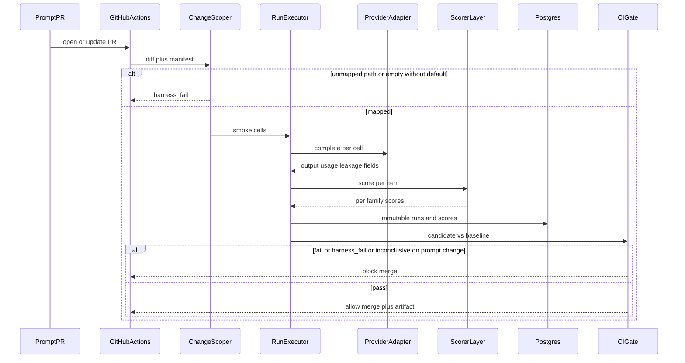
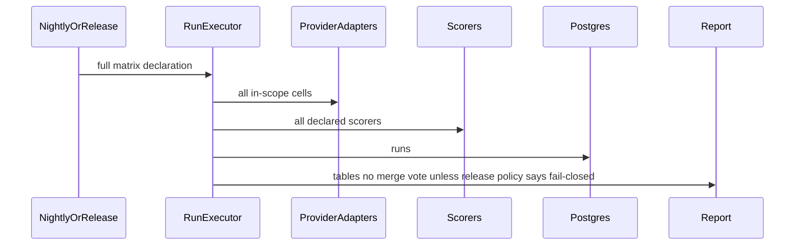
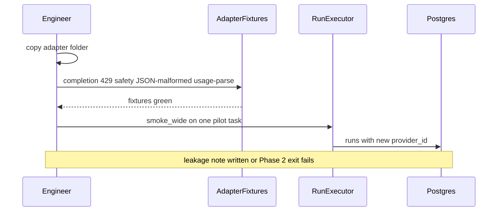

# Prompt Lab — System Design
> - **Document Status**: Draft
> - **Last Updated**: 2026 Aug 29
> - **Author**: Paul Serban

This document describes *how* the harness works internally: the data model, composite variant identity, adapter contract and leakage, heterogeneous scoring with two statistical treatments, and the change-scoped CI matrix. It complements the [Architecture Document](./02_architecture_document.md), which covers *what* the system is and *why* the core contract stays narrow.

> This is a design specification. No SDK, GitHub Actions YAML, or judge-prompt source is implemented as part of this documentation deliverable. Numbered steps are the intended job behavior, not a source file.

## 1. Data Model

Seven logical stores. They may start as JSONL plus git in Phase 1. They must not be collapsed into "a spreadsheet of scores we overwrite every Friday." Postgres is the intended system of record from Phase 2 onward (when a second provider and CI make history load-bearing).

### 1.1 `prompt_templates` (git-backed; hashes computed at run)

Human-authored files. The database stores the resolved hashes, not a second copy of truth, unless CI cannot check out git (it can).

| Field | Role |
| --- | --- |
| `template_path` | Repo path. |
| `template_hash` | Hash of **normalized** template bytes ([§2](#2-variant-identity)). |
| `technique` | `zero_shot` \| `few_shot` \| `cot` \| `structured_output` \| `system_prompt_variant`. A file may participate in more than one technique if composition is explicit (e.g. few-shot + structured). Composition is a variant, not a sixth mystery tag. |
| `system_prompt_hash` | Hash of system prompt file or empty-canonical if none. |
| `schema_hash` | JSON schema / tool spec hash, or empty-canonical. |
| `exemplar_set_hash` | Hash of the few-shot pack, or empty-canonical. |

### 1.2 `variants`

The unit of experiment after composition.

| Field | Role |
| --- | --- |
| `variant_hash` | Primary key. Composite of the axes in [§2](#2-variant-identity). |
| `task_id` | |
| `template_hash` / `technique` / `system_prompt_hash` / `schema_hash` / `exemplar_set_hash` | Axes. |
| `decoding_hash` | Canonical JSON of temperature, top_p, max_tokens, seed, stop, penalties. |
| `alias` | Optional human name. Not unique over time; `alias_history` records moves. |
| `created_at` | First seen. |

**Uniqueness:** `variant_hash`.

**Honesty:** if `decoding_hash` omits `max_tokens`, two runs that truncate differently will look like the same variant and you will debug "flaky exact-match."

### 1.3 `dataset_items`

| Field | Role |
| --- | --- |
| `dataset_version` | Pin. Part of uniqueness with `item_id`. |
| `item_id` | Stable across versions when carried forward. |
| `input` | Structured input the template renders. |
| `target` | Optional canonical answer. Required for exact-match family. Forbidden as the *only* quality signal on open-ended tasks. |
| `rubric_notes` | For judge scorers. |
| `retrieved_context` / `ground_truth_context` | Optional. Empty in v1. RAGAS may not run if empty ([ADR-005](./04_architecture_decision_records.md#adr-005)). |
| `split` | `smoke` \| `full` \| `calibration`. An item may be in smoke and full; calibration is a subset with human labels. |
| `stratum` | Optional tags (difficulty, category) so reports do not hide a 4-item slice inside a mean. |

**Uniqueness:** `(dataset_version, item_id)`.

### 1.4 `provider_models`

| Field | Role |
| --- | --- |
| `provider_id` | `openai` \| `anthropic` \| … |
| `model_api_name` | What we request. |
| `adapter_id` | Implementation version of the adapter (code hash or semver). Adapter changes can change tokenization or JSON mode. |
| `tokenizer_id` | Named tokenizer used for *local* estimates; may be `none`. |

### 1.5 `pricing_snapshots`

| Field | Role |
| --- | --- |
| `snapshot_id` | |
| `provider_id` / `model_api_name` | |
| `input_per_mtok` / `output_per_mtok` | Documented units. |
| `extra_rates_json` | Cache-write, cache-read, reasoning tokens — optional, explicit. |
| `effective_from` / `effective_to` | |
| `source` | Contract, public page, guessed. **Guessed snapshots must not silently look like contract.** |

A run pins `snapshot_id`. Dashboards that reprice history with today's list are forbidden.

### 1.6 `runs`

One row per matrix cell execution.

| Field | Role |
| --- | --- |
| `run_id` | Primary key. |
| `run_kind` | `pr_smoke` \| `full_matrix` \| `local` \| `calibration`. |
| `git_sha` | Candidate code/prompt bytes. |
| `task_id` / `variant_hash` / `dataset_version` | Pins. |
| `provider_id` / `model_api_name` / `adapter_id` | |
| `structured_output_mode` | `native_json` \| `tool_call` \| `prompt_fallback` \| `none`. Required, not inferred from technique tag. |
| `token_count_source` | `provider_usage` \| `local_estimate` \| `unknown`. |
| `input_tokens` / `output_tokens` / `other_tokens_json` | |
| `latency_ms` | |
| `pricing_snapshot_id` | |
| `cost_estimate` / `cost_status` | `ok` \| `unknown`. Never invent. |
| `finish_reason` / `error_class` | `ok` \| `timeout` \| `rate_limit` \| `content_policy` \| `parse_failure` \| `provider_5xx` \| `harness_bug`. |
| `output_ref` | Text or object-store pointer. Retention policy applies. |
| `seed` / `decoding_echo` | Replay. |
| `baseline_run_id` | For paired gate cells; null if this *is* the baseline materialization. |
| `started_at` / `finished_at` / `status` | `running` \| `complete` \| `failed_harness` \| `failed_incomplete`. |

**Immutability:** a finished run is not updated except to attach late human scores as additional `scores` rows.

### 1.7 `scores` and `ci_gate_results`

`scores`: `(run_id, item_id, scorer_id, dimension, value, rationale_short, judge_kind)`. `judge_kind` is `exact` \| `rule` \| `llm` \| `human` \| `ragas` (unused until Phase 5).

`ci_gate_results`: `(gate_id, git_sha, baseline_ref, smoke_or_full, per_family_json, overall, artifact_ref)`. `overall` is `pass` \| `fail` \| `inconclusive` \| `harness_fail`. Per-family outcomes are **not** averaged into overall except by documented fail-rules (any hard-fail family fails overall; inconclusive on a changed family blocks merge).

### 1.8 What is *not* a table

There is no `current_quality` singleton. There is no `blended_score`. There is no mutable `prompt_version = 3` without a hash.

## 2. Variant Identity

### 2.1 Axes (all required in the composite)

1. `task_id` (string, stable).
2. `template_hash`
3. `technique`
4. `system_prompt_hash` (empty-canonical if absent)
5. `exemplar_set_hash` (empty-canonical if absent)
6. `schema_hash` (empty-canonical if absent)
7. `decoding_hash`

**Not in the variant hash:** provider, model, dataset version, scorer. Those are run dimensions. The same prompt bytes against two models are **two runs of one variant**, not two variants. This is load-bearing for "compare techniques across models": you want the variant stable.

**In the run key:** `variant_hash + provider + model + adapter_id + dataset_version + git_sha` (git_sha distinguishes "same files, different day" only if files did not change — prefer hashing bytes; git_sha is audit).

### 2.2 Normalization (Phase 0 must freeze this)

Design intent, not a library:

- UTF-8, LF newlines, strip a single trailing newline, no BOM.
- Templates: do not minify; whitespace in prompts is behavior.
- JSON schema / decoding / exemplar packs stored as canonical JSON (sorted keys, no insignificant whitespace) **when the source is JSON**. Markdown exemplar files hash as normalized text, not as JSON.
- Do not expand env vars before hash. Secrets should not be in the file.
- Do not include comments stripped by a preprocessor unless that preprocessor is part of the published render path.

**Fixture tests (required):**
- Identical bytes → identical hash.
- Temperature 0 vs 0.0 in JSON → identical `decoding_hash` after canonicalization.
- Exemplar order is significant (few-shot order changes behavior) → different hash if the pack is an ordered list.
- Renaming a file without byte change → same hashes (path is not an axis).

### 2.3 Rendering

1. Load template + system + exemplars + schema by hash.
2. Render `input` through the template. Record `rendered_hash` on the run (optional but useful when templates are Jinja and bugs hide in render).
3. Adapter sends messages. The rendered bytes are what the model saw; the template hash alone is not enough if render is buggy — hence `rendered_hash`.

### 2.4 Aliases

`cot-v2` points at a `variant_hash`. Moving the alias writes `alias_history`. Reports may show aliases; gates pin hashes. "We shipped cot-v2" without a hash in the artifact is not auditable.

## 3. Provider Adapter Contract

### 3.1 Interface (conceptual)

The executor calls one method:

1. **Input:** `messages` (already rendered), `schema_or_tools` (optional), `decoding`, `timeout`, `idempotency_key` (optional; most completion APIs are not idempotent — do not pretend they are).
2. **Output:** `text`, `structured` (parsed object or null), `structured_output_mode`, `usage`, `latency_ms`, `provider_request_id`, `finish_reason`, `raw_error`.

Adapters **must not** score. Adapters **must not** retry on low scores. Adapters **may** retry transport 429/5xx with bounded backoff; those retries are harness-internal and must be counted (`retry_count` on the run) because they cost money.

### 3.2 Where the interface leaks (expected)

| Concern | Why it leaks | What we record |
| --- | --- | --- |
| Tokenizer / usage | Different tokenizers; cache tokens; reasoning tokens | `token_count_source`, `other_tokens_json` |
| Structured output | Native JSON vs tools vs prompt | `structured_output_mode`; schema-valid scorer |
| Decoding knobs | `max_tokens` vs `max_output_tokens`; ignored temperature | `decoding_echo` of what was *sent* |
| Errors | 429 body, safety 4xx vs 5xx | `error_class` mapping table per adapter |
| Streaming | Optional; gate does not need tokens streamed | If streaming, usage still required at end |
| Prompt caching | Cost and latency change; output should not | Extra rates in snapshot; do not treat cache hit as a different variant |

### 3.3 Structured-output policy

Numbered:

1. If the variant technique includes structured output and the model/provider has native schema or tool mode, the adapter **must** use it and set `native_json` or `tool_call`.
2. If native mode is unavailable, the adapter may use `prompt_fallback` only when the task explicitly allows it. The schema-valid scorer still runs. Gate reports parse-fail rate **separately** from exact-match on parsed fields.
3. Never report `technique=structured_output` with `structured_output_mode=none`.

### 3.4 Adding a provider

Copy an adapter folder. Implement the contract. Add a fixture suite: one completion, one 429, one safety 4xx, one malformed JSON, usage parsed from a recorded payload. Update `pricing_snapshots`. **Do not** generalize a plugin SPI for this ([ADR-003](./04_architecture_decision_records.md#adr-003)).

Document leakage in a short adapter note (tokenizer, JSON mode, error map). If Phase 2 cannot write that note, the abstraction is lying.

## 4. Scoring

### 4.1 Exact-match family

Applies only if `target` is present.

- `exact_raw`: string equality.
- `exact_normalized`: documented normalization (trim, casefold, optional punctuation). Normalization is part of `scorer_id`.
- `schema_valid`: JSON parses and validates against `schema_hash`.
- `slot_extract`: optional deterministic extract then match.

**Statistic for the gate:** per-item Bernoulli (correct/incorrect). Paired comparison: same items, candidate vs baseline. Report pass-rate and a **confidence interval** (Wilson or bootstrap). Fail if the interval for the delta (candidate − baseline) lies entirely below −MDE. Inconclusive if the interval includes both 0 and −MDE. Sample size vs MDE is Phase 0 work — 20 items will not support a 5-point MDE.

**Do not** use a naked "accuracy dropped 2%" without n and an interval.

### 4.2 LLM-as-judge family

Applies when the task declares a rubric and no canonical string is sufficient.

- Decomposed dimensions; hard-fail vs soft.
- Pairwise vs baseline with randomized order; store `pair_order`.
- `scorer_id` includes judge model + judge-prompt hash.
- Human labels on a calibration split; agreement below floor → `judge_untrusted`.

**Statistic for the gate:** paired per-item differences `d_i`, bootstrap CI (or permutation test), same three-way outcome as [support-bot harness regression](../../prj--support-bot-eval-harness/_docs/03_system_design.md#4-regression-detection-across-model-version-upgrades). **Do not** feed judge means into the exact-match proportion test.

Safety-like dimensions, if any exist on a lab task, are human-mandatory before `pass`. Most lab tasks will not have safety strata; do not copy a support-bot safety program as decoration.

### 4.3 RAGAS / retrieval family (reserved)

If `retrieved_context` and the consumer's ground-truth fields are absent, the scorer **refuses** (run records `scorer_skipped_missing_context`), it does not invent context. No gate rule consumes RAGAS until Phase 5 exit.

### 4.4 Combining families in one gate

Documented fail-rules, not a formula:

1. `harness_fail` if too many cells error (pre-registered incompleteness budget, default: any incompleteness on changed families).
2. `fail` if any **in-scope** family fails its own test.
3. `inconclusive` if any in-scope family is inconclusive and none fail — **does not merge** when the PR touched prompts/models/scorers.
4. `pass` only if every in-scope family passes and the run is complete.
5. Families not in-scope for the task are omitted, not scored as 100%.

**Forbidden:** `(exact_match_rate + mean_judge)/2`. **Forbidden:** dropping failed generations from the denominator without a pre-registered rule (count as incorrect or as incompleteness).

### 4.5 One run per candidate

`candidate_id` = `git_sha` + resolved variant hashes in the matrix. Re-run allowed for `error_class` in `{provider_5xx, timeout, harness_bug}` with cap. Re-run because exact-match was 0.74 is not allowed; the gate artifact must show `attempt=1` unless the error class permitted retry.

## 5. Change-Scoped Matrix and Gate

### 5.1 Mapping (design intent)

The scoper reads the PR diff paths and a **manifest** (checked in) that maps:

| Path glob | Affects |
| --- | --- |
| `tasks/<task_id>/**` | That task's smoke + any shared variants |
| `prompts/<task_id>/**` | Variants for that task |
| `prompts/_shared/**` | All tasks that include shared templates |
| `exemplars/**` | Variants whose `exemplar_set_hash` depends on those files |
| `schemas/**` | Structured-output variants |
| `scorers/**` | All tasks using that scorer; **cannot** use prompt-only smoke — scorer changes require judge/EM re-run as declared |
| `adapters/**` | Full smoke across models for that provider; adapter change is not "docs" |
| `docs/**`, `README.md` | Empty matrix → **default smoke or skip-with-label**. Phase 0 picks one. Skip-with-label is allowed only if the glob is truly docs. |

If a path matches nothing in the manifest: **fail-closed** (`unmapped_path`), not skip.

### 5.2 Smoke vs full

- **Smoke:** items with `split=smoke`, techniques and models in `smoke_matrix` declaration (e.g. 1–2 techniques most at risk, 1–2 models). Must include at least one known-failing fixture cell in CI tests of the harness itself.
- **Full:** all in-scope techniques × all in-scope models × `split=full` items. Nightly and/or release candidate.

A PR that changes `adapters/` or `scorers/` or `_shared` prompts **upgrades** to a wider smoke (documented as `smoke_wide`). Model list changes in config are `smoke_wide`.

### 5.3 Baseline

Baseline is a **named set of runs** on `main` (or last-known-good git SHA) for the same `dataset_version` and `scorer_id`. If the PR changes the dataset or the scorer, pairing against old scores is invalid — run **bridging**: execute baseline bytes and candidate bytes with the new scorer/dataset, or require a two-step PR (scorer change on old prompts first). Cheap teams will skip bridging and ship noise. The gate should refuse mixed-scorer pairs.

### 5.4 Caching

Unchanged cells (same variant_hash, model, dataset, scorer, adapter) on the baseline SHA are reused. Candidate cells always execute if their variant_hash is in the affected set. Do not cache candidate results across force-pushes that change bytes; do cache within a retry for 5xx.

## 6. Sequence Diagrams

### 6.1 PR smoke run gating a merge

### 6.2 Scheduled full matrix

Nightly may be report-only so a flaky provider does not page at 3am. Release candidate **fail-closed** on the same full matrix. Write this in Phase 0. If nightly is ignored for a month, it is not a matrix; it is a bill.

### 6.3 Adding a provider adapter

## 7. Observability (Minimum)

Metrics that change behavior:

- Cells attempted / complete / error_class counts.
- Gate: pass / fail / inconclusive / harness_fail / unmapped_path.
- Wall clock of smoke vs timeout budget.
- Cost per matrix (from pinned snapshots).
- Judge agreement when judge exists.
- Nightly full-matrix age (time since last successful complete run). If this grows, the full matrix is dead.

Logs: `run_id`, `variant_hash`, `task_id`, no secrets, prompt text retained per policy.

PR artifact: per-family tables, n, intervals, example item failures, leakage fields if structured_output_mode is fallback. A single "92%" badge is not an artifact.

## 8. Mapping Back to the Scenario Questions

| Question | Answer in this design |
| --- | --- |
| How do you run the same task through zero-shot, few-shot, CoT, structured-output, system-prompt variants? | Technique is a variant axis; composition is a new hash; matrix expansion enumerates in-scope techniques per task ([§2](#2-variant-identity)). |
| How do you compare models/providers? | Same `variant_hash`, different `provider_id`/`model_api_name` runs; adapters label leakage so JSON-mode differences are not scored as prompt differences ([§3](#3-provider-adapter-contract)). |
| How do you log prompt version, model, output, tokens, latency, cost? | Immutable `runs` with composite hash, usage, latency, `pricing_snapshot_id` ([§1.6](#16-runs)). |
| How do you score exact-match, LLM-as-judge, later RAGAS? | Pluggable scorers; separate statistics; RAGAS refuses without context ([§4](#4-scoring)). |
| How does a prompt change get a CI gate? | Change scoper → smoke matrix → paired per-family gate fail-closed; full matrix on schedule/release ([§5](#5-change-scoped-matrix-and-gate)). |
| How is this a backbone later projects plug into? | Task + dataset + scorer + (optional) adapter; core runner unchanged. Phase 5 only when a second consumer exists. Until then it is a designed seam, not a user count. |
