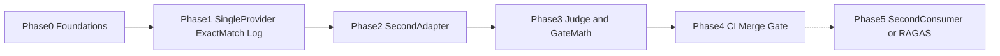

# Prompt Lab — Phased Implementation Plan
> - **Document Status**: Draft
> - **Last Updated**: 2026 Aug 29
> - **Author**: Paul Serban

Each phase has an **Objective**, **Deliverables**, and an **Exit Gate** that must pass before the next phase begins. Phases 0–4 are sequential. Phase 5 is conditional and may never trigger.

The order is load-bearing: **log and hash before adapters-as-a-story, exact-match before judge, two providers before "agnostic," smoke CI before claiming a merge gate, second consumer before RAGAS.** Collapsing Phase 1 and Phase 4 into one deploy is how you ship a green check that does not know what a variant is. Collapsing Phase 5 into Phase 1 is how you fake RAGAS.

## Phase 0 — Foundations

**Objective**: Freeze identity, matrix policy, money, and build-vs-buy **before** anyone treats a notebook as a gate.

**Deliverables**:
- Normalization spec for hashes (templates, JSON schema, decoding, exemplars) with **fixture cases** written as examples, even if no code exists yet ([ADR-001](./04_architecture_decision_records.md#adr-001)).
- Pilot task selection: 1–2 tasks. At least one with a real `target` so exact-match is valid. Write which techniques are in-scope (not all five are required on day one — but the *axes* must exist).
- Sampling plan: n, MDE, smoke vs full item counts. If n cannot support the MDE, **raise the MDE in writing**.
- Smoke-vs-full policy: which models/techniques in PR smoke; nightly vs release fail-closed for full matrix ([ADR-002](./04_architecture_decision_records.md#adr-002)).
- Path-manifest draft (globs → affected cells), including the unmapped-path fail-closed rule.
- Pricing snapshot policy: source of rates, `cost_status=unknown` rule.
- Re-run policy: one primary run per candidate artifact; harness-5xx retry only.
- Human-labeling hours **if** Phase 3 will use a judge as a merge signal. If hours are zero, Phase 3 judge cannot be the only gate.
- Build vs buy vs do-nothing decision using [Trade-offs §4](./05_tradeoffs_and_honest_assessment.md#4-build-vs-buy), named owner. If "do nothing," this plan stops.
- Written asks (CI spend cap, Postgres, consumer date) sent in parallel.

**Exit Gate**:
- [ ] Hash normalization examples reviewed by a second person (collision vs churn cases).
- [ ] MDE + n written; smoke size will not be pretended to detect the full MDE.
- [ ] Smoke/full policy written, including "nightly ignored" residual risk.
- [ ] Build/buy/do-nothing is explicit. If buy, remaining phases map onto vendor features or this plan is rewritten — do not dual-run a half platform.
- [ ] A consumer date exists or is explicitly "none — lab is self-use only" (then Phase 5 is off the table and the SPI stays minimal).

**Honesty gate:** if product wants "just run the five prompting styles this week so we can pick one," they are asking for a notebook. The compromise is a **manual Phase 1 log**, not calling Phase 0 done and skipping to a merge gate.

## Phase 1 — Single Provider, Exact-Match, Manual Runs

**Objective**: Prove logging and versioning end-to-end on **one** provider. No CI gate. No judge. Absence of CI is success for this phase, not an incomplete feature. The ledger is the feature.

**Deliverables**:
- Registry + hash computation + alias table.
- One adapter (OpenAI *or* Anthropic — pick the one the pilot actually uses).
- Executor: render, complete, record usage/latency/output, exact-match family only.
- Store: JSONL acceptable; schema must match [System Design §1](./03_system_design.md#1-data-model) so Postgres is a move, not a redesign.
- Pricing snapshot v0 pinned on runs.
- Tests: identical bytes → identical hash; temperature canonicalization; a known-bad template fails exact-match; a truncated `max_tokens` is a different `decoding_hash`.
- Manual matrix: in-scope techniques × one model × full(ish) labeled set, run at least twice to prove replay.

**Exit Gate**:
- [ ] Two runs of the same bytes produce the same `variant_hash` and comparable scores (flap within documented non-determinism; if flap is large at temperature 0, write it down — do not hide it).
- [ ] Changing exemplars changes `variant_hash`; changing only an alias label does not.
- [ ] Cost is either `ok` against the snapshot or `unknown` — never a guessed number presented as fact.
- [ ] **No GitHub Actions gate.** Confirm this so Phase 4 is not "already done."
- [ ] **No second provider required.** Confirm so Phase 2 is real work.

**Honesty gate:** if the only task has no targets, this phase cannot exit on exact-match. Either add a closed task or admit Phase 1 is "we logged completions" and **cannot** claim scoring works.

## Phase 2 — Second Provider Adapter (Prove the Abstraction)

**Objective**: Prove "provider-agnostic" as **honest leakage**, not as identical scores. A second adapter that cannot parse usage or that silently prompt-and-prays JSON fails this phase.

**Deliverables**:
- Second adapter (the other of OpenAI/Anthropic).
- Fixture suite: completion, 429, safety 4xx, malformed JSON, recorded usage payload parse.
- `structured_output_mode` populated on structured variants for **both** providers.
- Leakage note: tokenizer, JSON/tool mode, error map, known ignored decoding knobs.
- Same variant_hash run against both models; report score **and** parse-fail **and** cost **separately**.
- Move store to Postgres if JSONL is already painful (allowed here; required before Phase 4 cadence).

**Exit Gate**:
- [ ] Identical variant bytes, two providers, two run rows, one variant_hash.
- [ ] A structured-output cell on the weaker JSON path is labeled `prompt_fallback` if that is what happened — not `native_json`.
- [ ] Usage parse fixture fails the build if the vendor payload shape changes (the fixture is the canary).
- [ ] Leakage note exists. If the team cannot write it, they do not understand the adapter.
- [ ] Scores are **not** required to match across providers. A report that "Claude is worse" must show whether parse-fail, not semantics, drove it.

**Honesty gate:** if the second "provider" is the same vendor via an OpenAI-compatible proxy, this phase did not happen. That is one adapter with two base URLs.

## Phase 3 — LLM-Judge Scorer and Per-Family Statistical Gate

**Objective**: Add the noisy instrument and the math that prevents blending it with exact-match. CI is still not required; the gate **logic** is, so Phase 4 wires it rather than inventing it under merge pressure.

**Deliverables**:
- Judge scorer: decomposed rubric, pinned `scorer_id`, pairwise order randomization.
- Calibration subset + agreement measurement **or** documented `uncalibrated` status that **forbids** judge-only merge (Phase 4 must not "forget").
- Gate library: exact-match proportion/CI; judge paired bootstrap; combine via [§4.4 fail-rules](./03_system_design.md#44-combining-families-in-one-gate).
- Incompleteness budget; mixed-scorer pair refusal.
- Tests: blended average is **not** implementable as overall (assert overall comes from fail-rules); inconclusive ≠ pass; harness error ≠ pass.

**Exit Gate**:
- [ ] A synthetic regression on exact-match fails that family without touching judge.
- [ ] A synthetic judge-dimension drop fails that family even if exact-match is flat (on a task that has both).
- [ ] Mixed `scorer_id` pair is rejected.
- [ ] If agreement is below floor (or unlabeled): `judge_untrusted` path exists and blocks judge-as-gate.
- [ ] Sample-size vs MDE updated with **observed** variance.

**Honesty gate:** shipping Phase 3 with n=15 and three-decimal judge means is a fail. Raise MDE or grow n.

## Phase 4 — CI Smoke Matrix and Merge Gate

**Objective**: Make the merge tax real. This is the first phase that can claim "a prompt change can't merge if eval scores regress" — and only for **smoke**, with full matrix on the documented cadence.

**Deliverables**:
- GitHub Actions job: scoper + smoke + gate artifact on PR.
- Manifest fixtures: sample diffs → expected cells; unmapped path → harness_fail; docs glob → skip-or-default as Phase 0 wrote.
- Baseline cache from `main`.
- `smoke_wide` for adapters/scorers/shared prompts.
- Scheduled full matrix; release-candidate fail-closed **or** nightly fail-closed — pick one in Phase 0 and implement it.
- Fail-closed if Actions cannot reach providers (do not merge on skipped check unless the exception list explicitly allows docs-only).
- Cost and duration report vs Phase 0 budget.

**Exit Gate**:
- [ ] A PR that changes a template and would fail exact-match on smoke **cannot merge** (drill).
- [ ] A PR that only changes README follows the docs policy (skip or default smoke) — proven with a fixture.
- [ ] A PR that changes an adapter path cannot take the docs skip.
- [ ] Duplicate run of the same candidate does not count as independent evidence.
- [ ] Full matrix has completed at least twice on schedule; if it was skipped for cost, that is a **policy incident**, not an optimization — either shrink the declared full matrix or restore the job.
- [ ] Artifact includes per-family tables and hashes, not a single percentage.

**Honesty gate:** if the org allows bypassing required checks, Phase 4 is theater. Fix branch protection or stop claiming a gate.

## Phase 5 — Conditional Second Consumer and RAGAS

**Objective**: Grow the backbone **only** when a real second project plugs in, and/or when retrieval context exists. Not because the original scenario said "later RAGAS."

**Entry Gate (any one of):**
- [ ] A second workbook/product task is integrated (own dataset, own scorer or reused scorer, executed by the same runner) — not a copy-paste of the pilot files.
- [ ] A RAG consumer populates `retrieved_context` / ground-truth fields and wants a retrieval-family scorer; they will re-measure, not assume RAGAS is truth.
- [ ] Full-matrix / CI limits are hit *after* scoping and sharding, and a standing service or a vendor buy is the proposed fix — revisit [ADR-006](./04_architecture_decision_records.md#adr-006) and [Trade-offs §4](./05_tradeoffs_and_honest_assessment.md#4-build-vs-buy).

**Deliverables**:
- If second consumer: contract freeze (what they had to implement), a list of core changes that were *not* supposed to be needed (if that list is long, the seam failed).
- If RAGAS/retrieval: scorer behind the reserved family; refuse on empty context; gate rules **separate**; no blend.
- If platform buy/service: rewrite the deployment diagram; do not run two sources of truth for runs.

**Exit Gate**:
- [ ] Entry-gate reason actually improved (second team runs in CI, or retrieval scores move a real decision, or timeouts are gone). If not, revert the complexity.
- [ ] Phase 1–4 gates still pass (a new scorer must not average away an exact-match fail).

This phase can be deferred indefinitely. A hashed ledger, two leaky adapters, exact-match + optional judge, and a smoke gate will carry "are we allowed to merge this prompt." Shipping an eval SaaS on day one for one classification task is usually costume.

## Phase Dependency Graph

Phases 1–2 may be compressed in calendar time; they must not be one PR that both invents hashing and claims agnosticism. Phase 3 must not be skipped if Phase 4 will gate on a judge. Phase 4 without Phase 1's identity is a pytest that calls production. Phase 5 stays dotted.

## Kill Criteria for the Harness Program

Stated in advance so a bad harness does not linger as decoration:

- **Merge incidents attributed to a prompt the gate passed** because smoke was tiny, the scorer was blended, or checks were optional — pause claiming a gate; fix fail-rules or smoke; do not "tune the badge."
- **Nightly/full matrix skipped for a month** to save money while still advertising cross-model coverage — cut the claim or restore the job.
- **Human labeling defunded** while judge scores remain the merge signal — mark judge untrusted; fall back to exact-match/schema or stop gating.
- **No second consumer after the date Phase 0 wrote**, and the SPI is costing more than a script — collapse adapters/scorers inward; keep the job. That is a successful kill of the platform bet, not a secret.
- **Cost of matrix exceeds the incident cost it is supposed to prevent**, sustained, with no drill that a real regression was caught — legitimate reason to shrink to git + pytest + one model, or to buy a vendor and stop maintaining adapters.

None of these are "tune and continue by default." A measurement system that is untrusted should have to earn operation again, the same way a flaky CI suite should not be the merge requirement until it is fixed.
