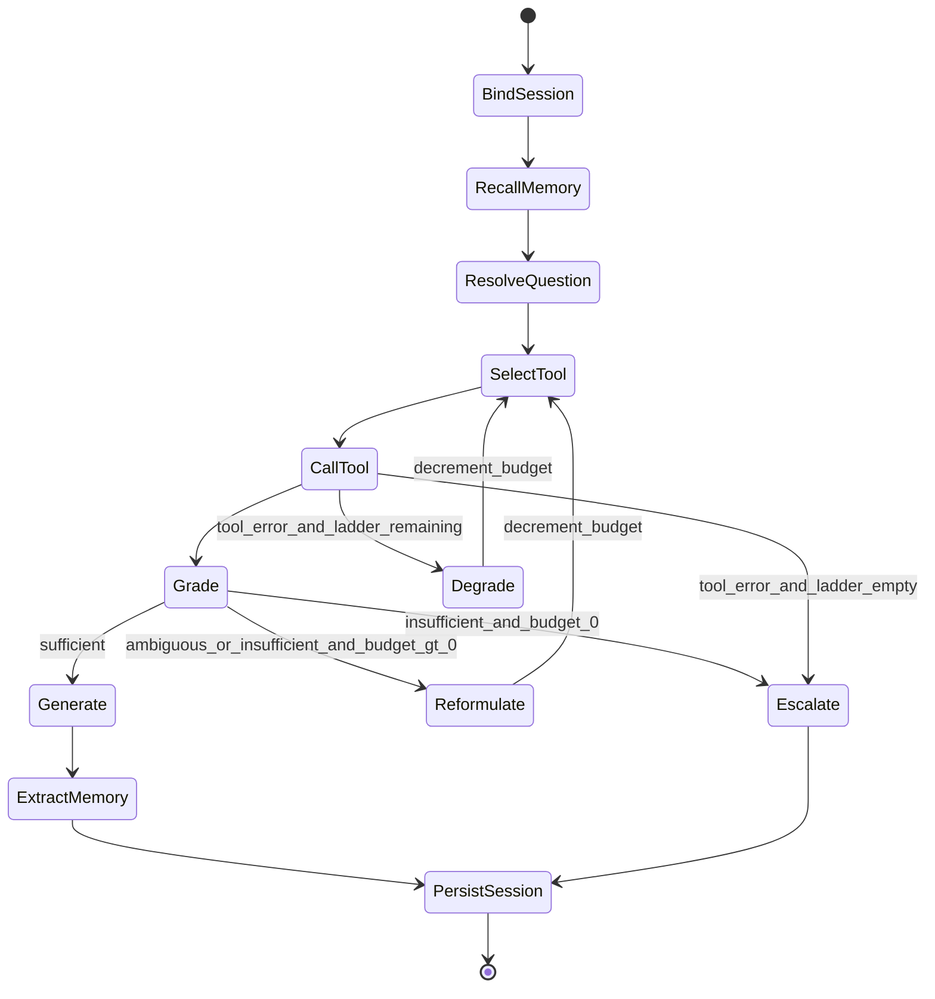
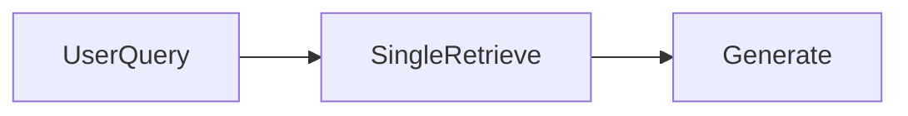
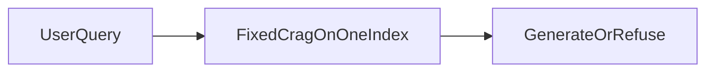
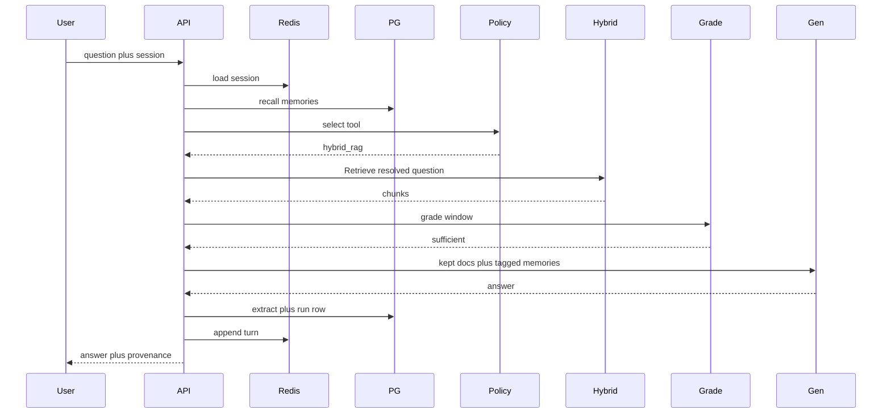
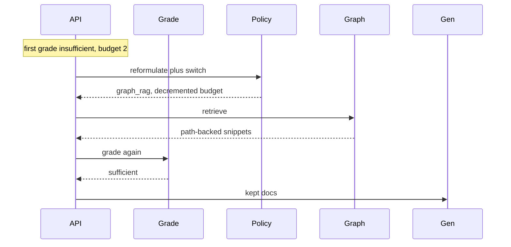
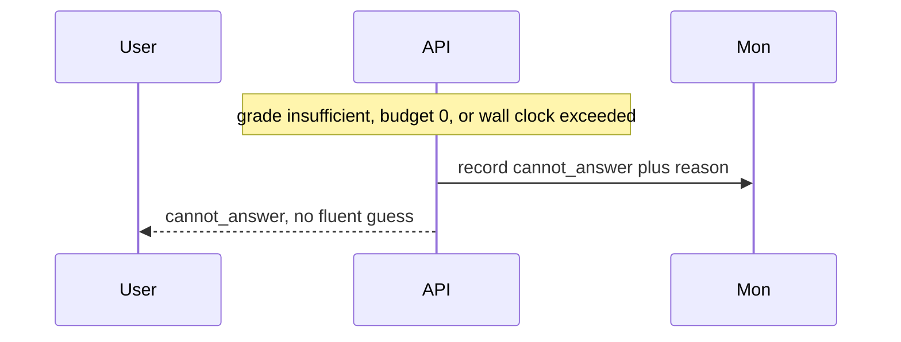

# Agentic RAG Runtime — Architecture Document
> - **Document Status**: Draft
> - **Last Updated**: 2026 Aug 29
> - **Author**: Paul Serban

A **bounded LangGraph runtime** over three existing retrieval services (naive, hybrid, graph), with a typed tool-selection policy, a typed grade as the stop condition, two-tier memory (Redis session, Postgres long-term), and a circuit breaker that can refuse. This document covers *what* the system is and *why* it is shaped this way; see [System Design](./03_system_design.md) for *how* routing, the loop, memory schemas, and budgets actually work, and [Trade-offs and Honest Assessment](./05_tradeoffs_and_honest_assessment.md) for what that runtime costs.

## Overview

**Brief description**: An assistant runtime for `kb.agentic_ask`. It loads per-user memory, chooses a retrieval tool, grades the result, may reformulate or switch tools inside a shared iteration budget, generates only from graded-sufficient context, and writes extracted memories at the end of a turn. It is not a vector database, not a new RAG algorithm, and not an unbounded agent.

**Business Context**
- See [Scenario and Requirements](./01_scenario_and_requirements.md) for the full framing. In short: a single pipeline is the wrong topology for some queries; a single turn cannot hold corrections and preferences; an open loop cannot finish. "Agentic" is therefore redefined as a **runtime** — session, policy, bound, memory, fallback — measured as rates and a cost multiplier against naive RAG *and* against [`prj--rag-selfheal`](../../prj--rag-selfheal/).
- Target users: owning engineer, on-call, product, security/privacy. The employee consumes an answer plus provenance (tool, iteration, memory ids), or a refuse.

## Requirements

### Functional Requirements

- **Authenticate and bind a session**: every request carries `user_id` + optional `session_id`. No anonymous long-term writes. Missing `user_id` → 401, not a "default" memory namespace.
- **Load short-term state**: conversation turns, in-flight plan, remaining budgets from Redis (or empty for a new session).
- **Recall long-term memory**: retrieve a bounded set of extracted memories for this user (preference / durable_fact / episode_summary), under a token budget.
- **Resolve the question**: optional rewrite of the current user string using session + recalled memories (entity carry-forward, "EU / 2025"). This is not the retrieval tool yet.
- **Select a tool**: structured choice among `naive_rag` | `hybrid_rag` | `graph_rag`, with a reason code. Heuristic may short-circuit (exact-token → hybrid).
- **Call the tool**: one HTTP (or RPC) call to the chosen Tier 1 service with the resolved question. Timeout. No model-invented tools.
- **Grade**: structured per-doc labels plus aggregate `sufficient` | `ambiguous` | `insufficient`. Unparseable ≠ sufficient.
- **Route**: on `sufficient`, generate from kept docs. On `ambiguous` / `insufficient`, if iteration budget remains, reformulate and/or switch tool and re-enter retrieve. If budget is exhausted, escalate (refuse).
- **Generate or refuse**: generate only from docs labeled relevant (plus memories tagged as memory, never as policy). Otherwise `cannot_answer`.
- **Extract memory (post-turn)**: structured extraction of new preferences / durable facts / a short episode summary; filter; upsert. Failures here must not fail the user-visible answer.
- **Measure**: strategy mix, mis-route vs gold (offline), iteration depth, breaker trips, memory-hit/write rates, latency/cost vs both baselines.

### Non-Functional Requirements

**Performance Requirements:**
- Happy path latency is **not** one retrieve plus one generate. It is memory recall + (optional resolve) + route + tool + grade + generate + async extract. Anyone who quotes naive-RAG p95 as this system's p95 is lying or has skipped the runtime.
- Retry-and-switch path adds approximately another tool call + another grade + a rewrite/route call. Working default `max_iterations` after the first retrieve = **2** means the worst *internal* path is **3 retrieves across possibly 3 different services**, plus 3 grades, plus routing. That is the p99 you must sign in Phase 0.
- Graph RAG as a tool is often the slowest arm. Routing 80% of traffic there "to be safe" is a cost bug, not thoroughness.

**Reliability Requirements:**
- **A single tool timeout must not hang the graph.** Timeout → failure ladder ([ADR-007](./04_architecture_decision_records.md#adr-007)), not a 30-second wait then 500.
- **A failed grade parse must not emit a fluent answer from ungraded context.** Conservative branch.
- **The graph must not loop past budget.** A bug that re-enters retrieve without decrementing is an incident. Recursion-limit of the graph runtime is a second fuse, not the first.
- **The circuit breaker must not be skippable** under load to "keep p95 green." Load shedding drops or queues requests; it does not skip grade or skip the breaker.
- **Redis loss** degrades to "new session" (follow-ups break for that session). It must not degrade to "read someone else's session." Postgres loss: no long-term recall/write; short-term-only mode is allowed if signed; serving answers from a dead KB tool is not.

**Infrastructure Constraints:**
- Illustrative: LangGraph for control flow; FastAPI (or equivalent) as the `kb.agentic_ask` route; Redis for session; Postgres for run ledger + long-term memory (+ pgvector if memory recall is embedding-based); HTTP clients to the three Tier 1 services; one LLM provider for route/grade/rewrite/generate/extract (roles, not necessarily five models).
- This project does **not** include training a router or a grader. Both are structured LLM calls. If Phase 2 shows the router cannot beat "always hybrid," do not proceed to a learned router in this repo — **delete the router** and keep memory + `rag-selfheal`.

**The defining constraint:**
- A chain cannot pick a strategy or remember. An unbounded agent cannot stop. The architecture is: **treat retrieval as a tool with a policy and a fuse, treat memory as a scoped extracted store, and treat "confident" as a typed grade plus remaining budget.**

## Executive Summary

The system is a **stateful, request-and-session-scoped control-flow graph**. The scarce resource on the naive path was unobserved retrieval failure. The scarce resource on the `rag-selfheal` path was a **fixed topology**. The scarce resource this path spends money to buy is **the right tool for this question, plus state that survives a follow-up and a logout**, without letting the loop or the memory store become a second untrusted product.

**Architecture Style:** Bounded state machine (LangGraph-shaped) over retrieval tools + two-tier memory. Not a chain. Not unbounded ReAct. Not "an LLM with plugins." Not a multi-agent supervisor.

**Key Components:**
- **Ask API / Session Manager**: authenticates, binds `session_id`, owns Redis read/write of turn state.
- **Memory Recall**: Postgres (and optional embeddings) → bounded memory context.
- **Question Resolver**: carries entities/constraints from session + memories into a resolved question.
- **Tool-Selection Policy**: structured choice + optional heuristic; allowlist of three tools.
- **Tool Adapters**: thin HTTP clients. Timeouts, circuit-open state per dependency.
- **Relevance Grader**: per-doc + aggregate structured verdict (borrowed from `rag-selfheal`, now also sees `tool_id`).
- **Corrective Router**: the only place edges are chosen; owns iteration/token/wall-clock remaining; may switch tools.
- **Budget Guard / Circuit Breaker**: hard stop; force escalate.
- **Generator**: completion from kept docs only.
- **Memory Extractor**: post-turn structured write path.
- **Run Ledger / Monitor**: rates, multipliers, traces.

**Technology Stack (illustrative):**
- Control flow: LangGraph (explicit nodes/edges, Postgres or Redis checkpointer optional; v1 can keep session in Redis without a full LangGraph checkpointer — see [System Design](./03_system_design.md)).
- Tools: existing services from `docqa-basic`, `retrieval-x`, `rag-hierarchy-graph-rag` (or `rag-selfheal` as a *single* hybrid tool if graph is not actually available — then this project shrinks).
- Session: Redis (TTL keys, per-user prefix).
- Long-term memory + run log: Postgres. Optional `vector` column for memory recall.
- Context packing: principles from [`prj--context-forge`](../../prj--context-forge/) (budget, priority: system > resolved question > kept chunks > memories > history).
- Eval: gold-strategy labels + RAGAS-style context metrics + multi-turn scripts. Plug into [`prj--rag-metrics`](../../prj--rag-metrics/) when it exists.

**Architecture Principles:**
- **The orchestrator decides, the model proposes.** Tool names, budgets, and terminals are code. The model fills structured slots.
- **Tools are someone else's services.** Adapters, not forks.
- **Grade before generate.** Same as `rag-selfheal`. Self-reported confidence is not an edge.
- **A strategy switch costs an iteration.** No hidden "just try graph too."
- **Memory is untrusted and scoped.** Tag it. Isolate it. Extract it. Do not index it into the KB.
- **Refuse is a successful handling of insufficiency or of a tripped breaker.** Fluent empty-context answers are the defect.
- **Measure the tax.** Routing, extra tools, grading, memory LLM calls are not "just RAG."
- **Degrade, then refuse.** Do not retry the same failing arm until the wall-clock budget dies.

**Key Architectural Decisions:**
1. **LangGraph bounded state machine over free-form ReAct.** [ADR-001](./04_architecture_decision_records.md#adr-001).
2. **Tool-selection over a rebuilt retrieval stack.** [ADR-002](./04_architecture_decision_records.md#adr-002).
3. **Two-tier memory: Redis vs Postgres.** [ADR-003](./04_architecture_decision_records.md#adr-003).
4. **Extracted long-term writes, never transcript dump.** [ADR-004](./04_architecture_decision_records.md#adr-004).
5. **Hard iteration / token / wall-clock budget + non-overridable breaker.** [ADR-005](./04_architecture_decision_records.md#adr-005).
6. **Typed grader as stop condition, not verbal confidence.** [ADR-006](./04_architecture_decision_records.md#adr-006).
7. **Failure ladder: next strategy → naive → refuse.** [ADR-007](./04_architecture_decision_records.md#adr-007).
8. **Per-user memory isolation as a hard predicate.** [ADR-008](./04_architecture_decision_records.md#adr-008).

### Context Diagram

```mermaid
flowchart LR
    user[Employee]
    api[AskAPI]
    runtime[AgenticRagRuntime]
    router[ToolSelectionPolicy]
    naive[NaiveRagTool]
    hybrid[HybridRerankTool]
    graph[GraphRagTool]
    grader[ConfidenceGrader]
    stm[RedisShortTerm]
    ltm[PostgresLongTerm]
    llm[LLMProvider]
    mon[RunMonitor]

    user --> api
    api --> runtime
    runtime --> stm
    runtime --> ltm
    runtime --> router
    router --> naive
    router --> hybrid
    router --> graph
    naive --> grader
    hybrid --> grader
    graph --> grader
    grader -->|"insufficient and budget remains"| router
    runtime --> llm
    runtime --> mon
    runtime --> user
```

The LLM provider is used for resolve, route, grade, rewrite, generate, and extract — six *roles*, not necessarily six models. The three RAG services are systems of record for *documents*. Postgres is the system of record for *memories and runs*. Redis is expendable session. The monitor is how "agentic" becomes a histogram.

### Target path — the state machine

This is the centerpiece. Every later sequence is a walk on this graph.



`Degrade` and `Reformulate` both consume the **same** iteration budget. The breaker (not drawn as a state; it is a guard on every edge into `CallTool` / `Reformulate`) can jump to `Escalate` on token or wall-clock exhaustion even if the grader is still hungry.

### What this replaces (and what it must not erase)



Naive chain: no strategy, no observation, no session.



`rag-selfheal`: observation and a bound, **one** topology, **no** cross-turn memory.

This runtime is not allowed to make the simple lookup path worse than those two without a signed tax. If it cannot beat them on the slices they already own, it is complexity without benefit.

## Runtime Architecture

1. **Bind layer**: authn, `user_id`, create or resume `session_id`, load Redis hash (turns, budgets). If Redis miss → empty session, new id. Never "find a session by IP."
2. **Recall layer**: query Postgres `WHERE user_id = $caller` for top memories (working: preferences always, plus kNN or recency on summaries). Pack under `memory_token_budget`.
3. **Resolve layer** (small structured LLM or rules): emit `resolved_question` + `constraints[]` (region, date, entity). If the user string is already complete and session is empty, copy through — do not pay a rewrite on first-turn lookups after a heuristic skip.
4. **Select layer**: heuristic (regex/id-like tokens → `hybrid_rag`; relation keywords / "which X of Y" → `graph_rag`; else LLM structured `ToolChoice`). Validate allowlist.
5. **Call layer**: HTTP to the tool. Per-tool timeout (graph may be larger than naive). On timeout/5xx → Degrade. On 4xx schema → Degrade (do not retry same).
6. **Grade layer**: one structured call on the tool's window vs `resolved_question`. Same conservative parse-fail as `rag-selfheal`.
7. **Correct layer** (0..max_iterations extra cycles): rewrite constraints and/or pick a *different* tool (identical tool + identical resolved question is forbidden; skip to degrade/escalate). Decrement **before** re-entry.
8. **Generate or escalate**: kept docs only, or `cannot_answer` with a stable code (`insufficient_all_tools`, `budget_exhausted`, `breaker_tokens`, `breaker_time`, `tool_ladder_exhausted`).
9. **Extract layer** (async-ok): structured memory candidates → filters → upsert. Must not block the HTTP response if product signs "answer first" (working default: **await extract with a short timeout**; skip write on timeout — losing a preference is better than adding 2s to every turn).
10. **Persist session + run row**: Redis TTL refresh; Postgres `AgentRun` with tool sequence, grades, tokens, memory ids.

Once this graph exists, "just add another tool" **stops being a one-line change**. Each tool is a dependency, a timeout class, a degrade rung, an eval slice, and a mis-route mode. The allowlist is small on purpose.

### Happy path vs switch vs refuse



Strategy switch (first naive insufficient, budget remains):



Budget exhausted / breaker:



**Forbidden terminals:** generate from an ungraded window; generate after `insufficient` because the user is waiting; retry the same timed-out tool until wall-clock dies; write raw transcript into `ltm_memory`; load memories `WHERE user_id IS NOT NULL` without binding the caller.

## Components

### 1. Ask API / Session Manager
**Purpose**: One hop for the employee. Own identity, session TTL, and the Redis schema so the graph never "finds" a session.

**Responsibilities:**
- `POST /ask {session_id?, message}` → `{answer | cannot_answer, provenance, session_id}`.
- Mint session ids; bind to `user_id`; reject session ids that belong to another user (treat as 404, not as a merge).
- Read/write Redis: turns (bounded N), `resolved_question` history, remaining budgets (restored per *turn* from config, not leftover from a previous turn's unused iterations — leftover budget across turns is how a chat becomes an unbounded agent).
- Do not call tools itself except by invoking the graph.

**Interactions:**
- Redis, Postgres (run insert), graph runtime.

### 2. Memory Recall
**Purpose**: Fetch a small, typed, user-scoped set of memories so follow-ups and preferences exist without stuffing the universe.

**Responsibilities:**
- Load `preference` rows (working cap: 20, recency).
- Load `durable_fact` and `episode_summary` by recency and/or embedding kNN against the current message (working k=5).
- Drop expired (`expires_at`) and `revoked` rows.
- Pack to `memory_token_budget` (working 512–1k tokens). Prioritize preferences over summaries.
- Return `{memory_id, type, text, source_type=memory}`. Never return another user's rows even if similarity would be higher (the query **must** include `user_id`).

**Interactions:**
- Postgres (+ pgvector if used).
- Does not call the LLM. Does not write.

### 3. Question Resolver
**Purpose**: Make the retrieval string include session constraints the current utterance omitted.

**Responsibilities:**
- Input: raw message, last M turns, recalled memories.
- Output: `resolved_question`, `constraints[]`.
- Must not invent constraints not present in session, memories, or the message. Hallucinated "user is in Germany" is a privacy and correctness incident.
- Heuristic skip: if session empty and message looks standalone, copy through.

**Interactions:**
- LLM structured output (or rules).
- Writes onto graph state only.

### 4. Tool-Selection Policy
**Purpose**: Pick one allowlisted tool. Be wrong sometimes; be measurable always.

**Responsibilities:**
- Heuristic first (optional, after Phase 0): id-like tokens → `hybrid_rag`; multi-hop patterns → `graph_rag`.
- Else structured LLM: `{tool, reason_code, confidence}`. `confidence` is telemetry, **not** a branch (the grade is the branch).
- Validate tool ∈ allowlist. Unknown → `hybrid_rag` default (the middle topology), log `policy_invalid_tool`.
- On reformulate: prefer a **different** tool unless the grade's `missing_aspects` clearly say "same tool, better query" (e.g. wrong year, hybrid still right). Identical `(tool, resolved_question)` is rejected by the router.

**Interactions:**
- LLM or heuristic.
- Does not retrieve.

### 5. Tool Adapters
**Purpose**: Be the only component that knows URLs, timeouts, and response mapping to a common `ChunkList`.

**Responsibilities:**
- Map `{resolved_question, k, user_acl if any}` to each service's contract. ACL: if the underlying service supports retrieval-time auth ([`prj--multi-source-rag-access-control`](../../prj--multi-source-rag-access-control/)), pass the caller identity; do not "widen" to a service account to make graph RAG work.
- Timeouts: working naive 800ms, hybrid 1500ms, graph 3000ms (illustrative; Phase 0 measures).
- Normalize to `{chunk_id, text, score?, source_pointer, tool_id, raw_provenance}`.
- Circuit-open: if a tool's breaker is open, skip it in Select (treat as unavailable) rather than wait for a guaranteed timeout.

**Interactions:**
- HTTP to Tier 1 services.
- Writes: `RetrievalResult` onto state; increments adapter error metrics.

### 6. Relevance Grader
**Purpose**: Be the observation the ReAct loop pretends the model has.

**Responsibilities:**
- Same three-way aggregate as `rag-selfheal`: `sufficient` | `ambiguous` | `insufficient`, plus `missing_aspects[]`, plus optional `suggested_tool` (hint only; router may ignore).
- Grade against `resolved_question`, not only the raw utterance.
- Batch one call per window. Parse failure → not sufficient.
- **Does not** award `sufficient` because memories "already contain the answer." Memories are not KB. If the user asks a policy question, policy chunks must be sufficient; a memory that says "PTO is 20 days" is a hint to retrieve, not a source.

**Interactions:**
- LLM structured output.
- Writes: `GradeResult`.

### 7. Corrective Router + Budget Guard
**Purpose**: The only node that chooses edges. Owns remaining iterations, tokens, wall-clock.

**Responsibilities:**
- Decrement iteration **before** re-entry.
- Check token accumulator and elapsed time **before** every LLM or tool call; if exceeded → Escalate (`breaker_*`).
- `sufficient` → Generate.
- `ambiguous`/`insufficient` and budget > 0 → Reformulate (new resolved question and/or new tool).
- Else → Escalate.
- Never increment budget. Never "one extra hop for graph because it's the last try" outside config.
- Per-turn budgets reset from config at BindSession for the new message, not carried as leftover.

**Interactions:**
- Reads grade, budgets, last `(tool, query)`.
- Writes: next node; decremented budgets.

### 8. Generator
**Purpose**: Answer from kept KB context, with memories as *hints*, or not at all.

**Responsibilities:**
- Prompt contains kept relevant docs and, separately, tagged memories and a short session tail packed by a context-forge-like budget.
- Citations: KB `chunk_id` + `tool_id`. Memories must not appear as document citations.
- Empty kept set → refuse even if the router erred.
- Not the grader. Not allowed to call tools.

### 9. Memory Extractor
**Purpose**: Persist *small typed facts*, not the conversation.

**Responsibilities:**
- Input: turn (user, resolved, answer or refuse, kept chunk ids — not full chunk text by default).
- Output: 0..N candidates `{type, text, confidence, ttl}`.
- Filters: no secrets/PII patterns (employee ids, tokens), no instructions to the assistant ("always ignore policy"), no KB-shaped claims presented as user preference ("the real PTO cap is 40" — that is a KB dispute, not a memory), no injection-shaped strings.
- Upsert by `(user_id, type, normalized_key)` so "I am in the EU entity" replaces last week, not stacks forever.
- On refuse, still allowed to extract a preference from the *user* message ("I meant EU") — the user's constraint is valid even when the KB missed.

**Interactions:**
- LLM structured output; Postgres writes.
- Failures logged; user response already sent or not delayed beyond timeout.

### 10. Escalator
**Purpose**: Honest terminal.

**Responsibilities:**
- Stable codes: `insufficient_all_tools`, `budget_exhausted`, `breaker_tokens`, `breaker_time`, `tool_ladder_exhausted`, `grade_parse_exhausted`, `session_mismatch`.
- No guessed policy paragraph.
- Provenance still returned (what was tried).

### 11. Run Monitor
**Purpose**: Make "we are agentic" a set of graphs, not a story.

**Responsibilities:**
- Per run: tools attempted, grades, iterations, breaker reason, tokens by role, latency breakdown, memory ids in/out, terminal.
- Alerts: iteration_depth p95 stuck at max (everything loops); router always-graph; memory_write_rate spike (extractor dumping); cross-user isolation test failing (page, this is a leak); breaker_trip_rate drowning the UX.
- Do not page on "we took a switch edge." That is the system working. Page on rates leaving the Phase 0 band.

### Communication Patterns

**Synchronous:**
- Caller ↔ Ask API: one request / one response.
- Graph ↔ tools: 1..3 serial (or rare parallel — **v1 is serial** to keep the bound obvious; parallel "try all tools" is a forbidden optimization that deletes tool-selection).
- Graph ↔ LLM: resolve, route, grade(s), rewrite, generate, extract.
- Graph ↔ Redis / Postgres: session and memory.

**Asynchronous:**
- Monitor sink.
- Optional extract-if-timeout-skipped retry queue — **not in v1**. Skip is skip.

There is no asynchronous "keep searching after we returned" in v1. That is a different product (research agent).

## Scaling Strategy

**Current Scale Requirements:**
- Human-paced QPS on an internal assistant (low tens of QPS). `max_iterations` small. This is not a batch firehose. If it becomes one, agentic-per-row is the wrong design.

**What scales horizontally:**
- Ask API / graph workers. Each request owns its state. Redis and Postgres are the shared stores.

**What does not:**
- Each Tier 1 service's QPS, multiplied by mis-route + retry rates.
- LLM RPM/TPM: many roles per request.
- Graph RAG latency tail.
- Router quality: more replicas do not calibrate a bad policy.
- Memory kNN: if every user accumulates unbounded summaries, recall degrades into a junk drawer. Extraction caps and TTL are the scale control.

**If QPS grows:**
- Heuristic skip resolve+route on simple first-turn lookups (S=1, always hybrid or naive).
- Do **not** skip grade to save p95.
- Do **not** raise `max_iterations` to "make quality scale."
- Split traffic: FAQ route stays on `rag-selfheal`/hybrid; this runtime is opt-in for "research" questions. That is a valid reduction, not a failure.

**Bottleneck Analysis:**
- Primary: grade + tool (especially graph) on the critical path; then extra hops.
- Secondary: extract LLM if awaited; Redis is not the bottleneck unless you store novels.
- Tertiary: Postgres memory kNN if embeddings are unbounded. Cap rows per user.

### Latency / cost tax by path

Working illustration vs baseline `1R + 1G` (naive). Numbers are **order-of-magnitude relative**, not a quote.

| Path | Extra LLM roles | Tool calls | Approx latency vs naive | When |
| --- | --- | --- | --- | --- |
| Naive RAG | generate | 1 naive | 1.0× | Baseline |
| `rag-selfheal` happy, S=1 | decompose + grade + generate | 1 hybrid | ~1.4–1.8× | Fixed topology, first pass sufficient |
| Agentic happy, first turn, hybrid | recall (no LLM) + route + grade + generate + extract | 1 hybrid | ~1.6–2.2× | Router correct, sufficient |
| Agentic + resolve (follow-up) | + resolve | 1 | ~1.8–2.5× | Session carry-forward |
| One switch (naive → graph) | + rewrite/route + grade2 + graph time | 2 | ~3–5× | The reason this project exists |
| Three retrieves, budget max | 3× grade + routes | 3 | ~5–8× | p99; must be signed |
| Unbounded ReAct (rejected) | unbounded | unbounded | unbounded | How demos die in prod |

The tax is worth paying when (a) wrong topology is an incident-class miss, (b) follow-ups/preferences are a signed product requirement, (c) Phase 0 shows both, (d) product signs the p99 of the switch path. It is not worth paying as a default wrap on a FAQ.

## Data Architecture

### Data Model

**Key Entities:**

| Entity | Store | Grain | Notes |
| --- | --- | --- | --- |
| `session` | Redis | `user_id:session_id` | turns[], last resolved, created_at; TTL |
| `turn` | Redis (and denormalized on run) | one user message | raw, resolved, terminal |
| `ltm_memory` | Postgres | one extracted record | `memory_id`, `user_id` **required**, type, text, embedding?, expires_at, revoked, origin_run_id |
| `agent_run` | Postgres | one ask | tools[], grades[], tokens, latencies, memory_ids_in, memory_ids_written, terminal, breaker_reason |
| `tool_choice` | on run | one hop | tool, reason_code, iteration |
| `grade_result` | on run | one hop | verdict, missing_aspects, parse_ok |
| `budget_snapshot` | on run | one ask | iterations_used, tokens, wall_ms |

**Entity Relationships:**
- User has many sessions (Redis) and many memories (Postgres).
- One ask → one run → 1..N tool choices and grades → 0..N memory writes.
- Memories point at `origin_run_id` for audit. Runs do not mutate KB indexes.

**What is not modeled:**
- Org/team memory. Shared scratchpads. "Assistant personality" as a global row.
- Web search results (out of v1).
- Learned router weights.

### Data Lifecycle

**Create**: session at first ask; run at terminal; memories at extract.

**Read**: recall at bind; tools read their own indexes; generator reads kept chunks + packed memories; on-call reads runs.

**Update**: memory upsert by normalized key; `revoked=true` on forget/correct; session turn append with cap (drop oldest).

**Delete**: TTL on Redis; `expires_at` or hard delete on user-forget; run retention per audit policy (runs contain questions — treat as classified like the KB). Embeddings must die with the row.

## Cost Analysis

### Cost Components

**Money:**
- LLM: route + grade (window is the expensive prompt) + generate + optional resolve/rewrite + extract. Grade-window duplication (chunks to grader, kept chunks to generator) remains. Extract is a *new* tax `rag-selfheal` did not pay.
- Retrieval: 1..3 service calls, possibly the expensive graph arm.
- Redis: trivial at this QPS.
- Postgres: small. Vector memory kNN is not a 50M-doc problem if per-user rows are capped (working cap: 200 active memories/user — if you need more, you are dumping transcripts and have already violated [ADR-004](./04_architecture_decision_records.md#adr-004)).
- Eval: multi-turn scripts + gold-strategy labels. Human time dominates. RAGAS-as-judge on a sample is another bill.

**Engineering time — the actual build cost:**
- Phase 0 labels: gold tool per item, multi-turn dialogues, poisoning probes. This is most of the honesty. Skipping it ships LangGraph.
- Adapter contracts and degrade behavior when a sibling service is down.
- Graph correctness (budget decrement, identical-hop skip, isolation tests).
- Extractor filters (the thankless part that prevents memory from becoming malware).
- The graph wiring itself is small.

**Risk cost of skipping this and "just using hybrid":**
- Multi-hop misses, broken follow-ups, users repeating constraints every turn. That is why you would pay the tax. If that risk is cheap, do not pay the tax.

### Cost Optimization

- Heuristic skip resolve+route on simple first turns.
- Default tool `hybrid_rag` when the policy is uncertain — not `graph_rag`.
- Serial one-tool-per-hop. Never "call all three and RRF" as v1 (that is a different, honest design: always-ensemble, and it should be named as a cost, not as agentic).
- `max_iterations` small. A third hop is rarely a new fact; it is usually the same indexes, tired.
- Cap memories per user; cap memory tokens in the prompt.
- Extract timeout skip.
- Do not add a second model as a "judge of the router." Calibrate against gold-strategy labels.

## Risks and Mitigation

| Risk | Likelihood | Impact | Mitigation Strategy | Owner |
| --- | --- | --- | --- | --- |
| Router at chance; always-hybrid would be cheaper | High if unlabeled | High — architecture is theatre | Phase 0 gold-strategy set; Phase 2 router confusion matrix; kill router if no lift | Eval + owning engineer |
| Router always picks graph | High | High bill, p99 explosion | Telemetry `tool_mix`; cap; default hybrid on invalid; heuristic | Policy owner |
| Grader false sufficient | High if uncalibrated | High — generate from bad context, slower | Same as `rag-selfheal` Phase 2; conservative parse | Eval |
| Grader false insufficient | High | High — iteration_depth → max, bill | Calibration; alert on depth p95 at cap | Eval |
| Cascading non-determinism (route × grade × rewrite) | Certain | High eval cost | Frozen eval; structured outputs; temperature 0 on policy/grade; still report variance | Eval |
| Unbounded loop / forgotten decrement | Low if tested, High if "just LangGraph" | High (outage, bill) | Decrement before edge; runtime max-steps; breaker; tests | Graph owner |
| Same-tool retry storm on 500s | Medium | High | Ladder [ADR-007](./04_architecture_decision_records.md#adr-007); per-tool circuit | Adapters |
| Memory poisoning (injection, sarcasm, secrets) | High if dump-based | High | Extract+filter [ADR-004](./04_architecture_decision_records.md#adr-004); probes in Phase 0/5 | Extractor + security |
| Cross-user memory leak | Low if predicate enforced, Certain if optional `user_id` | High (incident) | Required `user_id`; session bind check; isolation test in CI | Session + LTM |
| Memories cited as policy | High | High (wrong SLO) | `source_type=memory`; generator prompt; eval probe | Generator |
| Stale preference (user changed teams) | High over months | Medium | TTL; upsert; user-visible "what we remember"; forget | Product + LTM |
| Eval theater (single-turn only) | High | High (false ship) | Multi-turn and memory probes required in Phase 0/6 | Eval |
| Treating this as MCP/multi-agent | Medium | Medium sprawl | Non-goals; kill extra tools | Operator |
| Skipping grade under load | High in incidents | High | Config: grade not optional | Operator |
| Parallel try-all-tools "optimization" | Medium | High cost, deletes policy | Forbidden in v1; ADR-002 | Operator |

## Future Enhancements

### Phase 1 (this project's first *build* after measurement)
Session + fixed tool (hybrid) + extract off. Prove follow-ups without a router. See [Phased Implementation Plan](./06_phased_implementation_plan.md).

### Phase 2–3
Router live in shadow then live; bounded switch; still no learned policy.

### Phase 4–5
Long-term memory write/read with filters; breakers and ladder tested as gates.

### Phase 6
Baseline capture report. Then **stop**.

### Explicitly not in this design

- Unbounded ReAct, extra tools (`web`, `sql`, `email`).
- Generate-anyway on insufficient context.
- Learned / RLHF router as a v1 gate.
- Org-wide memory.
- Merging memories into the KB index.
- Multi-agent supervisor (planner/researcher/reviewer).
- MCP transport.
- Company-wide "wrap every RAG in an agent."
- Claiming the indexes are now complete because the runtime can loop.
