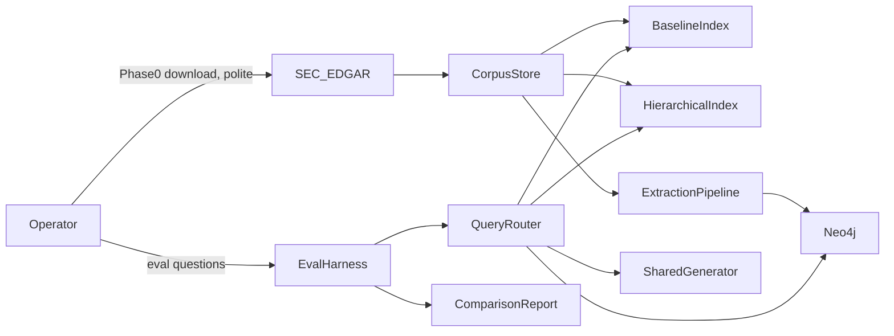
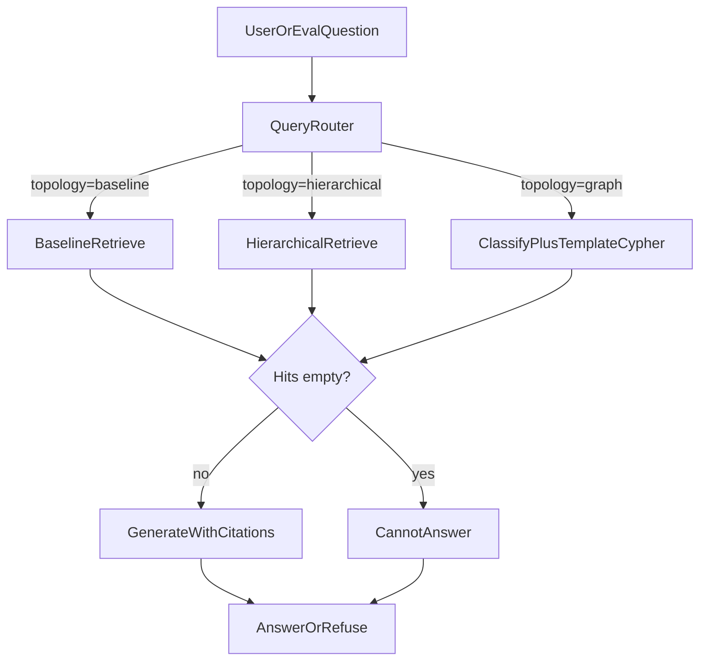
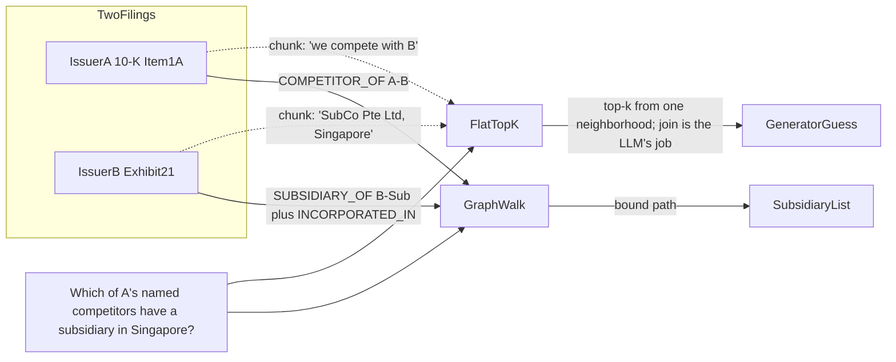
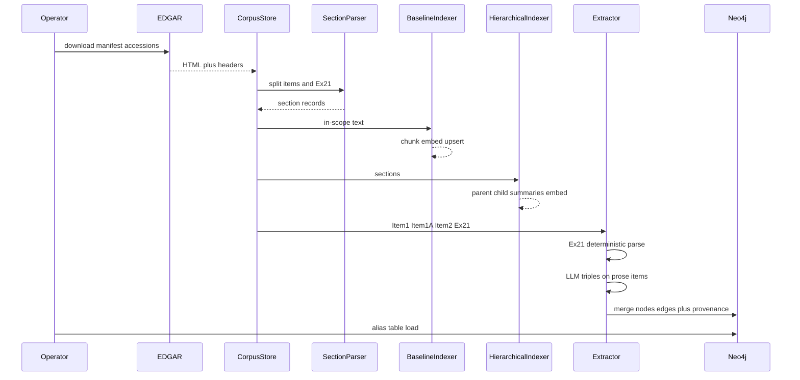

# Hierarchical vs Graph RAG — Architecture Document
> - **Document Status**: Draft
> - **Last Updated**: 2026 Aug 29
> - **Author**: Paul Serban

A **comparison study** over one frozen SEC 10-K corpus: a flat/hybrid baseline, a hierarchical (parent-child + summaries) index, and a knowledge-graph index behind template Cypher. This document covers *what* the system is and *why* it is three topologies rather than one clever retriever; see [System Design](./03_system_design.md) for *how* chunking, extraction, templates, and eval actually work, and [Trade-offs and Honest Assessment](./05_tradeoffs_and_honest_assessment.md) for when the graph is not worth building.

## Overview

**Brief description**: Study infrastructure, scoped narrowly: ingest a named 10-K snapshot, build three retrieve-then-generate paths that share a generator and an eval harness, publish a table. It is not a research terminal, not an EDGAR crawler-as-a-service, and not "GraphRAG" the Microsoft paper.

**Business Context**
- See [Scenario and Requirements](./01_scenario_and_requirements.md) for the full framing. In short: vector search is a one-hop neighborhood; some questions are path queries; 10-Ks do not contain a supplier graph; extraction precision is the real bottleneck; the comparison report is the customer.
- Target users: owning engineer, reviewer/hiring panel, future-self wiring these retrievers as tools. Not analysts.

## Requirements

### Functional Requirements

- **Corpus ingest**: fetch and store the manifest's 10-K HTML (or equivalent text), checksum, record accession number / issuer / fiscal year. Parse out Item 1, Item 1A, Item 2, Exhibit 21 as first-class sections. Fail a filing that cannot be section-split rather than stuffing the whole submission as one blob.
- **Baseline index**: chunk in-scope text at a flat grain, embed, store in a vector index; optional BM25 over the same chunks. Retrieve top-k, generate with citations.
- **Hierarchical index**: build a tree `filing → section → child chunks`, plus summary nodes (section summaries, optional filing summary). Retrieve with auto-merge (promote to parent when child-hit density is high) and/or top-down (summary index selects filings/sections, then drill into children). Generate with citations at the grain that was actually stuffed.
- **Graph index**: extract typed entities and relations from in-scope sections only; write to Neo4j with provenance on every edge; maintain a curated alias table for the issuer list. Exhibit 21 prefers deterministic list parsing over LLM extraction.
- **Graph retrieve**: classify the question into a **closed template set**, bind slots (issuer, jurisdiction, relation), run Cypher, map hits back to source spans, generate (or refuse). No default NL-to-Cypher.
- **Shared generate**: one generator prompt family across topologies so the independent variable is retrieval, not prompt cleverness. Citation required.
- **Eval harness**: frozen question set; RAGAS metrics; custom multi-hop correctness; per-topology latency and token/cost; unanswerable slice. Emits the comparison table.
- **Refuse**: "not in indexed filings" is a first-class output, especially on supplier-bait and out-of-schema items.

### Non-Functional Requirements

**Performance Requirements:**
- This is a **study**. Query p95 is measured and reported, not an SLO that kills the graph. Graph traversal on a 12-issuer graph should be milliseconds; the LLM classifier and generator dominate. Hierarchical auto-merge can stuff large parents — token budget is the real latency/cost knob, not Neo4j.
- Build-time cost is first-class: embedding all chunks (baseline + hierarchical, possibly shared embed cache) vs **extraction tokens** (graph). Extraction will dwarf embed cost. Report both.
- Eval-set runtime is allowed to be slow (LLM-as-judge, RAGAS). Do not "optimize" by shrinking the set below the Phase 1 size.

**Reliability Requirements:**
- **A failed extraction on one section must not corrupt the graph.** Skip/mark `extraction_failed`; do not insert partial triples without provenance.
- **A Cypher template that returns empty is a retrieval miss**, then refuse or labeled fallback — not "let the generator invent the path."
- **Eval must be replayable**: same corpus SHA, same question-set version, same model ids recorded on the table. A table without those pins is an anecdote.
- **Baseline row is never skipped.** Shipping hierarchical/graph numbers alone is a process defect.

**Infrastructure Constraints:**
- Illustrative stack (roadmap): Python, LlamaIndex (hierarchical indices / auto-merging), Neo4j, RAGAS, a single LLM provider for extract/classify/generate/judge. Local Neo4j (Docker) is enough; Aura is optional and not required.
- No k8s, no multi-tenant gateway, no streaming ingest. A laptop plus Docker is the intended host.
- EDGAR fair-access: polite rate limits on download in Phase 0; the snapshot is then local. Do not hammer `sec.gov` from a retry loop.

**The defining constraint:**
- **Index topology is the independent variable.** Everything that would confound the table (different generators, CRAG only on the graph, a reranker only on hierarchical) is either applied to all rows or called out as a labeled extra row. Cheating the table is the only way this project fails while looking like it succeeded.

## Executive Summary

The system is a **three-legged retrieval lab** on a frozen filing snapshot. The scarce resource on the naive path was *path structure*. Hierarchical retrieval spends index complexity to match document grain. Graph retrieval spends extraction and schema to match query grain. Neither is allowed to erase the baseline.

**Architecture Style:** Parallel pipelines over a shared corpus and shared eval, with a **strategy interface** for retrieve. Not a monolith "smart RAG." Not a mesh of microservices — process boundaries are allowed to be modules in one repo at this scale.

**Key Components:**
- **Corpus Store / Manifest** — filings, sections, checksums.
- **Section Parser** — Item / Exhibit splitter.
- **Baseline Indexer + Retriever**
- **Hierarchical Indexer + Retriever** (summaries, parent-child, auto-merge)
- **Extraction Pipeline** (section-scoped, Exhibit 21 deterministic path)
- **Graph Store (Neo4j)** + alias table
- **Query Router / Template Binder**
- **Shared Generator**
- **Eval Harness + Comparison Report**

**Technology Stack (illustrative):**
- Language: Python.
- Hierarchical / vector: LlamaIndex (or equivalent; the interfaces matter more than the logo).
- Vectors: whatever LlamaIndex sits on locally (FAISS / pgvector / Chroma). Shared embedding model across baseline and hierarchical.
- Graph: Neo4j Community, Docker.
- Eval: RAGAS; a structured LLM judge for multi-hop fact lists; a spreadsheet/markdown table as the artifact.
- LLM: one provider, pinned model ids per role (extract, classify, generate, judge). Mixing "whatever was the default that day" invalidates the table.

**Architecture Principles:**
- **Same corpus, same questions, same generator family.** Topology is the variable.
- **Extract less, type more.** A small correct graph beats a large `RELATED_TO` hairball.
- **Templates over generated queries** on the graph path.
- **Provenance on edges, citations on answers.**
- **Refuse is a win on unanswerable items.**
- **The table is the product.** A demo path is supporting evidence.

**Key Architectural Decisions:**
1. **Three parallel topologies; comparison report is the product.** [ADR-001](./04_architecture_decision_records.md#adr-001).
2. **Section-scoped, offline extraction — not whole 10-K.** [ADR-002](./04_architecture_decision_records.md#adr-002).
3. **Template Cypher, not NL-to-Cypher, as primary graph path.** [ADR-003](./04_architecture_decision_records.md#adr-003).
4. **Parent-child + summary index, not "recursive split" alone.** [ADR-004](./04_architecture_decision_records.md#adr-004).
5. **Bounded issuer set; alias table, not general ER.** [ADR-005](./04_architecture_decision_records.md#adr-005).
6. **RAGAS + custom multi-hop judge; question set frozen first.** [ADR-006](./04_architecture_decision_records.md#adr-006).
7. **Frozen snapshot; no live EDGAR ingest.** [ADR-007](./04_architecture_decision_records.md#adr-007).

### Context Diagram

EDGAR is a **build-time** source. Query time never hits `sec.gov`. The router is used both by a thin manual query CLI (operator debugging) and by the eval harness (the real customer).

### Query-time paths

Eval **pins** `topology`; it does not ask the router to "pick the best." Automatic topology selection is a later system (agentic RAG). Putting it in v1 confounds the table. A human/debug CLI may choose a topology explicitly.

### Why vector fails the in-corpus multi-hop (the picture this project exists to draw)

If Issuer B is **not** in the corpus, the right-hand walk stops at a competitor node with no Exhibit 21. The system must not invent B's subsidiaries from A's filing. That is the Phase 0 issuer-list constraint, drawn as architecture rather than as a data complaint.

## Runtime Architecture

1. **Build layer (offline):** download → section parse → (a) flat chunk+embed, (b) tree+summaries+embed, (c) extract+load graph. Three artifacts. One manifest SHA.
2. **Query layer (online, per pinned topology):** retrieve → (optional empty check) → generate or refuse.
3. **Eval layer:** iterate questions × topologies, score, write table. Slow, batch, repeatable.
4. **Operator layer:** inspect a section, inspect edges for an issuer, run one question through all three, dump traces. No product UI.

### Offline build sequence

Extraction never sits on the query path. If you find yourself extracting at query time to "fill in" a miss, you have rebuilt naive RAG with extra latency.

## Components

### 1. Corpus Store and Manifest

**Purpose**: Make the eval pinned to bytes, not to "whatever we downloaded that week."

**Responsibilities:**
- Store raw filing payloads and a manifest (`issuer_cik`, `name`, `form`, `fiscal_year`, `accession`, `sha256`, `retrieved_at`).
- Expose section records after parse: `section_id`, `item_code`, `text`, offsets.
- Refuse to index a filing not on the manifest.

**Interactions:** Written in Phase 0; read by all indexers and by eval (to print corpus identity on the report).

### 2. Section Parser

**Purpose**: Turn a 10-K into the four in-scope items plus "everything else, ignored."

**Responsibilities:**
- Detect Item 1 / 1A / 2 / Exhibit 21 in HTML or text. EDGAR HTML is messy; this component is allowed to be ugly and well-tested.
- Mark parse failures per filing. A failed Exhibit 21 parse is a **Phase 0/3 incident**, not a silent empty subsidiary list.
- Do not send "Part IV" soup to the extractor.

**Interactions:** Corpus Store in, section records out.

### 3. Baseline Indexer / Retriever

**Purpose**: The control. Deliberately close to [`prj--docqa-basic-naive-rag`](../../prj--docqa-basic-naive-rag/) plus optional BM25.

**Responsibilities:**
- Chunk in-scope sections at a documented fixed/recursive grain (same child grain as hierarchical children, so grain is not a hidden confound — or, if different, **label it**).
- Embed, upsert, top-k dense retrieve; optional hybrid.
- Return chunks with `filing_id`, `item_code`, offsets.

**Interactions:** Shared embedder with hierarchical if possible. Query path pinned `topology=baseline`.

### 4. Hierarchical Indexer / Retriever

**Purpose**: Match retrieval grain to 10-K grain.

**Responsibilities:**
- Tree: filing node → section nodes (Item 1, 1A, 2, Ex21) → child chunks.
- Summaries: LLM or extractive summary per section; optional filing-level summary. Summaries are **index nodes**, not a replacement for source text at generate time unless auto-merge chose a parent *source* node (section text), not the summary-only node. See [System Design](./03_system_design.md) — stuffing summaries into the generator as if they were filings is how you invent numbers.
- Retrieve: (a) child-level dense retrieval + auto-merge to section when hit density ≥ threshold; (b) summary-index top-down to pick sections, then retrieve children inside those sections.
- Enforce a **stuff budget**: merged parents truncated with a documented policy, not silently dropped on the floor.

**Interactions:** Same embedder. Query path pinned `topology=hierarchical`.

### 5. Extraction Pipeline

**Purpose**: Turn in-scope text into typed triples with provenance. The quality bottleneck lives here.

**Responsibilities:**
- Exhibit 21: deterministic parse (name, jurisdiction) → `SUBSIDIARY_OF`, `INCORPORATED_IN`.
- Item 1 / 1A / 2: LLM structured extraction against a **closed schema**. No open IE.
- Normalize names through the alias table; unresolved mentions become `UnresolvedOrg` (non-traversable by multi-hop templates) or are dropped per policy.
- Idempotent load: re-running extraction for a `section_id` replaces that section's edges, does not duplicate.
- Emit an extraction report: counts per relation, unresolved rate, parse-fail sections.

**Interactions:** Writes Neo4j. Does not run at query time.

### 6. Graph Store (Neo4j) and Alias Table

**Purpose**: Hold the only path-shaped index.

**Responsibilities:**
- Constraints: uniqueness on `Company.canonical_id`, etc.
- Every relationship has `source_section_id`, `accession`, `excerpt`, `extractor` (`rules_ex21` | `llm_vN`).
- Alias table: `alias → canonical_id` for the issuer set and reviewed extras.
- Small enough to dump as Cypher or CSV for review.

**Interactions:** Written by extraction; read by template runner.

### 7. Query Router, Classifier, Template Binder

**Purpose**: Map a natural-language question to a **bounded** graph operation, or declare "no template."

**Responsibilities:**
- Closed set of templates (see System Design): e.g. `subsidiaries_in_jurisdiction`, `competitors_of`, `competitors_subsidiaries_in_jurisdiction`, `properties_in_jurisdiction`, `execs_of`.
- Slot filling: issuer must resolve via alias table; if not, `cannot_bind` — do not fuzzy-match to the nearest company in the graph.
- Empty Cypher result ≠ classifier failure. Trace distinguishes `no_template` / `bind_failed` / `empty_result`.
- Eval pins topology; classifier runs **only** on the graph topology. It does not secretly send graph questions to baseline.

**Interactions:** Neo4j; Shared Generator; traces to eval.

### 8. Shared Generator

**Purpose**: Keep generation constant.

**Responsibilities:**
- Prompt: answer only from provided context (chunks **or** graph-serialized facts + source excerpts). Cite. If context insufficient, refuse.
- Same model id for all topologies in a given eval version.
- Graph context is a **verbalized path list with excerpts**, not raw Cypher dumps, and not "node names without sources."

**Interactions:** Receives already-retrieved context only.

### 9. Eval Harness and Comparison Report

**Purpose**: Be the customer.

**Responsibilities:**
- Load question set version V (id, slice, gold facts, gold unanswerable flag).
- Run each question × {baseline, hierarchical, graph}.
- RAGAS: faithfulness, answer relevancy, context precision, context recall (where context is defined per topology — graph context is the verbalized facts+excerpts).
- Custom judge: multi-hop list correctness (precision/recall against gold subsidiary lists, etc.).
- Cost/latency per question per topology.
- Write markdown table + trace dump. Pin corpus SHA, model ids, index build ids.

**Interactions:** Calls retrievers with topology pinned. Does not train, does not auto-tune k.

### Communication Patterns

**Synchronous, query time:** router → retriever → generator. One question, one topology, one answer.

**Batch, build time:** extraction over sections; embedding over chunks. Parallelism is fine locally; it is not a distributed job platform.

**Batch, eval time:** nested loops. Checkpoint per (question, topology) so a judge timeout does not restart the night.

## Scaling Strategy

**Current scale:** tens of filings, thousands of chunks, hundreds of graph nodes. Laptop class.

**What does not need to scale:**
- Neo4j cluster, causal clustering, graph data science at universe scale.
- ANN sharding.
- A microservice per topology.

**What is already awkward at this scale:**
- LLM extraction cost and **review** cost. Growing issuers from 12 to 50 grows review superlinearly if you care about precision.
- Hierarchical summaries: one LLM summary per section × filings. Cheap vs extraction, not free.

**If the corpus grew to "all 10-Ks this year":**
- This architecture **does not** scale by "run the same extractor." You would need: better ER, schema governance, extraction evaluation as a production pipeline, EDGAR incremental ingest, and a serving index. That is a different project, and it still would not put suppliers in the graph. Do not design v1 for it.

**Bottleneck Analysis:**
- Primary: **extraction precision/recall** on `COMPETITOR_OF` in prose.
- Secondary: section parser robustness on EDGAR HTML.
- Tertiary: eval judge cost and variance (LLM-as-judge).
- Not the bottleneck: Neo4j query time, vector ANN.

## Data Architecture

### Data Model

**Key Entities (corpus / lexical):**
- **Issuer**: CIK, canonical name, aliases.
- **Filing**: accession, form, fiscal year, SHA, issuer.
- **Section**: item code, text, parse status.
- **Chunk**: parent section, offsets, text, embedding id.
- **SummaryNode**: target (section or filing), text, embedding id.

**Key Entities (graph):**
- `(:Company {canonical_id, display_name, in_corpus: bool})`
- `(:Location {jurisdiction_code, name})` — jurisdictions of incorporation and, separately, property locations if modeled as a different rel type.
- `(:Person {canonical_id, name})` — optional, `EXEC_OF`.
- `(:Segment {name})` — optional, weak.

**Relationships (closed):**
- `(:Company)-[:SUBSIDIARY_OF]->(:Company)` — child → parent (or the reverse; pick one in System Design and stick to it).
- `(:Company)-[:COMPETITOR_OF]->(:Company)` — treat as undirected in queries (`-[:COMPETITOR_OF]-`) unless evidence is directed; 10-K language is usually symmetric-enough and noisy either way.
- `(:Company)-[:INCORPORATED_IN]->(:Location)`
- `(:Company)-[:LOCATED_IN]->(:Location)` — properties (Item 2), distinct from incorporation.
- `(:Person)-[:EXEC_OF]->(:Company)` — optional.

**Provenance:** on relationships, not only on nodes: `source_section_id`, `excerpt`, `extractor`, `confidence` (optional, not used as a silent filter in v1).

**Eval:**
- **Question**: id, version, slice, prompt, gold (structured), `unanswerable`.
- **RunCell**: question_id × topology × build_id → answer, contexts, metrics, tokens, ms.

**Entity relationships (logical):**

- Filing has many Sections; Section has many Chunks and one Summary.
- Company `in_corpus=true` has Filings; Company `in_corpus=false` is mention-only (named competitor not in the issuer list) — **no subsidiaries unless they appear in an in-corpus Exhibit 21**, which they will not.

### Data Lifecycle

**Create**: Phase 0 download; Phase 1–3 index builds.

**Read**: query and eval.

**Update**: rebuild an index version; never mutate a published eval's build in place. Graph section replace is an update with lineage (`build_id`).

**Delete**: dropping an issuer means a new corpus version and a full re-eval. Do not delete nodes under a live table.

## Cost Analysis

### Cost Components

**Money (LLM):**
- Embeddings: all in-scope chunks + hierarchical summaries. Modest at this scale.
- Extraction: structured calls over Item 1 / 1A / 2 per filing. **Dominant build cost.** Exhibit 21 should be near-zero LLM if parsed.
- Summaries: one call per section.
- Query: generate (all topologies) + classifier (graph only). Negligible vs extraction if you are not serving production QPS.
- Eval: RAGAS + judge ≈ several LLM calls per question per topology. For 60 questions × 3 topologies, this is a **real** bill. Budget it. Cheapening the judge by skipping the unanswerable slice is how you lose the honesty row.

**Money (infra):** Docker Neo4j, local disk. Approximately zero if the operator already has a machine.

**Operator time — the actual scarce resource:**
- Reading filings in Phase 0 (relation inventory).
- Writing gold answers for multi-hop lists (Exhibit 21 is tedious and is the job).
- Spot-checking competitor edges.
- Not: tuning HNSW `ef`.

### Cost Optimization

- Do not LLM-extract Exhibit 21.
- Do not extract out-of-scope items.
- Share embeddings between baseline children and hierarchical children.
- Cache eval generator outputs keyed by `(topology, question_id, context_hash)` when re-scoring metrics.
- Do not add a fourth topology (Microsoft GraphRAG, HyDE, …) until the three-row table exists.

If extraction cost is painful at 12 issuers, it will not become pleasant at 50. That is a signal to **narrow schema**, not to switch providers and hope.

## Security, Compliance, and Ethics (brief)

No separate security-architecture doc: public filings, local study, no user data.

Still:

- Honor EDGAR rate limits and fair-access headers (`User-Agent` with contact, as SEC asks). This is courtesy and ban-avoidance, not optional cleverness.
- Do not scrape through proxies to dodge fair access.
- Outputs are not investment advice; the report should say the system is incomplete by construction.
- LLM providers see filing excerpts (public) and questions. No confidential corpus in v1. If someone later points this at an internal wiki, **this design's "public EDGAR" assumption dies** and retrieval-time ACL becomes a different project ([roadmap 1.3](../../04_challenges/ai-engineering-portfolio-roadmap.md)).

## Risks and Mitigation

| Risk | Likelihood | Impact | Mitigation | Owner |
| --- | --- | --- | --- | --- |
| Chosen 10-Ks barely name competitors | Medium | High | Phase 0 relation inventory; reframe or kill multi-hop slice; do not invent `COMPETITOR_OF` | Operator |
| Supplier query used as gold | High if undisciplined | High | Unanswerable slice; refuse metric | Eval set author |
| LLM competitor edges are noisy | High | High | Precision spot-check gate before graph row is published | Phase 3 |
| Competitor not in corpus → empty subsidiary walk | Certain unless issuer list is designed | Medium | Phase 0 picks overlapping named competitors who are also issuers | Operator |
| Exhibit 21 HTML parse fails | Medium | High | Deterministic parser tests; fail the filing visibly | Section parser |
| Entity aliases split companies | High | High | Curated alias table; unresolved nodes non-traversable | ADR-005 |
| Hierarchical parents blow context window | Medium | Medium | Stuff budget; prefer merge-to-section not merge-to-filing | System Design |
| Summaries stuffed as if they were source | Medium | High | Generate from source text / excerpts, not summary-only, except labeled ablation | ADR-004 |
| NL-to-Cypher sneaks in as "just for demo" | Medium | High | Templates only on the published graph column | ADR-003 |
| Eval questions written after seeing graph output | Medium | High | Freeze set in Phase 1; version; kill criterion | Phase 1 gate |
| RAGAS looks fine while list recall is zero | Medium | High | Custom multi-hop judge is mandatory | ADR-006 |
| Confounded table (CRAG/rerank on one leg) | Medium | High | Shared generator; topology-only independent variable | ADR-001 |
| EDGAR ban / incomplete download | Low | Medium | Polite crawl; manifest completeness check | Phase 0 |
| Operator falls in love with Neo4j Browser and never writes the report | Medium | High | Phase 4 is the only "done"; screenshots are not a gate | Phase 4 |

## Future Enhancements

### Phase 1 (this design)
Baseline + frozen questions + harness skeleton. See [Phased Implementation Plan](./06_phased_implementation_plan.md).

### After the table exists (optional, not promised)
- Use hierarchical and graph retrievers as **tools** in agentic RAG (roadmap 2.3), with the table as the routing prior: graph tool for template-shaped questions, hierarchical for long Item 1A, baseline for everything else.
- A fourth labeled row: hybrid+rerank baseline, or Microsoft-style community summaries — **after** three honest rows.
- Year-over-year filing diff as a *new* relation type (`AMENDED_RISK`, etc.) — a new schema version.

### Technical Debt (accepted)

- LlamaIndex as the hierarchical implementation will hide details; document the actual tree, do not screenshot a class name.
- LLM-as-judge variance on RAGAS. Pin models; report once, not cherry-picked retries.
- `COMPETITOR_OF` as a binary edge is a cartoon of how 10-Ks talk. Remaining a cartoon is accepted; adding sentiment/strength is a new project.
- Alias table will rot if issuers are added. Bounded list is the mitigation, not a better algorithm.
