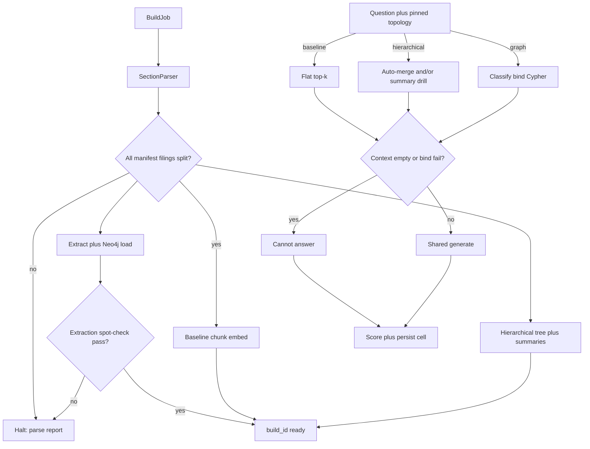

# Hierarchical vs Graph RAG — System Design
> - **Document Status**: Draft
> - **Last Updated**: 2026 Aug 29
> - **Author**: Paul Serban

This document is the mechanical *how* for the study described in the [Architecture Document](./02_architecture_document.md). It specifies section parsing, parent-child chunking, auto-merge, extraction, the Neo4j schema, Cypher templates, generation, and eval. It does not specify code.

## 1. Control Flow

Two clocks: **build** (offline) and **query/eval** (online). They do not share a process requirement; they share a corpus SHA and a `build_id`.



**Invariant:** eval never mixes topologies in one cell. **Invariant:** graph cells for a published table use a `build_id` that passed the spot-check gate. A later, prettier graph does not silently overwrite that id.

## 2. Section Parsing

EDGAR 10-K HTML is inconsistent (iXBRL, nested tables, "Item 1." vs "ITEM 1A"). This is a **parser with tests**, not a regex you tweak during the demo.

### 2.1 Targets

| `item_code` | Detection heuristic (illustrative) | Failure mode |
| --- | --- | --- |
| `item_1` | Heading Item 1 Business, stop before Item 1A | Merging 1 and 1A poisons competitor extraction with product prose and vice versa |
| `item_1a` | Item 1A Risk Factors, stop before Item 1B or Item 2 | |
| `item_2` | Item 2 Properties, stop before Item 3 | |
| `ex21` | Exhibit 21 / Subsidiaries of the Registrant | If missing (some issuers incorporate by reference), **record `ex21_missing`** — do not invent |

Everything else is stored as `out_of_scope` and is **not** chunked into the study indices. If Phase 0 finds a needed fact only in MD&A, either expand scope in a new corpus version or drop the question. Silent full-doc indexing "just in case" re-opens [ADR-002](./04_architecture_decision_records.md#adr-002).

### 2.2 Parser exit criteria

A filing is `parse_ok` when Item 1, 1A, and 2 are non-empty above a minimum character threshold (calibrate on one filing: empty Item 2 happens; empty Item 1A does not, for a large-cap 10-K). Exhibit 21 may be `missing` without failing the whole filing, but any eval question that needs subsidiaries of *that* issuer is then unanswerable **for that issuer** — gold labels must reflect it.

## 3. Shared Chunk Grain

Baseline children and hierarchical children use the **same splitter settings** unless an ablation row is explicitly labeled `baseline_chunk_X`. Default working grain (calibrate in Phase 1, do not treat as sacred):

- Splitter: recursive, sentence-aware if available.
- Child size: ~512 tokens, overlap ~64.
- Unit: in-scope section text only.

If hierarchical children differ from baseline, you cannot attribute a win to topology rather than to chunk luck.

## 4. Hierarchical Index Mechanics

### 4.1 Tree

```
Filing
  ├─ Section (item_1 | item_1a | item_2 | ex21)     [parent node; stores full section text]
  │    ├─ ChildChunk_0
  │    ├─ ChildChunk_1
  │    └─ ...
  └─ FilingSummary (optional, index-only)
       └─ SectionSummary per item (index-only)
```

**Parent text** is the section body (or a capped prefix if Item 1A is enormous — cap documented, e.g. 6k tokens, remainder only reachable via children). **Summary text** is a compressed view used to *select* nodes, not to *answer from*, in the default path.

### 4.2 Summaries

For each section, produce a summary (extractive first; abstractive LLM if extractive is too low-quality for retrieval). Constraints:

- Summaries are tagged `node_role=summary`.
- Default generate path **does not** stuff summary nodes. It stuffs `node_role=source` (children and/or merged parents).
- A labeled ablation may stuff summaries; it is not the hierarchical column of the main table.

Filing-level summaries help top-down doc selection when the corpus is 12 10-Ks of overlapping vocabulary ("semiconductor," "risk," "supply chain"). They are optional. If top-down selection is no better than retrieving against all children globally, skip filing summaries — they are cost without topology.

### 4.3 Retrieve modes

Two modes, both "hierarchical." Pick a **default** in Phase 2 and freeze it for the table; the other can be an ablation.

**Mode A — Auto-merge (bottom-up)**  
1. Dense retrieve top-`k_child` child chunks globally (in-scope corpus).  
2. Group hits by parent section.  
3. If a parent has ≥ `merge_threshold` child hits (working default: 2, or a fraction of that section's children), **replace those children with the parent section text** (capped).  
4. Remaining singleton children stay as children.  
5. Cut to a stuff budget (see §4.4).

**Mode B — Summary drill (top-down)**  
1. Dense retrieve against section-summary embeddings, top-`s` sections.  
2. Restrict child retrieval to those sections (plus optionally 1 neighbor item — default **off**, too easy to leak Item 1 into 1A).  
3. Optionally auto-merge inside the restricted set.

Mode A is the default: it directly attacks chunk-boundary bleed on long risk-factor items. Mode B is justified if Mode A still retrieves the wrong issuer's Item 1A because all foundry-risk language looks the same.

### 4.4 Stuff budget

Merged Item 1A parents can be 10k+ tokens. Policy:

- Hard cap `max_context_tokens` shared with baseline (so generation is comparable).
- Fill order: merged parents first (they existed because of hit density), then singleton children by retriever score, truncate last.
- **Truncation is recorded in the trace** (`truncated=true`, dropped ids). Silent truncation makes "hierarchical lost" uninterpretable.

### 4.5 What auto-merge will not fix

- Facts split across **two filings** (the multi-hop). Parents do not span accessions.
- A fact in Exhibit 21 when retrieval never hit that exhibit's children (summaries of Ex21 must mention "subsidiaries / jurisdictions" or Mode B will skip it).
- Table-shaped Ex21: if the splitter shreds rows, parent merge of Ex21 is actually the right move — returning the whole exhibit is better than three half-rows. That is a hierarchical win *inside one doc*, still not a graph walk.

## 5. Baseline Retrieve

- Embed query, top-`k` children (same `k` as hierarchical's `k_child` unless labeled).
- Optional BM25 + RRF if the operator already has it; if added, it should be added to hierarchical child retrieval too, or the table grows a `baseline_hybrid` row rather than poisoning `baseline`.
- No reranker in the **main** three-row table (rerank is [`prj--retrieval-x`](../../prj--retrieval-x/)). A fourth row `baseline+rerank` is allowed after the three exist.

## 6. Graph Data Model (physical)

Direction convention (lock this; reverse it in every query if you flip):

- `(:Subsidiary)-[:SUBSIDIARY_OF]->(:Parent)`  
- `(:Company)-[:INCORPORATED_IN]->(:Location)`  
- `(:Company)-[:LOCATED_IN]->(:Location)` — Item 2 sites; `loc_kind=property`  
- `(:Company)-[:COMPETITOR_OF]->(:Company)` — stored once per unordered pair (`canonical_id` min→max) to avoid duplicate directed edges from two 10-Ks saying the same thing; query with undirected `-[:COMPETITOR_OF]-`  
- `(:Person)-[:EXEC_OF {role}]->(:Company)` — optional

Node keys:

| Label | Key | Notes |
| --- | --- | --- |
| `Company` | `canonical_id` | Issuer CIK when `in_corpus=true`; `ext:{slug}` when mention-only |
| `Location` | `jurisdiction_code` | ISO-ish: `SG`, `US-CA`, `IE`. Maintain a small gazetteer. "Delaware" ≠ "United States" unless you decide it is; **be consistent** and document it. Exhibit 21 "Delaware" is incorporation, not HQ. |
| `Person` | `canonical_id` | Optional; skip in v1 if Phase 0 does not need exec questions |

Relationship properties (all types):

- `source_section_id`, `accession`, `excerpt` (≤500 chars), `char_start`, `extractor`, `build_id`

Constraints: unique `Company.canonical_id`, unique `Location.jurisdiction_code`. Indexes on `Company.display_name` are for operators, not for fuzzy query binding.

### 6.1 Alias table

Not in Neo4j as magic. A reviewed map:

```
alias_normalized → canonical_id
```

Normalization: Unicode fold, strip Inc/Ltd/Corporation/Co., collapse whitespace. **"The Company"** in issuer A's Item 1 resolves to **A**, never to a global "the company" node. Context for that rule is `section.issuer_id`.

Unmatched aliases after gazetteer: `UnresolvedOrg` nodes **or** drop. Multi-hop templates **must not** expand through `UnresolvedOrg`. Single-hop display of "we also saw this string" is operator-only.

## 7. Extraction Pipeline

### 7.1 Exhibit 21 (deterministic)

1. Isolate exhibit HTML/text.  
2. Parse rows: subsidiary legal name, jurisdiction of incorporation (and ownership % if present — **not** required in v1).  
3. Map jurisdiction through gazetteer. Fail the row if jurisdiction unmapped (goes to review queue), do not guess.  
4. Emit `SUBSIDIARY_OF` + `INCORPORATED_IN` with `extractor=rules_ex21`.  
5. Parent is the **filing issuer**, not "the Company" string.

This path should account for the majority of high-precision edges. If it doesn't, the parser is the bug, not the LLM.

### 7.2 Prose items (LLM, closed schema)

Input: one section (or a window of the section if Item 1A exceeds the extractor context — windows overlap; merge triples by `(type, src, dst)`).

Output: JSON matching a schema, e.g.:

```
{
  "competitors": [{"name": "", "excerpt": ""}],
  "properties": [{"place": "", "kind": "owned|leased|unspecified", "excerpt": ""}],
  "execs": [{"name": "", "role": "", "excerpt": ""}]
}
```

No `suppliers` field. Adding one is how the extractor starts lying. If a section genuinely names a supplier (rare), Phase 0 logs it as an exception; v1 schema still does not ingest it unless a new ADR opens `SUPPLIES`.

Post-process:

1. Bind `name` through alias table in **that issuer's** context.  
2. `competitors` → `COMPETITOR_OF` only if bound to a `Company` (in-corpus **or** mention-only). Unbound → unresolved, not an edge.  
3. Drop self-edges (`A` competes with `A`).  
4. Drop edges whose `excerpt` is empty — no provenance, no write.  
5. Optional: a second, cheaper "is this excerpt actually asserting competition?" filter. If used, it is part of `extractor=llm_vN` and must be in the build_id notes.

### 7.3 Idempotency

`build_id` is a UUID (or content hash of extractor version + corpus SHA + schema version). Loading `build_id=B` deletes relationships with `build_id=B` for the section then writes, **or** uses a side graph / database. Mixing two extractor versions in one graph without labels is how spot-checks lie.

### 7.4 Spot-check protocol (the Phase 3 gate)

Sample, written before seeing scores:

- **Ex21:** 20 random subsidiaries vs the HTML — precision target **≥ 0.95**. This should be boring. If not, stop.  
- **COMPETITOR_OF:** all edges if N is small (it should be — dozens, not thousands), else 40 random. Human labels `true_competitor_assertion` | `not_asserted` | `ambiguous`. Precision target **≥ 0.80** on `true` / (`true`+`not_asserted`); `ambiguous` excluded from denominator and reported separately.  
- **Recall (competitors):** from Phase 0's hand-built list of named competitors in Item 1A for 3 issuers, extractor recall **≥ 0.70**. If recall is 0.3, the graph cannot win multi-hop except by luck.

Failing the gate: **graph column omitted or marked `DQ-FAIL`**, not published as a win with an asterisk in the footer nobody reads.

## 8. Query Classification and Cypher Templates

### 8.1 Router (graph topology only)

Structured classify → `{template_id, slots}`. Slots: `issuer` (must alias-bind), `jurisdiction` (gazetteer-bind), `person` (optional).

If `template_id=none` or bind fails: empty context, refuse (or, if a **labeled** policy says "fallback to hierarchical," the cell's topology is no longer `graph` — it is `graph_then_hier` and belongs in a different row). Default: **no silent fallback**.

### 8.2 Template library (v1, closed)

Illustrative Cypher; names and directions must match §6.

**T1 `competitors_of`**  
Slots: `issuer`  
Question shape: "Who does A name as competitors?"

```
MATCH (a:Company {canonical_id: $issuer})-[:COMPETITOR_OF]-(b:Company)
RETURN b.canonical_id, b.display_name, b.in_corpus
```

Plus: fetch relationship excerpts for citations.

**T2 `subsidiaries_in_jurisdiction`**  
Slots: `issuer`, `jurisdiction`  
Question shape: "Which of A's subsidiaries are incorporated in Singapore?"

```
MATCH (s:Company)-[:SUBSIDIARY_OF]->(p:Company {canonical_id: $issuer})
MATCH (s)-[:INCORPORATED_IN]->(loc:Location {jurisdiction_code: $jurisdiction})
RETURN s.display_name, loc.jurisdiction_code
```

**T3 `competitors_subsidiaries_in_jurisdiction`** (the flagship **in-corpus** multi-hop)  
Slots: `issuer`, `jurisdiction`

```
MATCH (a:Company {canonical_id: $issuer})-[:COMPETITOR_OF]-(c:Company)
WHERE c.in_corpus = true
MATCH (s:Company)-[:SUBSIDIARY_OF]->(c)
MATCH (s)-[:INCORPORATED_IN]->(loc:Location {jurisdiction_code: $jurisdiction})
RETURN c.display_name, s.display_name, loc.jurisdiction_code
```

`WHERE c.in_corpus = true` is load-bearing. Mention-only competitors have no Exhibit 21. Returning nothing for them is correct. Dropping the filter and hoping is how you hallucinate via missing data.

**T4 `properties_in_jurisdiction`**  
Slots: `issuer`, `jurisdiction`  
Item 2 `LOCATED_IN`, not incorporation.

**T5 `cannot_answer_schema`**  
Classifier output when the question needs suppliers, capex time series, "why," or anything not in the template list. **No Cypher.** Refuse.

Adding T6+ is a schema/product change: new tests, new gold questions, new eval version.

### 8.3 Binding rules

- Issuer slot: alias table only. "Apple's competitors" must resolve; "the iPhone company's competitors" may fail. Failure is refuse, not a vector search pretending to be graph.
- Jurisdiction: gazetteer. "California" → `US-CA` or reject if you only modeled country. Do not bind "Silicon Valley."
- No string interpolation of user text into Cypher. Parameters only. This is the injection story: even a study system should not `cypher = f"MATCH ... {user}"`.

### 8.4 Verbalizing graph hits for the generator

Build a context block:

```
[graph] A --COMPETITOR_OF-- B
source: accession … Item 1A
excerpt: "…"

[graph] SubX --SUBSIDIARY_OF-- B ; SubX --INCORPORATED_IN-- SG
source: accession … Ex21
excerpt: "…"
```

If the result set exceeds N rows (working: 30), truncate with `truncated=true` and a count. Do not dump 400 subsidiaries into the window and call it RAG.

## 9. Shared Generation

Single prompt family:

- System: answer only from CONTEXT. Cite accession + item. If CONTEXT cannot answer, say the indexed filings do not contain it. Do not use general knowledge about public companies.
- User: QUESTION + CONTEXT (chunks or verbalized graph).

Same decoding settings across topologies. Temperature 0 for eval.

**Forbidden:** a graph-specific prompt that says "you are a knowledge graph reasoner, infer likely suppliers." That prompt is how the unanswerable slice dies.

## 10. Eval Harness Mechanics

### 10.1 Question set schema

| Field | Notes |
| --- | --- |
| `qid` | Stable |
| `version` | Eval set semver |
| `slice` | `single_hop` \| `long_section` \| `multi_hop` \| `out_of_schema` \| `unanswerable` |
| `question` | Text |
| `gold` | Structured: list of canonical ids, or prose for single-hop, or `null` if unanswerable |
| `gold_accessions` | Filings a correct answer may cite |
| `template_id_expected` | For graph path grading of the router, not shown to baseline |

Write gold for `multi_hop` by **reading Exhibit 21**, not by reading graph output.

Slice mix (working, Phase 1 freezes numbers):

- ~25% single_hop  
- ~20% long_section  
- ~25% multi_hop (only questions Phase 0 proved are in-corpus)  
- ~15% out_of_schema (capex, temporal, "why")  
- ~15% unanswerable (including supplier bait)

### 10.2 Metrics

**RAGAS** (on generated answer + retrieved context):

- Faithfulness  
- Answer relevancy  
- Context precision  
- Context recall  

Caveats, written on the report:

- Context recall for graph context is recall of **verbalized facts**, not of chunks. It is not comparable as a raw number to baseline context recall without a footnote.
- Faithfulness can be high when the graph is wrong: the answer is faithful to **bad edges**. Hence the custom judge.

**Custom multi-hop judge:**

- For list-gold questions: parse the answer into a set (LLM or regex), compute precision/recall/F1 vs gold canonical names (alias-normalized).
- Score 0 if the system answered an `unanswerable` with a non-empty fact list (e.g. named suppliers). A refuse scores 1 on that item.

**Router metrics (graph only, diagnostic, not mixed into RAGAS):**

- Template accuracy vs `template_id_expected`  
- Bind-fail rate  

**Cost / latency:**

- `llm_ms`, `retriever_ms`, `tokens_in`, `tokens_out`, `estimated_usd` per cell  
- Build-time: embed tokens, extract tokens, summary tokens — **once per build_id**, printed above the table

### 10.3 The table (minimum columns)

```
slice × topology: RAGAS faithfulness, context precision, multi-hop F1 (multi_hop slice only),
refuse_rate (unanswerable slice), p50 latency, cost/q
```

Plus a narrative: where each topology won, lost, tied; whether extraction gate was close; whether T3 was empty because `in_corpus` competitors were too few.

### 10.4 Isolation rules

- Do not tune hierarchical `merge_threshold` on the frozen eval set. Use a **dev split** (10 questions) or freeze defaults from one filing's qualitative traces.
- Do not drop questions after seeing scores except by shipping eval version N+1 with a written reason (gold error). Dropping the supplier items because the graph "looked bad" is a kill.

## 11. Error Handling

| Class | Examples | Behavior |
| --- | --- | --- |
| **Parse miss** | No Item 1A | Filing flagged; questions depending on it marked unanswerable or filing dropped from manifest |
| **Ex21 missing** | Incorporated by reference | `ex21_missing`; T2/T3 for that issuer return empty |
| **Extract JSON invalid** | LLM schema miss | Retry once; then `extraction_failed` on section; no silent empty-as-success |
| **Unresolved competitor** | Name not in alias table | No edge; count in extraction report |
| **Classify none / bind fail** | Supplier question, unknown issuer | Refuse; trace `no_template` / `bind_failed` |
| **Empty Cypher** | No path | Refuse or "no matching entities in graph," not generate-from-zero |
| **Neo4j down** | Docker died | Fail the graph cells; do not silently switch topology |
| **Judge timeout** | RAGAS flake | Retry cell; do not omit the question from one topology only |
| **EDGAR 403** | Fair access | Stop crawl; resume later; incomplete manifest cannot start indexing |

### Circuit breakers

- Extraction error rate > threshold (e.g. 20% sections failed) → halt load, fix parser/prompt, do not publish a half-graph.
- Eval: if one topology errors on >10% cells, the table is unpublished for that topology.

## 12. Observability (minimum)

Build:

- Per filing: parse status, section lengths, ex21 row count  
- Per extract: triples written, unresolved, failed sections  
- Spot-check sheet linked from `build_id`

Query/eval:

- `topology`, `template_id`, `bind_ok`, hit counts, `truncated`, tokens, ms  
- Retrieved ids (chunk ids or edge ids)

No APM product. Structured logs plus the eval store.

## 13. Security (query path)

- Cypher **parameters only**.  
- No user-provided labels/relationship types.  
- Generator sees excerpts from **public** filings only in v1.  
- Operator Neo4j Browser is not exposed to a network by default.

## 14. Stop / Done Conditions

- **Build done:** manifest complete, three `build_id`s recorded (baseline, hierarchical, graph), graph spot-check passed or graph marked DQ-FAIL.  
- **Eval done:** every `qid` × topology has a cell or an explicit error; table written; narrative written.  
- **Project done:** Phase 4 report committed. Neo4j still running is not done. See [Phased Implementation Plan](./06_phased_implementation_plan.md).
