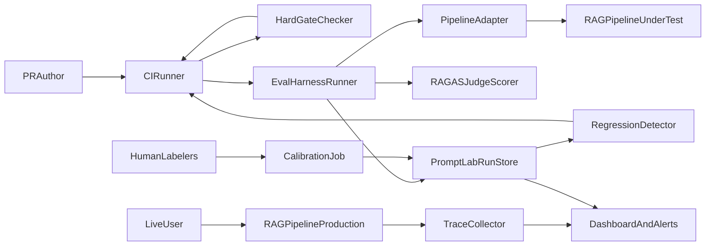
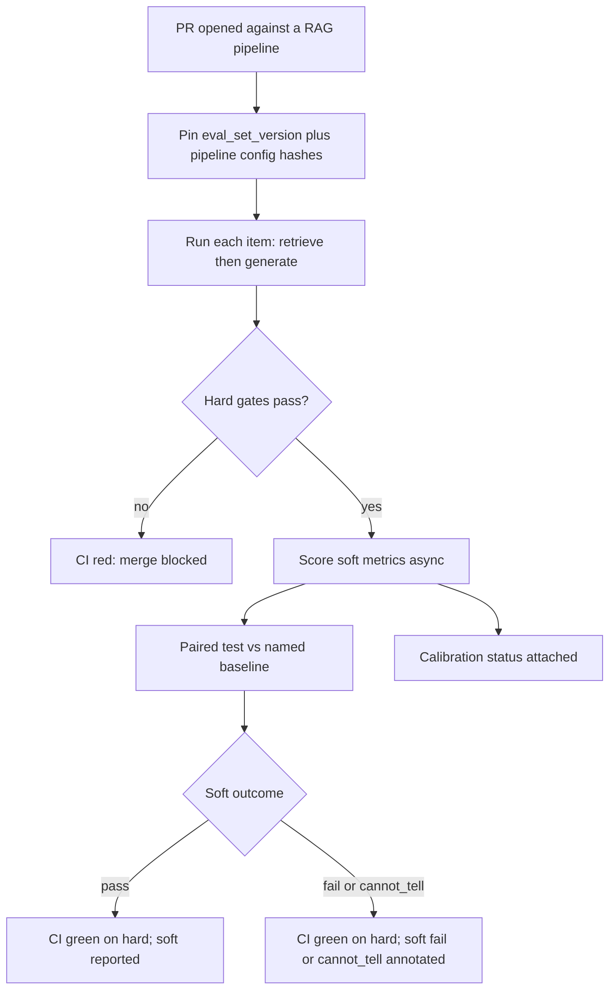
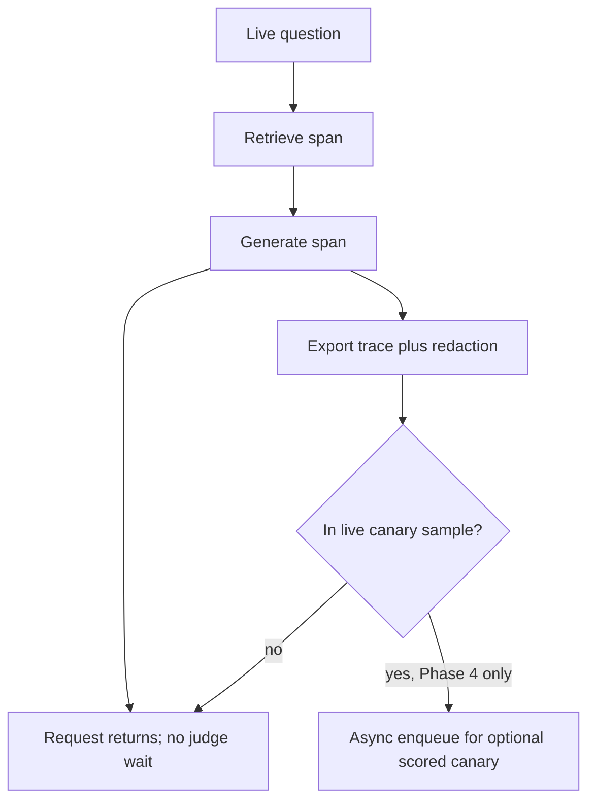
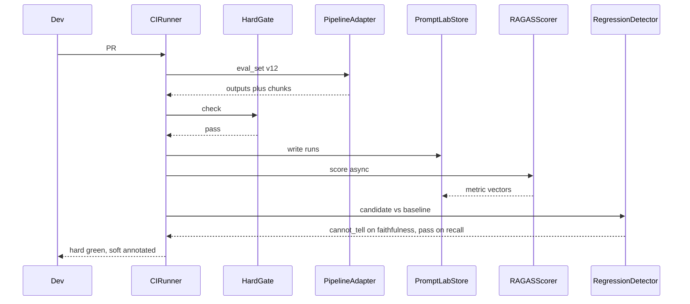
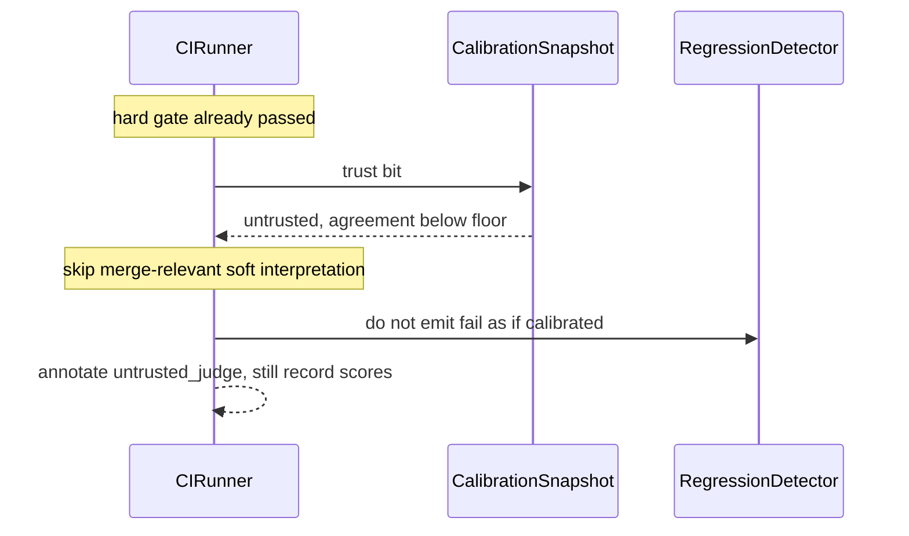

# RAG Evaluation & Observability Platform — Architecture Document
> - **Document Status**: Draft
> - **Last Updated**: 2026 Aug 29
> - **Author**: Paul Serban

Three layers sharing a schema: a **hard-gate CI checker** that may block a merge, a **soft-signal eval runner** that computes calibrated RAGAS-family metrics and a paired regression test, and a **production trace collector** that never waits on an LLM judge. This document covers *what* the system is and *why* it is shaped this way; see [System Design](./03_system_design.md) for *how* gates, scorers, and traces actually work, and [Trade-offs and Honest Assessment](./05_tradeoffs_and_honest_assessment.md) for what those scores are not.

## Overview

**Brief description**: Evaluation-and-observability infrastructure, scoped narrowly: make RAG quality a gated, measured discipline instead of a notebook. It is not a RAG pipeline, not a hosted eval SaaS, and not a correctness oracle. It extends [`prompt-lab`](../../prj--prompt-lab/README.md); it does not replace it.

**Business Context**
- See [Scenario and Requirements](./01_scenario_and_requirements.md) for the full framing. In short: the brief wants RAGAS + tracing + a CI regression gate + one backbone. "Quality" is therefore split into structural contracts (hard), LLM-judged properties (soft, calibrated, statistically tested), and operational telemetry (traces). Auto-blocking on a noisy mean, and running the judge on live traffic as "observability," are how you fail the scenario.

## Requirements

### Functional Requirements

- **Hard-gate**: run deterministic checks on the eval-set outputs (schema, citations, retrieval floor, PII/safety regex, abstain-on-empty-context). Fail the merge if any required check fails.
- **Soft-eval**: for each eval item, run the pipeline under test, persist retrieved chunks + generation, score with the declared scorer family (RAGAS-style and/or cheaper overlap metrics).
- **Calibrate**: on a cadence, score a human-labeled slice with the judge; record agreement; mark the judge trusted or untrusted.
- **Regress**: paired comparison of candidate run vs named baseline on the same eval-set version. Emit pass / fail / cannot-tell per metric family — fail is **alert-class** in v1, not merge-block, for LLM-judged metrics.
- **Trace**: on live requests, emit retrieve / (optional rerank) / generate spans with chunk ids, ranks, tokens, latency, cost. No judge on the hot path.
- **Dashboard**: per-pipeline, per-stratum, per-stage metrics; CI run history; judge-calibration status; eval-set version; token spend. One blended score is forbidden as the primary view.
- **Plug-in**: a RAG pipeline registers an adapter (retrieve + generate), a dataset id, and scorer selection. The runner is not forked.

### Non-Functional Requirements

**Performance Requirements:**
- **CI hard-gate** must finish inside a PR-budget wall clock (working target: minutes, not an hour). It runs the eval set through the pipeline; that cost is the pipeline's, not the platform's cleverness. Judge calls for the soft suite may be async relative to the GitHub check that reports hard-gate + "soft suite running."
- **Production tracing** adds a small, bounded overhead per request (export spans, not a second generation). If tracing requires an extra LLM call, the design has failed.
- Soft-eval cost is ~ **N_items × (pipeline cost + k judge calls)**. RAGAS metrics are multiple judge prompts per item. That multiplier is a line item, not a footnote.

**Reliability Requirements:**
- **A judge timeout must not fail the hard gate.** Soft suite degrades to "cannot tell / suite incomplete."
- **A harness crash fails closed** on the CI check (the check is red: we do not know). Silent skip is forbidden.
- **Untrusted judge** (calibration below floor) must not page as if the regression were real. Mark and move; do not keep the pager trained on noise.
- **The system must not degrade into "skip the eval job"** under flake pressure, or into "RAGAS on production" under dashboard pressure. Those are kill / rollback, not incident hotfixes.

**Infrastructure Constraints:**
- Illustrative: GitHub Actions (or equivalent) for CI; pytest as the runner entry; the `prompt-lab` store (Postgres) for runs; an OTel-compatible backend for traces; a dashboard that reads both. RAGAS (or an equivalent judge-prompt family) as a **scorer plugin**, not as the runtime.
- No GPU cluster, no training, no vector DB **owned by this project**. The RAG pipeline under test owns retrieval. This platform owns scoring, gating, traces, and the eval-set registry.

**The defining constraint:**
- LLM-judged scores are noisy instruments. CI that must be trusted cannot treat them as booleans. Observability that must be cheap cannot wait on them.

## Executive Summary

The system is a **tiered evidence pipeline**. The scarce resource on the naive path was *trust in a screenshot of a mean*. The new path spends cheap deterministic checks to protect merges, spends expensive judges on a labeled set with statistics and calibration, and spends cheap traces to make production operable.

**Architecture Style:** Evaluation-driven development as a control loop (detect → attribute to stage → decide), not a library wrapper. Not a single RAGAS job. Not a generic APM install.

**Key Components:**
- **Eval-Set Registry**: versioned, stratified items + labels + provenance.
- **Pipeline Adapter**: retrieve + generate against a pinned corpus/config.
- **Hard-Gate Checker**: deterministic checks; merge-blocking.
- **Eval Harness Runner**: executes the set; writes Runs to the `prompt-lab` store.
- **LLM-Judge / RAGAS Scorer**: plugin; calibrated.
- **Regression Detector**: paired test; pass / fail / cannot-tell.
- **Trace Collector**: live spans; redaction; export.
- **Dashboard and Alerting**: stages, strata, calibration, cost — not one number.
- **Calibration Job**: human labels vs judge, on a cadence.

**Technology Stack (illustrative):**
- CI: GitHub Actions, pytest.
- Scorers: RAGAS (or equivalent judge prompts) + deterministic overlap / schema checks.
- Store: `prompt-lab` Postgres for runs, variants, scores, eval-set versions.
- Tracing: OpenTelemetry spans → existing backend (Jaeger / Grafana Tempo / equivalent).
- Dashboard: Grafana or equivalent reading metrics + SQL; not a custom product.

**Architecture Principles:**
- **Block on contracts, flag on judges.** If a check can be a pure function of the output, it may be a gate. If it needs another model, it is a signal.
- **Do not blend stages.** Retrieval and generation fail independently; the dashboard must say which.
- **Pair and power, or do not claim regression.** A mean drop on 20 items is a vibe.
- **One schema, two runtimes.** CI eval and production traces share identity fields. They do not share an execution path.
- **Calibration can revoke trust.** An uncalibrated judge is worse than no judge, because it produces confident numbers.
- **The second consumer is the architecture test.** Until two pipelines plug in, "backbone" is a README.

**Key Architectural Decisions:**
1. **Hard deterministic gate vs. soft LLM-judged signal; only the former blocks merges in v1.** [ADR-001](./04_architecture_decision_records.md#adr-001).
2. **LLM-judge scores require continuous calibration against human labels.** [ADR-002](./04_architecture_decision_records.md#adr-002).
3. **Regression detection uses a paired, power-aware test, not a raw threshold.** [ADR-003](./04_architecture_decision_records.md#adr-003).
4. **Production tracing and CI evaluation are separate pipelines sharing a schema.** [ADR-004](./04_architecture_decision_records.md#adr-004).
5. **Per-stage metric scoping; no blended quality score as the gate input.** [ADR-005](./04_architecture_decision_records.md#adr-005).
6. **Eval-set governance: versioned, refreshed, provenance-tracked, Goodhart-guarded.** [ADR-006](./04_architecture_decision_records.md#adr-006).
7. **Cost-bounded evaluation: cheap checks sync/blocking; judges async/sampled.** [ADR-007](./04_architecture_decision_records.md#adr-007).

### Context Diagram

The RAG pipeline is **under test** in CI and **instrumented** in production. The platform does not retrieve or generate except through the adapter. `prompt-lab` is the system of record for eval runs. Traces do not flow through the judge.

### Target path — PR eval

### Target path — live request

## Runtime Architecture

1. **Registry layer** (rare writes): eval-set versions, scorer versions, baseline run ids, calibration snapshots.
2. **CI layer** (per PR / scheduled full suite): adapter execution → hard-gate → (async) soft scores → regression detector → GitHub check. Smoke vs full: change-scoped, inherited from `prompt-lab` (a retriever-config change runs retrieval-heavy strata; a README typo does not).
3. **Calibration layer** (scheduled, human-paced): sample outputs, human rubric, agreement metrics, trust bit.
4. **Production trace layer** (always-on): spans on the live pipeline; redaction; export. Optional Phase 4 sampled canary **off** the request path.
5. **Presentation layer**: dashboards and alerts. Alerts on hard-gate breakage in main, on trace SLO (latency/error), on calibration-floor breach, on **reviewed** soft-regression. Not on raw mean jitter.

Once quality is no longer a screenshot, RAGAS **stops being the architecture**. It remains a scorer plugin. Using it as the merge boolean or as the production tracer is how you fail the scenario.

### Happy path vs untrusted judge

Untrusted judge does not pretend:

## Components

### 1. Eval-Set Registry
**Purpose**: Be the only place "the" eval set is defined, so comparisons mean something.

**Responsibilities:**
- Store items: id, question, stratum, provenance (real / synthetic / adversarial), optional ground-truth answer, optional labeled relevant chunk ids, citation-required flag.
- Version immutably. A refresh is a new version plus a diff review (added / removed / edited).
- Holdout vs iteration split: iteration may be used by pipeline authors offline; the merge-signal set is the frozen holdout (or a declared "gate set"). See [ADR-006](./04_architecture_decision_records.md#adr-006).
- Refuse to score context recall on items without labels.

**Interactions:**
- Reads: runner, dashboard.
- Writes: eval owners, via review, not from a failing PR.

### 2. Pipeline Adapter
**Purpose**: Make "run this RAG" a contract so the harness does not import every pipeline's internals.

**Responsibilities:**
- `retrieve(question, config) → chunks[]` with ids, ranks, scores, text, source ids, corpus_version.
- `generate(question, chunks, config) → answer` with citations, model id, tokens, raw prompt hash.
- Pin config: chunker version, embedding model, top-k, prompt variant, generator model. Unpinned runs are invalid.
- Do not fetch "whatever is in prod" unless the run is explicitly a production canary.

**Interactions:**
- Calls: the pipeline under test (in-process in v1 is fine; HTTP is fine). The contract matters, not the transport.
- Writes: nothing durable; the runner persists.

### 3. Hard-Gate Checker
**Purpose**: The only merge-blocking quality path in v1.

**Responsibilities:**
- Run the check list from [Scenario](./01_scenario_and_requirements.md): schema/citations, retrieval floor on required strata, PII/safety regex, abstain-on-empty-context, identity hashes present.
- Fail closed on harness errors (could not run the set).
- Emit structured failures per item and per check id, not a single "eval failed."

**Interactions:**
- Reads: adapter outputs.
- Writes: CI annotation; Store (gate result on the run batch).

### 4. Eval Harness Runner
**Purpose**: Execute the set, once, with identity, and hand results to scorers.

**Responsibilities:**
- Resolve eval_set_version, baseline_run_id, scorer versions, pricing snapshot.
- Fan out item execution with bounded concurrency (the RAG pipeline and the provider have rate limits).
- Persist one Run per item (question, chunks, answer, usage) compatible with `prompt-lab`.
- Enforce the per-PR token budget: stop and fail the **budget** check rather than silently scoring 12 of 80 items and reporting a mean.

**Interactions:**
- Calls: Adapter, Hard-Gate, Scorers.
- Writes: Store.

### 5. LLM-Judge / RAGAS Scorer
**Purpose**: Estimate faithfulness, answer relevancy, context precision, context recall — as **separate** scores.

**Responsibilities:**
- Implement each metric as its own scorer id. Do not average them.
- Pin judge model, prompt/template version, temperature (judges should be as deterministic as the provider allows — this is not the product T>0 from other projects; a sampling judge is extra noise you did not need).
- Honor skip rules: no recall without labels; no faithfulness without retrieved context blob.
- Record judge tokens and latency on the run. The judge is on the bill.

**Interactions:**
- Reads: Run records.
- Writes: scores on those records.
- Does not call the RAG pipeline.

### 6. Regression Detector
**Purpose**: Turn two scored batches into an honest comparison.

**Responsibilities:**
- Pair on item id. Refuse to compare different eval_set_versions without an explicit migration note (and then it is not a paired regression; it is a dataset change).
- Per metric family, per stratum and overall: paired test (see [System Design](./03_system_design.md)). Outcomes: pass, fail (regression), cannot_tell.
- Improvement is reported. It is **not** an auto-merge license. Hard gates still apply.
- Attach calibration trust bit to the report.

**Interactions:**
- Reads: Store (candidate batch, baseline batch, calibration snapshot).
- Writes: ComparisonReport.

### 7. Trace Collector
**Purpose**: Make production operable without a judge.

**Responsibilities:**
- Instrument retrieve / rerank / generate. Fields: chunk ids, ranks, top-k, corpus version, model, tokens, latency, error class, redacted query pointer.
- Redact according to policy before export. Retention TTL.
- Metrics from traces: p95 retrieve, p95 generate, empty-retrieval rate, citation-missing rate, cost per request. These are **operational** SLOs, not RAGAS.
- Sampling: head-sample errors and empty-retrieval at 100%; downsample happy path if volume requires.

**Interactions:**
- Reads: live pipeline (in-process instrumentation).
- Writes: OTel backend. Does not write RAGAS scores.

### 8. Dashboard and Alerting
**Purpose**: Show stages, strata, cost, and trust — not a vanity mean.

**Responsibilities:**
- Views: CI history (hard + soft reports), per-stage offline metrics, trace SLOs, calibration agreement over time, eval-set version, $ per PR eval.
- Alerts: hard-gate red on main; trace error/latency burn; calibration below floor; **human-reviewed** soft-regression (Phase 3). No page on "faithfulness 0.81 vs 0.84."
- Default landing is decomposed. A single "Quality: 82" widget may exist as a joke; it must not be the gate or the page.

**Interactions:**
- Reads: Store, OTel, metrics.

### 9. Calibration Job
**Purpose**: Keep the judge honest enough to interpret.

**Responsibilities:**
- Sample a slice of recent eval outputs (stratified, including safety-adjacent if present).
- Collect human labels on a rubric aligned to what the judge claims to measure (faithful / not; relevant / not; relevant-chunk / not). Humans are not asked for a 0–1 RAGAS float unless you have evidence they can produce one stably.
- Compute agreement (see [System Design](./03_system_design.md)). Update trust bit and bias diagnostics (length correlation, etc.).
- Safety-flagged items: human is authority; judge is not sole label.

**Interactions:**
- Reads: Store.
- Writes: CalibrationSnapshot.

### Communication Patterns

**Synchronous:**
- CI ↔ adapter (eval execution).
- CI ↔ hard-gate.
- Live request ↔ trace export (non-blocking / batched; must not add a generation).

**Asynchronous:**
- Judge scoring of CI runs.
- Calibration labeling.
- Phase 4 live canary scoring.
- Dashboard queries.

There is no synchronous "judge this production answer before we return it." That is a different product (online moderation) and a latency/cost bomb.

## Scaling Strategy

**Current Scale Requirements:**
- One, then two, RAG pipelines. Eval set of order **80–300 items**, not 20 and not 10,000. Human labels on a **subset** (working: 40–80 for calibration). Production QPS of an internal-docs bot (human-paced) to a support/docs assistant (higher). This is not a web-search firehose.

**What scales horizontally:**
- Adapter execution (bounded workers).
- Judge calls (bounded concurrency; the bill scales linearly — that is not "free scale").
- Trace ingest (standard telemetry).

**What does not:**
- Human labeling. Calibration and eval-set refresh are the scarce resource. Buying more judge tokens does not replace them.
- Context-recall labels. Someone has to mark relevant chunks. That cost is why most "we have RAGAS" decks silently drop recall.
- Provider RPM for the **pipeline under test** during CI. An 200-item set × every PR × N concurrent engineers is a real load on the generator.

**If QPS or repo count grows:**
- Keep hard gates on PR. Move full soft suite to scheduled + release, smoke-stratum on PR ( `prompt-lab` change-scoped matrix).
- Sample traces; do not sample away empty-retrieval and errors.
- Do **not** "scale eval" by scoring production with RAGAS. That is [ADR-004](./04_architecture_decision_records.md#adr-004) / [ADR-007](./04_architecture_decision_records.md#adr-007).

**Bottleneck Analysis:**
- Primary: human labels + eval-set quality.
- Secondary: judge + pipeline token cost per PR.
- Tertiary: nothing about plotting. If the dashboard is the bottleneck you have built a BI project.

### What changes as eval-set size or consumers grow

| Dimension | 80 items, 1 pipeline | 500 items, 4 pipelines, full RAGAS on every PR |
| --- | --- | --- |
| CI time | Minutes | Hours unless smoke/full split |
| Judge $ | Noticeable, survivable | Dominant; will be skipped |
| Statistical power | Barely enough for large effects | Better, if labels keep up |
| Goodhart pressure | High (small set, everyone knows it) | Still high; refresh becomes mandatory |
| Temptation to auto-block on RAGAS | High | Higher; resist until calibration evidence exists |

## Data Architecture

### Data Model

**Key Entities:**
- **EvalSetVersion**: id, pipeline_family, item count, stratum mix, created_at, review record.
- **EvalItem**: item_id, set_version, question, stratum, provenance, gt_answer?, relevant_chunk_ids?, flags.
- **PipelineConfig**: hashes for corpus, chunker, embedder, retriever, prompt, generator model.
- **Run**: `prompt-lab` run row plus RAG extensions (chunks, ranks, corpus_version).
- **Score**: run_id, scorer_id, metric_name, value, judge_model, judge_prompt_hash.
- **ComparisonReport**: candidate_batch, baseline_id, per-metric outcomes, trust bit.
- **CalibrationSnapshot**: window, n_human, agreement, trust, bias notes.
- **TraceSpan**: request_id, span type, timing, chunk ids, tokens, redaction_status.

**Entity Relationships:**
- One eval-set version → many items.
- One CI batch → many Runs → many Scores.
- One ComparisonReport pairs two batches on one eval-set version.
- Traces are not Runs. A canary may *create* Runs from sampled traces later.

### Data Lifecycle

**Create**: items at refresh; runs at CI; scores async; traces on live requests; calibration on cadence.

**Read**: detector, dashboard, on-call (traces), reviewers (CI annotation).

**Update**: none of the runs or scores. Append-only. Eval items are not updated in place; versions replace.

**Delete**: query text and chunk text per PII/retention. Hashes, chunk ids, and aggregate metrics stay. Traces of user questions are not a research corpus unless legal said so.

## Cost Analysis

### Cost Components

**Money:**
- CI: `N_items × pipeline tokens` + `N_items × judge_calls_per_item × judge tokens`. RAGAS-style faithfulness + relevancy + precision + recall is **several** judge completions per item. Treat 4–8× a cheap generation as the working guess until measured in Phase 0. Pin a pricing snapshot on the batch.
- Production traces: storage and APM. Cheap relative to tokens if you do not store full chunk text forever.
- Live canary (Phase 4): sampled fraction × judge cost. Cap it.

**Engineering time — the actual build cost:**
- Eval-set curation and labels. This is most of Phase 0 and never really ends.
- Adapter contract + first pipeline integration.
- Hard-gate checks (small).
- Judge integration + calibration workflow (large, political: who labels?).
- Tracing instrumentation of the pipelines (medium, and it touches production).
- Dashboard (small if you reuse existing Grafana).

**Risk cost of skipping this and "just shipping RAG":**
- Silent retrieval breakage, fluent hallucination, no bisect, no idea which PR did it. That is why you would pay for evals. If the pipeline is a toy corpus and a demo, do not pay. See [Trade-offs](./05_tradeoffs_and_honest_assessment.md).

### Cost Optimization

- Hard gates first; they catch the dumb failures without a judge.
- Smoke stratum on PR; full set on main/nightly.
- Prefer deterministic citation-overlap where it applies; do not spend a judge to ask "is this substring in the context."
- Do not score recall on unlabeled items "to fill the chart."
- One judge model, pinned. Do not ensemble judges in v1 (N× cost, correlated taste).
- Do not add a second "meta-judge" of the RAGAS scores.

## Risks and Mitigation

| Risk | Likelihood | Impact | Mitigation Strategy | Owner |
| --- | --- | --- | --- | --- |
| Judge treated as ground truth; auto-block | High | High (flake, then skip) | ADR-001; Phase 4 only with evidence | Platform |
| Judge-human disagreement ignored | High | High (confident wrong gates) | Trust bit; untrusted disables soft interpretation | Eval owner |
| Eval set of 20 hand-picked items | High | High (Goodhart, no power) | Phase 0 gate on size, strata, provenance | Eval owner |
| Silent mutate of failing items | High | High | Immutable versions; review | Eval owner |
| Blended quality score hides stage failure | High | Medium | ADR-005; dashboard design | Dashboard |
| RAGAS on production as "tracing" | Medium | High (bill) | ADR-004, ADR-007; no judge on hot path | Platform |
| No second consumer; forked scripts anyway | Medium | High (backbone claim false) | Kill criterion | Phase 3+ |
| PII in traces | Medium | High | Redaction before export; retention | Security + platform |
| Context-recall skipped forever because labeling is hard | High | Medium (honest: then don't claim recall) | Show "not labeled" not a fake 0.9 | Eval owner |
| CI bill surprise | Medium | Medium | Budget check fails the PR; visible $ | Runner |
| Tracing never instrumented because "we have RAGAS" | Medium | High (on-call blind) | Phase 4 tracing is a gate; RAGAS does not substitute | Owning engineer |
| Safety averaged into quality | Medium | High | Hard-gate stratum; not a mean | Trust & safety |
| Promptfoo / LangSmith / Braintrust already exist | High | Medium | See Trade-offs: build vs buy is a Phase 0 question | Stakeholder |

## Future Enhancements

### Phase 1 (current design target)
Hard-gate only, one pipeline, no merge-block on RAGAS. See [Phased Implementation Plan](./06_phased_implementation_plan.md).

### Phase 2
Soft RAGAS (or equivalent) + calibration job + dashboard. Still not blocking.

### Phase 3
Statistical regression **alerting** (human-reviewed). Second pipeline adapter as the backbone test.

### Phase 4
Production tracing at scale. Optional sampled live canary. Conditional auto-block on soft metrics **only** if calibration + false-positive rate justify it. Default is that they still do not auto-block.

### Explicitly not in this design

- RAGAS as production tracing.
- A single quality score as the architecture.
- Prompt search / automatic prompt optimization.
- Multi-tenant eval SaaS.
- Replacing `prompt-lab`.
- Guaranteeing correctness.
- Guaranteeing that a green CI means users are happy.
