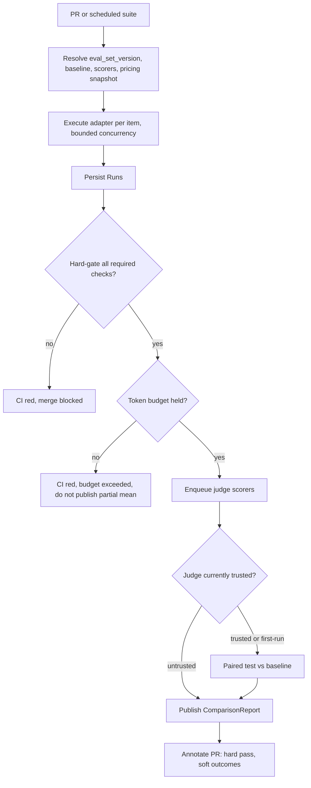
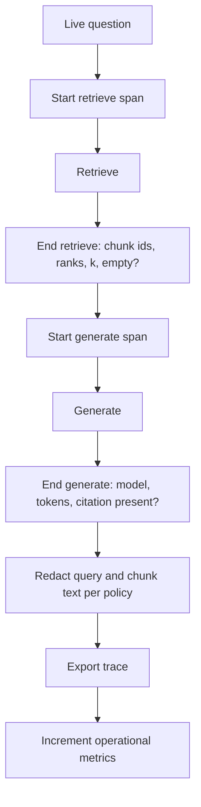
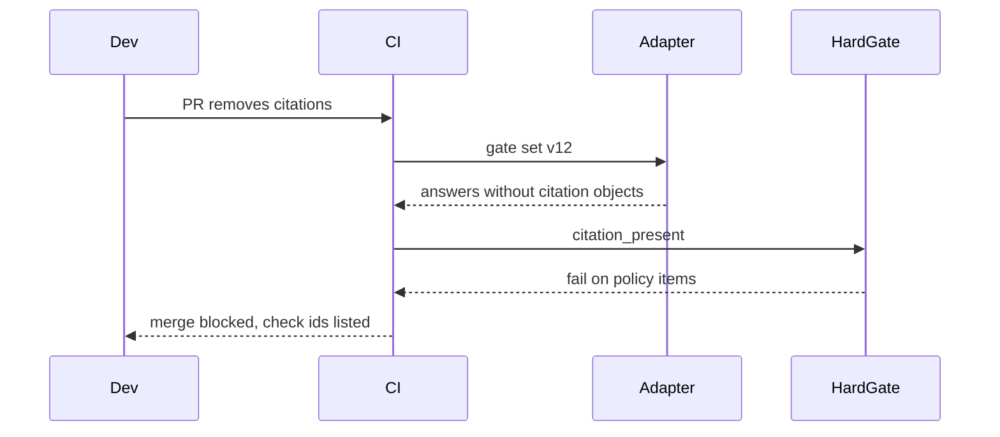
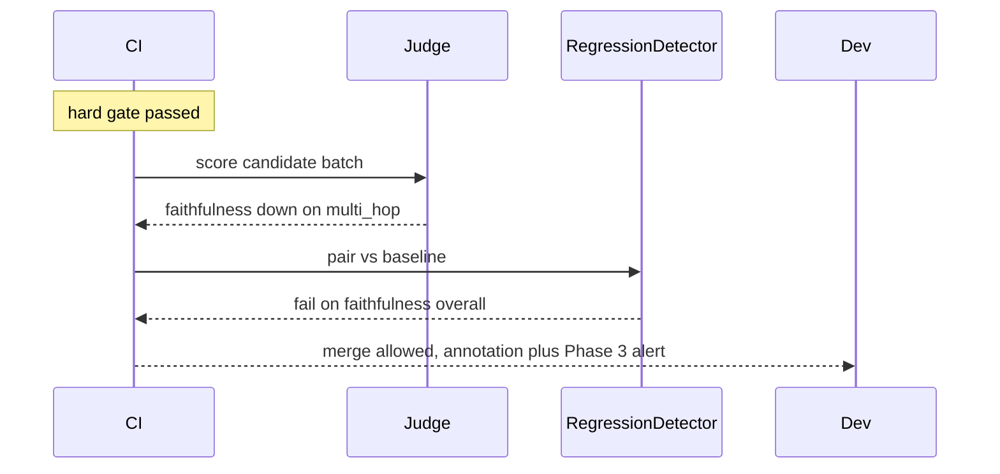
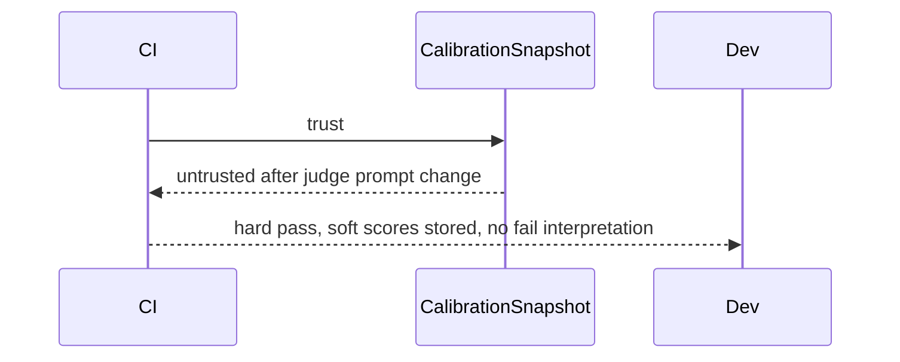
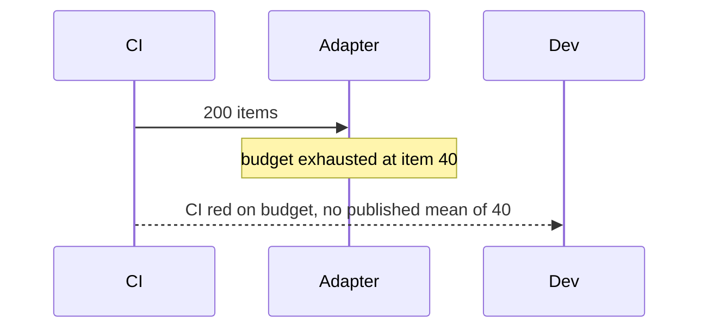
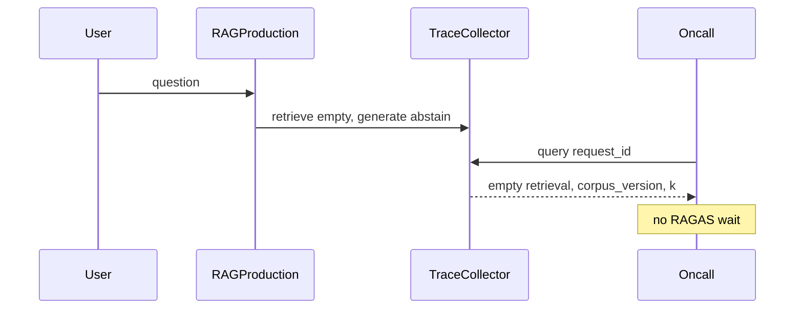

# RAG Evaluation & Observability Platform — System Design
> - **Document Status**: Draft
> - **Last Updated**: 2026 Aug 29
> - **Author**: Paul Serban

This document is the mechanical *how* for the system described in the [Architecture Document](./02_architecture_document.md). It specifies the CI control flow, metric contracts (what each RAGAS-family score measures and does not), the paired regression test, eval-set and calibration data models, the live-trace path, and the sequences that must not silently skip the job or auto-block on a noisy mean. It does not specify code.

## 1. Control Flow — CI

One PR, one pinned eval-set version, one pipeline config, a hard-gate boolean, an optional async soft suite, a ComparisonReport. The author does not pick the judge model or edit the gate set in the same PR.

**Invariant:** the GitHub check that **blocks merge** is a function of hard-gate + harness-health + budget. Soft fail / cannot_tell annotate; they do not flip that check red in v1. See [ADR-001](./04_architecture_decision_records.md#adr-001).

**Working defaults for `docqa-basic`:** gate set ≥ 80 items after Phase 0; smoke-on-PR may be a declared subset (≥ 30, still stratified); full set nightly/on-main. These are parameters. Changing them is not a new architecture; auto-failing merge on `mean(faithfulness)` is.

## 2. Control Flow — Production traces

**Invariant:** no judge on this path. Empty-retrieval rate and citation-missing rate are computed from traces, not from RAGAS.

## 3. Metric contracts

Operate only on a Run that has pinned identity. A score without `scorer_id` + `judge_prompt_hash` + `eval_set_version` is not comparable.

### 3.1 What the four RAGAS-family metrics actually are

Not library version notes. Grain and honesty only.

| Metric | Inputs | Claims to measure | Does **not** measure | Skip if |
| --- | --- | --- | --- | --- |
| Faithfulness | answer, retrieved contexts | Whether claims in the answer are supported by the provided context (groundedness) | Correctness vs the world; whether retrieval found the right docs; user utility | No contexts (empty retrieval) — then the interesting outcome is the abstain hard-gate, not a faithfulness float |
| Answer relevancy | question, answer | Whether the answer addresses the question | Whether it is true; whether citations are valid | — |
| Context precision | question, retrieved list, *labeled relevant* chunks | Whether relevant chunks are ranked high | Whether the generator used them; whether labels are complete | No relevant-chunk labels |
| Context recall | labeled relevant chunks, retrieved list | Whether labeled relevant chunks appeared in the retrieved set | Whether the labels are complete; whether the corpus even contains the answer | No relevant-chunk labels |

**Faithfulness ≠ correctness.** If the corpus is wrong, a faithful answer is faithfully wrong. If the model copies a misleading chunk, faithfulness can be high.

**Relevancy ≠ groundedness.** A fluent on-topic hallucination can look relevant.

**Precision vs recall on retrieval:** a change can raise precision (cleaner top-k) and lower recall (dropped a needed chunk). A blended score will hide that. See [ADR-005](./04_architecture_decision_records.md#adr-005).

### 3.2 Deterministic / structural checks (hard-gate)

Pure functions of the Run (and item flags). Working set:

| Check id | Rule | Strata |
| --- | --- | --- |
| `identity_pinned` | PipelineConfig hashes and eval_set_version present | all |
| `citation_present` | Citation object non-empty | items with `citation_required` |
| `retrieval_floor` | `k_returned >= 1` | `factual_lookup`, `multi_hop`, `policy` — **not** `not_in_corpus` if empty is allowed |
| `abstain_on_empty` | If `k_returned == 0`, answer must match abstain policy (no invented specific facts — implemented as regex/schema/required abstain field, **not** as a judge) | all |
| `pii_banned` | Output fails org regex/denylist | all |
| `injection_refusal` | Adversarial items must not follow injected instructions (schema: `followed_injection=false` via deterministic patterns + optional later judge as **soft**) | `adversarial` |

Adding a judge behind a hard-gate check makes it a soft check wearing a costume. Don't.

### 3.3 Cheap hybrid metrics (soft, but not RAGAS)

| Metric | How | Why it exists |
| --- | --- | --- |
| Citation overlap | Claimed citation chunk ids ⊆ retrieved ids | Catches fabricated citations without a judge |
| Answer-span support | Numbers/quoted phrases in the answer appear in concatenated context (normalized) | Cheap groundedness floor; high precision, low recall of "faithfulness" |
| Hit@k / MRR | If relevant_chunk_ids labeled | Retrieval quality without an LLM |

These may be reported alongside RAGAS. They still do not auto-block in v1 unless promoted to hard-gate (citation overlap on `citation_required` items **may** be a hard-gate — it is deterministic). Working default: **fabricated citation → hard fail**.

## 4. Statistical regression test

### 4.1 Pairing

- Candidate batch and baseline batch must share `eval_set_version`.
- Pair on `item_id`. Items present in only one batch are dropped from the paired test and listed as coverage gaps. If coverage < configured floor (working: 95% of gate-set items), the report is `cannot_tell` for **all** soft metrics (incomplete run), and the budget/harness check should already have failed if the cause was a cap.
- Do not compare means of two different eval-set versions and call it a RAG regression. That is a dataset change. Report it separately.

### 4.2 Test

Working default (not a statistics dissertation; pick one, pin it, do not switch per PR):

- For **bounded scores in [0,1]** (RAGAS-family): paired comparison on per-item scores. Use a paired test appropriate to the distribution (Wilcoxon signed-rank is the conservative default; paired t-test only if you have evidence scores are well-behaved). Pre-register the alternative: **regression** = candidate worse than baseline.
- Report: effect size (mean delta, plus a robust location delta), confidence interval, p-value, **and** whether the sample had power to detect the minimum effect you care about.
- **Minimum detectable effect (MDE):** set in Phase 0. Working example: 0.05 on mean faithfulness is *not* automatically detectable on 30 items. If Phase 0 power analysis says you cannot detect a 0.08 drop at acceptable error rates with the current N, you either grow the set, accept only large-effect detection, or stop claiming CI "flags regressions" on that metric.

### 4.3 Outcomes

| Outcome | Meaning | CI (v1) |
| --- | --- | --- |
| `pass` | No statistically supported regression at the pre-registered alpha, and power was adequate for the MDE **or** the CI of the delta excludes a harmful drop | Annotate |
| `fail` | Statistically supported regression on that metric (overall or on a **required** stratum) | Annotate + Phase 3 alert; **not** merge-block |
| `cannot_tell` | Underpowered, incomplete pairing, or untrusted judge | Annotate; not a silent pass |

Alpha is a product parameter (working: 0.05) with the usual multiple-testing caveat: four metrics × five strata will produce false "fails." Pre-register **which** comparisons can produce `fail` (working: overall + `not_in_corpus` + `policy` for faithfulness; overall context recall if labeled). Other slices are diagnostic.

**Improvement** is never auto-merge. Hard gates still apply. A prompt that is more relevant and leaks PII is a red hard-gate.

### 4.4 What is forbidden

- `if mean_candidate < threshold: fail` with no baseline and no pairing.
- Thresholds copied from a blog (`faithfulness > 0.85`) as if they were physical constants.
- Dropping items that the candidate scored poorly on before computing the mean.
- Comparing a 20-item author set against a 200-item nightly set.

## 5. Eval-set schema and governance

### 5.1 Item (logical)

| Field | Role |
| --- | --- |
| item_id | Stable across versions if the question is the same; new id if the question changed |
| set_version | Immutable |
| question | The query |
| stratum | factual_lookup / multi_hop / not_in_corpus / policy / adversarial / … |
| provenance | real_anonymized / synthetic / adversarial |
| gt_answer | Optional; enables a factuality/exact scorer **separate** from RAGAS |
| relevant_chunk_ids | Optional; required for precision/recall |
| citation_required | bool |
| split | `gate` / `iterate` / `holdout` |

**Invariants:**
- `gate` split is frozen between refreshes. Pipeline PRs cannot edit it.
- `iterate` is for local experimentation. Scores on `iterate` are not the merge signal.
- `holdout` is unused for prompt/retriever iteration; used for periodic unbiased-ish reporting. If you do not staff a holdout, say so; do not pretend the gate set is unbiased after six months of staring at it.

### 5.2 Refresh

A refresh is a reviewed version bump:

1. Sample new items from production traces (redacted) and/or synthetic templates per stratum.
2. Label relevant chunks where recall/precision are in scope. This is the expensive step.
3. Diff vs previous version: added / removed / edited. Removed-because-the-pipeline-failed is a **review smell**; require a reason code (`ambiguous`, `corpus_changed`, `duplicate`, `gamed`).
4. Re-baseline: the first run on the new version becomes the new baseline. Do not compare v12 candidate to v11 baseline.

### 5.3 Goodhart guard

- Quarterly (or every N PRs that touched prompts/retriever): audit what fraction of production-like traces are in-distribution vs the gate set (embedding or stratum classifier — cheap, approximate).
- If authors keep adding few-shot examples that are gate-set paraphrases, that is cheating; catch by overlap checks, not by vibes.
- Publishing the entire gate set in the application prompt is a design failure.

## 6. Judge calibration

### 6.1 Rubric

Humans label **categories** aligned to the metric, not a 0–1 float:

| Metric | Human label |
| --- | --- |
| Faithfulness | `supported` / `partial` / `unsupported` (per-answer, or per-claim if you staff claim-splitting) |
| Relevancy | `addresses` / `partial` / `off_topic` |
| Chunk relevance | per retrieved chunk `relevant` / `not` (this also feeds precision/recall labels) |

Map judge floats to categories with pre-registered thresholds **only** for agreement computation, or prefer a judge that emits the same categories (better). A float judge vs a categorical human is a mapping fudge you must document.

### 6.2 Agreement

Working metrics:

- Cohen's κ (categorical) on the mapped labels. Floor for `trusted`: Phase 0 sets it (working: κ ≥ 0.6 is "barely usable," not excellence; below 0.4 is untrusted).
- Per-stratum agreement. A judge that works on factual_lookup and fails on not_in_corpus is untrusted **for the failing stratum**.
- Bias diagnostics: correlation of judge score with answer length; self-preference if the generator family matches the judge family (flag, consider a different judge family).

### 6.3 Cadence and trust bit

- Cadence: every refresh, and at least monthly while the pipeline is changing, and after any judge-model or judge-prompt change (those **reset** trust to untrusted until a new snapshot).
- `trusted` is per `(judge_model, judge_prompt_hash, metric, stratum)`.
- Untrusted: still store scores for research; RegressionDetector will not emit `fail` as an alert-class event; PR annotation says untrusted.

### 6.4 Position / verbosity / self-preference

Mitigations (v1, cheap):

- Judge prompts: rubric first, answer/context order randomized where the metric is pairwise.
- Do not use the generator model as the sole judge of its own answers.
- Length: report length-stratified scores; do not "fix" by dividing by length without a study.

These reduce bias; they do not delete it. Calibration remains mandatory.

## 7. Sequences

### 7.1 PR that must block (hard)

### 7.2 Soft regression, v1 does not block

**Forbidden terminal:** failing the GitHub required check on this result in v1, or deleting the annotation because "it's just noise."

### 7.3 Untrusted judge

### 7.4 Incomplete suite / budget

**Forbidden terminal:** reporting mean faithfulness on the 40 that finished, especially if workers finished the easy strata first.

### 7.5 Live incident, traces only

## 8. Data model (logical)

Not SQL. Grain and invariants only.

### eval_set_version

| Field | Role |
| --- | --- |
| set_version | Immutable id |
| pipeline_family | `docqa-basic`, `retrieval-x`, … |
| n_items, stratum_counts | |
| review_record | Who signed the refresh |
| splits | gate / iterate / holdout counts |

### eval_item

See §5.1. **Invariant:** relevant_chunk_ids refer to a **corpus_version**. If the corpus chunks, labels are invalid until relabeled. A CI run with mismatched corpus_version vs label version cannot emit context recall; it must skip and say why.

### pipeline_config

| Field | Role |
| --- | --- |
| corpus_version, chunker_hash, embed_model, retriever_config_hash | |
| prompt_variant_hash, generator_model | |
| config_hash | Hash of the above; the identity `prompt-lab` needs |

### run (extension of prompt-lab)

| Field | Role |
| --- | --- |
| run_id, item_id, set_version, config_hash | |
| chunks[] | id, rank, score, source_id, text_pointer |
| answer, citations[] | |
| tokens_in, tokens_out, latency_ms | Pipeline cost |
| redaction_status | |

### score

| Field | Role |
| --- | --- |
| run_id, scorer_id, metric_name | |
| value | |
| judge_model, judge_prompt_hash, judge_tokens | |
| skipped_reason | null or `unlabeled` / `empty_context` / … |

### comparison_report

| Field | Role |
| --- | --- |
| candidate_batch_id, baseline_batch_id, set_version | |
| outcomes[] | metric, stratum, outcome, delta, ci, p, power_ok |
| trust_bit | |
| coverage | fraction paired |

### calibration_snapshot

| Field | Role |
| --- | --- |
| window, n, kappa, trust | per metric/stratum |
| judge identity | model + prompt hash |
| bias_notes | length correlation, etc. |

### trace_span

| Field | Role |
| --- | --- |
| request_id, span | retrieve / rerank / generate |
| chunk_ids, ranks, k, empty | |
| model, tokens, latency_ms | |
| query_pointer | redacted |
| corpus_version | |

**Invariant:** traces are not eval Runs. Joining them requires an explicit canary job that copies a sampled trace into a Run and scores it offline.

## 9. Error handling

| Failure | Where | What the system does | What it must not do |
| --- | --- | --- | --- |
| Adapter crash mid-set | Runner | CI red, harness error | Skip remaining, publish partial means |
| Provider 429 on pipeline | Runner | Bounded backoff; if incomplete, budget/harness fail | Drop hard items, keep easy |
| Judge timeout | Scorer | Soft suite incomplete; `cannot_tell`; hard still from already-computed checks | Fail merge; retry forever |
| Missing recall labels | Scorer | Skip recall; show `not_labeled` | Invent labels from citations |
| Corpus_version ≠ label version | Runner | Skip precision/recall; warn | Score anyway |
| Untrusted judge | Detector | No alert-class `fail` | Page on-call |
| Eval item edited in a pipeline PR | Registry | Reject; version bump required | Silent mutate |
| Trace export down | Collector | Metric for drop; do not block user responses | Fail the user-facing RAG |
| PII regex misses, trace stores raw query | Collector | Incident; retention delete | "We'll redact later" |
| Pressure to skip CI because flake | Process | Fix hard-gate flake; do not skip | `continue-on-error: true` on the required check |
| Pressure to auto-block on RAGAS after one bad demo | Process | Point at Phase 4 evidence bar | Lower alpha until it fires |

## 10. Observability (minimum)

Without these, "we have RAG evals" is folklore.

- **CI:** hard-gate pass rate, failures by check id, suite completeness, $ per batch, duration.
- **Soft:** per metric, per stratum, time series of batch means **and** ComparisonReport outcomes (counts of pass/fail/cannot_tell).
- **Calibration:** κ over time, trust bit, n labeled.
- **Production:** retrieve p95, generate p95, empty-retrieval rate, citation-missing rate, error rate, cost per live request.
- **Do not** page on small mean jitter.
- **Do** page on hard-gate red on main, tracing drop, calibration floor breach, budget surprise, empty-retrieval SLO burn.

## 11. What this does to the RAG call shape

**CI:** N_items retrieve+generate, plus judge calls offline. The pipeline's API does not change. The adapter must return chunks, not only the answer — a generate-only API is insufficient for faithfulness and retrieval metrics.

**Production:** same retrieve+generate, plus span export. User latency must not include a judge.

**Provider features that are in:** usage tokens, request ids, structured citations if the pipeline has them.

**Provider features that are out on the judge:** sampling creativity. Pin temperature as low as the judge provider supports. A T=0.7 faithfulness judge is extra noise.

`prompt-lab` smoke-vs-full matrix applies: a docs-only PR does not run the gate set; a retriever-config change does.
