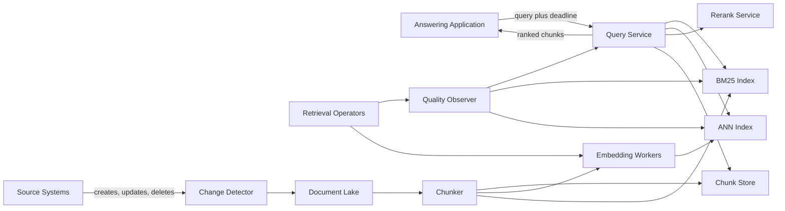
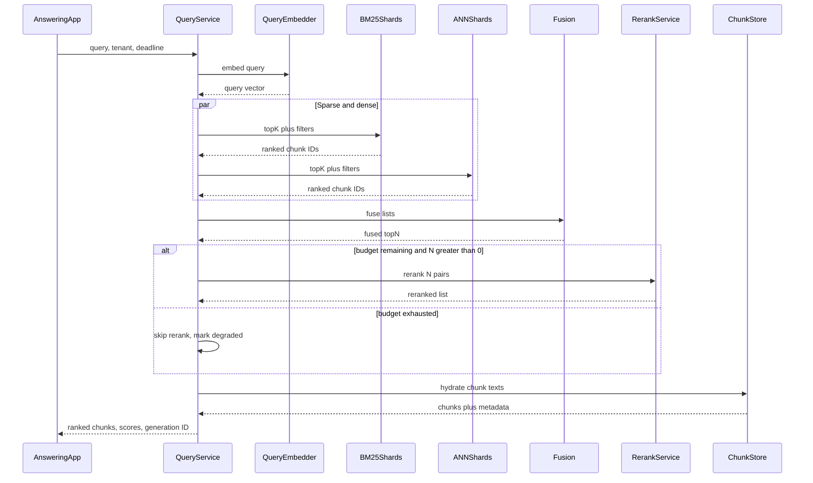
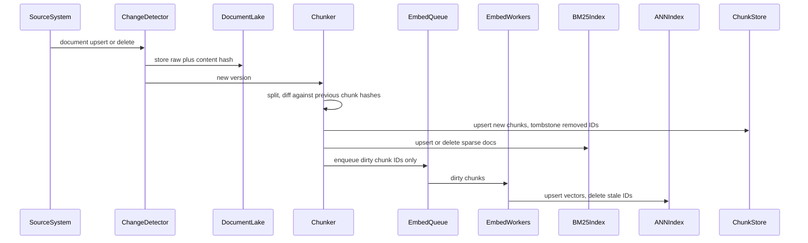

# RAG Pipeline at Scale — Architecture Document
> - **Document Status**: Draft
> - **Last Updated**: 2026 Aug 29
> - **Author**: Paul Serban

A retrieval-augmented generation serving stack that indexes on the order of 50 million source documents (~300 million chunks under the working assumption) and returns ranked chunks with **sub-second p99**, while source documents change and embedding models are replaced. This document covers *what* the system is and *why* it is shaped this way; see [System Design](./03_system_design.md) for *how* chunking, refresh, fusion, sharding, and online degradation detection actually work, and [Trade-offs and Honest Assessment](./05_tradeoffs_and_honest_assessment.md) for what is abandoned and why adding shards is not a strategy.

## Overview

**Brief description**: Internal retrieval infrastructure, scoped on purpose: ingest documents, produce versioned chunks, maintain a BM25 index and an ANN vector index, fuse and optionally rerank, hand chunks to a generator. It is not a chatbot product, not an embedding-model research lab, and not "a vector database with a prompt."

**Business Context**
- See [Business Overview](./01_business_overview.md) for the full framing. In short: 50M documents are ~300M vectors, ~1.8 TB of raw embeddings, and a p99 budget that rerank and scatter-gather will spend unless they are designed as first-class limits.
- Target users: answering application, retrieval operators, evaluation/quality. Source-system owners sit on the freshness SLO, not on the query path.

## Requirements

### Functional Requirements

- **Ingest**: the system must accept new and updated source documents, persist the raw bytes immutably, and extract text (including a documented, lossy path for PDFs/tables/scans). Failed extraction is a coverage hole, not a silent empty index entry.
- **Chunking**: the system must split documents with a **versioned chunker** (algorithm + parameters + parser version). Chunk IDs must be stable for unchanged text and must change when boundaries change, so refresh can delete stale vectors instead of orphaning them.
- **Dual indexing**: every live chunk must be searchable via BM25 (or an equivalent inverted index) *and* via ANN over a named embedding-model generation. Vector-only production traffic is a degraded mode, not the default. See [ADR-001](./04_architecture_decision_records.md#adr-001).
- **Incremental refresh**: when a source document changes, the system must detect dirty chunks, re-embed only those chunks, upsert them into both indexes, and delete chunks that no longer exist in the new version. A full rebuild is a separate, explicit operation — not the daily path.
- **Hybrid retrieval**: a query is embedded once, issued in parallel to BM25 and ANN (per shard), fused with Reciprocal Rank Fusion, then optionally cross-encoder-reranked on a bounded top-N. See [ADR-002](./04_architecture_decision_records.md#adr-002).
- **Query serving**: the query service hydrates chunk text from a chunk store, not from object storage of original files, and returns ranked chunks with scores, source pointers, and index-generation IDs.
- **Generation-model upgrades**: a new embedding model produces a new index generation, built in parallel, shadowed, then cut over atomically. Mixed-version vectors in one graph are forbidden. See [ADR-005](./04_architecture_decision_records.md#adr-005).
- **Online quality**: the system must emit freshness lag, coverage, score-distribution, golden-query, and downstream-proxy metrics in production. An index that cannot do this does not take traffic. See [ADR-007](./04_architecture_decision_records.md#adr-007).

### Non-Functional Requirements

**Performance Requirements:**
- Retrieval p99 < 1000 ms at the query service, excluding LLM generation, at a QPS that Phase 0 must measure rather than invent. A design that only quotes p50 is not meeting this requirement.
- Ingest and refresh are **throughput** problems, not p99 problems. They must not run on the query hosts.
- Rerank is in the p99 budget. Raising candidate `N` is a capacity change, not a free quality win.

**Reliability Requirements:**
- Query path must survive a single shard or replica loss without waiting on it until client timeout: hedges, deadlines, and degraded mode (skip rerank, or skip a late shard with a recorded recall risk).
- Refresh must be at-least-once with idempotent upserts. Duplicate embeds are a cost problem; missing deletes are a correctness problem (stale chunks ranking forever).
- Index generations are immutable once published. Rollback is "route queries to generation N-1," not "edit the graph."

**Infrastructure Constraints:**
- Technology stack is vendor-agnostic at the architecture layer: object store for raw docs; a metadata/chunk store (Postgres or equivalent); a sparse inverted index (OpenSearch/Elasticsearch/Tantivy-class); a dedicated ANN engine at this cardinality (not pgvector as the primary 300M-vector serving store); an embedding worker fleet (GPU and/or API); a rerank worker (batched GPU); a query service; a change-ingestion path.
- Hosting: a real cluster, not a laptop. Memory for ANN replicas is the dominant check. Pretending this fits in "the existing Postgres" is how the first production incident is born.
- Compliance: the corpus may contain PII, secrets, or regulated text. Chunks and embeddings inherit that classification. Embeddings are not anonymization. Logging queries and retrieved text is a data-handling decision, not a debug default.

**The defining constraint:**
- `50e6 documents × ~6 chunks × 1536 dim × 4 bytes ≈ 1.84 TB` of raw vectors, before graph, replicas, BM25, and the second generation you need in order to upgrade the model. Architecture that sizes a cluster for 50M rows is not architecture; it is a plan to OOM during backfill and then "add shards" in a war room.

## Executive Summary

The system is a **two-plane retrieval platform**: a write/refresh plane that turns document mutations into versioned chunks and index updates, and a read plane that runs a bounded funnel (cheap candidate generation → fusion → expensive rerank → hydrate). The scarce resources are **ANN memory, rerank GPU milliseconds, and embed/rebuild calendar time**. Query QPS is usually the easy one until the funnel is wrong.

**Architecture Style:** Batch + streaming ingest into dual search indexes; synchronous request/response query funnel. Not "an LLM with a plugin." Not a single-store architecture. Not microservices-for-their-own-sake — the service cuts follow the latency and failure domains (ingest vs query vs rerank vs index).

**Key Components:**
- **Source connectors / change detector**: CDC, webhooks, or polling; emits document-level change events with versions/hashes.
- **Document lake**: immutable raw objects + extraction artifacts.
- **Chunker**: structure-aware splitting, versioned; writes chunk records.
- **Embedding workers**: consume dirty chunks; produce vectors tagged with `model_generation`.
- **Sparse index (BM25)**: inverted index over chunk text + filters (tenant, ACL, type).
- **Dense index (ANN)**: sharded, quantized, replicated HNSW (or equivalent) per embedding generation.
- **Chunk store**: the text (and metadata) the query path hydrates; not the raw PDF.
- **Query service**: embed query, scatter-gather, RRF, optional rerank, hydrate, deadline enforcement.
- **Rerank service**: batched cross-encoder on a hard-capped N.
- **Index controller**: generation lifecycle, shadow traffic, cutover, rollback.
- **Quality observer**: golden queries, drift metrics, freshness lag, shadow diffs.

**Technology Stack (illustrative):**
- Object store: S3-compatible.
- Metadata/chunks: Postgres (or the warehouse already owned) — **not** the ANN serving path.
- Sparse search: OpenSearch/Elasticsearch (or a dedicated inverted-index engine). Using the same product for kNN *and* BM25 is allowed as a Phase 1 simplification and is **not** required to remain the ANN system of record at 300M quantized vectors.
- Dense search: a purpose-built ANN engine (Milvus/Qdrant/Weaviate/ScaNN-class, or OpenSearch kNN if Phase 0 proves p99 and memory). pgvector is a prototype store, not the 300M serving store.
- Embeddings: one named model per generation; self-hosted or API. The architecture does not care which, the cost model does.
- Orchestration: a job queue for refresh/rebuild (not the query path); Kubernetes or equivalent for services.
- Observability: latency histograms with stage breakdown, index stats, custom quality metrics.

**Architecture Principles:**
- **The chunk is the serving unit; the document is the mutation unit.** Capacity math uses chunks. Invalidation math uses documents then diffs to chunks.
- **Candidate generation is cheap and approximate; rerank is expensive and small.** Widen the funnel with shards and K; never widen N without a latency budget review.
- **Do not compare incomparable scores.** Fuse ranks (RRF), do not min-max-blend BM25 with cosine and hope the weights survive the next corpus shift.
- **Staleness is produced on the write path and observed on the read path.** Query-time "maybe re-embed this" is how you miss p99.
- **More shards is a tail-latency and recall-dilution decision**, not a synonym for scale. See [Scaling Strategy](#scaling-strategy).
- **Eval is a gate; production is the test.** A green notebook on last quarter's 400 questions is not a quality SLO.

**Key Architectural Decisions:**
1. **Hybrid BM25 + vector over vector-only.** [ADR-001](./04_architecture_decision_records.md#adr-001).
2. **RRF fusion over weighted score blending.** [ADR-002](./04_architecture_decision_records.md#adr-002).
3. **Structure-aware, versioned chunking over naive fixed-size-only.** [ADR-003](./04_architecture_decision_records.md#adr-003).
4. **Async dirty-chunk re-embed over synchronous write-path embedding.** [ADR-004](./04_architecture_decision_records.md#adr-004).
5. **Blue-green index generations for embedding-model migrations.** [ADR-005](./04_architecture_decision_records.md#adr-005).
6. **Quantized ANN + hedged scatter-gather with bounded fan-out over "add shards."** [ADR-006](./04_architecture_decision_records.md#adr-006).
7. **Continuous production degradation monitoring over eval-time-only gates.** [ADR-007](./04_architecture_decision_records.md#adr-007).

### Context Diagram

## Runtime Architecture

Two planes, deliberately decoupled.

1. **Refresh plane** (async, queued, backpressured): change event → fetch/store raw → extract → chunk/diff → embed dirty chunks → upsert BM25 + ANN → delete removed chunk IDs. Completeness of this plane is the freshness SLO.
2. **Query plane** (synchronous, SLO-bound): receive query → ACL/tenant filters → query embed → parallel BM25 + ANN scatter-gather with per-attempt deadline and hedges → RRF → rerank top-N if budget remains → hydrate chunks → return. This plane does not wait on the embed queue.
3. **Control plane** (human-paced + automated): index-generation builds, shadow traffic, cutover, rollback, golden-set runner, compaction/rebuild of a shard.
4. **Degraded modes** (explicit): skip rerank on budget exhaustion; omit a late shard; BM25-only if ANN generation is down; fail closed on ACL filter failure (return fewer/none, never "search everything").

### Query path (steady state)

### Refresh path (document update)

The query path never enters `EmbedQueue`. If the queue is twelve hours deep, answers are stale and **freshness lag is red**; latency can still be green. That split is load-bearing.

## Components

### 1. Change Detector
**Purpose**: Turn an opaque 50M-document world into a stream of versioned mutations. Without this, "incremental refresh" is a nightly full scan dressed up as architecture.

**Responsibilities:**
- Consume CDC/webhooks where they exist; poll with a cursor where they do not.
- Compute a document-level content hash (extracted text, not raw bytes — PDF re-export should not necessarily dirty every chunk).
- Emit `upsert(doc_id, version)` / `delete(doc_id)` with exactly-once-*enough* semantics (at-least-once + idempotent downstream).
- Track `source_mutated_at` for the freshness-lag metric.

**Interactions:**
- Reads: source systems.
- Writes: document lake, chunker trigger.
- Does not embed. Does not serve queries.

### 2. Document Lake + Extractor
**Purpose**: Keep the bytes you actually parsed, so a chunker-version bump can replay without re-fetching 50M files from hostile source APIs.

**Responsibilities:**
- Immutable raw object per `(doc_id, raw_hash)`.
- Extraction to canonical text/HTML/markdown, with a recorded extractor version. Tables, headers, and OCR are quality-defining here; garbage in at extract is unrecoverable by HNSW.
- ACL/tenant metadata preserved as structured fields, not hoped-for from the query.

**Interactions:**
- Written by change detector. Read by chunker and by auditors.

### 3. Chunker
**Purpose**: Produce the serving units. This is an architectural component, not a preprocessing script. Re-chunking the corpus is a migration.

**Responsibilities:**
- Structure-aware split: respect headings, lists, tables; fall back to token windows with overlap for unstructured blobs. See [System Design §2](./03_system_design.md#2-chunking).
- Assign chunk IDs: `(doc_id, doc_version, chunker_version, chunk_index)` plus `chunk_text_hash`.
- Diff against previous version: new / unchanged / removed.
- Enqueue only dirty (new or hash-changed) chunks for embedding.
- Delete removed IDs from chunk store and both indexes (sparse immediately; dense via the same ID).

**Interactions:**
- Reads: extracted text, previous chunk map.
- Writes: chunk store, BM25, embed queue.

### 4. Embedding Workers
**Purpose**: Convert dirty chunk text into vectors for **one** `model_generation`. Throughput and cost live here; p99 does not.

**Responsibilities:**
- Batch embed; retry with backoff; never silently drop a failed chunk (it remains dirty).
- Tag every vector with `model_generation` and `chunk_id`.
- Backpressure the queue; shed *new* rebuild jobs before dropping incremental refresh if product so orders it (typical: freshness of existing docs beats a second full generation, except during a planned cutover).
- Estimate and expose: queue depth, embeddings/s, $ or GPU-hours, waste rate (re-embeds of unchanged hashes).

**Interactions:**
- Reads: chunk store, embed queue.
- Writes: ANN index for the active *build* generation (prod or shadow).

### 5. BM25 Index
**Purpose**: Exact and rare-term recall that dense models systematically miss (IDs, error codes, acronyms, negations that lexical overlap still captures better than a single vector).

**Responsibilities:**
- Index chunk text with analyzers appropriate to the corpus (code vs prose is a Phase 0 split).
- Filter on tenant/ACL/type at query time — filters are security, not ranking.
- Per-shard top-K with a bound; do not return "the whole posting list."

**Interactions:**
- Written by chunker (text, not vectors). Queried by query service.

### 6. ANN Index
**Purpose**: Semantic candidate generation at 300M-vector scale, under memory and p99 constraints.

**Responsibilities:**
- Store quantized vectors + graph, sharded and replicated, **one embedding generation per logical index**.
- Serve top-K under a per-shard deadline.
- Support delete-by-chunk-id (refresh) and bulk-load (generation build).
- Export memory, QPS, recall-proxy (if available), and compaction health.

**Interactions:**
- Written by embedding workers. Queried by query service. Never mixed-generation.

### 7. Query Service + Rerank Service
**Purpose**: Spend the millisecond budget in a defined order and stop.

**Responsibilities:**
- Enforce deadline; allocate remaining budget to rerank or skip it.
- Scatter-gather with hedges; cap shard fan-out. See [System Design §5](./03_system_design.md#5-sharding-and-tail-latency).
- RRF fusion; then rerank N (default working value: 20–50, not 200).
- Hydrate from chunk store; apply ACL again at hydrate (defense in depth).
- Emit per-stage traces for p99 debugging.

**Interactions:**
- Reads: query embedder, both indexes, rerank, chunk store.
- Writes: nothing durable on the query path except metrics/logs (redacted).

### 8. Index Controller + Quality Observer
**Purpose**: Make model upgrades and "did retrieval get worse?" into operations, not folklore.

**Responsibilities:**
- Build generation N+1 from the chunk store without touching generation N serving.
- Shadow a sample of prod queries; compare overlap, scores, golden-set deltas.
- Cut over query routing; keep N warm for rollback for a defined window.
- Run golden queries on a clock against **production** indexes, not a sidecar toy index.
- Compute freshness lag, coverage, drift. Alert.

**Interactions:**
- Reads: everything. Writes: routing config, alerts.

### Communication Patterns

**Synchronous (query plane):**
- Query service ↔ embedder, indexes, rerank, chunk store. Deadlines on every hop. No unbounded retries.

**Asynchronous (refresh plane):**
- Change events, extract, chunk, embed, index upserts. At-least-once. Queue is allowed to be deep; it is not allowed to be invisible.

**Control-plane:**
- Generation builds are batch jobs measured in hours-to-days. They do not share thread pools with query serving.

## Scaling Strategy

**Current Scale Requirements (working assumptions, Phase 0 must replace):**
- ~50M documents → ~300M chunks.
- Query QPS: unknown; design the query plane for hundreds of QPS first, thousands only after the funnel is correct. ANN replicas scale read QPS. Embed workers scale write/refresh. These are different knobs.
- Freshness: unknown; minutes vs hours changes the refresh fleet, not the query diagram.

**What horizontal ANN shards actually buy:**
- Smaller graphs per node (memory fits; per-shard ANN latency falls).
- Parallel candidate generation.

**What they do not buy:**
- **Better p99 automatically.** Scatter-gather p99 is dominated by the slowest of N. Past a modest shard count, more shards *worsen* tails unless you hedge, deadline, and possibly query a subset.
- **Freshness.** Shards do not drain the embed queue.
- **Rerank capacity.** Rerank runs after gather, once per query, on N fused hits. Shard count does not reduce N.
- **Fusion correctness.** More partial lists mean more rank noise if K-per-shard is not retuned.
- **Recall of a bad chunker or a wrong embedding model.**

See [ADR-006](./04_architecture_decision_records.md#adr-006) and [Trade-offs §4](./05_tradeoffs_and_honest_assessment.md#4-why-just-add-more-vector-db-shards-is-not-a-full-answer).

**Preferred scale order (do not skip):**
1. Measure chunk count, QPS, change rate (Phase 0).
2. Quantize (int8/PQ) to make one replica fit; measure recall hit.
3. Replicate for QPS and HA.
4. Shard until a replica fits comfortably **and** scatter-gather p99 is still in budget, with hedges.
5. Bound fan-out (tenant shards, or semantic routing only if you can afford routing misses — usually you cannot, at v1).
6. Scale rerank GPUs independently if rerank is the p99 hotspot.

**Bottleneck Analysis:**
- Primary capacity bottleneck: **ANN RAM × replica factor × generation count** (you will have two generations during an upgrade).
- Primary latency bottleneck: **rerank N** and **unhedged scatter-gather**.
- Primary correctness bottleneck: **chunking + extraction + deletes on refresh**, not the ANN library.
- Primary operational bottleneck: **full rebuild calendar** when the chunker or embedding model changes.

**If the true cardinality is 50M chunks, not 50M documents:** the same architecture holds; the cluster shrinks by ~6×; pgvector or a single-node ANN might become a Phase 1 option. If it is 50M long PDFs at 30 chunks each, memory and rebuild time explode and quantization + aggressive sharding become mandatory on day one. Name the unit. See [Trade-offs §5](./05_tradeoffs_and_honest_assessment.md#5-what-changes-if-50m-did-not-mean-documents).

## Data Architecture

### Data Model

**Key Entities:**
- **SourceDocument**: `doc_id`, `source_mutated_at`, `raw_hash`, `text_hash`, ACL/tenant, extractor version.
- **Chunk**: `chunk_id`, `doc_id`, `doc_version`, `chunker_version`, `chunk_index`, `text`, `text_hash`, metadata (heading path, page, token count).
- **Vector**: `chunk_id`, `model_generation`, quantized payload, stored in ANN (not as a Postgres float array at this scale).
- **IndexGeneration**: `generation_id`, embedding-model name+hash, quantization, build started/finished, routing state (`building` / `shadow` / `active` / `draining`).
- **QueryTrace** (sampled): stage timings, K, N, degraded flags, generation_id — not full text by default.

**Entity Relationships:**
- One SourceDocument has many Chunks per `(doc_version, chunker_version)`.
- One Chunk has at most one Vector per `model_generation`.
- Query routing points at one active generation (and optionally one shadow).

### Data Lifecycle

**Create**: ingest → extract → chunk → embed → dual index.

**Read**: query plane reads indexes + chunk store. Generators never read the lake on the hot path.

**Update**: new `doc_version`; chunk diff; upsert new; **delete** removed `chunk_id`s from both indexes and the store. Unchanged hashes skip embed.

**Delete**: source delete tombstones all chunks for `doc_id` in all live generations. A forgotten delete is a legal/quality incident, not a vacuum job.

**Rebuild**: new `chunker_version` or `model_generation` writes a parallel generation from the chunk store (or from lake+rechunk), then cutover. Old generation retained until rollback window ends, then destroyed — because RAM is the bill.

## Cost Analysis

### Cost Components

**ANN memory (dominant, recurring):**
- 300M × 1536 × 4 B ≈ 1.84 TB raw.
- Quantized payload might land near ~0.5 TB; HNSW graph can keep total near ~1–2 TB **per replica per generation**. Two replicas × two generations during upgrade is the number finance should see, not the brochure "1.84 TB."

**Embed compute (spiky):**
- Incremental: proportional to dirty chunks/day. 3M dirty chunks/day at 400 tokens is ~1.2B tokens/day.
- API-class small embedding models: often **hundreds to low thousands of USD per full 300M rebuild**, not millions — the scare is calendar time, index build, and *doing it twice because the chunker was wrong*, not the list price of `text-embedding-3-small`.
- Large/proprietary models and self-hosted GPU fleets: can be an order of magnitude more. Phase 0 must pick a model *and* quote both $ and days.
- Waste (re-embedding unchanged text) is a self-inflicted tax.

**Rerank GPU (recurring, latency-coupled):**
- Cross-encoder cost is `QPS × N × cost_per_pair`. At N=50 this is the line item that makes "rerank everything" a fantasy. Distilled rerankers and small N are the design; a 12-layer cross-encoder on CPU is how p99 dies.

**Sparse index (real, often forgotten):**
- 300M documents in an inverted index is a large Elasticsearch/OpenSearch cluster of its own. Hybrid means **paying for two systems**, not getting BM25 free with the vector DB.

**Object store + chunk store:** cheap relative to RAM, expensive if you hydrate raw PDFs on the query path (you will not).

**Engineering time (actual scarce resource in year one):**
- Extraction quality, ACL filters, delete correctness, generation cutover, and online eval. Not "which ANN SDK."

### Cost Optimization

- Quantize first, shard second.
- Dirty-chunk diff so incremental embed tracks change rate, not corpus size.
- Cap N; skip rerank when the fused top-1 is already decisive or budget is gone.
- Cache query embeddings and, carefully, hot query result IDs (ACL-aware; short TTL). Cache is not a substitute for an index that fits in RAM.
- Destroy drained generations promptly.
- Do not run a third "just in case" embedding model in prod.

## Risks and Mitigation

| Risk | Likelihood | Impact | Mitigation Strategy | Owner |
| --- | --- | --- | --- | --- |
| Chunk-count assumption is 2–5× low | High | High | Phase 0 sample-and-extrapolate before hardware buy; design for chunks not docs | Operators |
| Vector-only retrieval misses IDs/codes | High | High | Hybrid default [ADR-001](./04_architecture_decision_records.md#adr-001) | Query service |
| Mixed embedding versions in one graph | Medium if rushed | High | Generations + atomic routing [ADR-005](./04_architecture_decision_records.md#adr-005) | Index controller |
| Stale chunks after doc edit (missed delete) | High if untested | High | Diff deletes as a tested invariant; freshness + golden queries on known edited docs | Chunker / QA |
| Scatter-gather p99 explodes with shard count | High | High | Deadlines, hedges, bounded fan-out [ADR-006](./04_architecture_decision_records.md#adr-006) | Query service |
| Rerank N raised to "fix quality" | High | High | N is a budgeted config; quality work goes to chunking/hybrid first | Operators |
| Offline eval green, prod quality red | High | High | Online drift + continuous golden set [ADR-007](./04_architecture_decision_records.md#adr-007) | Quality observer |
| Extraction butchers tables/PDFs | High | High | Measure extract quality in Phase 0; do not "fix in the prompt" | Extractor |
| ACL filter applied only to BM25 or only to ANN | Medium | High | Filters on both; hydrate-time recheck; fail closed | Query service |
| Full re-chunk of 50M docs treated as a regular deploy | Medium | High | Chunker version is a migration; blue-green like models | Operators |
| pgvector / single-node "for now" becomes prod | Medium | High | Hard kill criterion at 300M-chunk working set | Operators |
| Query logs store verbatim corpus snippets | Medium | High | Sampling, redaction, retention; embeddings still sensitive | Operators |
| Semantic shard routing drops the right shard | Medium if used | High | Hash sharding + full fan-out in v1; semantic routing is a later, measured bet | Query service |

## Future Enhancements

### Phase 1 (current design)
**Focus**: Dual index, versioned chunks, async refresh, bounded funnel, online metrics. See [Phased Implementation Plan](./06_phased_implementation_plan.md).

### Phase 2 (after p99 and freshness are real)
**Focus**: Distilled reranker, query embedding cache, tenant-aware replica pools, smarter K allocation.

### Phase 3 (conditional)
**Focus**: Learned sparse (e.g. SPLADE-class) replacing or sitting beside BM25; ColBERT-style late interaction if latency budget is proven and the corpus is worth it. These are not v1. They add another generation problem.

### Technical Debt (accepted)

- Two search systems to operate. Hybrid's bill. Unifying on one product is allowed only if Phase 0 p99/memory/recall pass — not because the org wants one vendor.
- Approximate ANN + quantization: recall is not 100%. We will not "fix" that with more shards.
- Structure-aware chunking will still mangle some layouts. Perfect chunking is not a milestone; measured harm is.
- Polling sources without CDC will burn crawl budget and lag. That is a source-system failure absorbed as a worse freshness SLO, not a reason to embed on the query path.
- Generation RAM during cutover is double. We pay it. In-place model swaps are forbidden.
