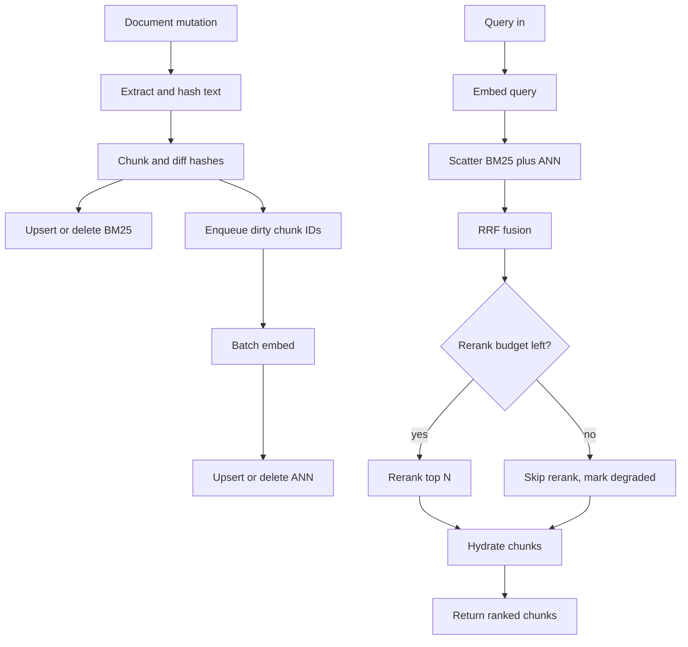

# RAG Pipeline at Scale — System Design
> - **Document Status**: Draft
> - **Last Updated**: 2026 Aug 29
> - **Author**: Paul Serban

This document is the mechanical *how* for the system described in the [Architecture Document](./02_architecture_document.md). It specifies chunking, dirty-chunk refresh, hybrid fusion, sharding and hedging, the millisecond budget, and production degradation detection. It does not specify code.

Working capacity numbers (50M docs → ~300M chunks, 1536-d float32) are **assumptions** until Phase 0 replaces them. Mechanics do not depend on the exact count; sizing does.

## 1. Control Flow

Two planes. Coupling them is how p99 dies (embed-on-read) or how freshness dies (rebuild-only, no incremental path).



**Invariant:** the query path never enqueues an embed. If the embed queue is behind, **freshness lag** goes red; the query still answers from whatever is searchable now.

## 2. Chunking

Chunking is a versioned compiler from document text to serving units. Changing it is a corpus migration, not a config tweak.

### 2.1 Algorithm (v1)

1. **Structure-aware split first.** Walk headings / markdown / HTML sections / PDF bookmark trees. Keep tables and fenced code blocks intact if they fit the token budget; if they do not, split on row/logical boundaries, not mid-cell.
2. **Token window fallback** for leftover prose: target **512–1024 tokens**, overlap **10–15%** (working default: 768 tokens, 96-token overlap). Overlap is recall insurance against a claim that sits on a boundary; it is also duplicate-embed cost. More than ~20% overlap at 300M chunks is how you buy a second cluster to store near-duplicates.
3. **Prepend a small breadcrumb** to each chunk (title + heading path + `doc_id`). Embeddings otherwise cannot see the section name. BM25 likes this too. Do not prepend the entire document.
4. **Do not semantic-chunk 50M documents in v1.** Semantic chunking (embed sentences, split on similarity breaks) makes chunking itself an embedding job. That is a second 300M-vector pipeline used as a preprocessor. Revisit only after structure-aware + window is measured.

### 2.2 Identifiers

```
chunk_id     = hash(doc_id, chunker_version, chunk_index, text_hash)
text_hash    = hash(normalized_chunk_text)
doc_version  = hash(extracted_text) or source version if trustworthy
```

- `chunk_index` is ordered within `(doc_id, doc_version, chunker_version)`.
- Unchanged `text_hash` ⇒ **do not embed**, even if `chunk_index` shifted, *if and only if* you also key the ANN/BM25 doc by `text_hash` or you re-bind IDs carefully. The simple, safer v1 rule: **identity is `chunk_id` as defined above**; a boundary shift that changes index or text produces new IDs and **deletes the old ones**. Safer for correctness; slightly more re-embed on harmless reflows. Prefer correctness. Optimize later with a "same text_hash, new index → retarget ID" map if waste rate is high.

### 2.3 What chunking will not fix

- A PDF extractor that returns page soup. HNSW will index soup.
- ACL metadata missing at ingest. Query-time regex on text is not an ACL.
- Questions that need whole-document reasoning. Retrieval returns chunks; if the answer is a table plus a footnote three pages away, either the breadcrumb+overlap caught it or the generator will hallucinate the footnote. Multi-hop retrieval is out of v1.

## 3. Embedding Refresh

### 3.1 Change detection

On mutation:

1. Fetch raw; store immutable object.
2. Extract text with a pinned extractor version; compute `text_hash`.
3. If `text_hash` equals last live version: **stop**. Metadata-only changes (rename, ACL) update the chunk store / filters without re-embed unless ACL is baked into the embedding (it must not be).
4. Else run chunker; diff `text_hash` sets:
   - **new hashes**: insert chunks, enqueue embed.
   - **same hashes**: keep; do not enqueue.
   - **missing hashes**: tombstone `chunk_id` in chunk store, BM25, and ANN.

Deletes of a whole document are the missing-hash case for every chunk.

### 3.2 Incremental vs full rebuild

| Trigger | Path |
| --- | --- |
| Single-doc edit/delete | Incremental diff, §3.1 |
| Burst of edits (crawler catch-up) | Same path; queue depth absorbs; freshness lag rises — this is the SLO working, not a reason to switch to full rebuild |
| New `chunker_version` | **Full re-chunk** from lake, new IDs, new BM25 corpus, new ANN generation. Old generation stays until cutover. |
| New embedding model / dim / similarity | **Full re-embed** of current chunks into generation N+1. Do not re-chunk unless the chunker also changed. |
| Quantization / HNSW parameter change | Rebuild ANN from stored float vectors if you kept them; otherwise re-embed or re-quantize from a stored full-precision sidecar. **If you discarded float32, a graph-parameter change can force re-embed.** Keep a cheap full-precision or int8 sidecar if rebuilds should not hit the model API again. |

**Decision rule:** if > ~20–30% of chunks would be dirty in a week of incrementals (threshold to calibrate), inspect whether the extractor is unstable (PDF jitter) rather than jumping to daily full rebuilds. Unstable extraction is the usual silent full-rebuild.

### 3.3 Queue and backpressure

- One queue for incremental dirty IDs (high priority).
- One queue for generation-build batches (bulk, preemptive, lower than incremental *except* during a scheduled cutover freeze).
- Failed embeds stay dirty with a retry budget; poison messages go to a dead-letter with an operator metric (`chunks_not_searchable`).
- **Never block the source connector on embed capacity.** Dropping change events loses the freshness clock. Buffer mutations; shed *build* work first.

### 3.4 Throughput math (working example)

300M chunks, 400 tokens average, 1,000 embeds/s:

- Full re-embed: `300e6 / 1000 = 300,000 s ≈ 3.5 days` of saturated workers, **plus** ANN bulk-load, **plus** BM25 reindex if chunker changed.
- 1% of docs change/day, 6 chunks/doc, 50% of those hashes actually change: `50e6 × 0.01 × 6 × 0.5 = 1.5e6` embeds/day ≈ **25 minutes** at 1,000/s. Feasible. If Phase 0 shows 10% daily change with 80% hash churn (bad extractor or hot corpus), you need a bigger fleet or a worse freshness SLO.

Cost: treat as `tokens × price` for APIs, or `GPU-hours × rate` for self-host. Quote both **dollars** and **calendar days**. Operators page on days.

### 3.5 Blue-green generation swap

See [ADR-005](./04_architecture_decision_records.md#adr-005). Mechanics:

1. Build generation N+1 to completion (coverage ≥ prod coverage minus a tiny epsilon).
2. Shadow: duplicate a sample of prod queries to N+1; record rank overlap@k, golden-set delta, stage latency.
3. Flip routing atomically on the query service (`active_generation = N+1`).
4. Keep N on replicas for a rollback window (hours to a few days — RAM is burning).
5. Destroy N.

**Forbidden:** writing N+1 vectors into N's HNSW. Different model ⇒ different space. The index will happily return neighbors. They will be wrong.

## 4. Hybrid Retrieval and Fusion

### 4.1 Per-query procedure

1. Normalize query (same analyzer family as BM25; do not over-stem queries for code/IDs).
2. Embed query with the **active** generation's model (cache by `hash(generation_id, normalized_query)`).
3. In parallel, with a shared parent deadline:
   - BM25: `topK_s` per shard (working: K_s = 50–100).
   - ANN: `topK_d` per shard (working: K_d = 50–100).
4. Merge shard lists inside each modality (standard distributed top-K).
5. Fuse the two modality lists with RRF.
6. Take fused top-N for rerank (working: N = 20–50).
7. Hydrate.

Filters (tenant, ACL, `doc_type`) apply **inside** each shard query, not as a post-filter on an unfiltered top-K. Post-filtering a global top-K is how tenant B receives nothing because tenant A's neighbors ate K.

### 4.2 Reciprocal Rank Fusion

For each chunk `c` appearing in any list `i`:

```
RRF(c) = Σ_i 1 / (k + rank_i(c))
```

Working `k = 60` (standard; not a magic quality knob — changing k is a ranking experiment, gated like a model change).

Ranks are **1-based** within that modality's merged list. A chunk only in BM25 still scores `1/(k + rank_bm25)`. That is the point: lexical-only hits survive.

**Worked example** (`k = 60`):

| chunk | BM25 rank | ANN rank | RRF |
| --- | --- | --- | --- |
| A | 1 | 5 | 1/61 + 1/65 ≈ 0.0318 |
| B | 4 | 1 | 1/64 + 1/61 ≈ 0.0320 |
| C | 2 | — | 1/62 ≈ 0.0161 |
| D | — | 2 | 1/62 ≈ 0.0161 |

B slightly beats A despite A winning BM25. C (an ID match the vector smeared away) still outranks the long tail of either list. Weighted cosine+BM25 would have required a coefficient that is wrong next Tuesday.

### 4.3 Why not a weighted sum

BM25 scores are corpus- and query-length dependent; cosine/IP scores shift with model, quantization, and index health. Min-max normalizing each list per query is slightly less bad and still brittle (one outlier neighbor crushes the scale). RRF ignores magnitudes. You give up a "calibrated relevance score" — you never had one.

If a later phase trains a learning-to-rank model on `{bm25_rank, ann_rank, bm25_score, ip, ...}`, that model is a new generation with its own eval. It does not sneak in as a YAML weight.

### 4.4 Rerank

- Cross-encoder over `(query, chunk_text)` for fused top-N only.
- Batch on GPU; cap sequence length (chunk already bounded).
- **Hard cap N.** Doubling N roughly doubles rerank latency and cost; recall gains go concave fast.
- Skip rerank when: remaining budget < measured p99 rerank; or fused lists empty; or a kill-switch. Skipping is **degraded**, metriced, not silent.
- Do not rerank 200 chunks "to be safe." That is how the SLO becomes 2 s while quality people argue about 0.02 nDCG.

## 5. Sharding and Tail Latency

### 5.1 Shard key (v1)

**Hash(`chunk_id`) modulo S**, or hash(`doc_id`) so a document's chunks colocate (better for per-doc deletes; slightly worse load balance if docs are huge).

v1 does **not** use semantic routing ("query this topic shard only"). A routing miss is a silent recall hole. Tenant *isolation* may use separate physical indexes for noisy-neighbor and ACL reasons; that is tenancy, not semantic sharding.

### 5.2 Scatter-gather tails

If each shard's latency `L_i` is i.i.d., the gather waits on `max(L_1..L_S)`. p99 of the max is much worse than p99 of one shard. Beyond modest S, adding shards to "make ANN faster" **increases** query p99.

Mitigations (required, not optional extras):

1. **Per-attempt deadline** (e.g. 40–80 ms) so one sick shard does not eat the 1000 ms SLO.
2. **Hedged requests**: if a replica has not responded by p95 of that shard, query a second replica. Hedging costs QPS; it buys tail.
3. **Degraded omit**: if the deadline fires, return without that shard and set `partial=true`. Better a slightly worse list than a client timeout. Track `queries_partial_shard`.
4. **Bound S** so that even with hedges, the gather budget in [§6](#6-latency-budget) holds. If a replica's graph no longer fits, **quantize harder or add memory**, then shard. Shard last.

### 5.3 Replicas vs shards

- **Replicas**: more QPS, HA, hedging targets. Same recall. First knob for read traffic.
- **Shards**: fit memory, more fan-out, worse tails, more operational objects. Knob for working set, not for QPS.

### 5.4 Quantization

Scalar int8 or PQ on the payload. Expected: large RAM win, small-to-moderate recall@k hit. **Measure on the golden set before and after.** Quantization is the actual alternative to "more shards," not a micro-optimization.

Store a full-precision sidecar if you can afford disk: parameter experiments should not require the embed fleet.

## 6. Latency Budget

SLO: **retrieval p99 < 1000 ms** at the query service. Generation is excluded.

Working ledger (calibrate with tracing in Phase 2; these are *allocations*, not measurements):

| Stage | p50 target | p99 allocation | Notes |
| --- | --- | --- | --- |
| Auth + parse + cache lookup | 2 ms | 10 ms | |
| Query embed (local, cached miss) | 15 ms | 60 ms | Remote API: often already fatal to this SLO; cache hard or localize |
| BM25 scatter-gather | 15 ms | 80 ms | Including hedge |
| ANN scatter-gather | 20 ms | 100 ms | Parallel with BM25; wall clock ≈ max(BM25, ANN) |
| RRF | <1 ms | 5 ms | |
| Rerank N=32, batched GPU | 20 ms | 120 ms | **Dominant controllable cost** |
| Hydrate chunk store | 5 ms | 40 ms | Chunk store must be a DB/KV, not S3 GET of PDFs |
| Serialization | 2 ms | 15 ms | |
| **Slack for covariance / GC / noisy neighbor** | | **~400+ ms** | If you spend the slack in rerank N, you have no SLO, you have a hope |

Wall clock of parallel stages is the max, not the sum. The table still adds because embed, gather, rerank, and hydrate are sequential.

**Where margin actually lives:** keep N small, keep query embed local+cached, keep hydrate off object storage, hedge shards, **do not grow S casually**.

If Phase 0 QPS is high enough that rerank GPUs queue, p99 becomes queueing delay. Scale rerank horizontally or skip rerank under load (explicit degraded mode) rather than letting a queue form.

## 7. Production Retrieval-Degradation Detection

Offline eval (a frozen corpus, a frozen 200–2000 query set, a notebook) is a **release gate**. It does not observe:

- corpus drift (new product names, new incident types),
- query-mix drift,
- extractor/chunker regressions,
- missed deletes / stale chunks,
- quantization or compaction recall loss,
- a slow shadow generation that nobody compared.

Shipping with eval-only quality is how you learn about degradation from Twitter.

### 7.1 Signals (required)

Each signal has a owner, a dashboard, and a page-worthy SLO or anomaly rule. None are "the data science team will look weekly."

**1. Freshness lag**
- Definition: `searchable_at - source_mutated_at` for a sampled mutation, separately for BM25 and ANN (they can diverge).
- p50 / p99. Alert if p99 exceeds the product SLO (e.g. 15 min) or if BM25≪ANN lag (embed queue stuck).

**2. Coverage**
- `% of live source docs with ≥1 chunk in both indexes` for the active generation.
- `% of chunk_ids in chunk store with a vector in active ANN` (embed holes).
- Alert on drop after deploys and on a slow leak (failed deletes vs failed inserts look different — keep both counters).

**3. Empty / low-confidence retrieval rate**
- Fraction of queries with 0 hits after filters; fraction whose fused top-1 RRF or rerank score is below a floor.
- Slice by tenant and query class if possible. A global average hides a dead shard for one tenant.

**4. Score-distribution drift**
- Rolling histogram of top-1 IP/cosine and top-1 BM25.
- Alert on mean/quantile shift vs a 7-day baseline (PSI or a simpler percentile band). A compaction bug, bad deploy, or unnormalized queries show up here before humans do.

**5. Embedding-space drift**
- Sample query vectors vs a sketch of corpus centroid / random doc vectors (same generation).
- Sudden move: query embedder mismatch (wrong model on query path — this happens). Slow move: query mix or corpus theme change; investigate, don't auto-page at 3 a.m. unless coupled to quality proxies.

**6. Continuous golden queries against prod**
- A living set: some frozen regression questions, some refreshed from recent real queries with human or high-confidence labels, some **synthetic probes** for known IDs/codes (the BM25-must-win set) and for recent edits (the freshness-must-win set).
- Run on a clock (e.g. every 5–15 min, rate-limited) **through the production query service**, not a private index. Record hit@k, rank of expected `chunk_id`/`doc_id`.
- A model/index deploy that fails this set does not complete cutover.

**7. Shadow / canary comparison**
- For generation N+1: overlap@k vs N, golden delta, per-stage latency.
- Cutover requires overlap and golden within a band **and** p99 not worse than a budget. "Neighbors look plausible" is not a gate.

**8. Downstream proxies** (imperfect, still required)
- Generator abstention / "I don't know" rate, citation click-through or explicit thumbs, groundedness checker failures, user re-query within T seconds.
- These move for prompt and model reasons too. **Never** sole-page on them. Use as corroboration when retrieval metrics move, and as a tripwire to start a retrieval investigation when they move alone.

### 7.2 What not to do

- Do not A/B the embedding model on 2% of traffic **in the same graph**.
- Do not wait for the quarterly eval refresh to notice a dead refresh worker.
- Do not use LLM-as-judge on 100% of prod queries as the SLO — cost, latency, and the judge drifting. Sample it.
- Do not alert on raw QPS of embeds; alert on **lag and holes**.

### 7.3 Incident clustering (so the runbook is obvious)

| Symptom | First suspects |
| --- | --- |
| Latency red, quality flat | Rerank queue, shard tail, hydrate, query-embed cache miss storm |
| Quality red, latency green, freshness red | Embed/delete queue, source connector, extractor crash-loop |
| Quality red, freshness green, score histogram shifted | Wrong query model, mixed generation, quantization/rebuild, analyzer change |
| ID/code questions fail, semantic questions fine | BM25 down, analyzer too aggressive, hybrid accidentally vector-only |
| Semantic questions fail, ID questions fine | ANN generation, query embed, quantization |
| One tenant empty | Filter bug, that tenant's shard, ACL mapping |
| Golden set fine, users furious | Query-mix drift; golden set is stale — this is [ADR-007](./04_architecture_decision_records.md#adr-007) justifying living queries |

## 8. Error Handling

- **Source fetch fail:** retry with backoff; document stays at last good version; lag metric includes time-in-error.
- **Extract fail:** mark doc `unsearchable`; do not index empty string (empty string nearest-neighbors are a special hell).
- **Embed fail:** chunk remains dirty; not searchable in ANN; BM25 may already have it (hybrid still helps). Metric: `chunks_sparse_only`.
- **Index upsert fail:** retry; do not ack the queue item.
- **Query shard timeout:** hedge, then omit, then `partial=true`.
- **Rerank fail/timeout:** return fused list, `rerank_skipped=true`.
- **ACL/filter subsystem fail:** **fail closed** (empty or deny), never unfiltered search.
- **Wrong generation on query embed:** detect via `model_id` mismatch checksum at process start and on each model load; this bug looks like "sudden quality death with healthy indexes."

## 9. Observability Minimum

If these do not exist, the system is not in production; it is a demo that got traffic.

- Per-stage latency histograms (embed, BM25, ANN, rerank, hydrate) with p50/p95/p99.
- `active_generation`, shadow generation, replica counts, shard counts, RSS per ANN pod.
- Queue depth, embeds/s, dirty age, `chunks_not_searchable`, `chunks_sparse_only`.
- Freshness lag, coverage, empty-result rate, golden hit@k.
- `queries_partial_shard`, `rerank_skipped`, hedge rate.
- Delete counts vs upsert counts (refresh correctness).

Logs of query text and chunk text are **sensitive**. Sample, retain short, ACL the observability store like the corpus.

## 10. Caching (narrow)

Allowed:

- Query embedding cache keyed by `(generation_id, normalized_query)`.
- Optional result-ID cache for identical queries with **ACL in the key**, low TTL (seconds to a minute). Freshness SLO must still be honoured — a 15-minute result cache silently violates a 15-minute freshness target.

Forbidden:

- Caching unfiltered results and filtering in the app.
- Caching across generation cutover without busting the key.
