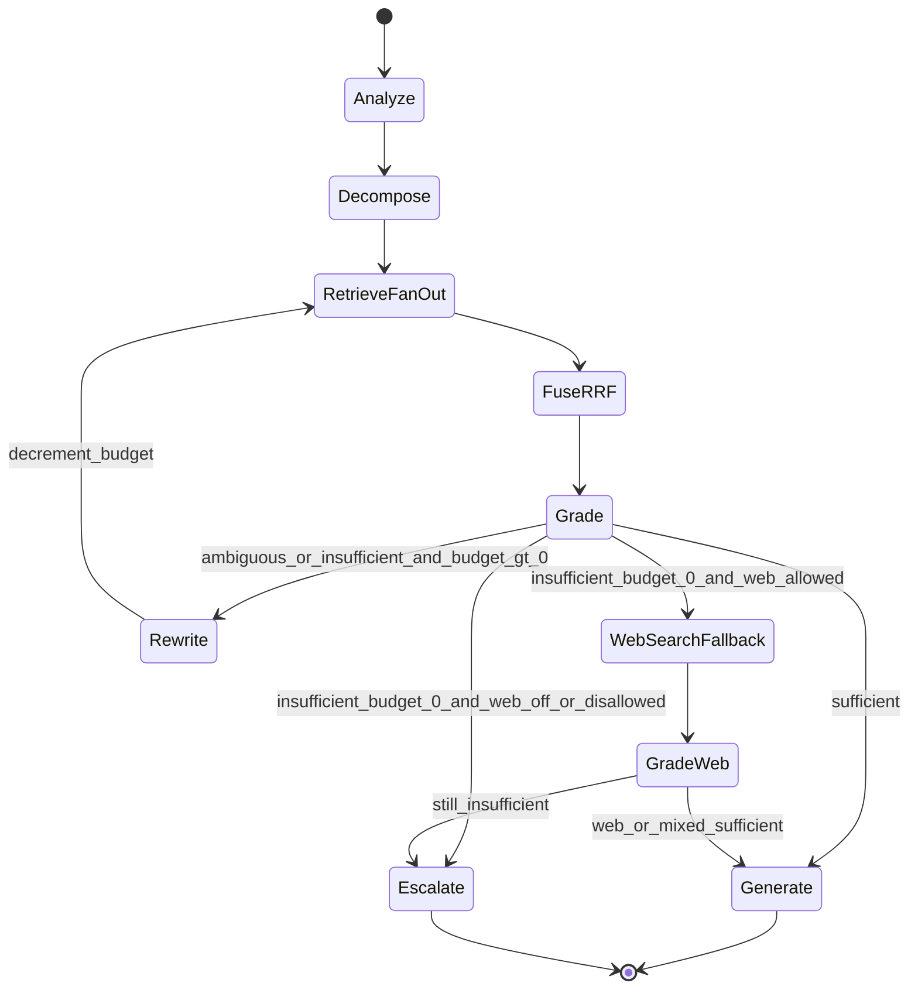
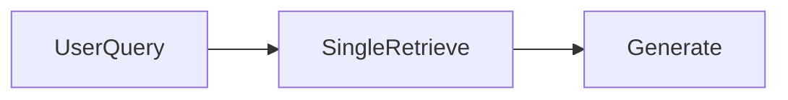
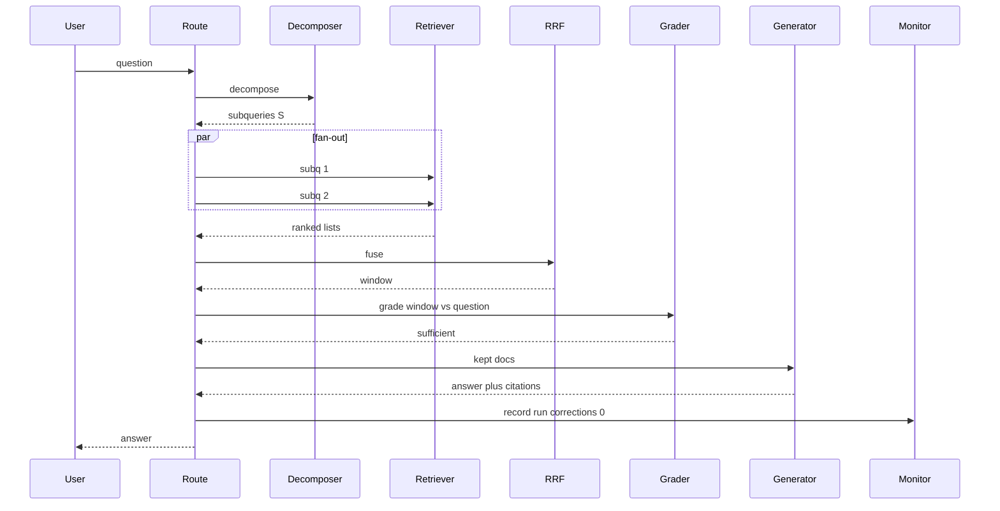
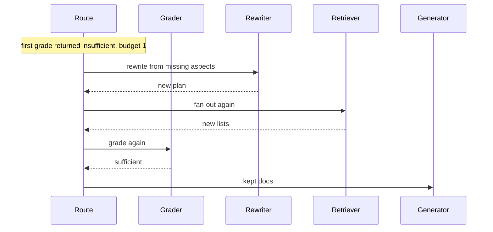
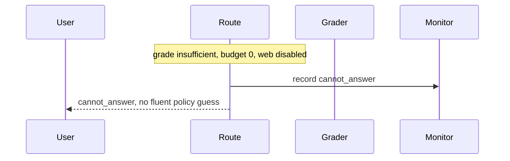

# Multi-Query & Corrective RAG — Architecture Document
> - **Document Status**: Draft
> - **Last Updated**: 2026 Aug 29
> - **Author**: Paul Serban

A request-scoped **state machine** over decompose, retrieve, fuse, grade, and (at most once) correct, with generate allowed only from graded-sufficient context and an honest refuse when the bound is exhausted. The retriever is a dependency; the index is not redesigned here. This document covers *what* the system is and *why* it is shaped this way; see [System Design](./03_system_design.md) for *how* RRF, grading, and the iteration bound actually work, and [Trade-offs and Honest Assessment](./05_tradeoffs_and_honest_assessment.md) for what that loop costs.

## Overview

**Brief description**: Retrieval-quality control flow, scoped narrowly: notice insufficient context *before* generation, try a bounded different retrieval, then generate or give up. It is not a vector database, not a hallucination detector on the completion, and not an unbounded agent.

**Business Context**
- See [Scenario and Requirements](./01_scenario_and_requirements.md) for the full framing. In short: single-pass RAG is open-loop. Multi-hop and ambiguous questions need more than one retrieval target. Topically similar chunks are not sufficient chunks. Missing documents do not appear because you retrieve twice. "Self-heal" is therefore redefined as a **typed grade plus a capped correction**, measured as rates and a cost multiplier.
- Target users: owning engineer, on-call, product, security/compliance. The employee consumes an answer plus provenance, or a refuse.

## Requirements

### Functional Requirements

- **Analyze / decompose**: for each request, produce a bounded list of sub-queries (possibly one). Structured output. Cap enforced in the graph, not hoped for in the prompt.
- **Fan-out retrieve**: one retriever call per sub-query, in parallel, against the internal index. Timeouts drop a sub-query's results; they do not block the request unbounded.
- **Fuse**: Reciprocal Rank Fusion across sub-query lists into a single candidate set. Cut to a grading window.
- **Grade**: structured per-document labels plus an aggregate verdict `sufficient` | `ambiguous` | `insufficient`. Unparseable grade ≠ sufficient.
- **Route**: on `sufficient`, generate from the kept docs. On `ambiguous` / `insufficient`, if correction budget remains, rewrite the query plan and re-enter retrieve. If budget is exhausted, take fallback or escalate.
- **Fallback**: optional web/broader search, policy-gated, provenance-tagged, then grade again (counts against the same honesty rules; does not reset an infinite loop).
- **Generate or refuse**: generate only from docs labeled relevant (or from a signed "partial coverage" policy). Otherwise `cannot_answer`.
- **Measure**: grade distribution, correction-trigger rate, fallback rate, refuse rate, realized latency/cost vs single-pass baseline, RAGAS-style context metrics.

### Non-Functional Requirements

**Performance Requirements:**
- Happy path latency is **not** one retrieve plus one generate. It is decompose + max(sub-query retrievals) + grade + generate. Grading is on the critical path. Anyone who quotes naive-RAG p95 as this system's p95 is lying or has skipped the grade node.
- Corrective path adds approximately another retrieve (fan-out) + another grade, plus a rewrite call. Working default of `max_corrections = 1` means the worst *internal* path is roughly **2× retrieve-and-grade**, plus two small LLM calls (decompose, rewrite), plus generate. Web fallback adds a third retrieval source and another grade.
- Fan-out multiplies retriever QPS by S (sub-queries), then again on correction. Capacity planning uses S × (1 + corrections_triggered_rate), not 1.

**Reliability Requirements:**
- **A single sub-query timeout must not fail the request** if other sub-queries returned. Fuse what you have; if the fused set is empty, that is `insufficient`, not a 500.
- **A failed grade parse must not emit a fluent answer from ungraded context.** Conservative branch.
- **The graph must not loop past `max_corrections`.** A bug that re-enters retrieve without decrementing the budget is an incident, not "thoroughness."
- **The system must not degrade into generate-anyway under load.** Load shedding drops or queues requests; it does not skip the grade node to "keep p95 green."

**Infrastructure Constraints:**
- Illustrative: LangGraph (or equivalent explicit graph runtime) for control flow; LangChain or LlamaIndex retriever adapters; existing hybrid index; RAGAS or equivalent for eval; optional third-party search API for fallback.
- This project does **not** include training a custom grader model as v1. The grader is an LLM call with a schema. If Phase 2 calibration shows it cannot beat a coin flip against labels, do not proceed to Phase 3 — a miscalibrated branch condition is worse than a chain.

**The defining constraint:**
- A linear chain cannot observe insufficiency and change retrieval. The architecture is: **stop treating retrieve as a function that returns "the context"; treat it as a step whose output is *graded* before anyone generates.**

## Executive Summary

The system is a **stateful control-flow graph**. The scarce resource on the naive path was *unobserved retrieval failure*. The new path spends a decompose call and S retrievals to cover multi-target questions, spends a grade call to look at the fused set, and spends at most one more retrieve-grade cycle (and optionally web) before it is willing to speak.

**Architecture Style:** Bounded state machine (LangGraph-shaped) over retrieval. Not a chain. Not an unbounded ReAct agent. Not "add k."

**Key Components:**
- **Query Analyzer / Decomposer**: structured sub-query list, cap S.
- **Retrieval Fan-Out**: parallel internal retriever calls.
- **RRF Fusion**: rank-based merge, no shared score calibration required.
- **Relevance Grader**: per-doc + aggregate structured verdict.
- **Corrective Router**: the only place edges are chosen; owns the iteration budget.
- **Query Rewriter**: produces a new plan from the grade (what's missing, too broad, wrong entity).
- **Web / Broader-Search Fallback**: optional, policy-gated connector.
- **Generator**: completion from kept docs only.
- **CRAG Monitor**: rates, multipliers, eval.

**Technology Stack (illustrative):**
- Control flow: LangGraph (explicit nodes/edges, checkpoint optional, not required in v1).
- Retrievers / chunk access: LangChain or LlamaIndex adapters over the existing index.
- Fusion: RRF in-process (a formula, not a product).
- Grading and decompose/rewrite: provider structured output.
- Eval: RAGAS (context precision, context recall, and later faithfulness — faithfulness is out of *this* system's SLO but useful as a guardrail that CRAG did not make generation worse).
- Fallback: a search API the company already vendors, or none.

**Architecture Principles:**
- **Grade before generate.** If you needed the answer to know the context was bad, you already paid the wrong bill.
- **Branch on typed verdicts, not on prose.** "The documents seem somewhat related…" is not an edge label.
- **Bound the loop.** Correction is a budgeted retry with a *different* query, not a personality.
- **Fallback is a source change, not a retry.** Web search is not "internal retrieval again with extra steps."
- **Refuse is a successful handling of insufficiency.** Fluent empty-context answers are the defect.
- **Measure the tax.** Decomposition, fan-out, grade, correction are not "just RAG."

**Key Architectural Decisions:**
1. **State machine (LangGraph) over a linear RAG chain.** [ADR-001](./04_architecture_decision_records.md#adr-001).
2. **Multi-query decomposition + parallel fan-out.** [ADR-002](./04_architecture_decision_records.md#adr-002).
3. **RRF for fusion over score-normalization merge.** [ADR-003](./04_architecture_decision_records.md#adr-003).
4. **Structured relevance grading as the branch condition.** [ADR-004](./04_architecture_decision_records.md#adr-004).
5. **Bounded corrective loop with explicit fallback and explicit give-up.** [ADR-005](./04_architecture_decision_records.md#adr-005).
6. **Web/broader search as a designed fallback, not a first choice.** [ADR-006](./04_architecture_decision_records.md#adr-006).
7. **Continuous RAGAS-style evaluation as a production/shadow signal.** [ADR-007](./04_architecture_decision_records.md#adr-007).

### Context Diagram

```mermaid
flowchart LR
    user[EmployeeOrBot]
    api[KbAnswerRoute]
    graph[CragStateMachine]
    idx[InternalRetriever]
    web[WebSearchApi]
    llm[LLMProvider]
    mon[CragMonitor]
    eval[RagasEval]

    user --> api
    api --> graph
    graph --> idx
    graph --> web
    graph --> llm
    graph --> mon
    eval -.-> mon
    graph --> user
```

The LLM provider is used for decompose, grade, rewrite, and generate — four *roles*, not necessarily four models. The internal retriever is the system of record for default answers. Web search is an optional, later node. The monitor is how "self-heal" becomes a rate.

### Target path — the state machine

This is the centerpiece. Every later sequence is a walk on this graph.



`GradeWeb` is the same grader with a `source_type` on each doc. It is drawn separately so "web results skip grading" cannot hide in the happy-path picture. They do not skip grading.

### Naive chain (what this replaces)



No observation. No second retrieval. No refuse distinct from a 500.

## Runtime Architecture

1. **Analyze / decompose layer** (one small structured LLM call, or a heuristic skip): produce `QueryPlan` with 1..S sub-queries. Simple lookups should often emit S=1. If the decomposer always emits 4, you are taxing every Wi-Fi-password question; fix the prompt, do not "optimize later."
2. **Retrieve layer** (latency ≈ slowest sub-query, plus tail): S parallel searches. Each returns a ranked list.
3. **Fuse layer** (milliseconds): RRF, cut to `grade_window` (working default 10).
4. **Grade layer** (one structured LLM call on the window, batched — not 10 serial calls in v1): per-doc labels + aggregate verdict.
5. **Correct layer** (0 or 1 extra cycle internally): rewrite from the grade's "what's missing," decrement budget, re-enter retrieve. Router is the only node allowed to send traffic backward.
6. **Fallback layer** (0 or 1): web search if policy allows and internal budget is spent.
7. **Generate or escalate layer**: completion from kept docs, or `cannot_answer`.
8. **Monitor layer** (async): write `RagRun`; increment rates.

Once retrieval is graded, "just add a reranker" **stops being the architecture**. A reranker can still sit *inside* the retrieve node as an implementation of "better first list." It does not replace the grade edge.

### Happy path vs one correction vs refuse



One correction cycle:



Budget exhausted, web off:



**Forbidden terminal:** generate from the first fused window after the grader said `insufficient`, because the user is waiting. That is sample #1 wearing a RAG costume.

## Components

### 1. Query Analyzer / Decomposer
**Purpose**: Turn one user string into a bounded retrieval plan so multi-target questions are not one averaged embedding.

**Responsibilities:**
- Emit a structured `QueryPlan`: original question, sub-queries[], optional complexity label (`simple` | `comparative` | `multi_hop` | `ambiguous`).
- Cap S (working default 4). Truncate deterministically if the model emits more; log `decompose_cap_hit`.
- Collapse to S=1 when the question is a simple lookup. Always-decompose-to-4 is a cost bug.
- Do not retrieve. Do not generate an answer.

**Interactions:**
- Calls: LLM structured output (or a cheap heuristic: skip LLM if length/entity count is below a threshold — allowed as an optimization *after* Phase 0 shows simple queries dominate; not a v1 requirement).
- Writes: `QueryPlan` onto graph state.

### 2. Retrieval Fan-Out
**Purpose**: Execute the plan against the internal index in parallel.

**Responsibilities:**
- One retriever invocation per sub-query. Same index, same k (working default k=20 per sub-query *before* fusion — this is not the context window; fusion will cut).
- Per-call timeout. Timed-out sub-query → empty list, not a hung graph.
- Attach `subquery_id` to every hit so fusion and grading know why the doc was pulled.
- No live tools the model invented. The graph calls the retriever; the LLM does not.

**Interactions:**
- Calls: internal retriever (hybrid BM25+dense assumed).
- Writes: `RetrievalResult[]` per sub-query.

### 3. RRF Fusion
**Purpose**: Merge heterogeneous ranked lists without pretending their scores are in one unit.

**Responsibilities:**
- Reciprocal Rank Fusion: `score(d) = Σ 1 / (k_rrf + rank_i(d))` over lists that contain d. Working `k_rrf = 60` (standard; tune in Phase 1, do not bike-shed in architecture review).
- Deterministic tie-break (e.g. lower chunk_id).
- Cut to `grade_window` (working default 10). Docs below the cut are not graded and not sent to the generator. If you need them, you needed a better retrieve, not a larger paste.
- Optional: drop exact-duplicate chunk ids before grading (the same chunk retrieved by two sub-queries should appear once; RRF already boosted it).

**Interactions:**
- Reads: retrieval lists.
- Writes: `FusedCandidate[]`.
- No LLM. Pure function.

### 4. Relevance Grader
**Purpose**: Be the observation the chain did not have.

**Responsibilities:**
- For each fused candidate, emit `relevant` | `irrelevant` | `ambiguous` relative to the *original* user question (not only the sub-query — a doc can match a sub-query and still not help the user's actual ask).
- Emit aggregate `verdict`: `sufficient` | `ambiguous` | `insufficient`, plus optional `missing_aspects[]` (short strings the rewriter will consume).
- **Working aggregate rule** (product may tighten): `sufficient` iff at least `min_relevant` docs are `relevant` (working default 2) **and** no required aspect in `missing_aspects` is still empty. Comparative questions should list both poles as aspects at decompose time so "we found 2025 but not 2024" cannot grade sufficient. See [System Design](./03_system_design.md).
- Batched in **one** structured call over the window in v1. Per-doc serial grading is N extra round-trips; reject it unless Phase 2 proves batch grading is uncalibrated.
- Parse failure → `verdict=ambiguous` if budget remains, else treat as insufficient (never as sufficient).

**Interactions:**
- Calls: LLM structured output.
- Writes: `GradeResult`.
- Does not generate the user-facing answer.

### 5. Corrective Router
**Purpose**: The only node that chooses edges. Owns `corrections_remaining`.

**Responsibilities:**
- `sufficient` → Generate (kept docs = those labeled `relevant`; optionally include `ambiguous` docs if product signed "partial context OK" — default **exclude** ambiguous from the generator prompt).
- `ambiguous` or `insufficient` AND `corrections_remaining > 0` → Rewrite, then RetrieveFanOut, decrement **before** re-entry (so a rewrite bug cannot loop).
- Else if web enabled and question policy allows → WebSearchFallback.
- Else → Escalate.
- Never: Generate on insufficient "just this once." Never: increment the budget.

**Interactions:**
- Reads: `GradeResult`, `corrections_remaining`, route flags.
- Writes: next node; decremented budget.

### 6. Query Rewriter
**Purpose**: Spend the one internal correction on a *different* plan, not the same query louder.

**Responsibilities:**
- Input: original question, previous plan, grade (`missing_aspects`, irrelevant-heavy window).
- Output: new `QueryPlan` (still capped at S). Strategies: broaden, narrow to a missing entity, split a remaining conjunct, add a date/version constraint the first plan missed.
- Forbidden: emit the identical sub-query list. If the model does, the router should detect equality and skip to fallback/escalate rather than pay another retrieve for the same lists.

**Interactions:**
- Calls: LLM structured output.
- Writes: replacement `QueryPlan`.

### 7. Web / Broader-Search Fallback
**Purpose**: Change **source** when the internal index cannot satisfy the grade.

**Responsibilities:**
- Call only from the router, only if `web_fallback_enabled` and the question is in an allowed class (no HR-PII / embargo flags — those flags are deterministic metadata on the route/user, not an LLM guess in v1).
- Retrieve a small k (working default 5). Tag every hit `source_type=web`.
- Do not mix into the internal index. Pass to grading as a new window (optionally union with any leftover internal `relevant` docs — default: grade web window separately, then optionally merge kept docs).
- Failures (API 429, timeout) → Escalate, not Generate from stale internal insufficient set.

**Interactions:**
- Calls: search API.
- Writes: `RetrievalResult` with source tags.

### 8. Generator
**Purpose**: Answer from kept context, or not at all.

**Responsibilities:**
- Prompt contains only kept docs (relevant; plus ambiguous only if signed).
- Citations carry `chunk_id` and `source_type`.
- If kept set is empty → refuse even if the router made a mistake. Belt and suspenders.
- This node is **not** the grader. Do not ask it "if you cannot answer, search again." Searching is not its job.

**Interactions:**
- Calls: LLM completion (prose, possibly with a citation schema).
- Writes: answer text.

### 9. Escalator
**Purpose**: Honest terminal.

**Responsibilities:**
- Return `cannot_answer` with a stable code: `insufficient_internal`, `web_disallowed`, `web_failed`, `grade_parse_exhausted`.
- Do not include a guessed policy paragraph "to be helpful."
- Optional: queue for human / doc-request if the product has that path.

### 10. CRAG Monitor
**Purpose**: Make "we self-heal" a graph, not a story.

**Responsibilities:**
- Per route: `decompose_s`, `grade_verdict` counts, `correction_trigger_rate`, `fallback_trigger_rate`, `refuse_rate`, `identical_rewrite_skip_rate`, latency breakdown (decompose, retrieve_1, grade_1, rewrite, retrieve_2, grade_2, web, generate), token cost vs a hypothetical single-pass baseline.
- Shadow or batch RAGAS context precision/recall on a labeled slice.
- Alert on correction_trigger_rate going to ~100% (everything is "healing" → the first retrieve is broken or the grader is always hungry) and on refuse_rate drowning the human queue.
- Do not page on "the graph took the correction edge." That is the system working. Page on the rates leaving the band Phase 0 named.

### Communication Patterns

**Synchronous:**
- Caller ↔ route: one request / one response (answer + provenance, or cannot_answer).
- Graph ↔ retriever: S parallel searches, twice if corrected.
- Graph ↔ LLM: decompose, grade, optional rewrite, optional second grade, generate.
- Graph ↔ web API: 0 or 1.

**Asynchronous:**
- Monitor / audit sink.
- RAGAS batch eval.
- Human doc-request queue.

There is no asynchronous "keep searching in the background and patch the answer later" in v1. That is a different product (async research agent).

## Scaling Strategy

**Current Scale Requirements:**
- Human-paced QPS on an internal KB (tens to low hundreds of QPS at the high end). S≤4, `max_corrections=1`. This is not a batch-enrichment firehose. If it becomes one, fan-out × correction will dominate the retriever and the LLM bill; do not silently keep S=4.

**What scales horizontally:**
- Graph workers. Each request owns its own state. No shared correction state between requests.

**What does not:**
- Retriever QPS: multiplied by S and by correction rate.
- LLM RPM/TPM: decompose + grade on every request, rewrite+grade on a fraction, generate always (except refuse).
- Web API quotas, if enabled.
- Grader quality: scaling QPS does not calibrate a bad grader.

**If QPS grows:**
- Skip decompose LLM on simple queries (heuristic), S=1.
- Skip grade on high-confidence first retrieve only if you have a **non-LLM** signal you trust (e.g. exact title match + BM25 above a validated threshold). Do not skip grade because p95 looks bad; that is deleting the architecture to save the SLO.
- Lower S if Phase 1 showed S=2 captures the win.
- Do **not** raise `max_corrections` to "make quality scale."

**Bottleneck Analysis:**
- Primary: grade LLM call on the critical path; then the slower of (retriever tail of S, decompose).
- Secondary: corrective path p95 (the users who *need* CRAG pay 2×); this is the latency tax the scenario asked you to discuss.
- Tertiary: RRF CPU. If fusion is your bottleneck you have built something else wrong.

### Latency / cost tax by path

Working illustration for `kb.answer_question`. Numbers are **order-of-magnitude relative to baseline** `1R + 1G` (one retrieve, one generate). They are not a quote.

| Path | LLM calls | Retriever calls | Approx latency vs baseline | When it happens |
| --- | --- | --- | --- | --- |
| Baseline naive RAG | 1 generate | 1 | 1.0× | What you have today |
| Happy CRAG, S=1 | decompose + grade + generate | 1 | ~1.4–1.8× (two extra small/medium LLM calls) | Simple lookup, first pass sufficient |
| Happy CRAG, S=3 | decompose + grade + generate | 3 parallel (wall ≈ 1 retrieve) | ~1.5–2.0× | Comparative, first pass sufficient |
| One internal correction, S=3 | + rewrite + grade2 | + 3 parallel | ~2.5–3.5× | First grade insufficient |
| + web fallback | + grade3 | + 1 web | ~3–4.5× | Internal still insufficient |
| Unbounded agent (rejected) | unbounded | unbounded | unbounded | How demos die in prod |

The tax is worth paying when a wrong-context answer is an incident (policy, legal, safety) **and** Phase 0 shows first-pass insufficiency is common enough on the mix that the extra calls buy measured context-recall, **and** product signs the p95 of the corrective path. It is not worth paying as a default wrap on every company prompt.

## Data Architecture

### Data Model

**Key Entities:**
- **QueryPlan**: request_id, original_question, sub_queries[], complexity, s.
- **SubQuery**: id, text, parent_plan.
- **RetrievalResult**: subquery_id, ranked hits (chunk_id, rank, score opaque, source_type).
- **FusedCandidate**: chunk_id, rrf_score, contributing_subqueries[], source_type.
- **GradeResult**: per_doc labels, verdict, missing_aspects[], parse_ok.
- **CorrectionAttempt**: index (0..max-1), previous_verdict, new_plan_id, identical_to_previous.
- **RagRun**: terminal (`answered` / `answered_after_correction` / `answered_with_web` / `cannot_answer`), counts, latencies, tokens, grade verdicts.
- **KeptContext**: chunk_ids actually sent to generate.

**Entity Relationships:**
- One request → one (or two) QueryPlan → S RetrievalResults → one fused window → one GradeResult per retrieve-grade cycle → zero or one web cycle → one terminal.

### Data Lifecycle

**Create**: plan at decompose; hits as they return; fusion and grade at end of each retrieve cycle; run record at terminal.

**Read**: rewriter reads previous plan + grade; generator reads kept context; support reads a run to explain a refuse or a web citation.

**Update**: `corrections_remaining` decrements. Plans are replaced, not mutated in place (keep history on the run).

**Delete**: query text and chunks retained per PII/audit policy. Web snippets often have shorter retention and stricter sharing rules.

## Cost Analysis

### Cost Components

**Money:**
- LLM: decompose input/output (small) + grade input (**the window of chunks is the expensive prompt** — this is the ugly part: you pay to re-send retrieved text to a judge) + optional rewrite + optional second grade (another window) + generate (the answer, plus kept chunks **again**).
- Retrieval: S × (1 + correction) internal queries. Usually cheap vs tokens unless the index is the 50M-doc system under a tight p99 — then this graph is a load multiplier that project must size for.
- Web API: per fallback.
- Eval: RAGAS LLM-as-judge on a sample is itself a bill. Budget it; do not eval 100% of production with a GPT-4 judge unless you like paying twice.

The grade-window-in-the-prompt duplication (chunks sent to grader, then kept chunks sent to generator) is a real tax. Shrinking `grade_window` shrinks it and also shrinks what you can notice. Tune in Phase 1–2; do not start at window=50.

**Engineering time — the actual build cost:**
- Phase 0 labeled set and baseline. This is most of the honesty. Skipping it ships LangGraph.
- Decompose/grade/rewrite schemas and the fight about `min_relevant` and web policy.
- Graph correctness (budget decrement, identical-rewrite skip, refuse terminal).
- Telemetry and RAGAS plumbing.
- The graph wiring itself is small.

**Risk cost of skipping CRAG and "just retrieving":**
- Fluent answers from the wrong policy version, unanswered comparatives, undetected out-of-corpus questions. That is why you would pay the tax. If that risk is cheap, do not pay the tax. See [Trade-offs](./05_tradeoffs_and_honest_assessment.md).

### Cost Optimization

- S=1 for simple queries. The decomposer must be allowed to say "one."
- Batch grade, not per-doc calls.
- `max_corrections=1`. A second internal loop is rarely the difference between empty and full corpus coverage; it is usually the same index, tired.
- Do not send irrelevant docs to the generator (saves generate tokens **and** reduces hallucination bait).
- Do not add a second model as a "judge of the grader." That is another bill and another calibration problem. Calibrate the grader against labels.
- Take vendor prompt-prefix caching if decompose/grade share prefixes. That is not an excuse to skip grading.

## Risks and Mitigation

| Risk | Likelihood | Impact | Mitigation Strategy | Owner |
| --- | --- | --- | --- | --- |
| Grader systematically too lenient (false sufficient) | High if uncalibrated | High — architecture is theatre, you generate from bad context with extra latency | Phase 2 calibration vs labels; conservative default; never skip to generate on parse fail | Eval + owning engineer |
| Grader systematically too strict (false insufficient) | High | High — correction_trigger_rate ~100%, bill and p95 explode, refuse storms | Same calibration; alert on trigger rate; do not raise max_corrections to compensate | Eval |
| Decomposer always emits S=4 | High | Medium–High cost | Cap + prompt + metric `mean_S`; Phase 1 kill if S does not improve eval | Decomposer owner |
| Identical rewrite, wasted second retrieve | Medium | Medium | Detect equal plans; skip to fallback/escalate | Router |
| Graph bug, infinite re-entry | Low if tested, High if "just LangGraph" | High (outage, bill) | Decrement before edge; max-step hard stop at graph runtime; test | Graph owner |
| Fan-out 429s the retriever | Medium at scale | High | Capacity × S × (1+c); timeouts; shed | Platform |
| RRF k_rrf / window poorly tuned | Medium | Medium | Phase 1 sweep on labeled set, not vibes | Retrieval owner |
| Web fallback leaks PII query to vendor | Medium if enabled casually | High (compliance) | Default off; allowlist; strip/deny on flags | Security |
| Web snippets treated as internal policy | High if untagged | High | `source_type` in prompt and UI; grade web separately | Generator + product |
| Correction cannot fix missing docs | Certain | High if oversold | Product copy: refuse exists; index freshness is another team's SLO | Product |
| Load shedding skips grade to save p95 | High under incident pressure | High (constraint violation) | Config: grade node not optional; incident review | Operator |
| Selling CRAG as hallucination-proof | High | High (wrong SLO) | Faithfulness is out of this system's success criteria | Product + evals |
| Naive mix is 90% simple lookups | High on real KBs | High wasted tax | Phase 0 mix analysis; heuristic skip; or kill project | Phase 0 |

## Future Enhancements

### Phase 1 (current design's first *build* target after measurement)
Decompose + fan-out + RRF only. No grade-driven loop. See [Phased Implementation Plan](./06_phased_implementation_plan.md).

### Phase 2
Grade node logs verdicts; edges still go to generate (shadow). Calibrate.

### Phase 3
Router live: bounded rewrite + re-retrieve; refuse terminal; no web yet.

### Phase 4
Web fallback if signed; production SLOs on rates and tax; optional simple-query skip.

### Explicitly not in this design

- Unbounded agentic search.
- Generate-anyway on insufficient context.
- Training a custom T5 grader as a v1 gate (the original CRAG paper used a retrieval evaluator; a fine-tuned small grader is a legitimate Phase 5 cost reduction if the LLM grader's bill dominates — it is not required to *have* a state machine).
- Multi-corpus federation with per-corpus agents.
- Using the generator as the sufficiency check.
- Claiming the index is now complete because the graph can loop.
- Company-wide "wrap every RAG in CRAG." Per route, high-stakes, after Phase 0.
