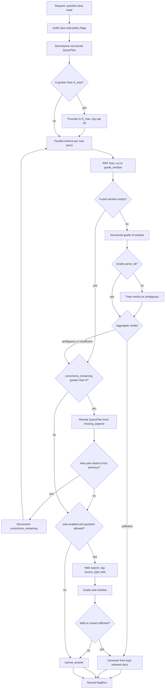
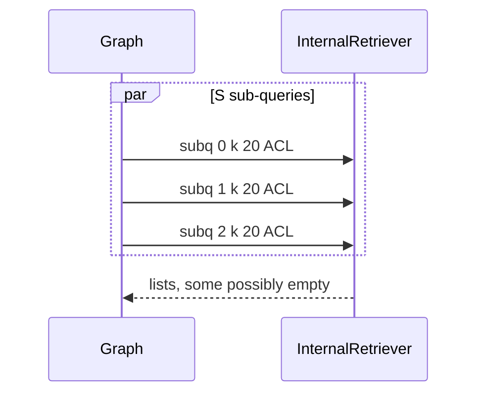
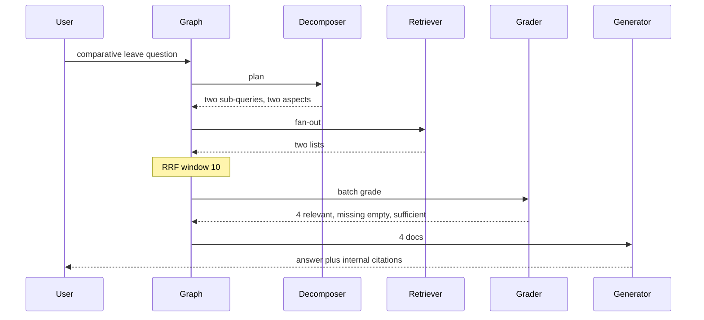
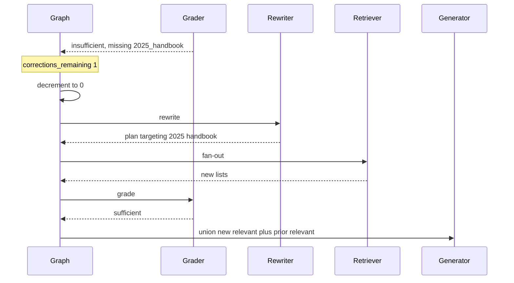
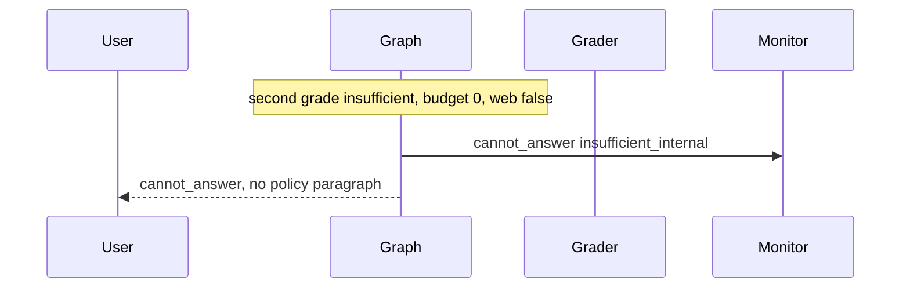
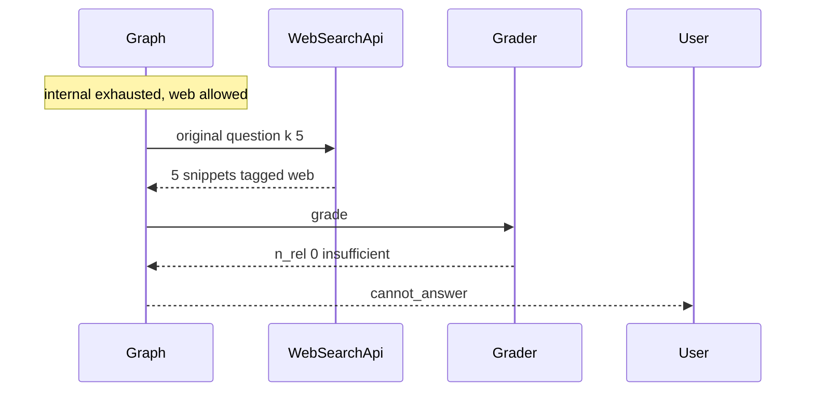
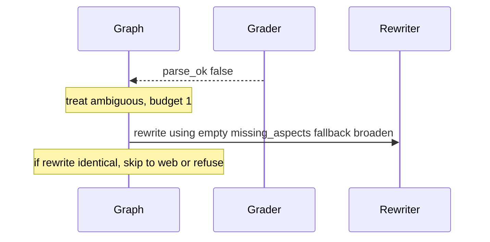
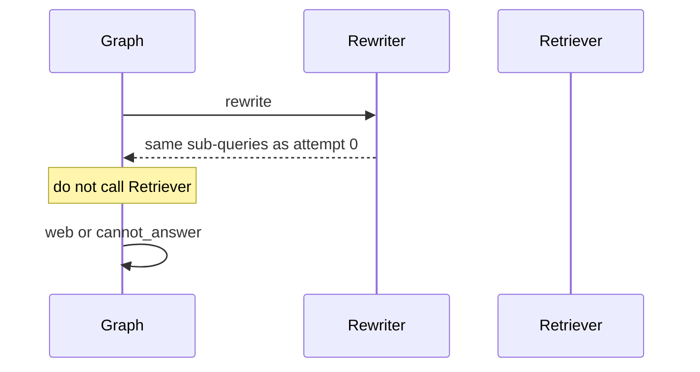

# Multi-Query & Corrective RAG — System Design
> - **Document Status**: Draft
> - **Last Updated**: 2026 Aug 29
> - **Author**: Paul Serban

This document is the mechanical *how* for the system described in the [Architecture Document](./02_architecture_document.md). It specifies the state machine, sub-query fan-out, RRF, the three-way grade, the iteration bound, fallback, and the sequences that must not generate from ungraded or insufficient context. It does not specify code.

## 1. Control Flow

One request, one bounded walk on the graph. The client does not pick S, `max_corrections`, or whether to hit the web.



**Invariant:** the generator is never invoked on a window that has not been graded, or on a verdict of `insufficient`. Empty fused window is `insufficient`.

**Working defaults for `kb.answer_question`:** S_max = 4, retrieve k = 20 per sub-query, `k_rrf` = 60, `grade_window` = 10, `min_relevant` = 2, `max_corrections` = 1, web fallback **off** until Phase 4 + signatures. These are route parameters. Changing them is not a new architecture; deleting the grade node or raising max_corrections without a signed measurement is.

## 2. Query Decomposition

### When to decompose

Three legal policies. Pick one in Phase 0; do not mix silently.

| Policy | Behavior | Use when |
| --- | --- | --- |
| Always call decomposer | Model may return S=1 | Default v1. Simplest graph. Cost: one small LLM call even on "Wi-Fi password." |
| Heuristic skip | If question is short and has one entity-like span, S=1, no LLM | After Phase 0 shows mix is mostly simple **and** the heuristic's error rate is measured |
| Always S=S_max | Forbidden | Taxes every query; not a policy |

v1 default: **always call decomposer**, require structured list, allow S=1.

### Schema of the plan (logical, not JSON Schema syntax)

| Field | Type | Notes |
| --- | --- | --- |
| `original_question` | string | Copied, not rewritten. The user-visible ask does not change. |
| `sub_queries` | list of strings | 1..S_max after cap |
| `aspects` | list of short strings | What a sufficient answer must cover (e.g. `["2024_handbook_parental_leave", "2025_handbook_parental_leave"]`). The grader's `missing_aspects` is relative to this list. |
| `complexity` | enum | `simple` \| `comparative` \| `multi_hop` \| `ambiguous` \| `unknown`. Telemetry; not a branch by itself in v1. |

**Invariants:**
- If `aspects` is empty, the grader can only use `min_relevant`. Comparative questions without aspects will false-sufficient on one pole. Phase 0 should require aspects on non-simple items in the labeled set.
- Sub-query text is a retrieval query, not a thought. "Let's think about contractors" is not a sub-query. If Phase 1 shows junk sub-queries, the schema gets a `type=search_query` instruction, not a bigger S.

### Fan-out execution

- Fire S retriever calls in parallel. Same `k`, same index, same filters (ACL of the user applied on every call — a sub-query must not see docs the original question could not).
- Per-call timeout T_ret (route parameter). On timeout or 5xx: that list is empty; others proceed.
- If **all** lists empty: fused window empty → insufficient path.
- The LLM does not invoke tools. The graph does.



## 3. Reciprocal Rank Fusion

### Formula

For each document `d` appearing in one or more ranked lists `L_i`:

```
rrf(d) = sum over i of  1 / (k_rrf + rank_i(d))
```

- `rank_i(d)` is 1-based rank in list `i` if present; if `d` is absent from `L_i`, that term is 0 (do not invent a rank of k+1 unless you have measured it; absence is absence).
- `k_rrf = 60` working default (Cormack et al. RRF; damps rank so rank 1 does not infinitely dominate, and scores from different systems need not be comparable).
- Scores from BM25 vs dense **inside** a single sub-query's retriever are the retriever's problem (hybrid fusion at retrieve time). RRF here merges **across sub-queries**.

### Tie-break and cut

1. Sort by `rrf` descending.
2. Ties: lower `chunk_id` (stable). Do not use "first list that had it" — that reintroduces fan-out race order.
3. Take top `grade_window` (10).
4. Deduplicate by `chunk_id` before sort (a doc in two lists is one candidate with summed RRF).

### What RRF is not

- Not a reranker. It does not read text. A cross-encoder may sit inside the retriever node **per sub-query** (rerank that list of 20 to 10 before RRF). That is optional Phase 1 work. It does not replace grading.
- Not score normalization (`minmax(bm25)` + `minmax(cosine)`). Those require comparable distributions; sub-query lists will not have them.

### Too few candidates

If unique fused docs < `min_relevant` (2): still grade (the grader may mark them relevant). If 0: skip grade, verdict `insufficient`. Do not pad the window with random corpus docs to make the grader feel busy.

## 4. Grading

### Why structured

Free-text "these look pretty good except the third" is not an edge. Same argument as schema-constrained voting in a decision ensemble: you cannot branch on a paragraph without a hidden parser you will not admit to. See [ADR-004](./04_architecture_decision_records.md#adr-004).

### Per-document label

Each fused candidate → `relevant` | `irrelevant` | `ambiguous`.

| Label | Meaning |
| --- | --- |
| `relevant` | The chunk contains information that *directly* helps answer the original question (or a declared aspect). Topical cousin is not enough. |
| `irrelevant` | Does not help. Includes "same topic, wrong year / region / product line." |
| `ambiguous` | Might help if another chunk supplies the missing qualifier; not enough alone. |

The grader is shown: original question, `aspects`, chunk text, chunk metadata (title, date, source_type), and which sub-query retrieved it.

### Aggregate verdict (three-way, CRAG-shaped)

Matching the CRAG taxonomy in spirit: **correct / ambiguous / incorrect** retrieval, named here `sufficient` / `ambiguous` / `insufficient` so nobody hears "correct" as "the answer is true."

Working rules (conjunction):

1. Count `n_rel` = number of `relevant` docs in the window.
2. `missing` = aspects with no `relevant` doc (aspect matching is the grader's structured `missing_aspects[]`; do not keyword-match aspects in v1).
3. `sufficient`: `n_rel >= min_relevant` AND `missing` is empty AND `parse_ok`.
4. `insufficient`: `n_rel == 0` OR (aspects were declared AND every aspect is missing) OR fused empty.
5. `ambiguous`: everything else (including `n_rel >= min_relevant` but `missing` non-empty — found volume, not coverage; including parse fail with budget remaining).

Product may require `min_relevant = 1` for simple lookups. Default 2 is conservative for policy answers (one chunk is how you quote a partial sentence).

### Batch vs per-doc calls

| Mode | Calls | Risk |
| --- | --- | --- |
| **Batch (v1)** | 1 structured object: array of labels + verdict + missing_aspects | Model may lazy-label later docs in a long window; keep window at 10 |
| Per-doc | `grade_window` calls | Latency disaster; more consistent labels maybe; not v1 unless batch calibration fails Phase 2 |
| Generator-as-grade | 1 full answer then "was that grounded?" | Pays generate to decide not to generate; rejected |

### Parse failure

Deterministic fence-strip only. If still invalid: `parse_ok=false`, do **not** invent `sufficient`. Router treats as `ambiguous` if `corrections_remaining > 0`, else `insufficient`.

## 5. Corrective actions and the bound

### Budget

- `max_corrections = 1` means **one** rewrite + re-retrieve + re-grade on the **internal** index.
- Decrement **before** the edge back to RetrieveFanOut.
- Graph runtime max-steps is a second fuse: e.g. hard stop at 12 node visits. If hit, `cannot_answer` + page. This is not the product bound; it is the safety bound against a wiring bug.

**Why not 2 or 3 internal loops.** The second rewrite is still the same corpus. If the first rewrite (informed by `missing_aspects`) did not surface the doc, a third paraphrase almost never materializes an unindexed paragraph; it materializes more near-misses and another grade bill. CRAG's original "refine then web" is a **source change**, which this design does after the internal bound, not a third internal hop. Raising the cap is how on-call "fixes quality" during an incident and 3× p95. Forbidden without a Phase 3 measurement that a second hop moved context-recall on the labeled set by enough to pay for itself.

### Rewrite strategies (the rewriter may use any; the router does not care)

1. **Narrow**: first plan was generic "return policy"; missing aspect is EU + 2025 → sub-query becomes that.
2. **Split remainder**: one aspect found, one missing → new plan is only the missing aspect (do not re-retrieve the found pole unless you need it for fusion again — v1 simplicity: new plan may include both; wasteful but simpler).
3. **Broaden**: first plan over-constrained (wrong product name) → drop the entity the grader marked as mismatch.

**Identical-plan skip:** canonicalize sub-query strings (trim, lowercase, sort) and compare to the previous plan. Equal → do not retrieve; go to web/escalate. Log `identical_rewrite_skip`.

### What correction is not

- Not "add the previous window to the next window forever" without grading. You may **union kept `relevant` docs** from attempt 0 into attempt 1's generator context if attempt 1 is sufficient on the missing aspects — working default: **yes, keep previously relevant docs** (they were paid for and graded). Do not keep `irrelevant` docs across attempts.
- Not raising `k` on the same query. That is the trap.

## 6. Web / broader-search fallback

Entered only when internal budget is 0 (or identical rewrite skipped) AND route `web_fallback_enabled` AND the request flags allow it.

**Allow flags (deterministic, v1):**
- Route config on.
- User/role not in a "no external search" group.
- Question classifier is **not** required in v1 if the entire route is already "general wiki, no HR." If the route mixes HR and public product docs, **do not enable web on the mixed route**; split the route. An LLM PII classifier as the only gate is a later, signed design.

**Mechanics:**
- One search query: original question (not 4 sub-queries, unless Phase 4 measurement says otherwise — web fan-out is a separate tax).
- k_web = 5.
- Tag `source_type=web`.
- Grade with the same schema. `sufficient` may be declared on web-only relevant docs.
- Generator prompt must include source type; UI must not look like an internal policy citation.

**Web failure:** timeout / 4xx / 5xx → `cannot_answer`, code `web_failed`. Do not generate from the old insufficient internal window.

**Web still insufficient:** `cannot_answer`. Do not loop web queries. One web shot is the fallback, not a new agent.

## 7. Generate and refuse

### Kept docs

- Default: `relevant` only, plus any `relevant` carried from a previous internal attempt.
- `ambiguous` docs: excluded unless product signed `include_ambiguous=true` (adds recall, adds noise). Default false.
- `irrelevant`: never.
- Empty kept set: refuse, even if verdict was wrongly `sufficient` (inconsistent grade). Log `kept_empty_inconsistency`.

### Forbidden terminals

| Forbidden | Why it shows up | What to do instead |
| --- | --- | --- |
| Generate from ungraded window | Skip grade under load | Shed the request |
| Generate after `insufficient` | User is waiting; "be helpful" | `cannot_answer` |
| Generate after parse fail treated as sufficient | Hidden default | Conservative branch |
| Generate from insufficient internal while web fails | "Better than nothing" | `cannot_answer` |
| Unbounded rewrite | Quality panic | Bound + identical skip + max-steps |

### Partial coverage (optional, signed)

If verdict is `ambiguous` with `n_rel >= 1` and budget 0 and web off, product may sign: generate with an explicit **coverage warning** listing `missing_aspects`. This is not the default. Default is refuse. The signed variant is still better than silent partial answers; it is not "sufficient."

## 8. Sequences

### 8.1 Sufficient on first pass



### 8.2 One correction cycle



### 8.3 Correction still insufficient, web off



**Forbidden terminal:** returning the first-pass fluent guess because "we tried."

### 8.4 Web fallback then still refuse



### 8.5 Parse failure with budget



If this is common, the problem is the grade schema/model, not `max_corrections`. Raising the bound so a second grade might parse is superstition.

### 8.6 Identical rewrite skip



## 9. Data Model (Logical)

Not SQL. Grain and invariants only.

### query_plan

| Field | Role |
| --- | --- |
| plan_id, request_id, attempt_index | attempt 0 is original decompose |
| original_question | Immutable across attempts |
| sub_queries[] | After cap |
| aspects[] | Sufficiency checklist |
| complexity | Telemetry |

### retrieval_result

| Field | Role |
| --- | --- |
| plan_id, subquery_id | |
| hits[] | chunk_id, rank, opaque_score, source_type `internal` \| `web` |
| status | ok / timeout / error |
| latency_ms | |

### fused_candidate

| Field | Role |
| --- | --- |
| request_id, attempt_index | |
| chunk_id, rrf_score, rank | |
| contributing_subquery_ids[] | |
| source_type | |

### grade_result

| Field | Role |
| --- | --- |
| request_id, attempt_index | |
| parse_ok | |
| per_doc[] | chunk_id, label |
| verdict | sufficient / ambiguous / insufficient |
| missing_aspects[] | |
| n_rel | |

### correction_attempt

| Field | Role |
| --- | --- |
| request_id, from_attempt, to_attempt | |
| reason | verdict that triggered |
| identical_skip | bool |

### rag_run

| Field | Role |
| --- | --- |
| run_id, request_id, route_id | |
| S, attempts, web_used | |
| terminal | `answered` / `answered_after_correction` / `answered_with_web` / `cannot_answer` |
| cannot_reason | insufficient_internal / web_disallowed / web_failed / grade_parse_exhausted / max_steps |
| tokens_in, tokens_out, latency_ms_by_node | |
| baseline_multiplier | realized cost / estimated single-pass cost |

### kept_context

| Field | Role |
| --- | --- |
| run_id | |
| chunk_ids[] | What the generator actually saw |
| source_types[] | |

**Invariant:** generator input ⊆ union of docs labeled `relevant` on some attempt (plus ambiguous only if signed). Auditable.

## 10. Error Handling

| Failure | Where | What the system does | What it must not do |
| --- | --- | --- | --- |
| Unauthenticated | Edge | 401, no retrieve | Decompose anyway |
| Decompose parse fail | Decomposer | Fallback plan: S=1, sub-query = original question, aspects empty | Fail the request if a single-query retrieve would have worked; do not emit S=0 |
| S > S_max | Decomposer | Truncate, log | Fan out 12 ways |
| One sub-query timeout | Fan-out | Empty list for that sub-query | Block on it; fail whole request |
| All sub-queries fail | Fan-out | insufficient path | Generate from empty |
| Fused empty | Fusion | Skip grade, insufficient | Invent filler chunks |
| Grade parse fail | Grader | Conservative ambiguous/insufficient | Default sufficient; generate |
| n_rel high but missing aspects | Grader | ambiguous | sufficient |
| Identical rewrite | Router | Skip retrieve | Pay for the same lists |
| max_corrections spent | Router | web or refuse | Loop anyway |
| Graph max-steps | Runtime | refuse, page | Continue |
| Web disabled / disallowed | Router | refuse | Call web "just to see" |
| Web API fail | Fallback | refuse `web_failed` | Generate from old insufficient internal |
| Web insufficient | Grader | refuse | Second web query |
| Kept set empty | Generator | refuse | Generate with "no context, be helpful" |
| Load / 429 on LLM grade | Grader | retry once bounded, else conservative insufficient | Skip grade |
| Pressure to skip grade for p95 | Config | refuse the change | "Just for tonight" |
| Pressure to set max_corrections=5 | Config | refuse | Quality hotfix |

## 11. Observability (Minimum)

Without these, "self-heal" is folklore.

- **Per route:** `mean_S`, `decompose_cap_hit_rate`, `verdict` histogram per attempt index, `correction_trigger_rate`, `identical_rewrite_skip_rate`, `fallback_trigger_rate`, `refuse_rate` by reason, `kept_empty_inconsistency`.
- **Cost:** tokens by node (grade window tokens called out), `baseline_multiplier`, retriever calls per request.
- **Latency:** p50/p95 by node and by path (`happy`, `corrected`, `web`, `refuse`). The corrective-path p95 *is* the tax. Report it separately; averaging it into happy-path p95 hides the scenario.
- **Eval:** RAGAS context precision / context recall on a labeled holdout, run on each phase gate and as a production shadow sample. Faithfulness as a **guardrail** (CRAG must not worsen it), not as this system's primary SLO.
- **Audit:** persist plans, fused ids, labels, kept ids, terminal. Support must reconstruct "why web" / "why refuse" without reading a prose log of the graph.
- **Do not** page every time the correction edge fires.
- **Do** page on correction_trigger_rate leaving the Phase 0 band (e.g. > 50% if you expected 15%), on refuse_rate vs staffing, on max-steps hits, on grade parse_fail_rate, on baseline_multiplier creeping because someone raised S_max or max_corrections.

## 12. What this does to the call shape

Still one user-visible HTTP request. Internally, working worst case with web: 1 decompose + S retrieve + 1 grade + 1 rewrite + S retrieve + 1 grade + 1 web + 1 grade + 1 generate.

Provider / platform features that are **in**: structured output, parallel retriever calls, per-call ids, usage tokens, graph max-steps.

Features that are **out** on this route: unbounded tool-calling agent; skipping grade; generate on insufficient; internal loop > `max_corrections`; web as the first retrieve.

LangGraph is the **illustrative** runtime because it makes states and conditional edges explicit. The architecture is the graph, not the library. A homegrown state machine with the same nodes and the same decrement-before-reentry invariant is compliant. A LangChain `SequentialChain` with a Python `if` that can `goto` retrieve in a `while` is the rejected unbounded shape even if someone imports LangGraph for the screenshot.
