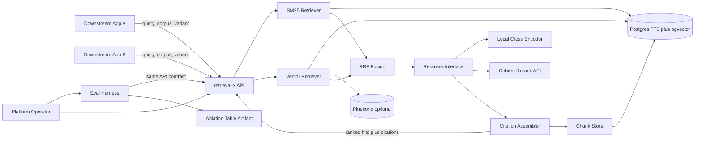
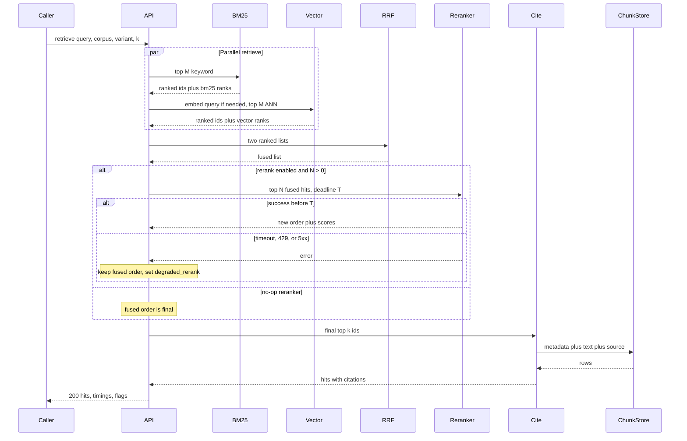

# retrieval-x — Architecture Document
> - **Document Status**: Draft
> - **Last Updated**: 2026 Aug 29
> - **Author**: Paul Serban

A quality-tuning retrieval microservice: hybrid (BM25 + vector) fused with Reciprocal Rank Fusion, an optional reranker behind a strategy interface, source citations on every hit, and an offline ablation harness that publishes naive-vs-hybrid-vs-hybrid+rerank numbers. This document covers *what* the system is and *why* it is shaped this way; see [System Design](./03_system_design.md) for *how* RRF, the reranker contract, the API schema, and the eval job actually work, and [Trade-offs and Honest Assessment](./05_tradeoffs_and_honest_assessment.md) for what is abandoned and what is asked for.

## Overview

**Brief description**: Shared, synchronous retrieval-as-a-service. Downstream apps send a query and a corpus id; they get ranked chunks with citations and per-stage timings. They do not get an answer. They do not get a training pipeline. They do not get a guarantee that hybrid+rerank is better — they get a table.

**Business Context**
- See [Scenario and Requirements](./01_scenario_and_requirements.md) for the full framing. In short: the reranker is the latency and cost ceiling; labeled judgments are the quality ceiling; the RRF formula is neither.
- Target users: downstream app services (callers), corpus owners, the platform operator who owns the table and the on-call.

## Requirements

Summarized from the [Scenario](./01_scenario_and_requirements.md); architecturally significant ones only.

### Functional Requirements
- Vector-only, hybrid (BM25 + vector + RRF), and hybrid+rerank as named, callable variants.
- Reranker behind a strategy interface with no-op, local cross-encoder, and hosted (Cohere) implementations.
- Citation metadata on every returned chunk.
- Versioned HTTP API; pipeline variant is explicit.
- Offline eval harness that emits a precision / recall / latency table.
- Reranker (or single-retriever) failure degrades; it does not fail the request unless nothing retrieved.

### Non-Functional Requirements
- Latency budgets as in the [Scenario](./01_scenario_and_requirements.md#non-functional-requirements); the Phase 0 SLA is the contract, these numbers are the working hypothesis.
- Stateless API, horizontal scale; indexes are the stateful bottleneck; reranker is the cost bottleneck.
- Multi-corpus isolation from day one.
- Inference-only. No learning-to-rank in this design.
- Illustrative stack: FastAPI, Postgres FTS + pgvector (Pinecone and Elastic as escape hatches), Docker, Kubernetes.

## Executive Summary

`retrieval-x` is a **staged, synchronous retrieval pipeline** exposed as a microservice, plus a **separately deployed eval harness** that is allowed to say "hybrid lost." The serving path is boring on purpose: parallel retrieve, fuse, optionally rerank, hydrate citations, return. The architecture spends its complexity on (1) making stages independently measurable, (2) making the reranker actually swappable, and (3) refusing to couple generation into the same process so quality remains attributable.

**Architecture Style:** Stateless request/response microservice + two stateful indexes + an optional inference sidecar/API + a batch eval job. Not event-driven. Not a training platform. Not an embedded library.

**Key Components:**
- **API / Query Orchestrator**: FastAPI surface, authz, variant selection, deadline propagation, response assembly.
- **BM25 Retriever adapter**: Postgres FTS (or Elastic).
- **Vector Retriever adapter**: pgvector (or Pinecone). Query embedding happens here or is passed in.
- **RRF Fusion**: rank-only combination of the two lists.
- **Reranker Interface**: strategy; implementations: no-op, local cross-encoder, Cohere.
- **Citation Assembler**: join hits to chunk-store metadata; never to raw object storage on the query path.
- **Offline Eval / Ablation Harness**: judged queries in, table out. Not on the serving path.

**Technology Stack:**
- API: FastAPI, one request thread/task per in-flight query (rerank may block; size workers accordingly).
- Store: Postgres for chunks, FTS, and (if used) pgvector. Pinecone replaces the vector adapter only.
- Rerank: local process (GPU if you meant it) or HTTPS to Cohere.
- Eval: same API as a client, plus a metrics writer. Not a private in-process shortcut — if the harness does not go through the contract, it is not testing the contract.
- Deploy: Docker images, Kubernetes Deployment + Service; HPA on the API; the reranker may be a separate Deployment so it can GPU-scale independently.

**Architecture Principles:**
- **Measure each stage or do not claim it.** A component that cannot appear as a row or a column in the table is ornamental.
- **Ranks fuse; scores do not.** BM25 and cosine live on different planets. See [ADR-002](./04_architecture_decision_records.md#adr-002).
- **Depend on an interface, not on Cohere, not on a particular Hugging Face id.** See [ADR-003](./04_architecture_decision_records.md#adr-003).
- **The contract is the product.** Embedding this as a library in five apps is how you get five ranking bugs and no shared table. See [ADR-004](./04_architecture_decision_records.md#adr-004).
- **Optional stages fail open.** Rerank is optional. BM25 is optional in degradation. Lying with a 200 and empty hits is worse than a flagged partial list; 5xx for an optional stage is worse than both.
- **Eval is a gate, not a vibe.** Production ranking changes require a harness run. See [ADR-006](./04_architecture_decision_records.md#adr-006).

**Key Architectural Decisions:**
1. **Hybrid is the *candidate* default, proven per corpus, not assumed.** [ADR-001](./04_architecture_decision_records.md#adr-001).
2. **RRF over linear score fusion.** [ADR-002](./04_architecture_decision_records.md#adr-002).
3. **Reranker behind a strategy interface, with no-op as a real implementation.** [ADR-003](./04_architecture_decision_records.md#adr-003).
4. **Standalone versioned microservice, not a library.** [ADR-004](./04_architecture_decision_records.md#adr-004).
5. **Synchronous rerank with a hard timeout and fused-only fallback.** [ADR-005](./04_architecture_decision_records.md#adr-005).
6. **Eval harness as a first-class, separately runnable artifact.** [ADR-006](./04_architecture_decision_records.md#adr-006).

### Context Diagram

The dashed Pinecone edge is an adapter swap, not a second vector path in production for the same corpus. Two vector backends for one corpus is how you debug "which index is live?" at 3 a.m.

## Runtime Architecture

1. **Ingest path (not this service's request handler, but required to exist):** corpus pipelines chunk, embed, write to the chunk store, FTS column, and vector index with the same `chunk_id`. `retrieval-x` may own the write API or may consume writes from an existing ingest; it must not embed documents inside `GET/POST /retrieve`. Divergence between FTS and vector for the same `chunk_id` is a first-class incident. See [Risks](#risks-and-mitigation).
2. **Query path (synchronous):** authenticate caller → resolve corpus config (variant defaults, `k`, `N`, reranker id, timeout) → embed query if needed → **parallel** BM25 + vector retrieve → RRF → if rerank enabled, call interface with deadline → citation hydrate from chunk store → return.
3. **Eval path (async/batch, same query path):** harness reads judged set, calls the API per variant, computes metrics, writes the table. No private back door.
4. **Operator path:** corpus config, reranker swap, canaries, on-call for index health and rerank error rate. The table is reviewed when ranking changes, not only when someone remembers.

### Query path

## Components

### 1. API / Query Orchestrator
**Purpose**: Be the contract. Everything else is allowed to change behind it.

**Responsibilities:**
- Versioned HTTP: retrieve, health, (internal) corpus config read. Schema in [System Design §4](./03_system_design.md#4-api-contract).
- Authn of calling services; authz of `corpus_id`.
- Deadline: a single remaining-time budget that the reranker call must respect. If the caller sent a 200 ms timeout, the orchestrator does not generously give Cohere 400 ms.
- Fan-out to both retrievers with a per-leg timeout strictly less than the request deadline.
- Attach `timings_ms` and `flags` (`degraded_rerank`, `degraded_bm25`, `degraded_vector`) so callers and the harness see the same truth.
- **Does not** implement BM25, ANN, or cross-encoder math.

**Interactions:** retrievers, fusion, reranker interface, citation assembler. Callers never skip it.

### 2. BM25 Retriever adapter
**Purpose**: Keyword / lexical retrieval. IDs, error codes, SKUs, statute numbers, rare tokens that embeddings smear.

**Responsibilities:**
- Query Postgres FTS (or Elastic) for top-M (`M` ≥ `k`, typically 50–100; a fusion input, not the user-facing `k`).
- Return `chunk_id` + rank + raw score (score is for logs, not for fusion).
- Empty result is valid (query is purely semantic, or the corpus has no tokens). Do not fabricate hits.

**Interactions:** reads FTS index. Does not call the vector adapter.

### 3. Vector Retriever adapter
**Purpose**: Semantic / paraphrase retrieval.

**Responsibilities:**
- Embed the query with the **same model version** the index was built with. Mixed-version query embedding is silent recall death. Model id is corpus config, not "whatever is default in the pod."
- ANN top-M from pgvector or Pinecone.
- Return `chunk_id` + rank + distance/similarity (again: log, not fuse).

**Interactions:** embedding inference (local or API) + vector index. Embedding-API latency sits **inside** this adapter's budget; a remote embed can consume the entire vector budget by itself. Prefer local or cached query embeds. See [System Design §6](./03_system_design.md#6-latency-budget).

### 4. RRF Fusion
**Purpose**: Combine two incompatible rankings into one.

**Responsibilities:**
- Reciprocal Rank Fusion: `score(d) = Σ 1 / (k_rrf + rank_r(d))` over retrievers r that returned d. Typical `k_rrf = 60`. Details in [System Design §2](./03_system_design.md#2-rrf-fusion).
- Documents appearing in one list only still get a score (they should: that is often the point of hybrid).
- Deterministic tie-break (e.g. `chunk_id` ascending) so eval is reproducible.

**Interactions:** pure function of two lists. No I/O.

### 5. Reranker Interface (strategy)
**Purpose**: Dependency inversion. The orchestrator depends on "reorder these N hits for this query before deadline T," not on a vendor or a weights file.

**Responsibilities:**
- Interface: `(query, hits[1..N], deadline) → ordered hits | error`. No HTTP, no GPU, no SDK in the signature.
- Implementations:
  - **No-op**: identity order. The A/B control and the timeout fallback.
  - **Local cross-encoder**: batch `(query, hit.text)` through a published model; sort by logit.
  - **Cohere (hosted)**: map to `/rerank`, map back. Timeouts and 429s are errors, not retries-until-the-caller-gave-up.
- Circuit breaker per implementation: after consecutive errors, skip the call and return error immediately so the orchestrator falls back to fused. A breaker that still waits for Cohere is decoration.

**Interactions:** called only with already-retrieved text (or ids that the implementation is allowed to hydrate). Must not search.

Why two "real" implementations plus no-op: an interface with one implementation is a comment. Phase 4 exists to prove the swap. See [ADR-003](./04_architecture_decision_records.md#adr-003) and [Phased Plan — Phase 4](./06_phased_implementation_plan.md#phase-4--second-reranker-implementation-and-degradation-drill).

### 6. Citation Assembler
**Purpose**: Make "grounded" a property of the payload, not of the prompt.

**Responsibilities:**
- For final top-k ids, load chunk text (if not already on the hit), `source_id`, URI / canonical path, title, span/section, `doc_version`, `chunk_index`, checksum or content hash.
- Drop or flag a hit that cannot be cited. Do not return an uncited chunk and hope the generator invents a URL.
- Must read the **chunk store** (rows written at ingest), not S3/GCS of the original PDF on the query path.

**Interactions:** chunk store. Read-only on query path.

### 7. Offline Eval / Ablation Harness
**Purpose**: Produce the table that justifies every stage still being on.

**Responsibilities:**
- Load the judged query set (schema in [System Design §7](./03_system_design.md#7-offline-eval-harness)).
- For each named variant, call the **public retrieve API** (not in-process).
- Compute precision@k, recall@k (against the judged relevant set), MRR, nDCG@k, and latency p50/p95 of the API.
- Write a versioned artifact: variant × metric, plus git/config/model ids so a later reader can tell *what* was measured.
- Pooling support: union of retrieved ids across variants for judgment campaigns, so hybrid is not scored only on vector-only's candidates.

**Interactions:** retrieve API as a client; object/blob or repo storage for the table. **Not** in the serving Deployment's request path. A harness bug must not take search down.

### Communication Patterns

**Synchronous:**
- Caller ↔ API: HTTP, one request, one response. No job id, no webhook. RAG retrieval that is "we'll rerank offline and ping you" is a different product.
- API ↔ retrievers: in-process or local HTTP; parallel.
- API ↔ Cohere: HTTPS, budgeted.

**Asynchronous:**
- Ingest/index updates: whatever the corpus pipeline already does. Not designed here beyond "same chunk_id lands in both indexes."
- Eval harness: batch, scheduled or CI.

**Forbidden:**
- API ↔ generator. Not this service.
- Query path ↔ object storage of raw sources.
- Eval harness importing the orchestrator as a Python function to "save latency" in CI. Then CI is not testing the service.

## Scaling Strategy

**Current scale assumption (this project):** a corpus that reasonably fits **one Postgres** with FTS + pgvector (tens of thousands to low millions of chunks, not 300 million). The quality work is the point; if you are already at 50M documents, you have the wrong first project — use [prj--rag-pipeline-at-scale](../../prj--rag-pipeline-at-scale/README.md) for capacity and put this service's *interface and eval discipline* on top.

**What scales horizontally:**
- API replicas. Stateless. Watch connection pools to Postgres and QPS to Cohere.
- Local reranker replicas (GPU Deployment). Batch size vs latency is a trade: under-batched GPUs waste money; over-batched GPUs add queueing that **is** p95.

**What does not scale by adding API pods:**
- Postgres FTS / pgvector. That box is the bottleneck. Vertical first, then Elastic / Pinecone adapters, then (if still not enough) the scale project's sharding story.
- Cohere rate limits. Horizontal API scale against a shared vendor key is how you 429 yourselves. The circuit breaker and the fused fallback are the scale valve, not "more pods."

**Bottleneck analysis:**
- Primary, quality: judged set size and bias. You cannot scale nDCG by adding hardware.
- Primary, serving latency: rerank N × model, or Cohere RTT.
- Primary, serving capacity: Postgres and/or embedding QPS.
- Secondary: query-embed if remote.
- Not a bottleneck: RRF.

**If QPS grows:**
- Cache: exact query cache (`corpus_id`, query string, variant, model versions) with a short TTL. Semantic cache is out of scope (and a correctness hazard). See [Trade-offs](./05_tradeoffs_and_honest_assessment.md#2-what-i-would-give-up).
- HPA on API CPU/RPS and on reranker GPU utilization, separately.
- Do not cache across corpus ids. Ever.

## Data Architecture

### Data Model

**Key Entities:**
- **Corpus**: id, tenant, embedding_model_id, bm25_config, default_variant, reranker_id, `k_rrf`, retrieve_M, rerank_N, sla_ms.
- **Chunk**: `chunk_id` (stable), `corpus_id`, text, token count, embedding (or pointer), `tsvector`, source citation fields, ingest timestamps.
- **SourceDocument**: `source_id`, URI, title, `doc_version`, owner. Chunks point here.
- **JudgedQuery**: query id, corpus, query text, notes.
- **Judgment**: query id, `chunk_id` (or source+span), grade (binary or 0–3).
- **EvalRun**: timestamp, git sha, config snapshot, variant, metrics JSON, latency histogram summary.
- **RetrieveRequest/Response**: not stored by default. If you log queries for eval mining, that log is a datastore of user questions — treat it as such.

**Entity Relationships:**
- Corpus 1—N Chunks; SourceDocument 1—N Chunks.
- JudgedQuery 1—N Judgments.
- EvalRun N—1 Corpus, N—1 config snapshot.

### Data Lifecycle

**Create**: ingest writes chunks to store + both indexes in one logical unit (transaction if same Postgres; two-phase with a repair job if vector is Pinecone — dual-write is the tax of the escape hatch).
**Read**: query path; eval path; operator debug.
**Update**: re-chunk / re-embed produces new `chunk_id`s or a versioned overwrite documented in ingest. In-place silent rewrite that desyncs FTS and vector is forbidden.
**Delete**: source deletion must drop FTS row, vector row, and chunk row. A cited hit whose source was deleted is a failure mode the assembler already flags.

## Cost Analysis

### Cost Components

| Component | Nature of cost | Honest note |
| --- | --- | --- |
| Postgres (FTS + chunks + pgvector) | Instance, storage, backup | The cheap path. Dominates if you stay here. |
| Pinecone / Elastic | SaaS or second cluster | Only if Phase 0 size/latency says Postgres will not do. Do not buy them to look like a RAG company. |
| Query + doc embeddings | GPU or vendor $ | Ingest-dominated. Query embed is small unless remote-and-chatty. |
| Local cross-encoder | GPU-hours, idle waste | Low QPS still pays for a warm GPU or accepts CPU latency. |
| Cohere rerank | **per query × N documents** | This is the bill that surprises finance. Estimate with `QPS × 86400 × unit_price` before enabling as default, not after. |
| Human judgments | Expert hours | Usually larger than the GPU bill for v1. Ignored in most RAG decks. |
| Kubernetes | Cluster you already have | If you do not have one, Docker Compose is an acceptable Phase 1–3 host. k8s in Phase 5. |

### Cost Optimization
- Keep rerank N small (20 is a number; 200 is a different system).
- No-op / fused-only as default until the table and the SLA agree.
- Exact query cache for repeated FAQ traffic.
- Do not dual-run Cohere and a local GPU "for safety" on every query. Pick one per corpus.
- Eval harness on a schedule, not on every request (online eval is a later, different design; this project's table is offline).

## Risks and Mitigation

| Risk | Likelihood | Impact | Mitigation Strategy | Owner |
| --- | --- | --- | --- | --- |
| No judged set; table is latency-only theater | High if Phase 0 is skipped | High | Phase 0 gate; no hybrid-default without quality rows | Operator |
| Judged set is the author's favorite queries | High | High | Reviewer who is not the author; sample from real traffic | Operator + corpus owner |
| Pooling skipped; hybrid cannot win | Medium | High | Harness requires union pooling before a judgment campaign | Eval harness |
| Hybrid loses on this corpus | Medium | Medium | Allowed. Vector-only stays default. [ADR-001](./04_architecture_decision_records.md#adr-001) | Operator |
| Rerank blows p95 | High if N/model unconstrained | High | Budget in [System Design §6](./03_system_design.md#6-latency-budget); go/no-go in Phase 3 | Operator |
| Cohere outage takes search down | High if fail-closed | High | Fail open to fused; circuit breaker [ADR-005](./04_architecture_decision_records.md#adr-005) | API |
| FTS and vector indexes diverge | Medium | High | Same-Postgres transaction when possible; repair job + lag metric when dual-writing Pinecone | Ingest |
| Query embed model ≠ index model | Medium | High | Model id in corpus config; refuse to query on mismatch | Vector adapter |
| Interface not actually swappable (Cohere types leak) | High in first draft | Medium | Phase 4 swap drill; no vendor types in orchestrator | API |
| Citation to deleted/moved source | Medium | Medium | Assembler flags; ingest delete protocol | Cite + ingest |
| Multi-tenant leak via shared index or cached query | Medium if rushed | High | `corpus_id` in every key; no cross-corpus cache; authz allow-list | API |
| k8s before the table exists | High (résumé-driven) | Low–Medium | k8s is Phase 5; Compose is enough to measure quality | Operator |
| Confusing this with 50M-doc scale | Medium | High | Explicit non-goal; point at the other project | Author of RFCs |
| Reranker used to "fix" bad chunking | High | High | Business rule 7; do not raise N to hide ingest bugs | Operator |
| Eval set contamination (test queries in logs used to tune k_rrf endlessly) | Medium | Medium | Frozen eval + a separate dev split; retune is a gated re-run, not a loop on the test set | Eval harness |

## Future Enhancements

### Phase 1 (this design)
Ship the staged pipeline, the interface, the citations, the table. See [Phased Implementation Plan](./06_phased_implementation_plan.md).

### Phase 2 (conditional, may never trigger)
- Learned fusion / learning-to-rank, **if** judgment volume justifies it. It usually does not in v1.
- Elastic / Pinecone adapter as a real production corpus, if Postgres is measured insufficient.
- Online quality monitors (score-distribution drift, empty-hit rate) — useful, still not a substitute for the offline table.

### Technical Debt (accepted)
- Postgres as both system of record and both indexes is a coupling. Fine until it is not. The adapters exist so this is reversible.
- No-op reranker as a "strategy" looks like over-engineering until the first Cohere incident. Keep it.
- k8s YAML and HPA will be written later than the résumé wants. Correct.
- Dual-write to Pinecone, if used, will desync. Budget a repair job the day you enable it, not the day after the first incident.
