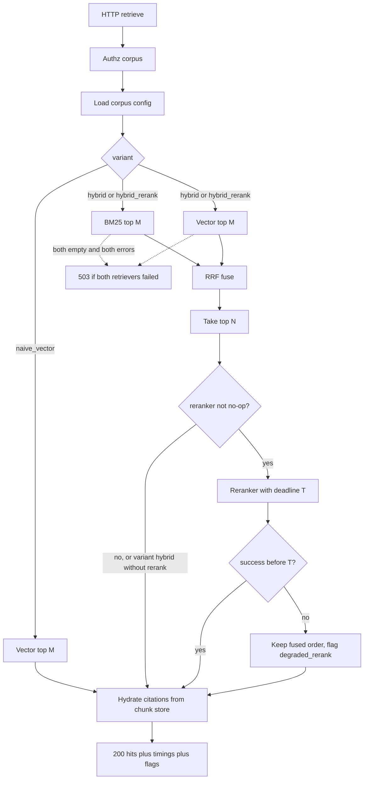

# retrieval-x — System Design
> - **Document Status**: Draft
> - **Last Updated**: 2026 Aug 29
> - **Author**: Paul Serban

This document is the mechanical *how* for the service described in the [Architecture Document](./02_architecture_document.md). It specifies control flow, RRF, the reranker interface, the HTTP contract, the latency budget, the eval harness, and failure modes. It does not specify code.

## 1. Control Flow

One request, four stages, one deadline. Stages 1a and 1b are parallel. Stage 3 is skippable (no-op or degraded).



**Invariant:** the response 200 path never waits on a reranker past `T`. `T` is `min(remaining_request_deadline - citation_budget, corpus.rerank_timeout_ms)`.

**Invariant:** naive_vector does not call BM25. The baseline in the table must be the actual baseline, not "hybrid with BM25 weighted to zero."

## 2. RRF Fusion

### Formula

For each `chunk_id` d appearing in at least one retriever list:

```
rrf(d) = Σ_r 1 / (k_rrf + rank_r(d))
```

where `rank_r(d)` is 1-based rank in retriever r's list, and a retriever that did not return d contributes **nothing** (not `1/(k_rrf + M+1)`). Typical `k_rrf = 60` (the constant from Cormack et al.; it is a smoothing factor, not magic). Corpus config may override; changing it is a ranking change and requires a harness run.

### Inputs

- BM25 list: up to M ids, ordered.
- Vector list: up to M ids, ordered.
- M is **not** user-facing `k`. M is the fusion pool (working default 50–100). `k` is what the caller gets after rerank/citation (working default 8–20).
- User `k` > M is rejected or clamped. Asking for 100 results from a pool of 50 is a config bug, not a ranking strategy.

### Tie-break

Sort by `rrf` descending, then `chunk_id` ascending. Eval reproducibility depends on this. Do not use wall-clock or random jitter on the serving path.

### What RRF is not

- It is not score fusion. Do not min-max BM25 and cosine and add them. Those scales move when you change k1/b, the analyzer, the embedding model, or the index size. See [ADR-002](./04_architecture_decision_records.md#adr-002).
- It is not a reranker. It cannot read query–document interaction beyond the two lists.
- It will not save a retriever that returned the wrong M. If both lists are junk, fused junk is still junk.

### Degenerate lists

| BM25 | Vector | Behavior |
| --- | --- | --- |
| hits | hits | Normal RRF |
| empty | hits | Fused list = vector list (still "hybrid variant"; flag `bm25_empty`) |
| hits | empty | Fused list = BM25 list; flag `vector_empty` |
| error | hits | Degraded: use vector, flag `degraded_bm25` |
| hits | error | Degraded: use BM25, flag `degraded_vector` |
| error | error | 503 |
| empty | empty | 200 with zero hits, not 503. Empty is a valid retrieval. |

## 3. Reranker Interface

### Contract (logical)

```
Reranker.rerank(
  query: string,
  hits: [{ chunk_id, text, fused_rank }],
  n: int,                 // len(hits) ≤ N
  deadline: monotonic     // absolute
) -> Result<[{ chunk_id, rerank_score, rerank_rank }], RerankError>
```

No vendor types. No `Response` objects from SDKs. No GPU handles. Implementations map to this and back.

`RerankError`: `timeout | unavailable | rate_limited | invalid_input | internal`. All of these are **fallback to fused order** at the orchestrator, except `invalid_input` which is also fallback (do not 400 the caller because Cohere rejected a too-long passage — truncate in the adapter, log, continue).

### Implementations

**No-op**
- Returns hits in the same order, `rerank_score = null`.
- Completes in microseconds. Used as variant control and as the in-process stand-in when the circuit breaker is open (the orchestrator may skip the call entirely; equivalent).

**Local cross-encoder**
- Model id from corpus config (e.g. a published MiniLM / DeBERTa cross-encoder). Not "latest on Hugging Face."
- Batch all N pairs in as few forward passes as hardware allows. N sequential passes is how you miss the budget on CPU.
- Truncate passage tokens to the model's max; truncation policy is documented (head, tail, or head+tail). Silent truncation that drops the only relevant sentence is a known failure mode — prefer ingest-time chunk sizes that fit.
- Must observe `deadline`: if the batch cannot start with enough remaining time, return `timeout` without starting. A forward pass that overruns is cancelled if the runtime allows; if it does not, **size N and model so overrun is rare**, and still return fused to the caller when the deadline fires (abandon the GPU result).

**Cohere (hosted)**
- Map `query` + `hits[].text` to the vendor rerank API. `top_n` = N.
- HTTP timeout = remaining deadline. No retry on 429 inside the request: retry is how you spend the caller's budget twice. 429 → `rate_limited` → fused fallback. A *later* request may succeed; this one will not wait.
- Truncate/batch per vendor limits in the adapter. If N exceeds the vendor cap, rerank the cap and append the remainder in fused order, flagged. Do not silently drop.
- API keys are secrets. Per-corpus keys if billing must isolate; otherwise one key and a shared rate limiter in front of the adapter so ten API pods do not multiply QPS.

### Circuit breaker

Per implementation, per corpus (Cohere can be down while the local GPU is fine):

- Open after K consecutive `timeout|unavailable|rate_limited` (working K=5) or an error-rate threshold over a short window.
- While open: orchestrator does not call; sets `degraded_rerank=circuit_open`.
- Half-open: one probe request. Success closes. Failure reopens.
- Breaker state is local to the process **or** shared (Redis) if many replicas would otherwise each take K failures against a paid API. For a small replica count, local is acceptable; document that a deploy resets the breaker.

### Swap

Corpus config: `reranker_id = noop | local:<model_id> | cohere:<model_id>`. The orchestrator resolves the id to an implementation at request time. **No caller field for "use Cohere"** in v1 — callers choose `variant` (`naive_vector | hybrid | hybrid_rerank`), not vendors. Vendor choice is operator config so the table stays apples-to-apples and so a caller cannot surprise you with a bill. See [ADR-003](./04_architecture_decision_records.md#adr-003).

## 4. API Contract

Illustrative HTTP. Version prefix `/v1`. JSON. This is a schema, not an implementation.

### `POST /v1/retrieve`

**Request**

| Field | Type | Notes |
| --- | --- | --- |
| `corpus_id` | string | Required. Authz'd. |
| `query` | string | Required. Non-empty after trim. |
| `k` | int | Optional. Default from corpus config. Clamp to `[1, k_max]`. |
| `variant` | enum | Optional. `naive_vector` \| `hybrid` \| `hybrid_rerank`. Default from corpus config. |
| `timeout_ms` | int | Optional. Caller budget. Server may cap. |

No raw query vector in v1 unless you need to skip query-embed; if added later, it must include `embedding_model_id` and be rejected on mismatch.

**Response 200**

| Field | Type | Notes |
| --- | --- | --- |
| `hits[]` | array | Length 0..k |
| `hits[].chunk_id` | string | |
| `hits[].text` | string | Chunk text as indexed (the thing a generator should see) |
| `hits[].score` | number \| null | Final ranking score: rerank logit if reranked, else RRF, else vector similarity. **Not comparable across variants.** For display/debug, not for callers to fuse further. |
| `hits[].rank` | int | 1-based |
| `hits[].citation` | object | See below. Required on every hit. |
| `variant_used` | enum | May differ from requested only if… it must **not**. If hybrid_rerank degrades, `variant_used` stays `hybrid_rerank` and `flags` explain. Do not silently rewrite the variant; the harness keys on it. |
| `flags` | string[] | `degraded_rerank`, `degraded_bm25`, `degraded_vector`, `bm25_empty`, `vector_empty`, `citation_incomplete` (should be unused if assembler drops uncited hits) |
| `timings_ms` | object | `bm25`, `vector`, `query_embed`, `rrf`, `rerank`, `citation`, `total` — missing stages omitted or 0 |
| `request_id` | string | Trace |

**Citation object**

| Field | Required | Notes |
| --- | --- | --- |
| `source_id` | yes | Stable document id |
| `uri` | yes | Canonical URL or `scheme:path` the UI can open |
| `title` | yes | Human |
| `doc_version` | yes | So "we cited yesterday's policy" is debuggable |
| `section` | no | Heading / span label |
| `chunk_index` | yes | Position in the source under this chunker version |
| `checksum` | no | Content hash of chunk text |

**Errors**

| Status | When |
| --- | --- |
| 400 | Unknown variant, k out of range, empty query, unknown corpus id format |
| 401/403 | Authn/authz |
| 404 | `corpus_id` not found (if you prefer not to leak existence, 403) |
| 429 | Caller rate limit (this service's, not Cohere's — Cohere 429 is degraded 200) |
| 503 | Both retrievers failed, or dependency mesh down |
| 504 | Entire request deadline exceeded **before** a degraded result could be assembled. Prefer returning fused hits over 504 whenever they exist. |

### `GET /v1/health`

Liveness vs readiness split in k8s:

- Live: process up.
- Ready: can reach Postgres (and Pinecone if that adapter is configured), and if local reranker is the configured default, the model is loaded. **Do not** make readiness depend on Cohere — that would take the Deployment out of rotation whenever the optional vendor blips, which is the opposite of fail-open.

### `GET /v1/corpora/{corpus_id}/config` (internal / operator)

Returns non-secret config: model ids, `k_rrf`, M, N, default variant, `reranker_id`. Callers of retrieve do not need this; the eval harness logs it onto the EvalRun.

## 5. Index and Chunk Mechanics (query-relevant)

### Identifiers

`chunk_id` is the join key across FTS, vector, chunk store, judgments, and citations. Inventing a second id "for vectors" is how hydrate misses.

Recommended composition: hash of `(corpus_id, source_id, doc_version, chunker_version, chunk_index)` or a content hash of chunk text plus corpus id. Re-chunk ⇒ new ids; old ids deleted. Do not overwrite vector rows in place across a changed boundary.

### Query embedding

- Model id on the corpus must equal the index's model id.
- Cache query embeddings only keyed by `(corpus_id, model_id, query_text)`.
- Remote embed: circuit-break and 503/degrade independently of retrievers — if you cannot embed, vector retrieval cannot run; BM25 still can, so hybrid may degrade to BM25-only.

### Dual-write (if Pinecone)

If vectors leave Postgres:

1. Write chunk + FTS in Postgres, commit.
2. Upsert vector remotely.
3. A repair job lists Postgres chunks missing remote vectors (and orphans the other way).
4. Query-time: if vector adapter errors, degrade; do not block BM25.

Lag between 1 and 2 is **freshness debt**. Expose `vector_lag_count`. This project does not solve ingest SLOs; it refuses to pretend dual-write is atomic.

## 6. Latency Budget

Working numbers for a Postgres-sized corpus, local query embed, M=50, k=10, N=20. **Calibrate in Phase 0–3 on the real hardware.** These are the ledger used to say no to N=200.

| Stage | Budget p50 | Budget p95 | Hybrid no rerank | Hybrid + local GPU CE | Hybrid + Cohere |
| --- | --- | --- | --- | --- | --- |
| Query embed (local) | 10 ms | 30 ms | yes | yes | yes |
| BM25 | 15 ms | 50 ms | yes | yes | yes |
| Vector ANN | 20 ms | 80 ms | yes | yes | yes |
| Parallel retrieve wall | ~max(bm25, vec+embed) | ~max p95 | ~40 / 90 | ~40 / 90 | ~40 / 90 |
| RRF | <2 ms | <5 ms | yes | yes | yes |
| Rerank N=20 | — | — | 0 | 40 / 120 | 150 / 400 |
| Citation hydrate | 8 ms | 30 ms | yes | yes | yes |
| **Total (illustrative)** | | | **~50 / 130 ms** | **~90 / 250 ms** | **~200 / 530 ms** |

Read the last row as: **Cohere rerank is a quality feature for high-intent queries, not for keystroke search.** Local GPU rerank fits a "submit and wait" UX if Phase 0's SLA is ~300 ms p95. If the SLA is 150 ms p95 end-to-end, hybrid without rerank is the production path and rerank stays an eval variant / a slow path. See [Trade-offs §4](./05_tradeoffs_and_honest_assessment.md#4-how-the-answer-changes-under-a-hard-low-latency-sla).

**Deadline split (example, 300 ms caller timeout):**

- 10 ms reserved for citation + serialization at the end.
- 20 ms reserved for orchestrator overhead.
- Remaining 270 ms: parallel retrieve cap ~90 ms per leg, rerank T = 270 − retrieve_actual − 10, floored at 0. If retrieve already consumed 200 ms, rerank is skipped (`degraded_rerank=no_time`).

Skipping rerank because retrieve was slow is correct. Blocking the caller to "still get the quality" is how p95 dies.

## 7. Offline Eval Harness

### Judged query set

| Asset | Schema (logical) |
| --- | --- |
| Query | `query_id`, `corpus_id`, `query_text`, `split` (`dev` \| `eval`), optional `intent` |
| Judgment | `query_id`, `chunk_id`, `grade` (binary 0/1, or 0–3) |
| Optional qrels file | TREC-style is fine; the harness should not require a GPU to parse it |

**Minimum viable eval set:** ~50 queries with pooled judgments is a start; ~100–200 is the first number I would defend in a review. Below ~30, a 2-point nDCG swing is noise. Do not publish a table on 12 hand-picked queries and call it science.

**Pooling:** for a judgment campaign, run all variants (and maybe a higher M), union `chunk_id`s per query, send the union to judges. Judging only naive_vector's top-k **structurally** prevents hybrid from showing recall wins.

**Splits:** `eval` is frozen for go/no-go. `dev` is for tuning `k_rrf`, M, N, analyzer. Tuning on `eval` is contamination. See [ADR-006](./04_architecture_decision_records.md#adr-006).

**Who judges:** a domain expert for that corpus. Binary relevance is cheaper and usually enough for v1. Graded 0–3 if you will report nDCG and can afford disagreement-resolution. Two annotators on a subset to measure agreement; if they disagree constantly, the metric is mush and you fix the guidelines before you tune the pipeline.

### Metrics

For each variant, at the corpus's serving `k` (and optionally a small grid of k):

| Metric | Why |
| --- | --- |
| Precision@k | Are the first k mostly relevant? Callers who stuff all k into a prompt care. |
| Recall@k | Did we surface the judged relevant set at all? Hybrid's usual pitch lives here. |
| MRR | First relevant rank. Good for "there's one right doc." |
| nDCG@k | Graded; only report if grades exist. |
| Empty-hit rate | On the query set. |
| Latency p50 / p95 / p99 | **From the API**, same region/hardware class as serving, not from an in-process function on a laptop. |

Do not report BLEU, "LLM-as-judge" as the *primary* table, or win-rate against a chatbot. Those measure a generator you do not own. Secondary, maybe, later, on a frozen generator — not v1.

### Table artifact

A versioned document (markdown + JSON sidecar) with:

- EvalRun id, timestamp, git sha, corpus config snapshot (model ids, `k_rrf`, M, N, `reranker_id`)
- One row per variant:

| Variant | P@k | R@k | MRR | nDCG@k | p50 ms | p95 ms | flags_rate |
| --- | --- | --- | --- | --- | --- | --- | --- |
| naive_vector | | | | | | | |
| hybrid | | | | | | | |
| hybrid_rerank (local:…) | | | | | | | |
| hybrid_rerank (cohere:…) | | | | | | | |

`hybrid_rerank` with two implementations are **two rows**. Collapsing them is how you cannot choose.

Publish location: the repo's `_docs/` or an internal artifact store. The number that matters is the one from CI/scheduled run on the eval split, not a local run after the author stared at `dev`.

### Harness mechanics

- Harness is a batch job / CI workflow. It calls `POST /v1/retrieve` with `variant` set explicitly.
- Concurrency is capped so it does not DDoS serving or blow the Cohere bill. Eval that uses Cohere should be able to skip or subsample, and must record that it skipped.
- Failure of a single query records as a harness error for that query, not a crash of the run. A run with >X% query errors is invalid and must not overwrite the "last good table."
- The harness never writes to indexes.

## 8. Failure Modes

| Class | Examples | Behavior |
| --- | --- | --- |
| **Auth** | 401/403 | Fail. Do not retrieve. |
| **Both retrievers down** | Postgres down (and it hosts both) | 503. If vector is Pinecone and Postgres is down, BM25 and citations are also down — 503. Postgres is the single point of failure on the default stack; that is accepted at this scale. |
| **One retriever down** | Pinecone 5xx, FTS timeout | Serve the other; flag `degraded_*`. |
| **Empty lists** | Valid zero recall | 200, zero hits. |
| **Query embed down** | Remote embed 5xx | Vector leg fails; hybrid degrades to BM25 if BM25 worked. Naive_vector → 503. |
| **Rerank timeout / 429 / 5xx** | Cohere slow, GPU queue | Fused order, `degraded_rerank`. |
| **Rerank circuit open** | Consecutive failures | Skip call, same flag. |
| **No time left for rerank** | Retrieve ate the budget | Skip, `degraded_rerank=no_time`. |
| **Citation miss** | Row deleted, dual-write hole | Drop hit, log, optionally backfill from next fused id to keep k. If this is frequent, it is an ingest incident. |
| **Model mismatch** | Query embed id ≠ index | Refuse vector leg (error), do not search the wrong space. |
| **Eval set drift** | Product changed, judgments stale | Table still runs; a human must mark the set `stale`. Shipping ranking changes against a stale set is a kill criterion. |
| **Partial timeout of one retrieve leg** | BM25 exceeded per-leg cap | Treat as that-leg error, degrade, do not wait. |

### What is not retried on the query path

- Successful retrieve legs.
- Cohere 429 (fallback, do not retry).
- The other retriever "just in case" after a full hybrid success.

Retries that are allowed: idempotent Postgres read on a single connection blip, inside the per-leg timeout, once. More than that is how you amplify load in an outage.

## 9. Observability

Minimum to operate and to trust the table:

**Per request (metrics + trace):**
- `variant`, `corpus_id`, `reranker_id`
- per-stage timings (the same object as the response)
- hit count, empty
- flags as counters (`degraded_rerank_total`, etc.)
- caller id

**Per corpus (gauges / SLOs):**
- p50/p95 retrieve latency by variant
- rerank error rate, circuit state
- `vector_lag_count` if dual-writing
- exact-cache hit rate if cache exists

**Eval:**
- last EvalRun age, metrics vs previous run (diff)
- alert if scheduled eval failed or is stale beyond a chosen cadence (e.g. weekly)

**Logs:**
- Do not log full chunk text at info once ingest is debugged; it is the corpus.
- Do log `chunk_id`s, flags, timings, `request_id`.
- Query text is user or employee content. If you keep it for mining eval queries, it is a datastore with an access policy, not a debug convenience.

**Alerts that matter:**
- p95 latency vs the Phase 0 SLA
- rerank error rate (even though you fail open — a week of silent fused-only means you are not the pipeline you think you are)
- 503 rate
- eval job failed / eval set marked stale
- FTS/vector divergence (`vector_lag_count`)

Alerts that do not matter in v1: GPU temperature dashboards as a substitute for p95. Capacity metrics support the SLA; they are not the SLA.

## 10. Security (brief)

No separate security-architecture doc in this project; the service is internal retrieval over already-permissioned corpora. Still:

- Service-to-service auth. Corpus allow-list per caller.
- `corpus_id` on every cache key, log sample, and eval run.
- Secrets: DB, Pinecone, Cohere, embed APIs — not in git, not in the retrieve response.
- The chunk store is the documents. Disk, backups, and `kubectl exec` are access to the documents.
- Query logs are potentially sensitive (HR, legal, health — depends on the corpus). Default to not retaining raw queries; if retained for eval mining, retention bound and access control.
- Do not send tenant B's chunks to Cohere because of a config mix-up. Hosted rerank is a data-boundary crossing: **document it per corpus** and do not enable Cohere on a corpus that cannot leave the VPC. Local cross-encoder exists partly for this reason, not only for latency.
