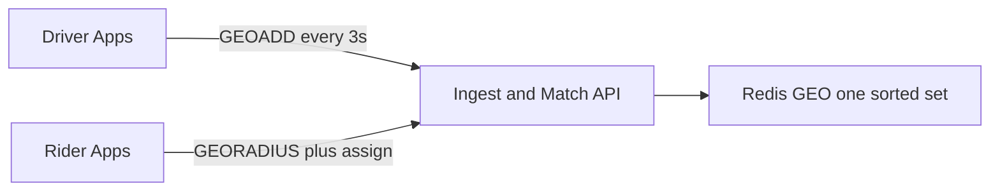
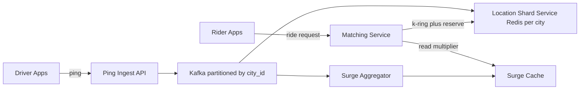
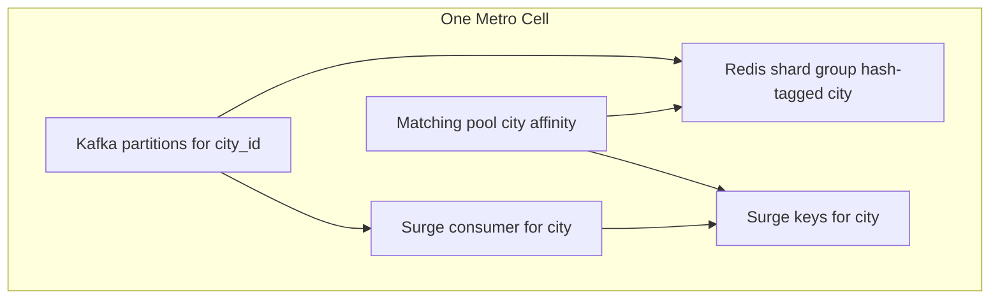

# Ride-Hailing Spatial Matching — Architecture Document
> - **Document Status**: Draft
> - **Last Updated**: 2026 Aug 29
> - **Author**: Paul Serban

A control-plane and data-plane redesign of live location, matching, and surge: space is discretized into H3 cells; membership is stored per cell; ingestion, state, matching, and surge are sharded by city so a storm in one metro cannot consume another metro's core. This document covers *what* the system is and *why* it is shaped this way; see [System Design](./03_system_design.md) for *how* pings, k-ring matching, reservation, and surge windows actually work, and [Trade-offs and Honest Assessment](./05_tradeoffs_and_honest_assessment.md) for what "H3 cells, city-sharded" costs.

## Overview

**Brief description**: Location and dispatch infrastructure, scoped narrowly: replace a global Redis GEO index with a city-isolated cell-membership fabric, and take surge off the match hot path. It is not a full ride-hailing product, not a routing company, and not a marketplace optimizer.

**Business Context**
- See [Scenario and Requirements](./01_scenario_and_requirements.md) for the full framing. In short: 900K drivers × 3s pings = 300K spatial writes/sec into a single-threaded GEO sorted set shared by 60 metros. `GEORADIUS` and `GEOADD` fight for one core; Cluster cannot split one key; one city's rain becomes every city's p99.
- Target users: owning engineer, on-call, marketplace/product. Capacity consumes "isolation is a topology, not a Redis flag."

## Requirements

### Functional Requirements

- **Ingest**: accept driver location pings, assign a city and an H3 cell, persist latest position and cell membership, and expire stale drivers from the matchable set.
- **Match**: given a pickup point, find a small set of nearby idle, fresh, unreserved drivers, rank them, reserve one atomically, return driver + approximate ETA.
- **Quote / surge**: given a pickup cell, return a capped, smoothed multiplier computed from recent localized supply and demand — not from a live GEO scan.
- **Release**: on trip start, cancel, reservation TTL, or driver status change, return the driver to the correct cell's idle set (or a busy set that matching does not read).
- **Isolate**: operate each metro's data plane so that overload, lag, or a bad deploy in city A is not city B's incident.

### Non-Functional Requirements

**Performance Requirements:**
- Ingest: sustain 300K pings/sec globally, with hot metros at ~20–30K/sec, with burst headroom. P99 of *accepting a ping into the log* is low tens of milliseconds. P99 of *the location store reflecting the ping* may be higher under burst; matching reads the store, not the log, and must tolerate that lag (staleness TTL).
- Match: low tens of milliseconds p99 for candidate fetch + reserve in a hot metro, excluding optional routing-engine calls on top-K.
- Surge read: single-key lookup. Not a function of how many drivers are in the city.

**Reliability Requirements:**
- **A lost ping is not a lost driver.** The next ping repairs. Matching must not require every 3s write to succeed.
- **A crashed matcher cannot leave a driver reserved forever.** Reservation TTL is the backstop.
- **Duplicate pings and out-of-order pings** (retries, mobile) must not resurrect an older position over a newer one. Last-write-wins with a monotonic write clock.
- **At-least-once log delivery** is assumed. Location apply is idempotent. Surge aggregation must be windowed so duplicates do not permanently inflate demand.

**Infrastructure Constraints:**
- Redis (Cluster) remains the location *serving* store. We do not require a new in-memory database in v1. We **do** require a different key schema than GEO. See [ADR-004](./04_architecture_decision_records.md#adr-004).
- A durable log (Kafka or equivalent) is in the target architecture for ingest decoupling and surge. It is not Phase 1 if Phase 0 says the stopgap is enough for tonight. See [ADR-003](./04_architecture_decision_records.md#adr-003).
- City geofences already exist operationally (you launch cities). They become partition keys. If they are sloppy polygons, sharding will be sloppy. That is a data problem, not a reason to stay on one GEO key.

**The defining constraint:**
- Redis command execution is single-threaded *per primary*. Isolation and scale are **key cardinality + shard assignment**, not "Redis GEO is built for geospatial." A spatial query that must scan a dense set on one key will always fight the writer of that key. The architecture is: **stop storing the world in one sorted set.**

## Executive Summary

The system is a **city-sharded location fabric** plus a **stateless matcher** plus a **streaming surge aggregator**. The scarce resource on the old path was Redis command-thread CPU, consumed by mixed `GEOADD`/`GEORADIUS` on one key, globally. The new path consumes that CPU in proportion to **one city's cell-set operations**, on shard groups that other cities do not share.

**Architecture Style:** Spatial discretization (H3) + partitioned streaming ingest + colocated in-memory membership + greedy match-and-reserve. Not a GIS platform, not an exact nearest-neighbor service, not a global optimizer.

**Key Components:**
- **Ping ingest API**: authenticates the driver, stamps server time, assigns city, publishes to the log. Does not `GEOADD`.
- **Location log**: Kafka (or equivalent), partitioned by `city_id` (sub-partitioned by H3 prefix for the largest metros).
- **Location shard service**: consumes the city partitions, maintains Redis cell sets + driver hashes on that city's shard group.
- **Matching service**: stateless, city-routed; k-ring lookup; approximate ETA rank; Lua/CAS reserve.
- **Surge aggregator**: streaming windows keyed by `(city_id, h3_surge_cell)`; writes a small surge cache.
- **Surge cache**: Redis keys per city/cell; quote and match read it.
- **Reservation TTL janitor**: lazy expiry on read + Redis key TTL; not a separate science project.

**Technology Stack:**
- Log: Kafka (documented default) or Kinesis. Partition key is city, not driver, not a random UUID.
- Serving store: Redis Cluster, hash-tagged by city, **no GEO commands in the hot path**.
- Compute: stateless matching pods with city affinity; stream processor (Kafka Streams or Flink) for surge.
- Spatial library: H3. Uber built it for this class of problem. That is a citation, not an argument from authority — the argument is discrete cells + k-ring vs geohash range scans.

**Architecture Principles:**
- **City is the isolation unit.** If city is not in the partition key, the isolation is fictional.
- **Cells, not radii.** Look up a set; expand a ring; do not scan a bounding box on a global index.
- **The log absorbs storms; the serving store serves matches.** Mixing those on one Redis thread is the old incident.
- **Approximate in the hot path; precise on the last mile of the last few candidates.** See [ADR-006](./04_architecture_decision_records.md#adr-006).
- **Reservation is a lock with a TTL, not a status field you hope to unset.**
- **Surge is precomputed.** If quote-time code is counting drivers, the design has regressed.

**Key Architectural Decisions:**
1. **H3 hex grid over Redis GEO / raw geohash / quadtree.** [ADR-001](./04_architecture_decision_records.md#adr-001).
2. **City-partitioned sharding of ingest, state, and compute.** [ADR-002](./04_architecture_decision_records.md#adr-002).
3. **Event log decoupling ingest from serving state.** [ADR-003](./04_architecture_decision_records.md#adr-003).
4. **Restructured Redis Cluster as the location store; bespoke in-memory service only as escalation.** [ADR-004](./04_architecture_decision_records.md#adr-004).
5. **Streaming windowed surge over on-demand scans.** [ADR-005](./04_architecture_decision_records.md#adr-005).
6. **Approximate ETA in the match hot path; routing engine for top-K only.** [ADR-006](./04_architecture_decision_records.md#adr-006).

### Context Diagram — current path (the anti-pattern)

Every city, every ping, every match, every surge scan: one key, one primary, one thread.

### Context Diagram — target path

Pings never take the matching thread. Matching never scans a global GEO set. Surge never counts live GEO at quote time.

## Runtime Architecture

1. **Ingest layer** (API, milliseconds): authn the driver, drop obviously bad points (null island, teleport jumps beyond a plausibility cap — see System Design), assign `city_id` from service-area geofence, publish `{driver_id, city_id, lat, lng, server_ts, status}` to Kafka. Return 202/204. Do not wait for Redis.
2. **Apply layer** (per-city consumers): for each ping, compute H3 matching cell (res 8) and surge cell (res 7); `HSET` driver record with TTL; if cell changed, `SREM` old cell / `SADD` new cell; if status is not idle, keep them out of the idle set. This is the only writer of location Redis.
3. **Match layer** (stateless, city-routed): pickup → H3 cell → k-ring idle sets until enough fresh candidates → rank by approximate ETA → optional route top-K → Lua reserve winner → return or next candidate.
4. **Surge layer** (stream processor): consume pings (supply snapshots) and ride-request events (demand); window by `(city_id, surge_cell)`; emit multiplier to surge cache.
5. **Janitor layer**: Redis TTL on driver hashes; reservation keys expire; read-path filters members whose hash is gone or `last_seen` is stale; periodic `SREM` of ghosts is backup, not the primary freshness mechanism.

City affinity: matching pods and location consumers are scheduled/routed so that NYC load lands on NYC shard group and NYC consumer group. A global "matching deployment" with a shared pool is how you recreate noisy neighbor at the app layer after fixing it at Redis.

### Metro isolation unit

Top ~10–15 metros get **dedicated** Redis shard groups and dedicated consumer/matching capacity. Remaining ~45 share **pooled** shard groups, still hash-tagged by city (isolation of *keys* and of *partitions*; shared *hardware* is an accepted density trade for small metros). If a "small" metro stops being small, promote it to dedicated. That is an ops runbook, not a rewrite.

Intra-city hotspot (NYC downpour saturating *NYC's* dedicated group) is **not** solved by city sharding. Escalation is sub-partitioning that city by H3 res-4/res-5 prefix onto more shards, and more matching pods. See [ADR-002](./04_architecture_decision_records.md#adr-002). Do not start there. Start with city.

## Components

### 1. Ping Ingest API
**Purpose**: Be a thin, city-aware publisher. Stop being a Redis client on the ping path.

**Responsibilities:**
- Authenticate the driver (existing session — this document does not invent an IdP).
- Stamp `server_ts`. Do not order by device clock.
- Resolve `city_id` from lat/lng against service-area polygons. If outside all areas, drop or park in a `city_unknown` dead-letter; do not write into a random city's set.
- Plausibility: reject or flag teleports (e.g. > 200 km from last *server-side* point in < 3s). Do not block the whole pipeline on a GIS dissertation.
- Publish to Kafka with partition key `city_id` (and for mega-metros, `city_id + h3_prefix`).
- Return quickly. Persistence of the ping is the log, not Redis.

**Interactions:**
- Writes: Kafka only.
- Reads: geofence cache, auth, optionally last point for teleport checks (last point may be cached; a miss is not a reason to hit GEO).

### 2. Location log (Kafka)
**Purpose**: Absorb write storms, decouple API pools from Redis CPU, and provide the ordered-enough feed surge aggregation needs.

**Responsibilities:**
- Topic(s) for `driver_location` and `ride_request` (demand). Separate topics; different volumes and consumers.
- Partitioning by city (see [ADR-002](./04_architecture_decision_records.md#adr-002)).
- Retention long enough for surge windows plus replay (hours, not weeks of 300K/sec — that is a storage bill; offload if you need history).
- Consumer groups: location-apply, surge-supply, others later (analytics). Matching does **not** consume this log per request.

**Interactions:**
- Producers: ingest API, ride-request API.
- Consumers: location shard service, surge aggregator.

### 3. Location shard service
**Purpose**: Turn a ping stream into queryable cell membership on Redis, per city.

**Responsibilities:**
- Consume only assigned city partitions.
- Maintain driver hash: `id, lat, lng, h3_match, h3_surge, status, last_seen, reservation_id?`.
- Maintain idle-driver **sets** per matching cell: `{city}cell:{h3}:idle`.
- On cell change: move membership. On status→busy: remove from idle. On status→idle: add.
- Apply last-write-wins using `server_ts` (ignore older pings).
- Do not expose GEO. Do not compute surge.

**Interactions:**
- Reads: Kafka, current driver hash (to SREM old cell).
- Writes: Redis shard group for that city.

### 4. Matching service
**Purpose**: Convert a pickup coordinate into a reserved driver without scanning the city.

**Responsibilities:**
- Resolve city; refuse to query another city's Redis.
- H3 index the pickup; k-ring expand (k=0,1,2…) until candidate quota or max k (max k is a product of "how far we will send a car," not "until we find someone in the metro").
- Hydrate driver hashes; drop stale / busy / reserved.
- Rank by approximate ETA (haversine × per-city speed factor, optionally time-of-day).
- Optionally call routing engine for top-K (K small: 3–5).
- Reserve via atomic script; on loss, next candidate.
- Emit `ride_request` / `match_attempt` events for surge demand (demand is requests, not successful matches — product must confirm; default is **requests**, so a no-car outcome still heats the cell).

**Interactions:**
- Reads: Redis cell sets, driver hashes, surge cache (if the match response includes the multiplier).
- Writes: reservation keys on the same shard group (hash-tagged city, so Lua can touch driver + reservation atomically on one slot — **this is load-bearing**; see System Design).

### 5. Surge aggregator
**Purpose**: Precompute multipliers so quote/match never scan.

**Responsibilities:**
- Windows: trailing T seconds/minutes of demand counts and supply estimates per `(city_id, h3_surge_cell)`.
- Supply: idle-driver distinct count in the surge cell (res 7 contains many res 8 matching cells). Prefer counting from the ping stream's idle flags or from periodic set-cardinality snapshots — pick one in System Design; do not double-count.
- Demand: ride requests whose pickup hashes to the surge cell.
- Function: capped `f(demand, supply)` with smoothing and hysteresis. Exact curve is product; architecture requires **bounded output** and **no division by zero theatrics**.
- Write `surge:{city}:{h3}` with short TTL; refresh as long as the city is live.

**Interactions:**
- Reads: Kafka location + request topics.
- Writes: surge cache (Redis, same city hash-tag or a dedicated surge Redis — either is fine; do not put surge scans back on GEO).

### 6. Quote API (thin)
**Purpose**: Return a multiplier without matching a car.

**Responsibilities:**
- Authn rider; resolve city and surge cell; `GET` surge key; default to 1.0 on miss (miss is "no recent aggregation," not "free ride" as a policy — product may instead fail closed and show "unavailable"; pick fail-open to 1.0x for availability, fail-closed if abuse of missing surge is a concern; see Trade-offs).
- Does not GEORADIUS. Does not estimate supply live.

### Communication Patterns

**Synchronous:**
- Rider ↔ Matching / Quote: HTTP or RPC, city-routed.
- Matching ↔ Redis: cell `SMEMBERS` / `SSCAN` (sets must stay small — that is why cells exist), `HMGET`, Lua reserve.
- Matching ↔ routing engine: only top-K, budgeted, skippable if the engine is slow (degrade to approximate ETA).

**Asynchronous:**
- Driver ping → Kafka → location apply.
- Ride request / ping → Kafka → surge.
- Reservation TTL expiry.

**Forbidden:**
- Ping HTTP handler → Redis GEO.
- Quote → count drivers.
- Matcher in city A → Redis keys of city B.

## Scaling Strategy

**Current Scale Requirements:**
- 300K writes/sec ingest, 60 metros, highly skewed density, match QPS bursty and local, surge cells ~500 m class.

**What scales by adding metros:**
- Kafka partitions (add partitions for the new city; do not rehash other cities if the key is city_id — new city, new partitions or share a pool).
- Redis hash slots already spread; dedicated shard groups are a **capacity assignment**, not a new hash function.
- Matching pods: scale the city pool.

**What does not need to scale globally:**
- A single GEO set. It must not exist.
- A global matching worker pool. That recreates the incident.

**Hot-metro escalation (intra-city):**
1. Dedicated Redis shard group + more pods (still one city keyspace).
2. Sub-partition Kafka and Redis keys by H3 coarse prefix inside the city (`{city:pref}` hash tags), matcher fans out to a small number of prefixes in the k-ring. This is real complexity. Do not do it in Phase 1.
3. Bespoke in-memory location service if Redis CPU per city is still the wall after (2). [ADR-004](./04_architecture_decision_records.md#adr-004).

**Bottleneck Analysis:**
- After redesign, the **correct** bottleneck is the hot metro's own shard CPU and matcher, plus last-mile ping gaps. That is the point of isolation.
- Secondary: Kafka hot partitions if a mega-city is one partition. Mitigation: sub-partition that city.
- Tertiary: cell sets that grew huge because resolution is too coarse downtown. Mitigation: locally higher resolution is a product/ops nightmare; first use k-ring with COUNT-like cap and `SSCAN`, then consider res 9 *for matching in that city only* as a versioned schema change — expensive, not v1.
- Surge: aggregator lag → stale multipliers. Matching still works; pricing is wrong. Treat as a marketplace incident, not a dispatch outage, unless product says otherwise.

**Redis set size invariant:** a matching cell (res 8, ~0.74 km²) in a dense downtown might hold tens to low hundreds of idle drivers, not tens of thousands. If a cell set is thousands, either the city is using the wrong resolution or idle/busy is not being maintained and you have rebuilt GEO in a SET. Alert on set cardinality.

## Data Architecture

### Data Model

**Key Entities:**
- **DriverLocation**: driver_id, city_id, lat, lng, h3_match, h3_surge, status (`idle` | `reserved` | `busy` | `offline`), last_seen, server_ts.
- **CellIdleSet**: city_id + h3_match → set of driver_ids (idle and not reserved).
- **Reservation**: reservation_id, driver_id, rider_id / trip_id, expires_at.
- **SurgeCell**: city_id + h3_surge → multiplier, demand_count, supply_est, updated_at.
- **City**: id, geofence, speed_factor, dedicated_or_pooled, kafka_prefix, max_k_ring.

**Entity Relationships:**
- One driver is in at most one city and at most one matching cell idle set at a time.
- One reservation holds one driver.
- Surge cells contain multiple matching cells (res 7 parent of res 8).

### Data Lifecycle

**Create/update**: ping upserts DriverLocation; membership moves; ride request increments demand window.

**Read**: match reads idle sets + hashes; quote reads surge.

**Delete/expire**: driver hash TTL; reservation TTL; idle-set ghosts removed on apply or janitor; surge keys TTL refreshed.

## Cost Analysis

### Cost Components

**Money:**
- Kafka at 300K × ~200 B messages/sec is on the order of **~60 MB/sec** ingest, plus ride requests (tiny). This is real but not exotic. Retention is the lever. Multi-AZ Kafka is the bill.
- Redis Cluster: many smaller primaries instead of one hero box. **More instances, more replication, more memory overhead, less wasted *unusable* headroom on a single core.** Net Redis spend likely *up*. You are buying isolation, not a discount.
- Stream processor for surge: always-on compute. On-demand surge was "free" (it stole matching CPU). Precompute costs money so matching can spend CPU on matching.
- Routing engine calls for top-K: per-match vendor or OSRM fleet. Cap K. This can exceed Redis cost if someone routes every candidate.

**Engineering time — the actual cost:**
- Key schema + city routing + Lua reservation: weeks.
- Kafka + consumers + replay + "out-of-order ping": weeks.
- Matcher k-ring + ranking + drills for double-book: weeks.
- Surge windows + hysteresis + marketplace fights about the curve: longer than engineers expect, because it is product.
- Topology: dedicated vs pooled metros, partition assignment, on-call per metro: ongoing.
- Client changes: none required for pings if the API shape stays; matching API may add reservation semantics.

**Risk cost of staying on GEO:**
- Global matching outages during local weather. That is a marketplace trust cost. It is why this project exists *if* Phase 0 confirms the diagnosis.

### Cost Optimization

- Pooled shards for long-tail metros.
- Do not retain location topics for weeks.
- Do not call routing for k-ring members 6–40.
- Do not build a custom spatial DB in v1.
- Single PUT-equivalent: skip Kafka only as a Phase 1 stopgap, not as the target if 300K and surge-from-log are real. See Trade-offs.

## Risks and Mitigation

| Risk | Likelihood | Impact | Mitigation Strategy | Owner |
| --- | --- | --- | --- | --- |
| Phase 0 shows memory-healthy Redis and people still "add Cluster" | High | High | Commandstats + one-key proof in writing before Kafka | Owning engineer |
| City geofences wrong; pings land in the wrong shard | Medium | High | Dead-letter `city_unknown`; border buffer runbook; do not dual-write by default | Ops + owning engineer |
| Kafka one-partition mega-city | High for top metros | High | Sub-partition those cities by H3 prefix from day of promotion to dedicated | Platform |
| Cell-set ghosts after TTL on hash | High if ignored | Medium | Filter on read by last_seen; janitor SREM; alert on cardinality | Location service |
| Hex edge: nearest car in adjacent cell missed at k=0 | High | Medium | Always consider k=1 before declaring sparse; max k capped | Matcher / product |
| Double-book if reservation is not atomic / not same hash slot | Medium | High | Lua + hash tags; drill in Phase 3; kill criterion | Matcher |
| Approximate ETA grossly wrong at rivers | High in some cities | Medium | Top-K routing; city-specific shame list; do not route the world | Matcher |
| Surge flicker / oscillation | High with raw ratios | High | Coarser surge cell, smoothing, caps, hysteresis | Marketplace |
| Surge lag during aggregator outage | Medium | Medium | TTL + last-known; fail-open 1.0x or fail-closed — written product choice | Quote |
| Isolation drill fails because matching is still a global pool | High | High | City affinity as a gate, not a "later" | Phased plan |
| "Just use Redis GEO but per city" declared done | High | Medium | Accept as stopgap; do not retire the GEO-in-city problem if NYC still scans 80K | Trade-offs |
| Building a custom location VM to feel like Uber | Medium | High | [ADR-004](./04_architecture_decision_records.md#adr-004): Redis until measured otherwise | Architecture |
| 300K/sec assumed, actual is 30K | Medium | Low (correct kill) | Phase 0 numbers; maybe stopgap only | Phase 0 |
| Cross-region active-active for pings | Low (someone will ask) | High | Refuse; home region per city | ADR-002 |

## Future Enhancements

### Phase 1 (current design's first slice)
**Focus**: Diagnose, then city-sharded cell sets without Kafka if needed as stopgap. See [Phased Implementation Plan](./06_phased_implementation_plan.md).

### Phase 2
**Focus**: Log-backed ingest.

### Phase 3
**Focus**: Matcher + reservation on the new index.

### Phase 4
**Focus**: Streaming surge.

### Phase 5
**Focus**: Per-metro cutover, isolation drill, GEO retirement.

### Technical Debt (accepted)

- H3 is an approximation. Exact NN is not started.
- Intra-city prefix sharding is designed as escalation, not built.
- Routing engine is optional and degraded-around.
- Redis remains; a custom location service is an ADR revisit, not an inevitable rewrite.
- Surge curve tuning will never be "done." Cap it so it cannot page matching.
- Pooled small metros share hardware; a pooled-shard storm is still a multi-city event for those 45. Dedicated promotion is the fix, not a global GEO return.
