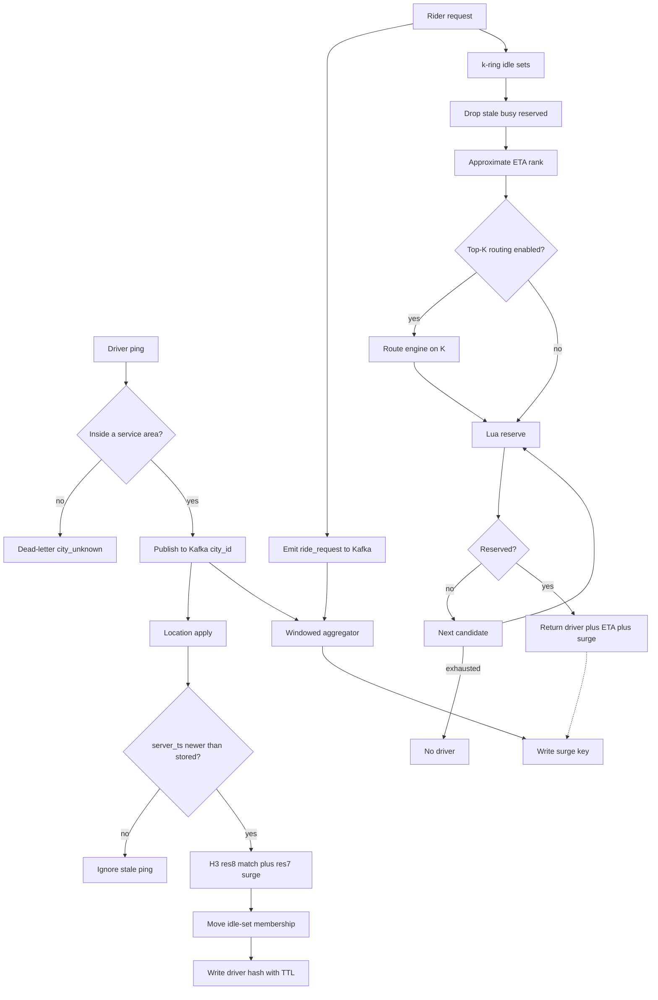
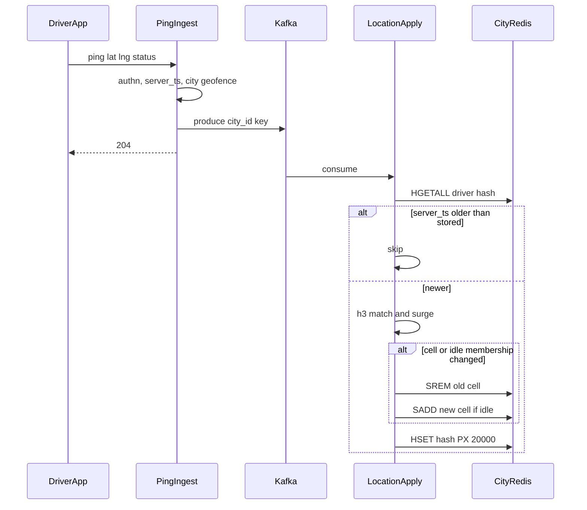
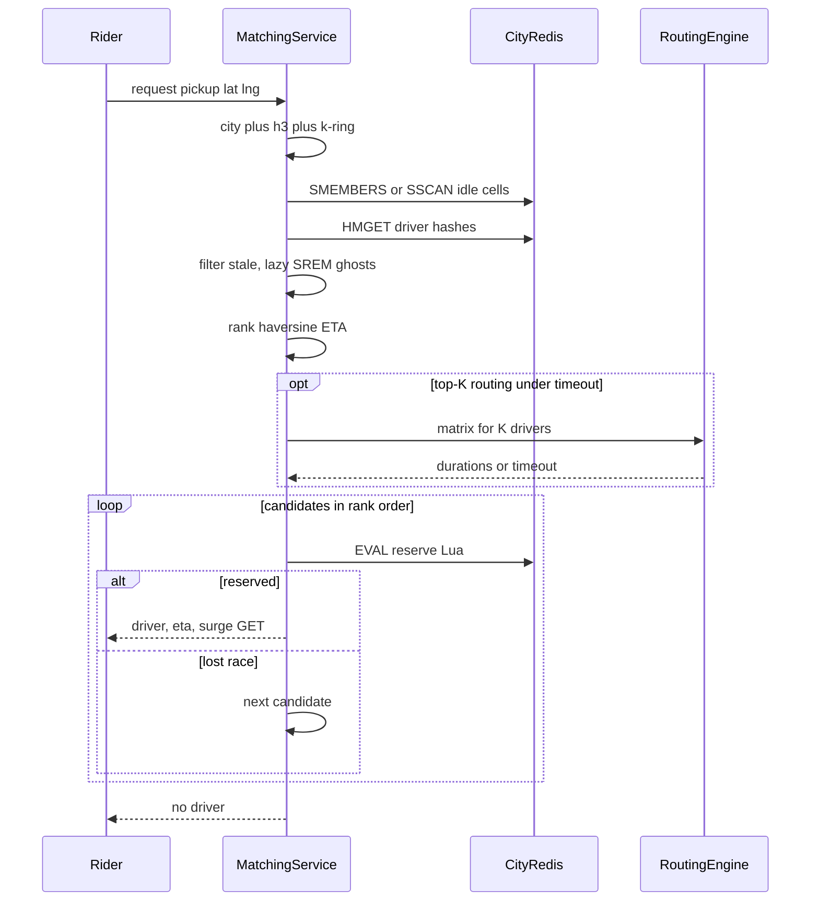
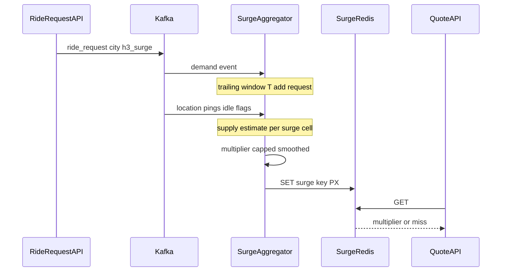
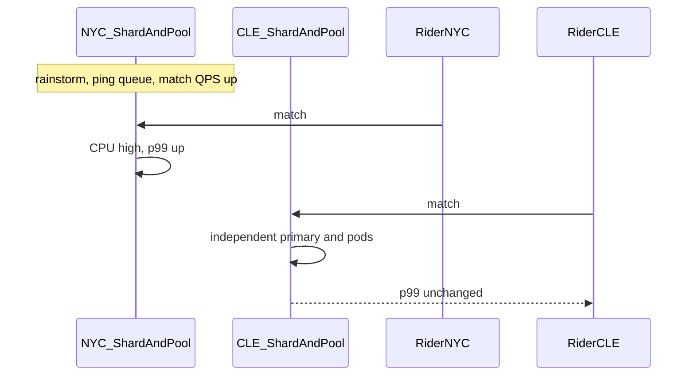
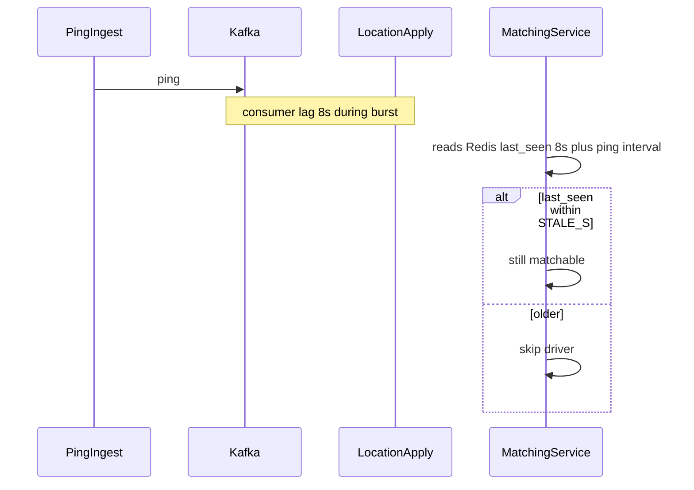

# Ride-Hailing Spatial Matching — System Design
> - **Document Status**: Draft
> - **Last Updated**: 2026 Aug 29
> - **Author**: Paul Serban

This document is the mechanical *how* for the system described in the [Architecture Document](./02_architecture_document.md). It specifies H3 resolutions, key layout, ping apply, k-ring matching, atomic reservation, surge windows, and failure behavior. It does not specify code.

## 1. Control Flow

Two write clocks, one read path. Pings update serving state asynchronously. Matches read serving state synchronously. Surge is a third consumer of the log, not a function on the match path.



**Invariants:**
- The ping HTTP handler does not write Redis.
- Matching does not consume Kafka per request.
- Quote/match surge is a `GET`, not a count.
- All Redis keys for a city share a hash tag `{city_id}` so reservation Lua can touch driver hash + idle set + reservation key on one slot.
- A driver is in at most one `{city}cell:{h3}:idle` set.

## 2. Spatial Geometry

### 2.1 Resolutions

| Use | H3 resolution | Approx edge | Role |
| --- | --- | --- | --- |
| Matching cell | **8** | ~461 m | Idle-set grain. Closest standard edge to "500 m hex." |
| Surge cell | **7** | ~1.22 km | Multiplier grain. Parent of res 8. Less flicker. |
| Intra-city Kafka/Redis sub-partition (escalation only) | **4 or 5** | ~20–45 km | Prefix to split a mega-city, not a matching grain. |

"500-meter hexagonal cells" in the scenario is treated as **matching grain ≈ res 8**, not as surge grain. Computing surge per res 8 cell with 1 request and 0 drivers is how multipliers explode. Product may *display* a heatmap at res 8; the **binding multiplier** is res 7 (or max of res 7 and a 1-ring of res 7 — a product choice). See [ADR-001](./04_architecture_decision_records.md#adr-001) and [ADR-005](./04_architecture_decision_records.md#adr-005).

### 2.2 k-ring

Pickup point → `h3_match = geoToH3(lat, lng, 8)`.

Search order:

1. k = 0: the pickup cell.
2. If fewer than `CANDIDATE_MIN` **fresh idle unreserved** drivers, k = 1 (6 neighbors).
3. k = 2 if still short, then stop at `K_MAX`.

**Working defaults:** `CANDIDATE_MIN = 8` (enough to lose a few reservation races and still pick), `K_MAX = 2` (~19 cells). At res 8, k = 2 is roughly a ~1.5 km scale neighborhood, not the whole metro. Sending a car from k = 4 because downtown is empty is a product decision that blows ETA; do not encode "keep expanding until found" as architecture. Empty after `K_MAX` is a valid "no driver" if the city is actually empty nearby.

**Hex-edge effect:** a rider on a boundary with a car 20 m away in the neighbor cell is missed at k = 0. **k = 1 is the default first expansion, not an edge-case.** In dense cells, still fetch k = 0 first (cheap), but if you need quality over latency, fetch k = 0 and k = 1 in parallel and union. Parallel is the better default in hot metros; sequential k-loop is simpler for Phase 3.

**Do not sort the entire city.** k-ring is the index.

### 2.3 Approximate ETA

```
dist_m = haversine(pickup, driver)
eta_s  = dist_m / city.speed_mps(time_of_day)
```

`speed_mps` is a calibrated per-city (optionally per hour-of-week) factor, not live traffic. It will be wrong at rivers, bridges, one-ways, and "the freeway is 40 m away and 8 minutes to the exit." Mitigation: optional routing engine on **top K = 3–5** after the approximate rank, with a hard timeout (e.g. 20 ms). On timeout, keep approximate rank. See [ADR-006](./04_architecture_decision_records.md#adr-006).

Working default: **do not call routing in v1 matching.** Ship approximate. Add routing when a city has a documented "haversine shame" (rivers). Building OSRM globally to make the architecture look complete is how this project misses Phase 3.

## 3. Redis Key Layout

Hash tag `{city_id}` on every key the Lua script must see together. Cluster slot = hash of the tag.

| Key | Type | Contents | TTL |
| --- | --- | --- | --- |
| `{city}drv:{driver_id}` | Hash | lat, lng, h3_match, h3_surge, status, last_seen, server_ts | ~20 s, refreshed every ping |
| `{city}cell:{h3}:idle` | Set | driver_ids currently idle in that matching cell | none (members removed explicitly) |
| `{city}rsv:{driver_id}` | String | reservation_id + rider/trip + exp | ~20–30 s |
| `{city}surge:{h3_surge}` | Hash or string | multiplier, demand, supply, updated_at | ~60–120 s, refreshed by aggregator |

**Why driver hash TTL is not enough.** When `{city}drv:{id}` expires, the id may remain in `{city}cell:{h3}:idle`. Sets do not honor member TTLs. Freshness is:

1. **Write path:** every ping refreshes the hash TTL and repairs membership.
2. **Read path (mandatory):** matching hydrates hashes; missing hash or `now - last_seen > STALE_S` → skip and `SREM` (lazy delete).
3. **Janitor (backup):** periodic `SSCAN` of high-cardinality cells, `SREM` ghosts. Not the primary.

If you skip (2), you will dispatch ghosts. If you skip (1), read-path `SREM` becomes the writer and matching pays it.

**STALE_S working default:** 15 seconds (5 missed pings at 3s). Tighter than 15s increases false "no driver" when last-mile gaps are common. Looser than 30s dispatches cars that have gone into a garage. Phase 0 should look at actual ping-gap p99 before freezing this.

**Sorted-set alternative:** `ZADD` cell members with score = `last_seen`, `ZRANGEBYSCORE` min = now - STALE_S. Cleaner reads, more write cost (ZADD every ping even if cell unchanged). Sets + hash TTL + lazy SREM is the default (cheaper when the driver stays in cell, which is the common case). Revisit if ghost cardinality alerts fire. See [ADR-004](./04_architecture_decision_records.md#adr-004).

### 3.1 Same-slot invariant for reservation

The Lua reserve script must:

- Read `{city}drv:{id}` status and last_seen
- Check `{city}rsv:{id}` does not exist
- `SREM` `{city}cell:{h3}:idle` {id}
- `SET` `{city}rsv:{id}` with PX
- `HSET` status = reserved

All those keys **must hash to one slot**. That is why the tag is `{city}` and not `{city}:{h3}`. Tagging by cell would spread a city (good for CPU) and **break multi-key Lua** when reserve needs driver + cell + rsv (driver and cell would diverge).

**Implication:** a city's keys live on **one Cluster slot** if the tag is only `{city_id}`. One slot = one primary. City sharding isolates *cities from each other*. A whole city still sits on one Redis primary unless we change the tag scheme.

This is the most important mechanical fact in the design. Be honest:

- **v1 tag `{city_id}`:** 60 slots used for 60 cities (plus unrelated keys). Redis Cluster has 16384 slots, but **one city = one primary**. NYC's 80K drivers × ping rate of ~27K HSET/SADD/sec lands on **one core**. That is still far better than 300K GEO+RADIUS globally. It may still be tight for NYC.
- **Escalation tag `{city_id}:{h3_prefix}`:** splits a city across primaries. Lua can only touch keys in one prefix. Reservation must then **only SREM the cell the driver is in** (same prefix if prefix is coarse enough that a res-8 cell never straddles prefixes — choose prefix resolution so a cell id's prefix is a function of the cell, which it is). Driver hash must use the **same** prefix as current cell. When a driver crosses a prefix boundary, the apply path is a cross-slot move: read old, write new, delete old — not one Lua across prefixes. This is why prefix-split is Phase-later: the apply path gets a distributed move.

v1 accepts **one Redis primary per city** (dedicated instance or one Cluster primary that holds that city's slot). Promote hot cities to **dedicated Redis primary hardware**, not to a different algorithm. Prefix-split is the next ADR, not v1. See [ADR-002](./04_architecture_decision_records.md#adr-002).

Pooled small metros: multiple `city_id` tags will hash to *different* slots, which may still land on the same Cluster primary. Isolation is probabilistic at slot level on a shared Cluster. **Dedicated hardware for top metros is the real isolation.** Hash tags on a shared 3-primary Cluster are "better than one GEO key," not "NYC cannot hurt Cleveland" if they share a primary. Topology must assign **NYC's slot to a primary Cleveland's slot is not on**. That is Cluster slot allocation / separate clusters, not a naming convention.

**Documented v1 topology:**

- Separate Redis Cluster (or standalone primary + replica) **per dedicated metro**.
- One shared Cluster for pooled metros, hash-tagged by city (best-effort isolation; slot migration if two hot pooled cities collide).
- Do not run all 60 cities as hash tags on a 3-node Cluster and claim isolation. That claim is false whenever two cities share a primary.

## 4. Sequences

### 4.1 Ping ingest and apply (happy path, cell change)



**Out-of-order:** mobile retries can deliver ping T1 after T2. Compare `server_ts` (ingest stamp at produce time, carried on the message). If apply is partitioned by city only, two apply workers for the same city must not run (consumer group: **one worker per city partition**). That preserves per-partition order. Sub-partitioned mega-cities: order is per prefix, which is enough if a driver rarely hops prefixes in one second; last-write-wins still applies per driver hash.

**Idempotent apply:** same message twice (at-least-once): same `server_ts` → treat as not newer (use `>=` skip or equal-ts no-op). Do not SADD twice in a way that matters (sets are idempotent).

### 4.2 Match, reservation race, retry next candidate



**Lua reserve (semantics, not source):**

1. If reservation key exists → return LOST.
2. If driver hash missing or last_seen stale or status ≠ idle → return LOST, optionally SREM.
3. If driver is not in the expected cell idle set → return LOST (moved).
4. SREM idle set, SET reservation PX, HSET status reserved, return WIN + snapshot.

**Lost race is normal** in a storm. Rank list of 8 exists so this is not "fail the rider." If all lose, expand k or return no driver. Do not hold a mutex on the cell.

**Reservation TTL 20–30s:** rider confirm / trip-create must complete in this window or the driver returns to idle (apply or a tiny expiry path: on GET miss of rsv, if status is reserved, revert to idle and SADD — lazy). A matcher crash mid-loop does not tombstone cars.

### 4.3 Surge window (demand spike, supply lag)



**Window T working default:** 2–5 minutes for demand. Shorter flickers; longer is not "surge," it is a slow average.

**Supply estimate:** do **not** `SCARD` every matching cell on every quote. Aggregator options:

- **A (preferred):** periodic (e.g. 5s) cardinality snapshot: for each surge cell, sum `SCARD` of child matching idle sets (res 7 has 7 children of res 8). Done in the location service or a snapshot loop on the city Redis. Volume: number of cells with activity, not 300K.
- **B:** unique idle drivers from ping stream in window. Under-counts silent-but-fresh drivers who have not pinged this window yet but are still in-TTL. Worse.

Use A. Pings still feed status; snapshots feed surge supply.

**Demand:** count `ride_request` events in the window for that surge cell. Use event-time from server_ts. Dedup by `request_id` in the window so retries do not heat surge.

**Miss on GET:** documented product choice. Default: **1.0x** (fail-open) so a dead aggregator does not freeze the marketplace, plus an alert. Fail-closed ("cannot quote") is allowed if abuse of 1.0x during outage is worse. Write it down in Phase 4. See [Trade-offs](./05_tradeoffs_and_honest_assessment.md).

### 4.4 Isolation: storm in city A, quiet city B



If this sequence is false in a drill, the topology is still shared (same Redis primary, or same matching pool, or Kafka controller overload — the last is a platform issue; distinguish data-plane isolation from "Kafka cluster metadata is a global brain"). Isolation drill is a Phase 5 gate.

### 4.5 Apply lag vs match (staleness, not blocking)



Matching does **not** wait for the lag to drain. The rider gets a slightly stale map filtered by TTL. Catching up is the apply consumer's job (scale that city's consumers / Redis). If lag exceeds STALE_S, match quality collapses toward "no drivers" even if cars are there — that is a **city** incident, correctly isolated.

## 5. Data Model (Logical)

Not Redis syntax. Grain and invariants only.

### driver_location (hash)

| Field | Role |
| --- | --- |
| driver_id | PK |
| city_id | Partition. Changes only on geofence reassignment (rare). |
| lat, lng | Last accepted point |
| h3_match | res 8 |
| h3_surge | res 7 |
| status | idle \| reserved \| busy \| offline |
| last_seen | server time of last **applied** ping |
| server_ts | for LWW |
| heading / speed | optional; not required for v1 match |

**Invariants:**
- status idle ⇔ member of exactly one idle cell set (lazy violations repaired on read).
- reserved ⇒ reservation key exists or is racing expiry (repair on read).
- busy / offline ⇒ not in idle set.

### cell_idle_set

| Field | Role |
| --- | --- |
| city_id + h3_match | PK |
| driver_ids | members |

**Invariants:** cardinality alert if > N (working: 500). A res 8 downtown cell should not hold thousands of idle ids if busy/idle is correct.

### reservation

| Field | Role |
| --- | --- |
| driver_id | PK (one active reservation per driver) |
| reservation_id | unguessable |
| trip or rider | who holds it |
| expires_at | TTL |

**Invariants:** winning Lua is the only creator. Confirm-trip is a separate call that sets status busy and deletes reservation (or converts it). This document does not design trip lifecycle beyond that handoff.

### surge_cell

| Field | Role |
| --- | --- |
| city_id + h3_surge | PK |
| multiplier | bounded, e.g. 1.0–3.0 |
| demand_count, supply_est | for debug, not for quote math on read |
| updated_at | freshness |

**Invariants:** multiplier is never NaN, never unbounded. Updated_at older than 2× refresh interval → treat as miss.

### ride_request event (log)

request_id, city_id, h3_surge, server_ts. Needed for surge. Matching emits it at request time, not at success time.

## 6. Consistency, Races, Staleness

### 6.1 What we guarantee

- **Reservation mutual exclusion** for a driver, on that city's Redis primary, via Lua. Two matchers cannot both WIN.
- **LWW positions** per driver on a single apply partition.
- **Isolation of CPU** between dedicated metros, if topology matches §3.1.

### 6.2 What we do not guarantee

- **Exact nearest driver.** H3 + k-ring + approximate ETA.
- **Read-your-pings on match.** Apply lag exists. TTL bounds how wrong.
- **Exactly-once surge counts.** At-least-once log + request_id dedup in window is "accurate enough." A replay of a whole window can still bias; treat replay as an ops event (reset windows).
- **Cross-city atomicity.** Does not exist. A driver on a border is in one city.
- **Linearizability across prefix-split shards.** Not in v1.

### 6.3 Double-dispatch (the GEO-era bug)

GEO path: GEORADIUS → app thinks idle → two apps SET busy. Window grows with latency.

New path: idle is only trusted inside Lua that also reserves. App-side "I listed them" is not a lease.

**Still possible:** apply sets idle while Lua reserved if apply does not check reservation key. **Apply must not SADD idle if rsv exists or status is reserved/busy.** Apply is status-aware. Ping with status idle from a device that does not know it was reserved is a real event (stale app state). Prefer **server status as authority**: a ping does not clear reserved/busy; only TTL / trip service does. Device-reported status is a hint for offline vs looking-for-trip when **unreserved**.

This is load-bearing. If pings can overwrite `reserved` to `idle`, you will double-dispatch.

## 7. Error Handling

| Failure | Where | What the system does | What it must not do |
| --- | --- | --- | --- |
| Ping outside geofence | Ingest | Dead-letter; no Redis write | Write into a neighbor city "to be nice" |
| Kafka produce fail | Ingest | 503; driver retries next interval | GEOADD fallback "so we don't lose pings" |
| Older ping | Apply | Skip | Overwrite newer position |
| Apply lag > STALE_S | City apply | Page that city; matches skip stale | Block matching globally |
| Empty k-ring at K_MAX | Match | no driver | GEORADIUS the whole city as fallback |
| Lua LOST | Match | next candidate | retry same driver in a tight loop without backoff |
| All candidates LOST | Match | no driver or one more k if under K_MAX | lock the cell |
| Routing timeout | Match | keep haversine rank | stall the request |
| Surge aggregator down | Quote | miss policy (default 1.0x) + alert | GEORADIUS to recompute |
| Reservation TTL fire mid-confirm | Trip | confirm Lua must re-check; if expired, fail confirm, match again | trip with no lock |
| Shared Cluster primary hosts NYC+CLE | Topology | failed isolation drill | declare city hash tags sufficient |
| Ghost members | Match | lazy SREM | dispatch without hash |
| Teleport ping | Ingest/apply | drop or flag | warp the car into another cell across the metro |

Redis GEO commands on this path are **not** in the table. If they appear in an incident on the new path, the old index is still in the data path.

## 8. Observability (Minimum)

If on-call only has global Redis CPU, city isolation is invisible.

- **Per city:** ping produce rate, apply lag, Redis primary CPU, HSET/SADD ops/sec, match QPS, match p99, no-driver rate, reservation WIN/LOST, STALE skip rate, idle-set max cardinality, surge updated_at age, surge miss rate.
- **Global only for:** Kafka controller, platform.
- **Dashboards that page:** city apply lag vs STALE_S; city Redis CPU; isolation canary (synthetic match p99 in a quiet city during a load test in a loud one).
- **Do not:** average all cities into one matching p99 as the SLO. That SLO hides NYC.

## 9. Security and Abuse (Minimum)

Not a full security architecture. Matching-adjacent:

- Driver pings are authenticated; a client cannot GEO-spoof another driver_id.
- Reservation ids are unguessable; knowing a driver_id is not enough to steal a reservation without the match path.
- Surge must be capped; otherwise a bot farm of ride_requests in a cell is a pricing weapon. Rate-limit request events per rider and per cell. This is marketplace integrity, not optional polish.
- Location topics are PII (paths). Retention short; access locked. This is why "keep Kafka forever for ML" is not free.

## 10. What stays on Redis (and what does not)

Still on Redis: cell sets, driver hashes, reservations, surge keys — **per city topology in §3.1**.

Not on Redis: the ingest buffer (that is Kafka), historical paths, surge window state (that is the stream processor's state store — changelog to Kafka, not a GEO rebuild).

Not on Redis GEO: anything. `GEOADD`/`GEORADIUS` retired after Phase 5. A leftover GEO key is a second index that will desync and get used as a fallback in a panic. Kill it on a date. See [Phased Implementation Plan](./06_phased_implementation_plan.md).
