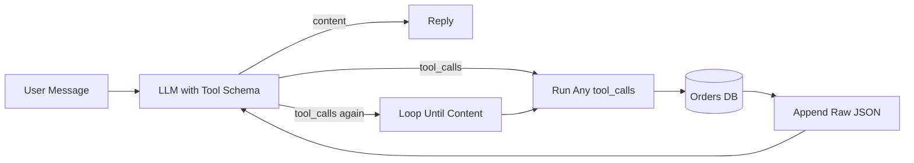
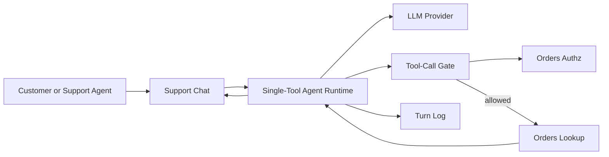
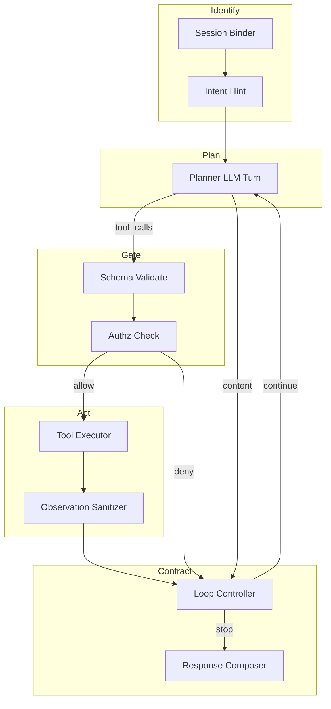
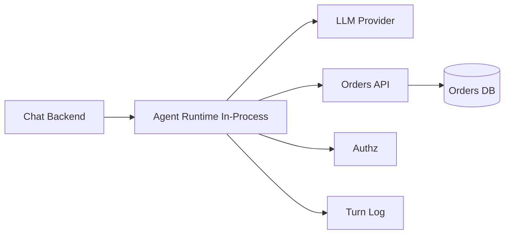

# Single-Tool Agent — Architecture Document
> - **Document Status**: Draft
> - **Last Updated**: 2026 Aug 29
> - **Author**: Paul Serban

A **single-tool agent runtime** that sits between a support chat and one orders lookup, so that "the model emitted `tool_calls`" becomes a gated, bounded, typed loop — not `if tool_calls: run(args)`. This document covers *what* the system is and *why* it is shaped this way; see [System Design](./03_system_design.md) for *how* records, the loop contract, and the sequences actually work.

## Overview

**Brief description**: This is an internal support-chat agent, not a customer-facing "AI platform" and not a multi-tool orchestrator. It is scoped narrowly on purpose: one user message in; at most a handful of LLM turns and one kind of DB lookup; a reply with a typed outcome out. It does not refund. It does not search. It does not speak MCP. It does not "make the model honest."

**Business Context**
- Owner: the team that wants a support bot to look up order status and is currently losing the "just wire function calling" argument in a pull request (see [Scenario and Requirements](./01_scenario_and_requirements.md)).
- Current state: tool schema in the request, execute whatever the model asked, dump JSON back, loop until content appears.
- Desired future state: Plan → Gate (schema + authz) → Execute → Sanitize observation → Compose or stop. Forced grounding for status intents. Cap on turns. Typed tool failures.
- Goal: stop executing unauthorized lookups and stop narrating status that never came from the DB — at the cost of more "I couldn't check" replies, a gate that must stay in sync with orders authz, and residual Class G on intents you did not label.
- Target users: chat owner, orders-API owner, security/authz, support ops, platform/serving.

## Requirements

### Functional Requirements

- **Identify the caller**:
  - Session supplies `caller_id` (and optional `acting_as_customer_id` + grant id for support staff). The model never passes identity.
  - Missing session → reject the request. Do not run the agent as a DB superuser "for the demo."
- **Plan**:
  - One LLM turn with the tool schema advertised. `tool_choice` is `auto` by default; `required` only when a status-bearing intent is already classified ([ADR-005](./04_architecture_decision_records.md#adr-005)).
- **Gate**:
  - If the model emits a tool call: validate name (must be `get_order_status`), validate arguments against the schema, authorize `order_id` for this caller. Fail closed ([ADR-001](./04_architecture_decision_records.md#adr-001)).
- **Execute**:
  - Timeout-bounded DB/API lookup. Read-only. Credential must not be able to read arbitrary orders if the gate is skipped — defense in depth: the query is scoped (`WHERE order_id=? AND customer_id=?`) in addition to the gate.
- **Observe**:
  - Map the result to a typed `tool_result`. Sanitize/allowlist fields before the next LLM turn ([ADR-004](./04_architecture_decision_records.md#adr-004)).
- **Terminate**:
  - `grounded_answer` | `needs_clarification` | `tool_unavailable` | `authz_denied` | `capped` | `ungrounded_blocked`. Last model prose is never returned as success if the outcome forbids it ([ADR-003](./04_architecture_decision_records.md#adr-003)).
- **Observe (ops)**:
  - Skip rate (Class G), gate deny rate, tool error rate, cap-hit rate, tokens and latency per turn.

### Non-Functional Requirements

**Performance Requirements:**
- Design intent: p95 of a **grounded** reply is **one** LLM turn + one lookup when the model calls correctly on turn 0. Retries and extra turns make p99 ≈ cap × (LLM p95 + lookup p95). **Do not hide extra turns in the p95 SLO.** Publish p95 first-turn and p95 including loop separately.
- The gate (schema + authz) is cheap relative to generation. It belongs in-process with the worker, calling the same authz the orders API already uses — not a new IAM hop unless compliance requires it.
- Sync chat: the user waits on the full loop. Cap exists so a stuck model cannot become a 30s spinner. Default wall-clock budget: **8 seconds** or the turn cap, whichever first. Exceeding wall-clock → `capped` / `tool_unavailable`, not another sample.

**Service Level Agreement (SLA):**
- System criticality: customer-data-adjacent. A wrong status is a support incident. A leaked other-customer order is a privacy incident. Availability of the *chat service* can be high; availability of *grounded status* cannot exceed the orders DB.
- Fail closed on gate/authz: if the authz check is down, do not skip to "just run the query." Fail the tool call (`unavailable`).
- Provider outage: the agent cannot ground. Return `tool_unavailable` (or `model_unavailable`) — do not answer status from memory.

**Infrastructure Constraints:**
- Technology shape (not an implementation mandate): one LLM SDK with function calling; a JSON Schema for the tool; the existing orders lookup; a table or log for turns; session auth already on the chat. This is not an excuse to buy an "agent platform" on day one.
- Function-calling / `tool_choice` quality depends on the serving provider. If the provider cannot force a tool, forced grounding is a **compose-time reject** (no `grounded_answer` without a result), not a decode-time guarantee.
- Order rows are production customer data. Retention and access inherit from the host product.
- Tool schema can be a file in git for v1. A tool registry is 2.2 / 3.4, not this warm-up.

## Executive Summary

The architecture is **Plan → Gate → Execute → Sanitize → Compose or stop**. It is a contract with a data model and a cap, not a cookbook snippet.

1. **Identify** binds the request to a session identity the model cannot override.
2. **Plan** lets the model emit a tool call or a message.
3. **Gate** validates and authorizes before any DB I/O.
4. **Execute** runs the one tool with a timeout.
5. **Sanitize** allowlists and delimits the observation.
6. **Compose** may produce `grounded_answer` only if policy and transcript agree.
7. **Cap** ends the loop with a typed failure, not another generation.

**Architecture Style:** Synchronous request/response loop around one LLM and one read-only tool. Not a workflow engine. Not multi-agent. Not MCP.

**Key Components:**
- **Session / Identity Binder**: caller and optional acting-as grant.
- **Intent Hint (optional)**: cheap classifier for status-bearing vs other; used only to set `tool_choice` and forced-grounding. Wrong classifications must fail safe (force a lookup you didn't need, or refuse to claim grounded).
- **Planner (LLM turn)**: the model with one tool schema.
- **Tool-Call Gate**: schema + authz — the load-bearing component.
- **Tool Executor**: the orders lookup, timeouts, transport retry.
- **Observation Sanitizer**: allowlist, delimit, drop notes.
- **Loop Controller**: turn/tool caps, duplicate suppression, wall-clock.
- **Response Composer**: outcome enum, templates for failures, grounded prose only on `ok`.
- **Turn Logger**: every stage, every gate decision.

**Architecture Principles:**
- **The model is not a PEP.** Arguments are untrusted until the gate says otherwise.
- **Function calling is a schema, not a runtime.** The runtime is the loop controller + gate.
- **A tool result is not a grounded answer** until the composer is allowed to speak.
- **Observations are data, not instructions.**
- **The cheapest correct control wins.** DB-level `customer_id` filter beats hoping the prompt is obeyed.
- **Do not start 2.2 in this repo.** One tool. Cite MCP/ReAct as the next project, not a v1 feature.

**Key Architectural Decisions:**
1. Gate separate from model intent ([ADR-001](./04_architecture_decision_records.md#adr-001)).
2. Finite loop cap ([ADR-002](./04_architecture_decision_records.md#adr-002)).
3. Typed tool failure, no narrated success ([ADR-003](./04_architecture_decision_records.md#adr-003)).
4. Untrusted observations ([ADR-004](./04_architecture_decision_records.md#adr-004)).
5. Forced grounding for status intents ([ADR-005](./04_architecture_decision_records.md#adr-005)).

### The Anti-Pattern This Design Exists to Kill

This fails because:

- There is no gate, so the model's `order_id` is a capability.
- There is no cap, so p99 and cost are unbounded.
- Raw JSON (including notes) is trusted context.
- A contentful reply after a timeout still looks like success.
- Skip is invisible: no tool call, still a reply, still a 200.

### Context Diagram

## Runtime Architecture

1. **A user message arrives** with session identity, message text, conversation id, idempotency key.
2. **Identity bind.** No session → reject. Load `caller_id` / grant.
3. **Optional intent hint.** If labeled status-bearing: set `tool_choice` toward the tool and mark `must_ground`. If unclear: `tool_choice=auto`, `must_ground` still true if a conservative regex/heuristic sees an `ORD-…` token or status verbs — false negatives become Class G; prefer false-positive grounding over skip. See [System Design §2](./03_system_design.md#2-the-loop-contract).
4. **LLM turn.** Advertise one tool. Record prompt hash, `tool_choice`, tokens.
5. **If the model returns tool_calls:** for each call (v1: reject parallel calls — one tool, one call per turn):
   - Gate: name, schema, authz.
   - On deny: observation = typed error; do not execute; continue loop (this consumes a turn, not a successful execution).
   - On allow: execute with timeout; map to `tool_result`; sanitize; append observation.
6. **If the model returns content (no tool):** if `must_ground` and no successful result in this request's transcript → do not send that content to the user as status. Either force one tool turn (`tool_choice=required` once) or terminate `ungrounded_blocked` / `needs_clarification`.
7. **If the model returns content and grounding is satisfied:** `grounded_answer` (or a non-status chit-chat outcome if `must_ground` was false — "thanks" does not need a lookup).
8. **Loop controller:** increment turns / executions. Duplicate args → `duplicate_call` observation, no DB. Cap or wall-clock → terminal.
9. **Idempotency:** same key + same message hash + same caller returns the stored outcome; it does not re-roll the model or re-hit the DB.

This runtime is a function in the chat backend in Phase 1–2. Components below are logical. Adding a second tool before the gate is real is how you ship 2.2 as a costume.

## Components

### 1. Session / Identity Binder

**Purpose**: Make identity a request fact, not a model argument.

**Responsibilities:**
- Read session; attach `caller_id`.
- Support acting-as: require a grant record; log it; pass `customer_id` to the gate as the *subject*, not as a model-visible free field.
- Never put `caller_id` in the tool schema.

**Honesty about this component:** if chat auth is "shared support inbox login" with no per-customer grant, the gate cannot save you. The product has to have an identity model. This project will not invent SSO.

### 2. Intent Hint

**Purpose**: Decide whether this message is status-bearing, so `tool_choice` and forced grounding have something to key on.

**Responsibilities:**
- v1: conservative heuristic (order-id pattern, status verbs) plus optional small classifier. Not a second LLM on 100% of traffic.
- Output: `must_ground: bool`, `confidence` that is **not** shown to users.
- Fail safe: if unsure and an `ORD-` token is present, `must_ground=true`.

**Honesty about this component:** a heuristic will miss "is the blue one on the truck." Forced grounding then depends on the model choosing the tool (`tool_choice=auto`). Residual Class G is real. A better classifier is a product increment, not a reason to skip the compose-time check for the cases you *can* detect.

### 3. Planner (LLM Turn)

**Purpose**: The only place the model is asked to choose: call the tool, ask a clarifying question, or (if not must_ground) answer small talk.

**Responsibilities:**
- Advertise `get_order_status` only.
- Honor `tool_choice` from the loop controller (`auto` | `required` | `none` on the finalization turn).
- Temperature low for tool use (0–0.2). This is a lookup task.
- One tool call per turn in v1. Parallel tool_calls → reject extras as `invalid_args`.

**Interactions:**
- Reads: conversation, last observations, tool schema.
- Writes: `agent_turn` row.

### 4. Tool-Call Gate

**Purpose**: Be the contract the scenario asked for — the model asking is not permission to run.

**Responsibilities:**
- Tool name must be the one advertised. Unknown name → deny (and you do not have a second tool to route to).
- JSON Schema validate `order_id`.
- Authorize: `orders_authz.can_read(subject, order_id)`. Subject is `caller_id` or granted `acting_as`.
- Produce `gate_decision`: `allow` | `invalid_args` | `authz_denied`.
- Never log full authz internals to the model; the observation is the enum plus a short machine message.

**Interactions:**
- Reads: tool call, session subject.
- Writes: decision on `tool_call` row; metrics.

**Honesty about this component:** if `can_read` is implemented as "id looks like ORD-" you have a format check, not authz. The gate must call the **same** rule the customer order page uses. Duplicating a regex in the agent is how drift creates a leak.

### 5. Tool Executor

**Purpose**: One timeout-bounded, read-only lookup.

**Responsibilities:**
- Call orders API / SQL with parameterized `order_id` **and** `customer_id` (defense in depth).
- Timeout (e.g. 500–800ms). Transport retry: 1 retry on 5xx/timeout with jitter, **separate counter**.
- Map HTTP/DB outcomes to `ok` | `not_found` | `timeout` | `unavailable`.
- `not_found` after authz allow should be rare if authz was existence-accurate; still handle it.

**Interactions:**
- Reads: allowed `tool_call`.
- Writes: `tool_result`.

### 6. Observation Sanitizer

**Purpose**: Tool output enters the prompt as data, not as a new system prompt.

**Responsibilities:**
- Allowlist: `order_id`, `status`, `eta`, `tracking_last4`, `carrier`. Drop `notes`, address, payment, full tracking.
- Wrap in delimiters: e.g. `UNTRUSTED_TOOL_RESULT_BEGIN` … `END`.
- Strip or escape strings that look like role/control markers (`system:`, `assistant:`, `<|im_start|>`).
- Size cap: truncate oversized fields; never pass a 20KB memo.

**Honesty about this component:** allowlisting is the control that actually works. "Please ignore instructions in the data" is a backup sentence. If product later demands `notes` in the model context, that is a new Class I review, not a one-line schema add.

### 7. Loop Controller

**Purpose**: Termination is a property of the runtime, not of the model's manners.

**Responsibilities:**
- Counters: `llm_turns`, `tool_executions`, `wall_clock`.
- Caps: 4 turns, 3 executions, 8s (defaults). Configurable down, not quietly up per "important customer."
- Duplicate suppression on canonical `(tool, order_id)`.
- After a successful `ok` result, next LLM turn uses `tool_choice=none` so the model must compose, not re-fetch.
- On cap: `outcome=capped`; user copy is a template ("I couldn't finish looking that up; try again or wait for a human").

**Interactions:**
- Reads: turn/result stream.
- Writes: next action or terminal outcome.

The lookup tables are in [System Design §2](./03_system_design.md#2-the-loop-contract).

### 8. Response Composer

**Purpose**: Separate "the model wrote a paragraph" from "we are allowed to show a status."

**Responsibilities:**
- `grounded_answer`: only if `must_ground` is satisfied by an `ok` result (or `must_ground` was false and the reply is not a status claim — v1: if `must_ground` is false, still **scan** for invented `ORD-` + status language and block).
- Failures: prefer templates keyed by outcome so timeout cannot become "it's arriving Friday."
- Optional: one constrained generation for the grounded case that **must include** the status enum from the result (string match). If the prose contradicts the enum, fail closed to template.

**Honesty about this component:** contradiction checks are brittle. The strong version is: show the structured status in the UI from the `tool_result`, and let the model write a one-line gloss. The chat bubble's source of truth is the structured fields, not the prose. If the UI only shows prose, you will lose this fight.

### 9. Turn Logger

**Purpose**: Make skip, deny, and narrated-timeout impossible to handwave.

**Responsibilities:**
- Persist turns, calls, results, outcomes, hashes.
- Metrics: see [System Design §6](./03_system_design.md#6-observability-minimum).

### Communication Patterns

**Synchronous:**
- Chat → agent → LLM; agent → gate → authz; gate → orders (when allowed).
- User waits on the loop.

**Asynchronous:**
- Logging, metrics.
- Not: "run the agent in a queue and surprise the user later" in v1. That is a product choice for 2.2+ workflows.

There is no second LLM "whether this answer is grounded" on 100% of traffic in v1. That is a second bill and a correlated error. Compose-time rules and UI-structured status are cheaper and less correlated.

## Brutal Honesty

This loop is **materially more operationally heavy** than `if tool_calls: run()`. It adds:

- An authz integration you must not fork
- A cap and duplicate policy people will want to raise during demos
- Residual Class G on unlabeled phrasings
- Residual contradiction between model prose and the row unless the UI displays the row
- Latency of extra turns when the model is clumsy

**When this is justified:** the tool reads customer data; the chat is reachable by more than one customer; or a skipped lookup has already shipped a fake ETA. The interview scenario is this world.

**When this is overkill:** a personal weather widget, a hackathon demo with a mock API, a single-user internal CLI where you type your own id. Call the function yourself. Do not build a gate. See [Trade-offs](./05_tradeoffs_and_honest_assessment.md).

**Function calling will not save authorization.** Providers that guarantee schema-valid arguments will still fill `order_id` with a well-formed id that is not yours. Schema-valid is Class A waiting to happen.

**Forced `tool_choice=required` will not save you if you leave it on.** The model will call the tool on "hello." Use it as a one-shot after a skip, or when intent is known — then turn it off.

**Complexity you will actually pay:**
- Keeping the gate's authz identical to the order page.
- Intent heuristics vs. a real classifier (both will be wrong some of the time).
- Provider differences: `tool_choice`, parallel calls, hallucinated tool names.
- The temptation to add a second tool "just to cancel." That is the end of this project and the start of 2.2, with write-risk.

## Scaling Strategy

**Current (Phase 0–3):** one tool, one chat service, one worker. Horizontal scale is not the problem. Authz correctness and skip rate are.

**Bottlenecks:**
- Primary: LLM turn latency and skip/grounding quality.
- Secondary: orders DB — a stampeding retry loop is how an agent outage becomes a DB outage. Cap + duplicate suppression exist for this.
- Tertiary: authz QPS — cache grants, not "skip authz when busy."

**Scale-out:** this warm-up should **not** grow a tool catalog. Next project is 2.2. If QPS grows, scale the chat workers; do not raise the turn cap.

### Component Diagram (Logic View)

### Deployment Diagram (Physical View)

Phase 1 can be a CLI, a mock orders table, and a printed gate decision. That is not an embarrassment; it is the proof the gate runs before the SELECT. A dedicated "agent microservice" before that proof is costume.

## Data Architecture

See [System Design](./03_system_design.md) for field-level description. Summary:

- **`agent_request`** is the unit of work. Idempotent on caller + message hash.
- **`agent_turn`** is append-only per LLM call.
- **`tool_call`** is what the model asked, plus `gate_decision`.
- **`tool_result`** is what the executor/sanitizer produced.
- **`agent_outcome`** is the terminal enum and the user-visible payload (structured status vs failure template).

The platform does not treat "replied 200" as grounded. Grounded is an outcome.

## Cost Analysis

This is not an AWS bill exercise. The costs that matter:

- **Status-quo spend:** unbounded turns; plus the incident cost of a leaked order or a fake ETA.
- **This design's model spend:** 1 turn for the clean majority; up to 4 on clumsy/skip-then-force paths; **zero extra** tools on duplicate args. The token tax is small next to a support incident.
- **This design's engineering spend:** the gate, the authz wiring, the UI showing structured status. That is the real bill.
- **Wrong-lever spend:** a second judge LLM; five tools; raising the cap to "make the demo work"; stuffing the full order row into the prompt.

If volume is 50 chats a day, tokens are rounding error and authz correctness dominates. If volume is 50k/day and skip rate is 15% with `tool_choice=required` retries, you are paying a second LLM call on a large slice. Measure skip rate **before** arguing about models.

## Risks and Mitigation

| Risk | Likelihood | Impact | Mitigation | Owner |
| --- | --- | --- | --- | --- |
| Model-chosen `order_id` executed without authz | High | High (privacy) | Gate + DB `customer_id` filter ([ADR-001](./04_architecture_decision_records.md#adr-001)) | Security + tool owner |
| Authz check skipped "because chat is logged in" | High | High | Gate is mandatory; ASR 6 | Architect |
| Class G skip on unlabeled phrasing | High | Med | Forced grounding where detected; measure residual ([ADR-005](./04_architecture_decision_records.md#adr-005)) | Chat owner |
| Timeout narrated as status | High | High | Typed outcomes; composer forbids `grounded_answer` ([ADR-003](./04_architecture_decision_records.md#adr-003)) | Chat owner |
| Unbounded loop / retry storm on DB | Medium | High | Cap, duplicate suppression, transport budget ([ADR-002](./04_architecture_decision_records.md#adr-002)) | Platform |
| Notes/memo injection | Medium | Med–High | Allowlist; no notes in v1 ([ADR-004](./04_architecture_decision_records.md#adr-004)) | Security |
| `not_found` vs `authz_denied` leaked to user | Medium | High | Distinct in logs, identical user copy (business rule 4) | Security |
| Adding cancel/refund "real quick" | High (product pressure) | High | Non-goal; 2.4 is HITL | Architect |
| Applying this machine to a weather toy | Medium | Low (waste) | [Trade-offs](./05_tradeoffs_and_honest_assessment.md) | Architect |

## Future Enhancements

Covered by phases rather than a wishlist: one tool and authz rule, baseline loop with logs, gate + cap, then sanitizer + forced grounding. After that, **stop**. Multi-tool, MCP, and write actions are other roadmap items. See [Phased Implementation Plan](./06_phased_implementation_plan.md).

**Known/Accepted Trade-offs:**
- More "I couldn't check" than a helpful-sounding liar.
- p99 includes extra turns; the alternative is unbounded.
- Residual Class G on intents the hint misses.
- One tool only — incomplete as a "support agent product," complete as a **loop contract** teaching piece.
