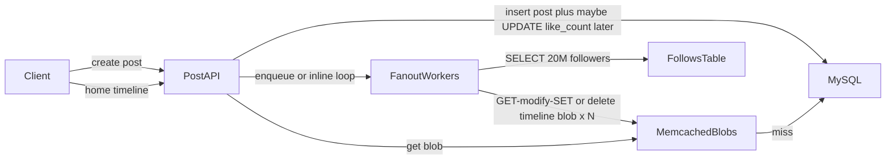
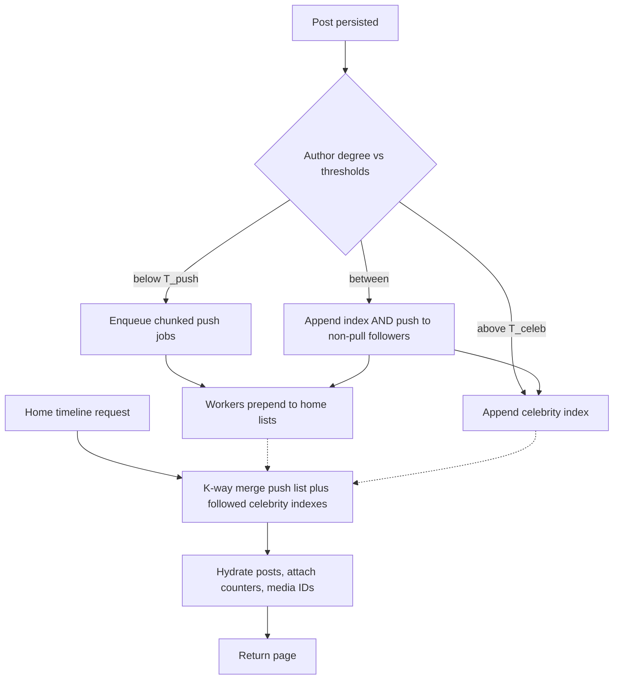

# High-Fanout Social Feed — Architecture Document
> - **Document Status**: Draft
> - **Last Updated**: 2026 Aug 29
> - **Author**: Paul Serban

A control-plane redesign of home-timeline generation: ordinary and mid-tier posts are pushed into capped per-follower timelines; celebrity posts are appended to a shared per-author index and merged at read time; media is a reference; engagement counters are a different service. This document covers *what* the system is and *why* it is shaped this way. See [System Design](./03_system_design.md) for *how* the tiers, merge, fanout workers, and counters actually work, and [Trade-offs and Honest Assessment](./05_tradeoffs_and_honest_assessment.md) for what those three words — hybrid push/pull — cost.

## Overview

**Brief description**: Timeline delivery infrastructure, scoped narrowly: stop unbounded per-follower writes, keep ordinary-user reads fast, decouple media and counters from timeline materialization. It is not a ranking platform, not a CDN, and not a social graph product.

**Business Context**
- See [Scenario and Requirements](./01_scenario_and_requirements.md) for the full framing. In short: 250M DAU, power-law follow graph, celebrity posts that currently fan out to tens of millions of Memcached blobs, 15+ second news delays, cache thrash, MySQL miss storms, hot like-rows.
- Target users: owning engineer, on-call, SRE. Product consumes "the home timeline is fast and eventually complete."

## Requirements

### Functional Requirements

- **Post**: persist a canonical post; select push / pull / hybrid from author degree at post time; do not loop followers in the request.
- **Push fanout**: for in-threshold authors, asynchronously prepend the post ID onto each follower's materialized home timeline, idempotently, with a cap.
- **Celebrity index**: for above-threshold authors, append the post ID to that author's index only. No per-follower write.
- **Home read**: merge the viewer's push timeline with the celebrity indexes of pull-tier accounts they follow; hydrate posts; attach counters; resolve media by ID.
- **Delete / edit / visibility**: update the canonical post; for pull-tier authors, update one index; for push-tier authors, fan out a retract within the same bounded degree; hydration must drop posts that are no longer visible even if a stale ID remains in a list.
- **Counters**: accept like/repost/comment intents idempotently; serve approximate counts on feed cards; reconcile to a durable truth.
- **Media**: timeline entries store media IDs (and perhaps a media type), not bytes and not short-lived signed URLs.

### Non-Functional Requirements

**Performance Requirements:**
- Home-timeline metadata p99 < 100 ms (ID merge + hydration + counter fetch). Media transfer is out of budget.
- Celebrity write path is O(index append), not O(followers).
- Push fanout throughput is sized for the *push* population's post rate × mean degree of that population — not for the celebrity tail.
- Ordinary-user posts should appear in followers' push timelines without a 15-second drain. Seconds of queue delay under load are a degraded mode, not the design point.

**Reliability Requirements:**
- **A failed fanout of follower 5,000,001 does not fail followers 1..5,000,000.** Chunked, checkpointed fanout.
- **Retry does not duplicate.** Timeline entries are keyed by `(viewer_id, post_id)` (or a sorted-set member that is the post ID).
- **Counter service degradation must not take down the feed.** Last-known-good or omit counts; do not block merge on counter RPC timeout.
- **Canonical post store is source of truth for body and visibility.** Caches are wrong eventually; hydration is the gate.

**Infrastructure Constraints:**
- Existing system is MySQL + Memcached + some generation of async workers. The redesign introduces a queue with backpressure, a cache/store that can represent sorted ID lists (Redis or equivalent), a counter path, and a media-ID contract. It does not require a new language or a rewrite of the client app beyond what hydration already needs.
- Follow graph remains large. The follow-graph service must answer "followers of this author" in chunks for push, and "pull-tier followees of this viewer" cheaply for read. If today's `follows` table cannot do the second query without a full scan, that is part of this project, not a footnote.

**The defining constraint:**
- Degree is a power law. Per-follower materialization is O(followers). Those two facts cannot both be unbounded. The architecture is: **cap who you push; merge who you cannot.**

## Executive Summary

The system is a **tiered timeline fabric**. The scarce resource on the old path was cache churn and database writes, consumed in proportion to author degree × post rate, colliding with a read path of billions of feed loads. The new path consumes push writes in proportion to *below-threshold* degree only. Celebrity cost moves to a small number of hot indexes and a bounded merge at read.

**Architecture Style:** Hybrid fanout (push below threshold, pull above) with async workers, a materialized celebrity index, and two deliberately separate read-side attachments (counters, media). Not a streaming graph engine, not Kafka-as-the-timeline, not "Memcached but bigger."

**Key Components:**
- **Post API / Post Store**: canonical posts in MySQL (or a document store); visibility; media ID list.
- **Follow-Graph Service**: follows edges; degree; **celebrity classification** (tier) as a first-class attribute, not a comment in a wiki.
- **Fanout Planner**: on post, chooses push, pull, or hybrid; enqueues work; never does the 20M loop inline.
- **Push Fanout Workers**: chunked follower iteration, idempotent prepend to home timelines, checkpoints, backpressure.
- **Celebrity Index Store**: per pull-tier author, a capped sequence of post IDs (the thing followers merge).
- **Home Timeline Store**: per viewer, a capped sorted list of pushed post IDs.
- **Timeline Read / Merge Service**: k-way merge of push list + followed celebrity indexes; pagination; duplicate suppression.
- **Hydration**: post bodies from Post Store / post cache (not from the timeline list).
- **Engagement Counter Service**: sharded, approximate, reconciled; not a column on `posts`.
- **Media Reference / CDN**: existing; consumed by ID.
- **Feed Cache**: hot pages and hot celebrity-index prefixes; **not** a serialized blob of hydrated posts-plus-media that GET-modify-SET mutates.

**Technology Stack (logical, not a shopping list):**
- Durable posts and follows: existing MySQL (or equivalent), schema evolved, not thrown away on day one.
- Materialized ID lists: Redis (or equivalent) sorted sets / streams-as-lists. See [ADR-005](./04_architecture_decision_records.md#adr-005). This is a migration, not a rename of Memcached.
- Work queue: a real queue with consumer groups, retry, dead-letter, and **backpressure into the post path or a shed policy** — not an unbounded in-memory goroutine pool. See [ADR-006](./04_architecture_decision_records.md#adr-006).
- Counters: a write-optimized path (Redis cluster / dedicated counter tables / OLAP reconcile), not `UPDATE posts`. See [ADR-003](./04_architecture_decision_records.md#adr-003).

**Architecture Principles:**
- **Degree selects protocol.** Same as size selecting single PUT vs multipart in an upload system. The author does not pick. Product does not pick per tweet.
- **Push is a performance optimization for the body of the graph, not a correctness requirement.** Pull-tier posts are correct without ever touching a follower's list.
- **Lists store IDs.** Hydration is a separate step. If you put bodies and media URLs in the list, you will invalidate the list for reasons that are not "new post."
- **Counters are not posts.** Viral engagement is a different write-rate class.
- **Caches may be wrong; hydration must not be.** Deleted posts disappear at hydrate even if a stale ID won a race.
- **Memcached blobs are not a timeline database.** LRU plus GET-modify-SET is how thrash happens. Stop using them as one.

**Key Architectural Decisions:**
1. **Hybrid push/pull with a follower-count threshold, not pure push or pure pull.** [ADR-001](./04_architecture_decision_records.md#adr-001).
2. **Read-time merge of celebrity indexes, not synchronous (or async-unbounded) fanout for high-degree authors.** [ADR-002](./04_architecture_decision_records.md#adr-002).
3. **Decoupled approximate counters, not row updates on `posts`.** [ADR-003](./04_architecture_decision_records.md#adr-003).
4. **Media by stable ID, not embedded in timeline payloads.** [ADR-004](./04_architecture_decision_records.md#adr-004).
5. **Redis-class sorted structures for ID lists, replacing Memcached as the timeline materialization tier.** [ADR-005](./04_architecture_decision_records.md#adr-005).
6. **Async queued fanout with checkpoints and backpressure, not inline fanout.** [ADR-006](./04_architecture_decision_records.md#adr-006).

### Context Diagram — current path (the anti-pattern)



Every arrow labeled with N followers is write amplification. The blob is the timeline, the cache, and the eviction victim. Counters and media ride in the same structures.

### Context Diagram — target path

```mermaid
flowchart LR
    client[Client]
    api[PostAPI]
    planner[FanoutPlanner]
    postStore[PostStore]
    graph[FollowGraph]
    queue[FanoutQueue]
    workers[PushWorkers]
    home[HomeTimelineStore]
    celeb[CelebrityIndex]
    merge[MergeService]
    counters[CounterService]
    media[MediaById]

    client -->|create post| api
    api --> postStore
    api --> planner
    planner --> graph
    planner -->|pull tier: append once| celeb
    planner -->|push tier: jobs| queue
    queue --> workers
    workers --> graph
    workers -->|prepend ID, cap| home
    client -->|home timeline| merge
    merge --> home
    merge --> celeb
    merge --> postStore
    merge --> counters
    merge --> media
```

The 20-million-follower author never enters `FanoutQueue` as 20 million jobs. The merge reads a handful of celebrity indexes, not 20 million caches.

## Runtime Architecture

1. **Write layer** (Post API, milliseconds to tens of milliseconds): authenticate, persist canonical post, read author tier from Follow-Graph (cached), enqueue push jobs and/or append celebrity index, return to client. Returning success means the post is stored, not that every follower's home list is updated.
2. **Push fanout layer** (workers, duration proportional to *push-tier* follower count): iterate follower IDs in chunks, `ZADD`-equivalent prepend, cap length, checkpoint chunk, respect backpressure. Celebrity authors skip this layer.
3. **Read/merge layer** (Merge Service, target p99 < 100 ms): load viewer push list page; load recent prefixes of followed pull-tier indexes; k-way merge by score/timestamp; cut page; hydrate; attach counters (budgeted, fail-open); return IDs + bodies + count snapshots + media IDs.
4. **Counter layer** (async, lossy under overload): increment shards; read sum or cached aggregate; periodic reconcile from a durable like-events table.
5. **Media layer** (CDN, not this process): client fetches bytes by ID/URL after the feed JSON. Timeline generation does not wait on origin fetches of video.

### Push-tier post vs pull-tier post vs home read



Hybrid (middle band) exists so accounts growing through the threshold do not fall off a cliff, and so mid-tier creators still get push for most followers while starting to grow an index. It is also the consistency trap: the same post can appear in the push list *and* the celebrity index. Merge **must** dedupe by post ID. See [System Design](./03_system_design.md).

## Components

### 1. Post API and Post Store
**Purpose**: Be the only place a post becomes real.

**Responsibilities:**
- Authenticate; authorize; persist body, author, timestamps, visibility, media IDs.
- Return a post ID quickly. Do not fan out in-process.
- Serve hydration reads (individual posts, batches by ID). Batch get is mandatory; N+1 from merge is how you blow the 100 ms budget.
- Enforce delete/edit on the canonical record.

**Interactions:**
- Writes: Post Store.
- Calls: Fanout Planner (async after commit).
- Reads: Merge/hydration.

### 2. Follow-Graph Service
**Purpose**: Answer degree, tier, followers-in-chunks, and "which of this viewer's followees are pull-tier" without a 20M row surprise on the request path.

**Responsibilities:**
- Store directed follow edges (existing MySQL is fine at first; this component is a *contract*, not a mandate to buy a graph database).
- Maintain `follower_count` and `tier` (`push` | `hybrid` | `pull`) as maintained attributes. Tier is not recomputed with `COUNT(*)` on every post.
- Chunked `followers(author, cursor, limit)` for workers.
- `pull_followees(viewer)` : a small set (tens, not millions). This set is cached on the viewer; it changes when they follow/unfollow a celebrity, not on every tweet.
- Reclassify accounts when degree crosses thresholds (async job). Reclassification **does not** rewrite the world inline. See [Phased Implementation Plan](./06_phased_implementation_plan.md).

**Interactions:**
- Reads: Planner, workers, merge (pull-followee set).
- Writes: follow/unfollow paths (existing product).

### 3. Fanout Planner
**Purpose**: Map one post to a *bounded* unit of work.

**Responsibilities:**
- Read author tier.
- Pull/hybrid: append post ID to celebrity index; optionally invalidate/refresh the hot prefix cache for that index.
- Push/hybrid: enqueue jobs of the form `{post_id, author_id, chunk_cursor}` — not `{post_id, follower_id}` times 20 million, and not `{post_id}` with "worker, please load all followers."
- Apply backpressure: if the push queue depth exceeds a shed limit, **do not** take celebrity work onto the push path as a "help." Shed or delay *push-tier* fanout; pull-tier remains O(1).

**Interactions:**
- Reads: Follow-Graph tier.
- Writes: Celebrity Index; Fanout Queue.

### 4. Push Fanout Workers
**Purpose**: Materialize the optimization that makes ordinary home reads cheap.

**Responsibilities:**
- Claim a chunk; fetch follower IDs; prepend post ID to each home list; trim to cap; write checkpoint; ack.
- Idempotent: adding the same post ID twice is a no-op.
- Poison posts (repeated chunk failure) go to a DLQ; the post remains on the author's profile; some followers' home lists lag until replay. That is better than blocking the queue.
- Do not hydrate posts. Do not touch counters. Do not write media URLs.

**Interactions:**
- Reads: Follow-Graph chunks; Post Store only for "does this post still exist / still visible" if needed at chunk start.
- Writes: Home Timeline Store; checkpoint store (can be the queue cursor).

### 5. Home Timeline Store
**Purpose**: The pushed ID list per viewer.

**Responsibilities:**
- Capped sorted collection of post IDs (score = timestamp or supplied rank score).
- Cap K (working default in System Design: a few thousand). This is not the user's lifetime history.
- Optional hot-page cache of the first page of IDs only — still IDs, not hydrated JSON.

**Interactions:**
- Written by workers; read by merge.

### 6. Celebrity Index Store
**Purpose**: The single list that 20 million followers will merge, instead of 20 million lists they would have mutated.

**Responsibilities:**
- One capped sequence per pull-tier (and hybrid-tier) author.
- Hot prefix cached (the first page of IDs is the breaking-news path). A celebrity post is visible to merge as soon as this prefix is updated — hundreds of milliseconds, not a 20M drain.
- Same ID-only rule.

**Interactions:**
- Written by Planner (sync or near-sync after post commit — this write is small).
- Read by merge, fan-in bounded by how many celebrities the viewer follows.

### 7. Timeline Read / Merge Service
**Purpose**: Produce a page of post IDs in order, then hydrate.

**Responsibilities:**
- Fetch push list slice + each followed celebrity-index prefix (parallel, hedged).
- K-way merge by score; skip IDs already emitted (hybrid overlap, retries).
- Pagination tokens that do not require re-merging the world (see System Design).
- Bound the number of celebrity indexes touched per request. If a user follows 500 pull-tier accounts, that is a product problem (or a classification problem: the threshold is too low) as much as a merge problem. Hard cap + degrade (omit cold celebrities) is allowed; silent O(500) Redis round-trips is not.

**Interactions:**
- Reads: Home Timeline Store, Celebrity Index, Follow-Graph `pull_followees`.
- Calls: Hydration, Counter Service, media ID pass-through.

### 8. Engagement Counter Service
**Purpose**: Absorb viral write rates without becoming the feed's mutex.

**Responsibilities:**
- Idempotent increment per `(actor, post, kind)` — the like event is durable somewhere; the displayed count is a projection.
- Sharded in-memory/Redis aggregates; periodic flush/reconcile.
- Read API: `counts(post_ids[])` in one round-trip.
- Fail-open: timeout returns cached or zeros with a flag. Feed still ships.

**Interactions:**
- Writes: like/repost/comment APIs (separate from Post API).
- Reads: Merge/hydration.

### 9. Media Reference (existing CDN / object store)
**Purpose**: Deliver bytes. Not a timeline component.

**Responsibilities (contract only):**
- Stable media ID → URL resolution at the edge or a small media service.
- Cache-control and invalidation of **media objects**, never of home-timeline keys.
- Takedown deletes or replaces the object; feed cards that still have the ID fail closed at the media service (broken image / tombstone), which is acceptable compared to 20M timeline rewrites. Hydration can also drop media IDs marked taken-down if that flag lives on the post.

### Communication Patterns

**Synchronous (small):**
- Client ↔ Post API (create).
- Client ↔ Merge (home).
- Merge ↔ Home/Celebrity stores, Post Store batch get, Counter batch get.

**Asynchronous:**
- Planner → Fanout Queue → Workers.
- Counter increments → shard → reconcile.
- Tier reclassification → backfill jobs (slow, gated).

**Not on any timeline path:**
- Client ↔ CDN for bytes.

## Scaling Strategy

**Current Scale Requirements:**
- 250M DAU, ~5B feed reads/day as a planning figure, power-law authors, breaking-news spikes.

**What does not need to scale with celebrity degree:**
- Push queue depth, push worker count, Home Timeline write QPS. Those scale with *below-threshold* graph activity.

**What must be hot and small:**
- Celebrity index prefixes (one per celebrity, tiny).
- `pull_followees(viewer)` sets.
- Post-body cache for currently viral posts (the same post is hydrated millions of times — that is a post-cache problem, which is O(viral posts), not O(followers)).

**What is already a different ceiling:**
- Follow-graph chunk reads during push fanout. Still expensive for a 50k-follower "mid-tier" author. That is accepted push cost. It is not 20M.
- Redis memory: `users_with_push_timelines × K × bytes_per_id`. This is large. It is not `DAU × 20M`. Size it; if it does not fit, lower K, or do not materialize push timelines for inactive users (rebuild on next session from a slower path — a known Twitter-era trick with known pain). See Trade-offs.

**Bottleneck Analysis:**
- Primary bottleneck after redesign: merge width (celebrities followed) and hydration batch latency. Correct bottlenecks. Tune threshold and post cache.
- Secondary: push-queue lag for *ordinary* posts during a news spike if workers were stolen to "help" celebrities. They must not be. Pull-tier work is not worker-bound.
- Tertiary: counter reconcile lag. User-visible as wrong counts, not as a blank feed.
- Not a bottleneck you should "fix" with more fanout parallelism: 20M-follower push. That path is closed.

## Data Architecture

### Data Model

**Key Entities:**
- **Post**: id, author_id, created_at, visibility, body ref, media_ids[], score optional.
- **FollowEdge**: follower_id, followee_id.
- **AuthorTier**: author_id, follower_count, tier, updated_at.
- **HomeTimeline**: viewer_id → sorted post_ids (capped).
- **CelebrityIndex**: author_id → sorted post_ids (capped).
- **FanoutCheckpoint**: post_id, chunk_cursor, status.
- **LikeEvent** (or engagement event): actor_id, post_id, kind, idempotency_key.
- **CounterProjection**: post_id, kind, count, as_of.

**Entity Relationships:**
- One post appears in at most one celebrity index (the author's), and in many home timelines if push-tier.
- Hybrid posts may appear in both; merge dedupes.
- Counters are 1:1 with post for display, N:1 events underneath.

### Data Lifecycle

**Create**: post row; index append and/or fanout checkpoints; counter projection at 0.

**Read**: merge → hydrate → counts → media IDs.

**Update**: body edit updates Post Store and post cache. Push lists are IDs; they do not change. Pull index order may change if score changes (rare); do not chase home lists for edits.

**Delete**: tombstone Post; remove from celebrity index if pull; enqueue bounded retract for push-tier; hydration drops regardless.

## Cost Analysis

### Cost Components

**Money:**
- Redis (or equivalent) for ID lists is the new large bill. Memcached was already a large bill; this is not "add Redis," it is "replace a blob cache with a dataset that is the timeline." Expect memory-heavy cluster cost, replicas, and a multi-quarter ops burden.
- Queue (SQS/Kafka/Pulsar/etc.) is cheap compared to Redis memory if you do not treat Kafka as a timeline store.
- Counter cluster: modest next to timelines.
- CDN: already paid; decoupling should *reduce* origin load from bad cache busting, not add a CDN bill.

**Engineering time — the actual cost:**
- Merge correctness (pagination, dedupe, threshold-boundary duplicates/omissions): most of the *design* risk.
- Fanout workers with checkpoints: most of the *operational* risk for the push path.
- Memcached → Redis migration of a live 250M DAU feed: most of the *calendar*. Dual-read/dual-write is ugly. See Phase plan.
- Counter cutover: a separate migration with its own dual-write.
- Media ID contract: "small" until every client and every cached card still embeds URLs.

**Risk cost of skipping pull for celebrities:**
- The next breaking-news event is a write outage. You already have the symptom. Paying Redis to do 20M `ZADD`s is paying more for the outage.

### Cost Optimization

- Do not materialize push timelines for users inactive past a window; rebuild on next login from a slower merge of *push-tier* followees only (this is a large product/UX trade: first-open slowness). Optional, later, not v1 unless memory math fails Phase 0.
- Keep K small. A 10,000-ID home list is vanity. A few hundred to a few thousand is a session.
- Celebrity index hot prefix only in RAM; cold tail on disk if needed.
- Threshold T_celeb high enough that merge width stays tiny. Every account you pull is a Redis get on every home load of every follower. Pulling "anyone over 10k" can make merge the new outage.

## Risks and Mitigation

| Risk | Likelihood | Impact | Mitigation Strategy | Owner |
| --- | --- | --- | --- | --- |
| Threshold too low; merge width explodes | Medium | High | Cap celebrities merged per request; alert on p99 merge fan-in; raise T_celeb | Planner + merge |
| Threshold too high; push storms return | Medium | High | Phase 0 histogram; SLO on fanout job size; refuse push above hard cap | Planner |
| Hybrid overlap duplicates or omits posts | High at first | Medium | Dedupe by post ID in merge; tests at boundary; do not skip this | Merge |
| Redis treated as infinite disk; OOM | High without cap | High | Caps on list length; memory budget in Phase 0; eviction policy that is not "LRU the hot home page of active users during a write storm" | SRE |
| Queue backlog interpreted as "add consumers" during celebrity event | High | High | Celebrity path must not use that queue; dashboards split by tier | On-call |
| Counter fail-closed takes down feed | Medium | High | Fail-open; [ADR-003](./04_architecture_decision_records.md#adr-003) | Counter + merge |
| Media URLs still in cached JSON | High during migration | Medium | Hydration strips; client flag; Phase 4 gate | Media + feed client |
| Reclassification rewrite of millions of lists | Medium | High | Never blocking; backfill jobs with kill switch | Graph + workers |
| "Sub-100ms" includes images and ranking | High politically | High | SLO wording: metadata only; ranking out of scope | Product + eng |
| Memcached dual-running forever | High | High | Phase 5 time-box; kill criterion | Phased plan |
| Active-active multi-region hoped into v1 | Medium | High | Non-goal; refuse | Architecture |
| Pagination tokens that restart merge from t=0 every scroll | Medium | Medium | Explicit cursor design in System Design | Merge |

## Future Enhancements

### Phase 1 (current design)
**Focus**: Measure, then pull-tier for the extreme tail only, flagged. See [Phased Implementation Plan](./06_phased_implementation_plan.md).

### Phase 2
**Focus**: Queued, checkpointed push for everyone still on push.

### Phase 3
**Focus**: Counter service.

### Phase 4
**Focus**: Media IDs only.

### Phase 5
**Focus**: Cut over serving, retire Memcached blobs as timelines.

### Technical Debt (accepted)

- Ranking is not started. If product later requires "For You," candidate generation is a new system that *reads* these indexes; it does not replace them in the same PR.
- Multi-region active-active is not started.
- Inactive-user timeline eviction is optional and painful; not v1 unless memory forces it.
- Exact counts are not promised.
- Follow-graph remains MySQL until proven otherwise. A graph DB is not a prerequisite for hybrid fanout; it is a later scaling project if chunked follower iteration cannot keep up *inside the push cap*.
