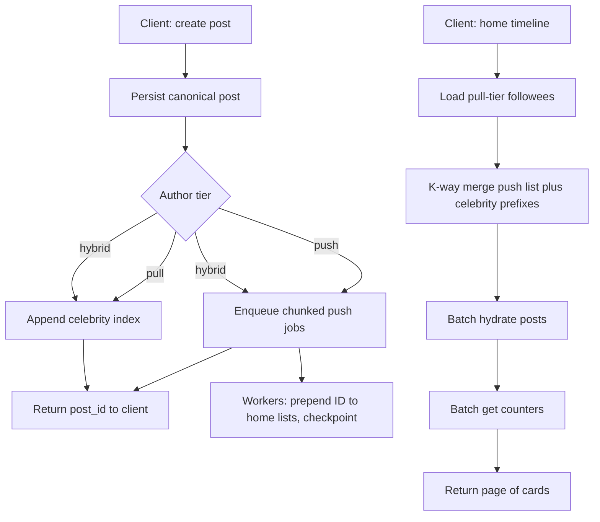
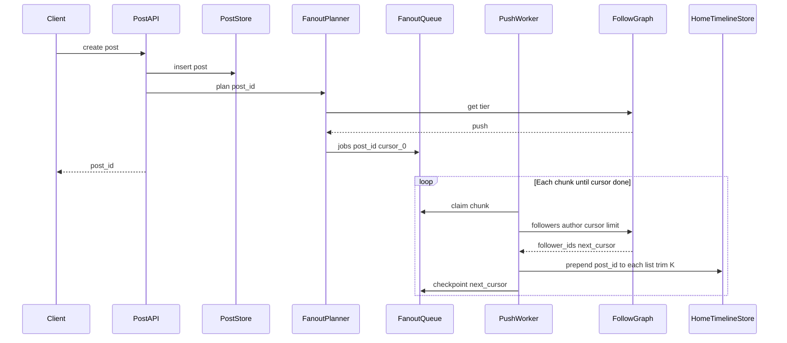
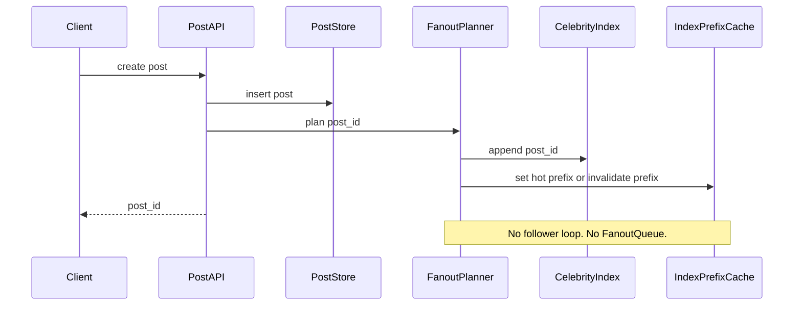
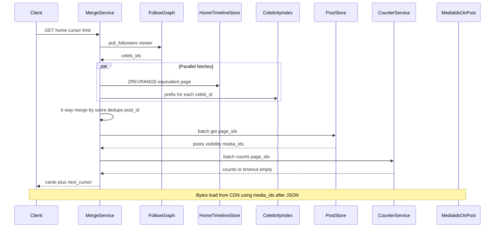
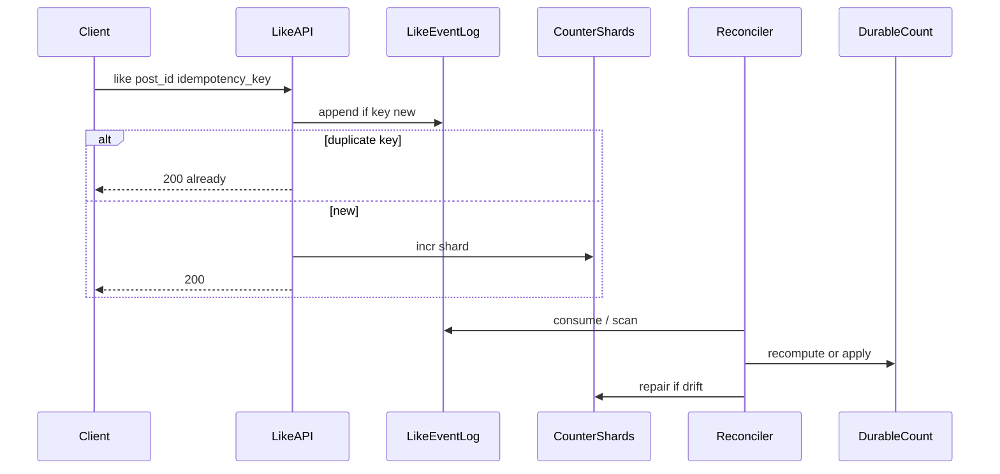
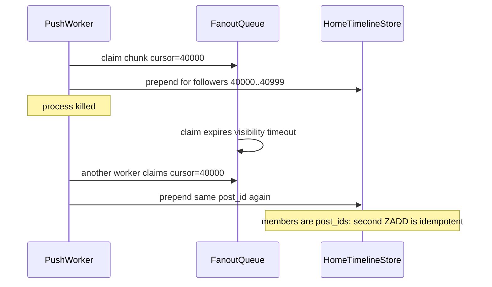

# High-Fanout Social Feed — System Design
> - **Document Status**: Draft
> - **Last Updated**: 2026 Aug 29
> - **Author**: Paul Serban

This document is the mechanical *how* for the system described in the [Architecture Document](./02_architecture_document.md). It specifies the degree thresholds, the two write protocols, the merge-at-read algorithm, fanout checkpoints, counters, media references, and cache behavior. It does not specify code.

## 1. Control Flow

Two write protocols, one post entry point. Tier is chosen from the **author's stored follower_count** at post time, not from a live `COUNT(*)`. The client does not pick the protocol.

**Invariant:** the create-post request does not iterate followers. If it does, the design has failed.

**Invariant:** merge dedupes by `post_id`. Hybrid and retries will violate uniqueness of lists.

**Thresholds** are design parameters, not product settings. Changing them does not require a new architecture; it requires evidence that push job size and merge fan-in still meet the SLOs. See [ADR-001](./04_architecture_decision_records.md#adr-001).

## 2. Degree Tiers and Threshold Geometry

Working defaults. Phase 0 replaces them with percentiles from the real follower histogram.

| Tier | Degree range (working) | Write path | Read path |
| --- | --- | --- | --- |
| **push** | `follower_count < T_push` | Chunked fanout to every follower's home list | Home list only (plus hydration) |
| **hybrid** | `T_push ≤ follower_count < T_celeb` | Celebrity index **and** fanout to followers | Home list **and** this author's index; **dedupe** |
| **pull** | `follower_count ≥ T_celeb` | Celebrity index only. **No** per-follower writes | Home list **plus** this author's index |

**Working numbers:** `T_push = 10,000`, `T_celeb = 1,000,000`.

Rationale, not magic:

- Below 10k, push is a few chunks. A 10k-`ZADD` job is expensive but finite; it is the cost you pay so the average user's 150-followee feed is a single list read.
- Above 1M, push is a news-event outage. Pull is mandatory.
- The band between 10k and 1M is where product will fight you ("this creator is not a celebrity"). Hybrid exists so you can raise `T_celeb` without dropping mid-tier creators into a merge-only experience before the index is trusted. It is also where bugs live.

**Hard cap, non-negotiable:** no author is ever pushed above `T_hard` (working: `T_hard = T_celeb`). If classification lags and a 20M-follower account is still marked `push`, the planner **refuses** the push path and writes the index only, then pages. Silent 20M fanout because `tier` was stale is how you recreate the incident. Stale classification fails toward pull, not toward push.

**Merge-width cap:** `C_max` celebrity indexes per home request (working: 64). If `pull_followees(viewer)` exceeds `C_max`, merge the hottest `C_max` by recent engagement or by follow recency, and increment a metric. That is a degraded feed, not a 200 ms Redis scatter. If this metric is hot, `T_celeb` is too low or users follow too many pull-tier accounts — product or classification, not "raise timeout."

**Part of the geometry that is not a threshold:** home-list cap `K` (working: 800–2,000 IDs) and celebrity-index cap `K_c` (working: 1,000–5,000). These are memory and product ("how far can you scroll the live home list") parameters. They are not "infinite timeline."

## 3. Sequences

### 3.1 Push-tier author posts (ordinary or mid below T_push)

The client is unblocked when the post is stored. Followers see it as workers complete chunks. That lag must stay seconds, not fifteen, for this *tier* — because this tier's N is bounded.

### 3.2 Pull-tier author posts (celebrity)

Visibility for followers is "the next merge reads the new prefix." Breaking-news latency is index write + cache, not worker drain. This is the 15-second problem's actual fix.

### 3.3 Home timeline read (mixed follows)

If CounterService times out, cards still return. Counts may be missing or stale. That is required, not sloppy.

### 3.4 Engagement increment (viral post)

The feed read path never `UPDATE`s the post row. The like API never waits on 20 million timeline updates. "Real-time" for the actor is "your like is accepted"; for everyone else it is "the next counter read sees a nearby number."

### 3.5 Partial fanout then crash (push tier)

**What must exist:** checkpoints at chunk granularity, visibility timeout, idempotent members. **What must not exist:** a single job "fan out to all followers" with no cursor; a list of duplicate-allowing blob concatenations (the Memcached GET-modify-SET bug).

## 4. Data Model (Logical)

Not SQL. Grain and invariants only.

### post

| Field | Role |
| --- | --- |
| id | Opaque, unguessable enough for enumeration concerns; issued by Post Store. |
| author_id | Owner. |
| created_at | Default merge score if no ranker. |
| score | Optional external rank score. Merge compares scores; it does not compute them. |
| visibility | `public` / `unlisted` / `deleted` / `author_only` — hydration filter. |
| media_ids | Stable IDs. Empty for text. |
| body | Canonical text (or pointer). Not copied into home lists. |

**Invariants:** deleting sets `visibility=deleted` (or equivalent tombstone). Lists may still hold the ID until trim or retract; hydration must drop it.

### author_tier

| Field | Role |
| --- | --- |
| author_id | PK. |
| follower_count | Maintained counter, not live COUNT. |
| tier | `push` \| `hybrid` \| `pull`. |
| updated_at | Classification time. Stale tier + degree above `T_hard` → planner forces pull. |

### home_timeline

Logical sorted set: `viewer_id` → members `post_id` with score `created_at` or `score`.

**Invariants:**
- Cardinality ≤ `K`. Trim lowest scores on insert.
- Member uniqueness = idempotent fanout.
- Not a source of truth for "did this author post." Profile and Post Store are.

### celebrity_index

Same structure, key = `author_id`, cap `K_c`.

**Invariants:**
- Only authors in `hybrid` or `pull` have an index that merge reads.
- Append is the breaking-news write. It must be fast and replicated enough that merge in the same region sees it quickly. Cross-region lag is accepted (non-goal: active-active).

### fanout_checkpoint

| Field | Role |
| --- | --- |
| post_id | |
| author_id | |
| cursor | Last completed follower-page token. |
| status | `pending` \| `in_progress` \| `done` \| `poison`. |

**Invariants:** one logical fanout per post per author (push/hybrid only). Replay from cursor, never from zero without idempotent members.

### engagement_event

| Field | Role |
| --- | --- |
| idempotency_key | Unique; like button retries reuse it. |
| actor_id, post_id, kind | `like` \| `repost` \| `comment` (comment may instead be a comment row; the *count* still flows here). |
| created_at | |

**Invariants:** duplicate keys do not increment twice. Displayed count is a projection, not `COUNT(*)` on the request path.

### counter_projection

| Field | Role |
| --- | --- |
| post_id, kind | |
| count | Approximate. |
| as_of | For debugging "why is this wrong." |

## 5. Merge Algorithm (Read Path)

Goal: a page of `L` visible posts (working `L = 20`) for viewer `V`, after cursor `C`.

1. **Load `pull_followees(V)`**, cap to `C_max`. Cache this set (TTL minutes; invalidate on follow/unfollow of a pull-tier account).
2. **Fetch in parallel:**
   - From `home_timeline(V)`, the next candidates after `C` (over-fetch: `L` plus slack for deletes and dedupe, e.g. `3L`).
   - From each celebrity index, the next candidates after `C` (same over-fetch).
3. **K-way merge** by score descending (timestamp if no score). Use a heap of size `1 + min(|celebs|, C_max)`.
4. **Dedupe** `post_id`. Hybrid overlap is the common case, not an error.
5. **Stop** when `L` IDs are collected or all sources are exhausted for this window.
6. **Batch hydrate.** Drop `visibility` that V cannot see. If drops are many, pull more from the merge (bounded iterations, e.g. 2), then return a short page rather than looping into 100 ms.
7. **Batch counters.** Timeout → continue without fresh counts.
8. **Emit cursor.** The cursor is not an offset. Offset pagination re-merges and duplicates under concurrency. Cursor is a `(score, post_id)` lower bound (or a per-source set of positions). Working choice: **global `(score, post_id)` watermark**. Every source in the next request only returns members strictly below that watermark. This can skip a post that arrives late with an older timestamp (rare) or include a late high-score post on a later page (acceptable eventual consistency). Perfect stable pagination under concurrent inserts is not a v1 requirement.

**What merge must not do:**
- Hydrate 3L posts to pick L (waste). Over-fetch IDs, hydrate only the page.
- Sequential Redis gets for 80 celebrities. Parallel with a hard cap and hedging of slow shards.
- Read media bytes.
- `SELECT * FROM posts WHERE author IN (all followees) ORDER BY created_at LIMIT 20` — that is pure pull through MySQL and is the other outage.

## 6. Fanout Workers, Backpressure, Poison

- **Job grain:** `(post_id, author_id, cursor, chunk_size)`. Chunk size working default: 500–2,000 follower IDs. Too small: queue overhead. Too large: visibility timeout and double-work on crash.
- **Backpressure:** if queue depth or age exceeds `Q_max`, shed *push* work: delay ordinary fanout, never convert pull authors into push to "catch up." Create-post remains 200; ordinary followers' home lists lag. Metric and page. Product copy is "feed may be delayed," not "the site is down," if pull-tier news still flows.
- **Poison:** after `R` failed attempts on the same cursor, mark `poison`, DLQ, continue other posts. A bad follower ID or a down Redis shard for a slice of users must not stall the firehose.
- **Deletes (push-tier):** a retract job of the same shape: `ZREM` post_id from each follower list. Same bound, same checkpoints. Hydration still filters if retract lags.
- **Do not** use the fanout queue to push counter updates or media-ready events into timelines.

## 7. Cache Design (What Replaces Memcached Blobs)

| What | Where | Why this, not a blob |
| --- | --- | --- |
| Home ID lists | Redis sorted set (or equivalent) | Prepend + cap + idempotent member |
| Celebrity index | Same | Single hot key per celebrity, tiny |
| Index hot prefix | Replica-local cache optional | Breaking news; still IDs |
| `pull_followees(V)` | Redis string/set, TTL | Avoid graph hit on every home load |
| Post bodies | Separate post cache by post_id | Viral post is read millions of times; one key, not millions of copies inside timeline blobs |
| Counter aggregates | Counter cluster | Different TTL and write rate |
| First-page rendered JSON | Optional, short TTL, **must not** be GET-modify-SET on new posts | If used, invalidate on that viewer's push prepend *or* accept seconds of staleness with SWR |

**Why Memcached thrash happened:** celebrity fanout wrote or invalidated millions of *viewer* keys, including inactive ones, blowing LRU, then active users missed, then MySQL rebuilt hydrated blobs (large values, more thrash).

**Replacement access pattern:** celebrity write touches **one** index key. Viewer reads touch **one** home key + **C** index keys. Inactive viewers' home keys are not written on celebrity posts. Working set ≈ active users' home lists + all celebrity indexes + viral post cache. That can still be huge; it is not "times 20 million extra writes per news tweet."

**Thundering herd (breaking news):** millions of clients open the app. They all miss the same celebrity prefix or the same viral post body.

- Request coalescing / singleflight on `celebrity_index:{id}` prefix and `post:{id}`.
- Stale-while-revalidate on rendered first page if you have one: serve 1–2 s stale during a stampede rather than synchronized rebuild.
- Do not coalesce *distinct* home keys — they are distinct. The stampede that matters is the *shared* celebrity index and the *shared* viral post.

**TTL:** ID lists are mutated, not expired as the primary freshness mechanism. TTL as a safety net (days) to drop abandoned users' lists is fine. TTL of 60 s on home lists is how you send everyone to rebuild and recreate read amplification.

## 8. Media Decoupling (Contract)

Timeline and post JSON:

- Include `media_ids[]`.
- May include a **non-authoritative** display hint (aspect ratio, blurhash) stored on the post record, not fanned out as a second copy.
- Must not include short-lived signed URLs that expire while the timeline list still holds the post.
- Must not include transcoding status that will change.

Client or edge:

- Resolves `media_id` → CDN URL via a media service or a stable public URL scheme.
- CDN invalidation is by content ID, not by follow graph.

Takedown:

- Mark media or post. Hydration omits or replaces. CDN purge the object. **No** fanout.

This project does not design POP placement, byte-range video, or packager pipelines. If those do not exist, feed still returns IDs; playback is a different team's SLO.

## 9. Consistency Model

| Question | Answer |
| --- | --- |
| Is the home timeline linearizable? | No. |
| Is per-author order preserved? | Yes, on that author's index and on push inserts using the same score. Cross-author order is by score; concurrent posts can appear in different orders for different viewers. |
| When is a celebrity post visible to a follower? | After index append is visible to the merge's Redis read. Target: sub-second in-region. Not after 20M writes. |
| When is an ordinary post visible to a follower? | After that follower's chunk is processed. Under backlog, delayed. |
| Can a post appear twice? | Yes, until merge dedupe. Must not appear twice in one page after merge. |
| Can a deleted post appear? | Yes, as an ID, until hydration. Must not be displayed after successful hydrate. |
| Are like counts exact? | No. Actor has read-your-writes on *their* like action (the button state), not on the global integer. Drift window: seconds to minutes under load; reconcile repairs. |
| Read-your-writes on own post in own home? | The author should see their post on their **profile** from Post Store. Their **home** list may not include their own post unless product inserts it client-side or the author is a self-follow. Do not special-case 20M. A small "self insert on author's device" is a client concern. |

**Acceptable staleness:** celebrity index replica lag inside the region should be well below the old 15 s SLO (hundreds of ms). Push-tier lag of a few seconds under normal load is OK. Push-tier lag of 15 s is an incident *for that tier*, not a reason to push celebrities.

## 10. Error Handling

| Failure | Where | What the system does | What it must not do |
| --- | --- | --- | --- |
| Post insert fails | Post Store | 5xx, no plan | Enqueue fanout for a post that does not exist |
| Planner sees stale push tier but degree ≥ T_hard | Planner | Force pull, alert | Fan out 20M |
| Redis OOM / write fail on one home list | Worker | Retry chunk; then poison slice | Block all fanout |
| Queue age > SLO | Queue | Shed push; page | Start pushing pull-tier "to help" |
| Merge Redis timeout on one celebrity index | Merge | Skip that source, return rest, metric | Fail the whole home timeline |
| Hydration miss / 5xx | Merge | Omit post or retry batch once | N+1 fallback to MySQL per ID in a loop |
| Counter timeout | Merge | Omit or stale counts | Fail home |
| Duplicate like | Like API | 200, no second increment | Extra shard incr |
| Classification job wants to move author to pull | Graph | Flip tier; stop new push; do **not** synchronously delete 20M old copies | Overnight blocking rewrite |
| Media CDN down | Client | Broken image, feed JSON still 200 | Block merge on media health |
| Poison DLQ growing | Workers | Alert, replay tooling | Auto-replay without idempotency check |

Memcached `GET-modify-SET` lost updates and `client_max_body_size` are not in this table for the new path. If blob GET-modify-SET appears in an incident, the file — the timeline — is still a Memcached blob.

## 11. Observability (Minimum)

If on-call only has "Redis CPU high," celebrity storms and ordinary backlog look the same.

- **Split all fanout metrics by tier.** Job size, queue age, writes/sec. Pull-tier write QPS should stay tiny (indexes). If it tracks news events at millions/sec, someone is pushing.
- **Propagation probes:** canary viewers: (a) follows only pull-tier, (b) follows only push-tier. Time from post commit to appearance. This is the 15 s SLO, instrumented.
- **Merge fan-in histogram.** Alert if p95 celebrities-followed-at-read exceeds a fraction of `C_max`.
- **Cache:** hit rate on celebrity prefixes and post bodies, **not** only global Redis hit rate (global will look "fine" while home lists thrash).
- **Counters:** ingest vs display drift samples; like API latency vs merge latency (they should not couple).
- **Do not** log entire home lists. They are user graph-adjacent.

## 12. What stays on MySQL (and what does not)

Still on MySQL (until a later project proves otherwise): canonical posts, follow edges, engagement event durability if you keep it relational, tier rows.

Not on MySQL: per-follower home-timeline rows at 250M × K, celebrity fanout inserts, `like_count` hot updates on `posts`.

Not on Memcached: the timeline itself.

Redis (or equivalent) is the materialized ID fabric. MySQL is the system of record for posts and follows. Mixing those roles is the current incident.
