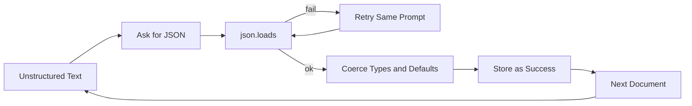
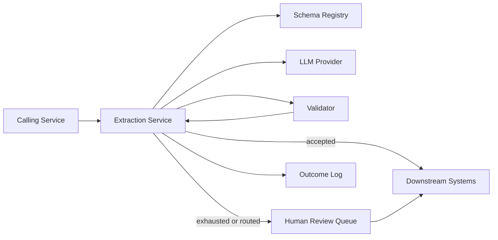
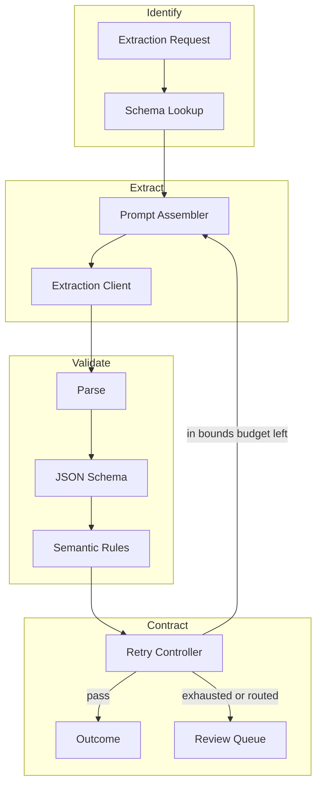
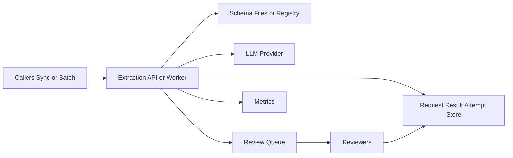

# Structured-Output Extractor — Architecture Document
> - **Document Status**: Draft
> - **Last Updated**: 2026 Aug 29
> - **Author**: Paul Serban

An **extraction service** that sits between unstructured text and a downstream system that requires a typed object, so that "we got JSON" becomes a layered validation result, a bounded repair-retry, and an explicit terminal outcome — not a `while not valid` loop around a prompt. This document covers *what* the system is and *why* it is shaped this way; see [System Design](./03_system_design.md) for *how* records, the retry contract, and the sequences actually work.

## Overview

**Brief description**: This is an internal extraction pipeline, not a customer-facing document-AI product and not a prompt file. It is scoped narrowly on purpose: one document (text, caller-supplied type, schema version) in; a validated object or an explicit failure out. It does not OCR pages. It does not classify document type in v1. It does not "make the model truthful."

**Business Context**
- Owner: the team that needs resumes, invoices, or support tickets in a database and is currently losing the "just retry until it parses" argument in a pull request (see [Scenario and Requirements](./01_scenario_and_requirements.md)).
- Current state: prompt-for-JSON, `json.loads` in a try, same prompt again on failure, silent coercion of messy strings into typed columns.
- Desired future state: Extract → Validate (parse / schema / semantic) → Repair-retry (bounded, error-injected) → Accept or human-review / reject. Constrained decoding is the shape control. Retry is the backstop. Review/reject is the content residual.
- Goal: stop storing schema-valid lies — at the cost of a review queue (or a higher reject rate), extra schema discipline, and residual Class C that no JSON Schema will catch.
- Target users: calling engineer, schema owner, review/ops, platform/serving, downstream system owner.

## Requirements

### Functional Requirements

- **Identify**:
  - The caller must send `document_type` and `schema_version` (or accept the current default version for that type). The service looks up the schema; it does not infer type from prose in v1.
  - Unknown type or unknown version → `rejected`, not a best-effort map onto another schema.
- **Extract**:
  - Assemble a prompt bound to that schema (instructions + schema + optional small format few-shot + source text).
  - Call the provider with structured output / function-calling when available; JSON mode or prompt+parse otherwise ([ADR-003](./04_architecture_decision_records.md#adr-003)).
  - Temperature default 0 for extraction.
- **Validate**:
  - Layer 1 parse (including cheap deterministic salvage: fence strip).
  - Layer 2 JSON Schema (types, required, enums, additionalProperties policy).
  - Layer 3 document-type semantic rules (arithmetic, date order, id format).
  - Optional cheap grounding heuristic on *critical* fields (invoice totals, order_id) — suggestion, not gold ([ADR-001](./04_architecture_decision_records.md#adr-001)).
- **Retry**:
  - Only on in-bounds classes (P, H, and a named subset of B). Budget 2. Repair prompt carries validator errors. Temperature stays at 0 or drops. Same prompt without error context is not a retry policy ([ADR-002](./04_architecture_decision_records.md#adr-002)).
- **Terminate**:
  - `accepted` | `retried_then_accepted` | `failed_to_human_review` | `rejected`. Last invalid object is never returned as success ([ADR-004](./04_architecture_decision_records.md#adr-004)).
- **Observe**:
  - Retry rate by layer and type, outcome rates, review age, token/latency per attempt, schema version on every row.

### Non-Functional Requirements

**Performance Requirements:**
- Sync callers (ticket assist, recruiter overlay): design intent p95 of **one** generation + validation in the same ballpark as the provider's p95; retries make p99 ≈ 3× that. **Do not hide retry in the p95 SLO.** Publish p95 first-attempt and p95 including retries separately, or the SLO is a lie the first time Class H spikes.
- Batch callers (nightly invoice ingest): throughput-bound. Retry budget is still 2; parallelism is a worker-pool problem, not an invitation to raise N.
- Validation itself (parse, JSON Schema, arithmetic) is cheap relative to generation. It belongs in-process with the worker, not a second network hop, unless you have a compliance reason to isolate it.
- Human review is a **queue SLO** (hours/days), not a serving SLO. Sync callers that cannot wait must take `rejected` or `pending_review` and design the UX for it — they may not block the HTTP request on a human.

**Service Level Agreement (SLA):**
- System criticality: data-adjacent. A schema-valid wrong total can move money. A blocked extraction because review is backlogged is also a cost. Neither is five-nines of *model truth*. Availability of the *service* (accept a request, return an outcome) can be high; availability of *correct values* cannot be promised at that level.
- Fail closed on validation: if the validator process is down, do not skip to "return raw JSON." Fail the request.
- Provider outage: retry/backoff for **transport** errors is a different budget from **validation** retries. Do not share the counter. A 429 is not Class H.

**Infrastructure Constraints:**
- Technology shape (not an implementation mandate): JSON Schema as the interchange contract; Pydantic or Zod as the in-process binding; a table for requests/results/attempts; a queue for review items; the provider's structured-output API where it exists. This is not an excuse to buy a "document AI platform" on day one.
- Structured-output / grammar constraints depend on the serving provider. If the provider cannot constrain decoding, Class P/H fall back to JSON mode + validate-and-repair. The architecture does not assume OpenAI-shaped function calling.
- Source text and completions are production data (resumes = PII, tickets = customer content, invoices = financial). Retention and access inherit from the host product.
- Schema registry can be files in git for v1. A database-backed registry is Phase 4. Do not build a CMS for schemas before one document type has a measured review rate.

## Executive Summary

The architecture is **Extract → Validate in layers → Repair-retry (bounded) → Accept or fail loud**. It is a contract with a data model and a queue, not a prompting technique.

1. **Identify** binds the request to a versioned schema the caller named.
2. **Extract** calls the model under that schema, preferring constrained decoding.
3. **Validate** runs parse, then schema, then semantic rules, as distinct stages with distinct error objects.
4. **Repair-retry** runs only when the class is in-bounds, at most twice, with the error list in the next prompt.
5. **Terminate** with an outcome enum. Review gets the trail. Downstream gets `accepted` objects only.

**Architecture Style:** Synchronous extraction worker with an out-of-band human-review dead letter. Not an agent. Not a multi-hop "document understanding graph." Not a second model that "checks the first" on 100% of traffic in v1.

**Key Components:**
- **Schema Registry**: versioned JSON Schema + semantic rule pack per document type.
- **Prompt Assembler**: schema + instructions + optional format few-shot + source, under an input-token budget.
- **Extraction Client**: provider-native structured output; fallback JSON mode / prompt+parse.
- **Validator**: parse, schema, semantic, optional grounding heuristic — separate components, one facade.
- **Retry Controller**: budget, in-bounds classes, repair context, temperature policy, transport vs validation counters.
- **Confidence / Flagging**: optional per-field flags; not a calibrated probability in v1.
- **Human Review Queue**: dead letter for exhausted retries and routed Class B/C/U.
- **Outcome Logger**: every attempt, every layer error, every outcome.

**Architecture Principles:**
- **Parseable is not correct.** The contract starts after `json.loads`.
- **Retry is a shape tool.** It is not a truth tool.
- **The cheapest correct control wins.** Constrained decoding beats N repair retries on the hot path when both would move Class P/H.
- **Absence must be representable.** `required` without `null` is how you order hallucinations.
- **Silent coercion is a bug.** `"N/A"` → `0` is not helpful.
- **Do not rebuild sibling platforms.** Cite triage for few-shot scoping, forensics for retained bodies, eval harness for labeled exact-match, hallucination detection for faithfulness scoring.

**Key Architectural Decisions:**
1. Layered validation, separately measured ([ADR-001](./04_architecture_decision_records.md#adr-001)).
2. Finite repair-retry, not unbounded resubmit ([ADR-002](./04_architecture_decision_records.md#adr-002)).
3. Provider-native structured output preferred ([ADR-003](./04_architecture_decision_records.md#adr-003)).
4. Exhausted retry → review or reject, never silent success ([ADR-004](./04_architecture_decision_records.md#adr-004)).
5. Few-shot scoped to format, versioned with schema ([ADR-005](./04_architecture_decision_records.md#adr-005)).

### The Anti-Pattern This Design Exists to Kill

This fails because:

- There is no layer, so a parse success ends the conversation.
- Retry has no budget and no error context, so it either livelocks or eventually samples a different shape by luck.
- Coercion hides Class U and Class C in typed columns.
- Downstream cannot distinguish first-attempt truth from third-attempt invented totals.
- Constrained decoding, if the provider already offers it, sits unused while the prompt begs for braces.

### Context Diagram

## Runtime Architecture

1. **A request arrives** with `document_type`, `schema_version` (or default), source text, caller id, idempotency key.
2. **Registry lookup.** Unknown type/version → `rejected`. Rule pack loaded with the schema.
3. **Prompt assembly.** Truncation policy if source exceeds budget: fail `source_too_large` or caller-approved truncate-with-flag — do not silently drop the bottom of an invoice.
4. **Attempt 0.** Extraction client calls provider (structured output preferred). Transport errors use a **separate** retry policy.
5. **Validate layers in order.** Stop at the first layer that fails for routing (still *record* subsequent layers if parse succeeded — a schema-invalid object can also fail arithmetic; capturing both is useful). Primary class from the first failing layer: P, H, or B. Grounding heuristic may tag C without failing the accept path in v1 unless policy says so.
6. **Retry controller.** If class in-bounds and budget remaining: build repair prompt (source + schema + error list + last output), temperature 0, increment attempt, go to 4.
7. **If in-bounds but budget 0:** `failed_to_human_review` if a queue exists and policy queues this type; else `rejected`. Attach full trail.
8. **If out-of-bounds (C, U, most B):** do not spend the budget. Route per playbook (review, or accept with `field_status` / flags if the schema allows absence).
9. **If all layers pass:** `accepted` (attempt 0) or `retried_then_accepted` (attempt > 0). Persist object + attempt count + flags.
10. **Idempotency:** same key + same source hash + same schema version returns the stored outcome; it does not re-roll the model.

This runtime is a worker and a table in Phase 2. Components below are logical. Automating review "with another LLM" before layer rates are known is how you ship a second extractor that agrees with the first.

## Components

### 1. Schema Registry

**Purpose**: Make the contract a versioned artifact, not a string inside a prompt.

**Responsibilities:**
- Store JSON Schema per `(document_type, schema_version)`.
- Store the **semantic rule pack** beside it (totals, date order). Rules are code or a tiny expression list, not more prose in the prompt.
- Compatibility: a request naming `schema_version=3` must run 3, not "latest." Downstream parsers pin versions. Silent latest is how [schema drift](../../prj--llm-schema-drift-forensics/README.md) becomes a week-later mystery **you** caused.
- Publish a diff when `required` grows — that change is a product decision because it raises Class C/H.

**Interactions:**
- Reads: extraction service at request start.
- Writes: schema owners via git (Phase 1–3) or a registry API (Phase 4).
- Honesty: JSON Schema cannot express "sum of line items equals total." Pretending it can (with heroic `pattern` regexes) produces unmaintainable schemas and a false sense of Class B coverage.

### 2. Prompt Assembler

**Purpose**: Bind source + schema + repair context under a token budget.

**Responsibilities:**
- Base prompt: role (extractor, not assistant-with-preamble), schema (or a pointer if the provider takes a JSON Schema native field), explicit absence policy, "do not invent identifiers."
- Optional **small** few-shot of *shape only*, versioned with the schema ([ADR-005](./04_architecture_decision_records.md#adr-005)).
- Repair turn: previous assistant output + structured error list from the validator. Not "try harder."
- Token budget: if source does not fit, **do not** silently truncate invoices from the bottom. Outcome `rejected` / `source_too_large`, or a caller-flagged truncation that review will see.

**Interactions:**
- Reads: registry, source, optional `validation_failure`s from prior attempt.
- Writes: rendered prompt hash onto the attempt row (forensics and eval).

**Honesty about this component:** stuffing the full JSON Schema into the prompt *and* passing it as a native `response_format` is redundant and burns tokens. Prefer native structured output; keep a short instruction. If the provider ignores the schema and only honors the prompt, that is a provider fact to measure in Phase 0, not an assumption.

### 3. Extraction Client

**Purpose**: One interface over providers that do and do not constrain decoding.

**Responsibilities:**
- Primary path: function-calling / JSON Schema / grammar constraint matching the registry schema.
- Fallback path: `json_object` mode or unconstrained + parse.
- Timeouts, transport retry (429/5xx) with backoff, **separate counter**.
- Record `system_fingerprint` / model version headers when present — gift to [schema-drift forensics](../../prj--llm-schema-drift-forensics/README.md).
- Honor temperature 0; record whether the provider actually deterministic-looked (see Class S in [flaky-output triage](../../prj--llm-flaky-output-triage/README.md)). Do not assume seed is honored.

**Interactions:**
- Reads: assembled request.
- Writes: raw output, token counts, latency, provider metadata on `extraction_attempt`.

### 4. Validator

**Purpose**: Turn "invalid" into a layer, a class, and a structured error the retry controller can use.

**Responsibilities:**
- **Parse:** bytes/string → JSON value. Cheap salvage first (markdown fence, trailing comma if you accept that risk — salvage must be deterministic and logged, or you will argue about it forever).
- **Schema:** JSON Schema validation. Error objects with JSON pointer, expected vs actual.
- **Semantic:** document-type rules. Each rule has an id (`invoice.totals_balance`). Failures are Class B.
- **Grounding heuristic (optional, Phase 3+):** critical field value as substring / normalized match in source. Miss → flag `possible_class_C`, do not auto-reject in v1 unless policy for that field is strict (`order_id` must appear verbatim).
- Never coerce types to "make schema pass." Coercion is a schema change or a reject.

**Interactions:**
- Reads: raw output, schema, rule pack, source text (for grounding).
- Writes: `validation_failure` rows; `primary_class`; layer statuses.

**Honesty about this component:** the grounding heuristic will false-positive (formatted currency `"1,000.00"` vs source `"1000"`) and false-negative (equivalent dates, inferred priority). It is a flag generator. Treating it as Class C gold is how you reject correct extractions and accept fluent paraphrases that never appeared.

### 5. Retry Controller

**Purpose**: Be the contract the scenario asked for — what happens on schema-invalid, how many times, what the fallback is.

**Responsibilities:**
- Maintain `attempt_index` and `validation_retry_budget` (default 2).
- In-bounds: Class P (except `truncated` unless `max_tokens` was raised — and raising it is **one** allowed policy tweak, not an infinite climb), Class H, Class B only if the rule is in the `retryable_rule_ids` allowlist (see [System Design §2](./03_system_design.md#2-the-validationretry-contract)).
- Out-of-bounds: C, U, B-not-allowlisted → no validation retry.
- Build repair context from **this attempt's** errors, not a generic "be valid."
- Cap total wall time so a slow provider + 3 attempts cannot become an accidental 90s sync request without the caller opting in.

**Interactions:**
- Reads: validator output, budget config per document type (invoices may be stricter than resumes).
- Writes: next attempt or terminal outcome.

The lookup itself is in [System Design §2](./03_system_design.md#2-the-validationretry-contract).

### 6. Confidence / Flagging

**Purpose**: Mark objects that passed layers but still deserve a human eye, without pretending to have calibrated probabilities.

**Responsibilities:**
- v1 flags are **ordinal and mechanistic**: `grounding_miss`, `retried_then_accepted`, `source_truncated_by_caller`, `low_source_length`, `semantic_rule_waived`.
- Per-field confidence scores, if ever added, are Phase 5 and must be calibrated against human review — uncalibrated 0.87 is decoration.
- Flags never flip `rejected` to `accepted`. They may flip `accepted` to `accepted_with_flags` which downstream *may* treat as review.

**Honesty about this component:** models' self-reported confidence is not this component. Do not ask the extractor "how sure are you" and store that number.

### 7. Human Review Queue

**Purpose**: The terminal fallback that makes ADR-004 real.

**Responsibilities:**
- Enqueue `review_item` with source, schema version, all attempts, errors, last object.
- SLA / age metric. A queue nobody drains is `rejected` with extra steps — set a max age then `rejected` or page ops.
- Reviewer actions: accept-as-is, edit-then-accept, reject, `source_insufficient`. Edited accepts are gold for later eval (Phase 3+), not silent prompt few-shots ([ADR-005](./04_architecture_decision_records.md#adr-005)).
- If the organization will not staff this queue, the component **collapses to `rejected`**. That is an allowed deployment mode, documented, not a hidden empty SQS.

**Interactions:**
- Reads: retry controller terminal state.
- Writes: downstream only after human accept; outcome log.

### 8. Outcome Logger

**Purpose**: Make retry rate and silent-success impossible to handwave.

**Responsibilities:**
- Persist request, attempts, failures, outcome, hashes of source and prompt.
- Retain raw bodies at a sampling rate compatible with PII policy — forensics needs *some* bodies ([schema-drift](../../prj--llm-schema-drift-forensics/README.md)).
- Metrics: see [System Design §6](./03_system_design.md#6-observability-minimum).

### Communication Patterns

**Synchronous:**
- Caller → extraction service for request/response when the caller can wait one generation (and has opted into waiting for retries, or has `max_attempts=1`).
- In-process validator.
- Registry read (cached).

**Asynchronous:**
- Human review queue.
- Batch ingest workers.
- Transport retries with backoff.
- Phase 4 dashboards / alerts.

There is no synchronous "ask another LLM whether this JSON is true" on 100% of traffic in v1. That is a second bill and a correlated error. Phase 5 may add a budgeted checker on high-stakes fields only.

## Brutal Honesty

This pipeline is **materially slower and more operationally heavy** than `json.loads` in a retry loop. It adds:

- A schema versioning discipline (you cannot validate what you will not freeze)
- Semantic rules that are real code, with tests, that JSON Schema will not write for you
- A review queue or a reject path the caller has to handle
- Residual Class C that looks like success in every dashboard you will be tempted to screenshot
- p99 latency that includes retries, which product will want to "fix" by raising temperature or skipping validation

**When this is justified:** the object hits money, legal, routing, or a system of record; document types are recurring; retry rate is already visible as cost; or a silent `"N/A"` → `0` has already happened. The interview scenario is this world.

**When this is overkill:** a weekend script over twenty of your own invoices, a hackathon demo, a single enum extraction from a clean form. Call structured output once, validate, print failures. Do not build a registry. See [Trade-offs](./05_tradeoffs_and_honest_assessment.md).

**Constrained decoding will not save content.** Providers that guarantee schema-valid JSON will still fill `total` with a number. Some teams see *more* fluent invention once the model is no longer burning tokens on braces. Measure Class B and field-level exact match when you turn it on, not only parse-fail.

**Repair retries can launder Class B into Class C.** "Make the totals consistent" is the load-bearing example. The allowlist exists because of this, not as bureaucracy.

**Complexity you will actually pay:**
- Schema `required` debates with downstream (they want every column filled).
- Review staffing or an honest reject UX.
- Provider differences: one vendor's JSON mode still preambles; another's structured output cannot express a particular schema keyword (`oneOf`, `format: date-time`). Phase 0 must measure this on *your* schemas, not a blog post.
- Salvage helpers (fence strip) become a second parser. Log them or they become folklore.

## Scaling Strategy

**Current (Phase 1–3):** one document type, one worker pool, git-versioned schema, a table, a review inbox (even a ticket mailbox). Horizontal scale is not the problem. Reviewers and Class C are.

**Bottlenecks:**
- Primary: provider tokens and review hours.
- Secondary: huge source documents (token budget) — splitting is a product decision per type, not a generic chunker in v1.
- Tertiary: semantic rules that hit an LLM (don't); keep them deterministic.

**Scale-out (Phase 4–5):** more document types via registry; batch parallelism; optional per-field checkers on a budget. Do not scale retry budget with QPS. Do not add document-type auto-detect to "simplify the caller" until misroute cost is measured — a resume in the invoice schema will accept nicely.

### Component Diagram (Logic View)

### Deployment Diagram (Physical View)

Phase 1 can be a CLI, a JSON Schema file, and a spreadsheet of failures. That is not an embarrassment; it is the proof the layers work. A dedicated service before that proof is costume.

## Data Architecture

See [System Design](./03_system_design.md) for field-level description. Summary:

- **`extraction_request`** is the unit of work. Idempotent on caller key + source hash + schema version.
- **`extraction_attempt`** is append-only. Overwriting the raw output is how you lose the trail the reviewer needs.
- **`validation_failure`** names layer, class, JSON pointer, rule id.
- **`extraction_result`** holds the terminal outcome and the accepted object *only* when outcome is an accept flavor.
- **`review_item`** is the dead letter. It is not the eval golden set; promoting a corrected item into the frozen sample is a versioned eval-set change.

The platform does not treat accept rate as accuracy. Accept rate is "passed our layers." Accuracy is field-level match on a labeled sample (Phase 3).

## Cost Analysis

This is not an AWS bill exercise. The costs that matter:

- **Status-quo retry spend:** unbounded or high-N generation on every parse fail; plus the downstream cost of accepted lies (wrong payment, wrong hire pipeline, wrong refund).
- **This design's model spend:** 1 generation for the clean majority; up to 3 for shape failures; **zero extra** for Class C (we do not retry truth). Constrained decoding usually *reduces* completion tokens vs. preamble+fences.
- **This design's human spend:** review queue. Price it against incident cost, not against "the script didn't throw."
- **Wrong-lever spend:** raising retry budget to chase Class C; stuffing few-shot invoices into every call; a second judge LLM on 100% of traffic.

If volume is 50 documents a week, the token bill is rounding error and review process can dominate — see [Trade-offs](./05_tradeoffs_and_honest_assessment.md). If volume is 50k invoices a night, a 15% retry rate is a second pipeline. Measure it.

## Risks and Mitigation

| Risk | Likelihood | Impact | Mitigation | Owner |
| --- | --- | --- | --- | --- |
| Retry launders Class B into internally consistent fiction | High | High | B retry allowlist; forbid "make numbers consistent" without `inconsistent_source` ([ADR-002](./04_architecture_decision_records.md#adr-002)) | Schema owner + architect |
| Team skips semantic layer because schema pass rate looks good | High | High | Dashboards by layer; accept rate is not accuracy ([ADR-001](./04_architecture_decision_records.md#adr-001)) | Eval / quality |
| Review queue unstaffed; items rot then get bulk-accepted | High | High | Max age → reject or page; bulk-accept is an incident ([ADR-004](./04_architecture_decision_records.md#adr-004)) | Review ops |
| `required` fields force invented ids | High | High | Null/absent path; ASR 6 | Schema owner |
| Provider structured output unavailable or incomplete | Medium | Medium | Fallback JSON mode + validate-and-repair ([ADR-003](./04_architecture_decision_records.md#adr-003)) | Platform |
| Silent truncation of source | Medium | High | Fail `source_too_large`; no silent bottom-crop on invoices | Extraction service |
| Fence-strip salvage disagrees with strict parse | Medium | Low–Med | Log salvage; prefer constrained decoding so salvage dies | Platform |
| Calling another LLM as a "validator" | Medium | High (cost + correlation) | Not v1; Phase 5 budgeted only | Architect |
| Schema version "latest" | Medium | High | Pin version on the request; see forensics sibling | Schema owner |
| Applying this machine to a throwaway notebook | Medium | Low (waste) | Non-goals; [Trade-offs](./05_tradeoffs_and_honest_assessment.md) | Architect |

## Future Enhancements

Covered by phases rather than a wishlist: one schema and labeled failures, manual review of every extract, shape-only auto-retry, semantic layer + formal queue, multi-type registry and dashboards, then conditional confidence/checkers. See [Phased Implementation Plan](./06_phased_implementation_plan.md).

**Known/Accepted Trade-offs:**
- Lower accept-as-success rate for fewer silent lies.
- p99 includes retries; the alternative is returning invalid objects faster.
- Fuzzy Class C remaining after every mechanical check.
- Constrained decoding preferred even though it does not fix content — the 2-minute answer is not "structured output is morality."
