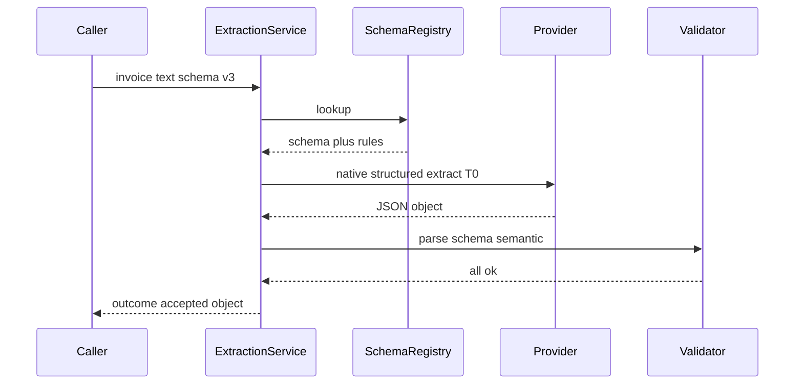
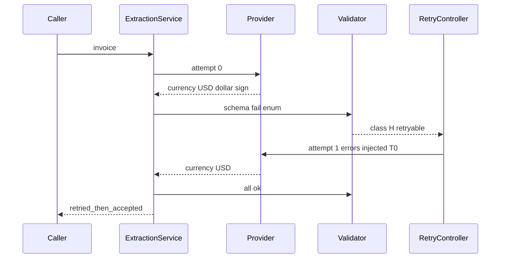
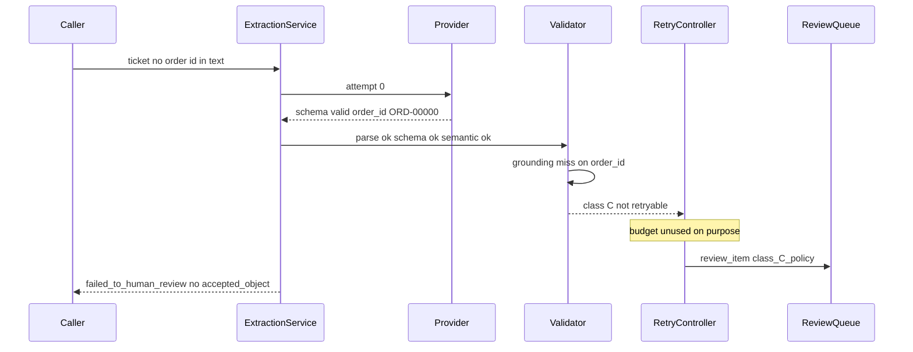
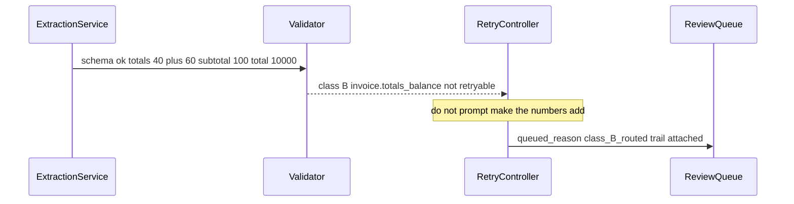
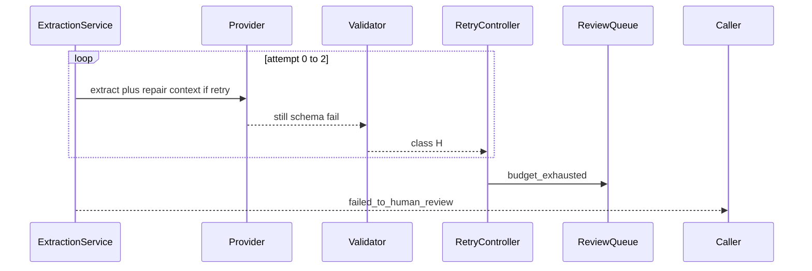

# Structured-Output Extractor — System Design

This document describes *how* the extraction contract works internally: the data model, the validation/retry policy, and the sequences that actually answer the scenario (retry repairing shape, retry failing to catch a lie, budget exhaustion going to review). It complements the [Architecture Document](./02_architecture_document.md), which covers *what* the system is and *why* it is shaped this way.

> This is a design specification. No extractor client, schema library, or review service is implemented as part of this documentation deliverable. Numbered steps are the intended behavior, not a source file.

## 1. Data Model

Five logical stores. They may be JSON files plus a spreadsheet in Phase 1. They must not be collapsed into "the prompt and a parsed dict in memory."

### 1.1 `extraction_request`

The unit of work. One row per caller submission (idempotent on the key below).

| Field | Role |
| --- | --- |
| `request_id` | Stable id. Cited on review items and logs. |
| `idempotency_key` | Caller-supplied. Combined with `source_hash` + `schema_version`. |
| `caller_id` | Who asked. |
| `document_type` | `resume` \| `invoice` \| `support_ticket`. Required. |
| `schema_version` | Pin. Missing → type default recorded as the pin used, never an implicit moving `latest` on replay. |
| `source_text` or `source_uri` + `source_hash` | The text the model will see. Hash is SHA of the exact bytes sent to the assembler. |
| `source_too_large` | If true, do not extract; outcome `rejected` unless caller passed `allow_truncate` **and** a truncation flag will be persisted. |
| `status` | `received` \| `in_flight` \| `terminal` |
| `created_at` | |

**Completeness rule:** no `document_type` → `rejected`. Empty source (after trim) → `rejected` / Class U, **zero** model calls.

### 1.2 `extraction_attempt`

Append-only. One row per provider call that was a validation attempt (transport retries may be nested metadata, not extra rows, if they never produced a body).

| Field | Role |
| --- | --- |
| `attempt_id` | |
| `request_id` | Parent. |
| `attempt_index` | 0-based. |
| `prompt_hash` | Fully rendered prompt including repair context. |
| `model_id` | Provider string + fingerprint/version header if present. |
| `sampling` | Temperature, top-p, seed. Extraction default T=0. |
| `constraint_mode` | `native_structured` \| `json_object` \| `unconstrained` |
| `raw_output` | Exactly what came back. Retention per PII policy; if redacted, store error-classifiable stub + hash. |
| `salvage_applied` | e.g. `fence_strip`. Empty if none. |
| `tokens_in` / `tokens_out` / `latency_ms` | |
| `parse_status` | `ok` \| `fail` \| `truncated` |
| `schema_status` | `ok` \| `fail` \| `skipped` (skipped if parse failed) |
| `semantic_status` | `ok` \| `fail` \| `skipped` |
| `primary_class` | `{P, H, B, C, U}` or null if all ok. |
| `created_at` | |

### 1.3 `validation_failure`

Zero or more per attempt. The retry controller reads these, not a boolean.

| Field | Role |
| --- | --- |
| `attempt_id` | |
| `layer` | `parse` \| `schema` \| `semantic` \| `grounding_heuristic` |
| `class` | P, H, B, C, U |
| `rule_id` | e.g. `jsonschema.required`, `invoice.totals_balance`, `parse.truncated` |
| `json_pointer` | `#/total`, `#/experience/0/end_date` when applicable. |
| `expected` / `actual` | Short, log-safe. Not the entire resume. |
| `retryable` | Copied from the contract table at time of validation (rule pack version). |

### 1.4 `extraction_result`

One row per request, written at terminal state. The object the caller may trust **only** if outcome is an accept flavor.

| Field | Role |
| --- | --- |
| `request_id` | |
| `outcome` | `accepted` \| `retried_then_accepted` \| `failed_to_human_review` \| `rejected` |
| `accepted_object` | Present only for accept flavors. |
| `schema_version` | Echo. |
| `attempt_count` | |
| `flags` | List: `grounding_miss`, `source_truncated_by_caller`, etc. |
| `review_item_id` | If queued. |
| `reject_reason` | `unknown_type` \| `empty_source` \| `source_too_large` \| `budget_exhausted` \| `policy_reject` \| … |

### 1.5 `review_item`

Dead letter. Not the golden set.

| Field | Role |
| --- | --- |
| `review_item_id` | |
| `request_id` | |
| `queued_reason` | `budget_exhausted` \| `class_B_routed` \| `class_U` \| `flagged` \| `class_C_policy` |
| `trail_uri` | Pointer to attempts + failures. |
| `status` | `open` \| `accepted_as_is` \| `edited_accept` \| `rejected` \| `source_insufficient` \| `expired` |
| `reviewer_id` / `reviewed_at` | |
| `edited_object` | If `edited_accept`. Candidate for eval-set promotion (versioned, not automatic). |
| `age_sla_hours` | |
| `expired_outcome` | What happens at SLA breach: `rejected` (default) or `page_ops`. Not `bulk_accept`. |

### 1.6 What is *not* a table

- A `parsed_json` cache without attempt history. You cannot explain `retried_then_accepted`.
- A growing few-shot blob of "correct invoices" inside the prompt with no schema version. See [ADR-005](./04_architecture_decision_records.md#adr-005).
- A `confidence float` column in v1 with no calibration study.

## 2. The Validation/Retry Contract

This section *is* the architecture angle. Numbered so an implementation (or a Phase 1 checklist) can be traced 1:1.

**Defaults:** `validation_retry_budget = 2` (max 3 generations that produce a body). `temperature = 0`. Transport retries do not consume this budget.

### 2.1 Order of operations per attempt

1. **Cheap salvage (not an attempt increment by itself).** If `constraint_mode` is not native and the output looks like fenced JSON, strip fences. Log `salvage_applied`. If salvage yields parse-ok, continue; do not hide it.
2. **Parse.** Fail → Class P. `truncated` (finish_reason / unterminated string) is Class P with `rule_id=parse.truncated`.
3. **JSON Schema.** Fail → Class H. Collect **all** schema errors, not only the first (repair needs the list). Cap the list to a bounded size so a 200-error dump does not blow the next prompt.
4. **Semantic rules** (parse and schema must have passed, or run only rules that do not need a valid object — v1: require schema-ok). Fail → Class B, one failure per `rule_id`.
5. **Grounding heuristic** (optional). Does not set `primary_class` by itself in v1 unless the field is on the `strict_verbatim` list (`invoice.invoice_id`, `ticket.order_id` when non-null). Otherwise flag only.

First failing layer among parse → schema → semantic assigns `primary_class` for retry routing. Additional errors still persist.

### 2.2 Retry triggers (in-bounds)

| `primary_class` | `rule_id` examples | Retry? | What changes on the next attempt |
| --- | --- | --- | --- |
| P | preamble, fence leftover after salvage, trailing comma, invalid JSON | **Yes**, if budget left | Inject parse error; keep T=0; do not change schema |
| P | `parse.truncated` | **Once**, only if `max_output_tokens` is raised or schema/source is split | If already at cap, **no** — terminal. Looping truncation is free money for the provider |
| H | missing required, wrong type, enum, additionalProperties | **Yes**, if budget left | Inject JSON pointers + expected vs actual; T=0 |
| B | allowlisted `retryable_rule_ids` only, e.g. `resume.date_order` where swap is the likely bug | **Yes, at most one B-retry** (consumes budget) | Inject rule id + "re-read source; if source inconsistent, set the escape flag" — schema **must** have that flag or B is not allowlisted |
| B | `invoice.totals_balance` | **No** by default | Route to review. See §2.4 |
| C | grounding miss, invented id | **No** | Review or accept-with-null policy; never "try again to be accurate" |
| U | empty source, wrong type, missing page | **No** | `rejected` or review `source_insufficient`; **zero** extra model calls if source empty |

**Blind resubmit** (same prompt, no error list) is not a legal retry even if it would sometimes work. It is an unguided sample. If native structured output is on and the failure is P/H, the repair still includes errors; the constraint stays on.

### 2.3 What retry must not do

- Must not raise temperature. Extraction is not a creativity task. T>0 turns Class P repair into Class S (see [flaky-output triage](../../prj--llm-flaky-output-triage/README.md)).
- Must not add few-shot examples *in the retry path* as a panic lever. Examples are schema-versioned, not incident-versioned ([ADR-005](./04_architecture_decision_records.md#adr-005)).
- Must not coerce the last invalid object into schema shape in application code (`int("N/A")` → `0`, missing key → `""`) and then mark `accepted`.
- Must not treat `retried_then_accepted` as operationally identical to `accepted` in metrics. Both may flow downstream; only the former is a retry-shaped success.

### 2.4 Class B allowlist (load-bearing)

Default **deny** for semantic retries. A rule is allowlisted only if all of:

1. The check is deterministic and local (date order, enum synonym the schema should have accepted, ISO currency with a `$` suffix).
2. Satisfying the check by **inventing a value that was not in source** is hard or an explicit escape exists (`totals_inconsistent: true`, `dates_unclear: true`).
3. A labeled sample showed repair improved **field exact-match to source**, not merely rule-pass rate.

`invoice.totals_balance` fails (2) unless the schema has `totals_inconsistent` and the repair prompt **forbids** changing numbers to satisfy the equation. Until that escape is in the schema, the rule is not retryable. This is the incident in the [taxonomy](./01_scenario_and_requirements.md#class-b--business-rule--semantic-check-failure).

### 2.5 Terminal fallback

When budget is 0 and the last attempt still fails an in-bounds class, or when class is out-of-bounds:

1. If review is deployed for this `document_type` and reason: `outcome = failed_to_human_review`, enqueue `review_item` with trail. Caller receives that outcome **and must not** write `accepted_object` to the system of record.
2. If review is not deployed: `outcome = rejected`, `reject_reason = budget_exhausted` or `class_routed_no_review`. Caller handles reject (retry later, manual, skip).
3. Sync HTTP: do not wait for the reviewer. Return the terminal outcome immediately.

**There is no "return last best-effort object with a warning header" that downstream is free to ignore.** If a caller needs a partial object for UX (show what we got), that is a **separate** `partial_object` field, not `accepted_object`, and default UX is review-not-store.

### 2.6 Transport vs validation

| Event | Counter | Policy |
| --- | --- | --- |
| 429, 5xx, timeout, empty body from transport | `transport_retry` | Exponential backoff, cap separate (e.g. 3), jitter. Not in this document's validation budget |
| 200 with illegal JSON / schema fail | `validation_retry` | This contract |
| 400 from provider because schema keyword unsupported | neither retry | `rejected` or fallback `constraint_mode` once per request (mode downgrade is **one** allowed switch, then validate) |

## 3. Semantic Rule Packs (v1 minimum)

Not exhaustive. Enough to prove Class B is real. Each rule has `rule_id`, `retryable` default, and a one-line failure message for the repair prompt.

**Invoice:** `invoice.line_sum_eq_subtotal`, `invoice.subtotal_plus_tax_eq_total` (both **not** retryable until `totals_inconsistent` exists), `invoice.currency_enum`, `invoice.due_not_before_issue` (retryable if escape `dates_unclear`).

**Resume:** `resume.email_format` (retryable — format is shape-like), `resume.experience_date_order` (retryable with `dates_unclear`), `resume.end_without_start` (not retryable by default).

**Ticket:** `ticket.intent_enum` (schema layer, Class H), `ticket.order_id_format_if_present` (retryable), `ticket.order_id_must_appear_in_source_if_non_null` (grounding, Class C, **not** retryable; prefer null).

## 4. Prompt and Constraint Binding

v1 assembler behavior:

1. System: extractor role; "no preamble"; absence policy ("null if not in source; never invent order_id, invoice_id, email").
2. Native schema field **or** compact schema; do not dump a 20-page JSON Schema into the prompt if the API takes it natively.
3. Source in a delimited block. Hash matches `source_hash`.
4. Repair user turn (attempts > 0): "Previous output failed validation. Errors:" + bulleted `json_pointer` / `rule_id` / expected vs actual. "Revise by re-reading the source. Do not invent fields to satisfy the schema. Use null / flags where allowed."
5. Few-shot: at most 1–2 **synthetic** shape examples versioned with schema, no real PII, deleted if native constraint drops Class P/H enough ([ADR-005](./04_architecture_decision_records.md#adr-005)).

## 5. Sequence Diagrams

### 5.1 Happy path: valid on attempt 0

Native structured output, invoice, totals already consistent.

### 5.2 Shape failure caught and repaired on retry

Class H: `currency` came back `"USD $"`.

This is the case retry is for. Metrics must show it as retry-shaped success, not hide it in a generic 99% valid.

### 5.3 Schema-valid but wrong: retry cannot catch it

Class C: ticket has no order id; schema allows null but the model emits `ORD-00000`. Grounding heuristic flags; policy for `order_id` is strict.

If the schema had `order_id` **required** without null, this would have been forced invention even more often. The fix is the schema, not a retry.

### 5.4 Class B totals: retry forbidden, review gets the inconsistency

### 5.5 Budget exhausted → human review

Class H that will not die (nested schema the model cannot satisfy; or native constraint unavailable and the model keeps omitting a key).

If review is not staffed: same sequence, `rejected` / `budget_exhausted`, no queue.

## 6. Observability (Minimum)

Metrics that change behavior:

- Outcomes: count by `outcome`, `document_type`, `schema_version`.
- Retry: `validation_retry` rate by `primary_class` and `rule_id`; mean attempts; budget-exhaustion rate.
- Layers: parse-fail, schema-fail, semantic-fail, grounding-flag rates — **separately**. A single `valid_json_rate` is forbidden as the headline.
- Cost/latency: tokens and ms per request (all attempts); p95 first-attempt vs p95 including validation retries.
- Review: queue depth, age, SLA-breach, reviewer actions mix (`edited_accept` share is gold; `accepted_as_is` on exhausted Class H may mean reviewers are rubber-stamping).
- Flags: `retried_then_accepted` rate (climbing without Class P/H drop after enabling native structured output means the constraint is not working).

Logs: `request_id`, `attempt_index`, `constraint_mode`, `rule_id`, `outcome`. Not full resumes in default logs.

Alert when: schema-fail rate spikes (your schema or the provider — [forensics](../../prj--llm-schema-drift-forensics/README.md) if the native output shape moved); review age exceeds SLA; accept rate jumps **up** after a schema `required` change (suspicious: more invention).

## 7. Mapping Back to the Scenario Questions

| Question | Answer in this design |
| --- | --- |
| Convince them in under 2 minutes | [The 2-Minute Answer](./01_scenario_and_requirements.md#the-2-minute-answer). Retry repairs shape. Schema-valid ≠ true. Exhausted budget goes to review or reject, never silent success. |
| What happens on a schema-invalid response | Layered errors → Class H (or P) → repair prompt with JSON pointers → T=0 → at most 2 retries ([§2](#2-the-validationretry-contract)). |
| How many retries | Default 2. Not unbounded. Truncation and Class C do not get the full budget. |
| What's the fallback | `failed_to_human_review` with trail, or `rejected` if no queue. No coerced defaults. Optional `partial_object` is not `accepted_object`. |
| Is this just "add retry"? | No. Native structured output is the shape control; layers distinguish B/C; B totals are not retryable by default; outcomes are enum-typed. |

## 8. Worked Retry Cheatsheet

For the Phase 0 contract card. Short on purpose.

| You observe | Layer | Class | Retry? | Fallback |
| --- | --- | --- | --- | --- |
| Markdown fence / preamble | parse | P | Yes (after salvage) | Review/reject at budget |
| Truncated JSON | parse | P | Only with more output tokens, once | Reject truncated; split doc |
| Missing required key, source has it | schema | H | Yes | Review at budget |
| Missing required key, source does not | schema or U | H/U | No (fix schema: allow null) | Review / accept null |
| `"USD $"` vs enum | schema | H | Yes | — |
| Totals do not add | semantic | B | **No** default | Review; do not "fix the math" |
| Dates inverted | semantic | B | Maybe, with `dates_unclear` | Review |
| `order_id` not in source | grounding | C | No | Null or review |
| Empty OCR text | — | U | No | Reject, zero LLM calls |
| `"N/A"` in an amount field | schema or coerce temptation | H | Yes as type error | Never coerce to 0 |
| Native JSON valid, wrong employer | (none) | C | No | Eval/review; not this retry loop |

When unsure between H and U on a missing field: **open the source**. If the value is not there, it is U (schema problem) not a retry problem. The cost of retrying U is invented content. The cost of allowing null is a column the downstream must handle — that is the correct cost.
