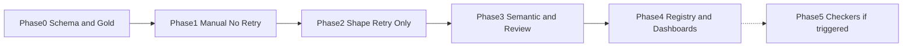

# Structured-Output Extractor — Phased Implementation Plan

Each phase has an **Objective**, **Deliverables**, and an **Exit Gate** that must pass before the next phase begins. Phases 0–4 are sequential. Phase 5 is conditional and may never trigger.

The order is load-bearing: **Phase 1 does not auto-retry, and Phase 3 is the first phase that can honestly claim a semantic contract.** If Phase 0–1 are skipped ("we already know it's a JSON problem, we'll add layers later"), the trap is back — you cannot prove retry is safe if you never measured what retry does to *content*.

## Phase 0 — Foundations

**Objective**: Freeze **one** document type, its schema v1, the layer definitions, and a labeled sample before anyone ships a retry client under this project's name.

**Deliverables**:
- Document type choice: resume **or** invoice **or** ticket — not all three. Invoice if the scenario must include arithmetic (Class B); ticket if Class C identifiers matter most; resume if PII/date-order is the story. Write down why.
- JSON Schema v1: `required` vs nullable decided explicitly for every critical field. Absence path exists for fields that can be missing in source ([ASR 6](./01_scenario_and_requirements.md#architecturally-significant-requirements)).
- Semantic rule list **on paper** (even if not coded): which `rule_id`s, which are retryable (default deny for totals).
- Provider constraint inventory: native structured output / JSON mode / neither, tested on *this* schema (unsupported keywords logged). `constraint_mode` default chosen ([ADR-003](./04_architecture_decision_records.md#adr-003)).
- Contract card: the [cheatsheet](./03_system_design.md#8-worked-retry-cheatsheet) customized with this type's `rule_id`s. Budget = 2 written down.
- First frozen batch: at least **30** real documents with **human gold objects** (field-level). Dual-entry on a 10-item slice to measure annotator disagreement (dates and line items will hurt).
- Baseline *without* retry: one-shot extract (chosen constraint mode, T=0), layer fail rates, field exact-match vs gold. This is the number Phase 2 has to beat on **shape** without hurting **match**.
- PII/retention decision for raw outputs. Tracing: will you keep bodies for [forensics](../../prj--llm-schema-drift-forensics/README.md)?
- Named owners: schema, serving, review (even if review is "the engineer of the week"), caller.
- Eval-harness status: exists / stub / neither. Field exact-match spec written either way.

**Exit Gate**:
- [ ] Schema v1 frozen; `required` list can be explained field-by-field ("source always has it" vs "downstream wished it").
- [ ] Baseline one-shot metrics **published**: parse-fail, schema-fail, semantic-fail (if rules were applied by hand), field exact-match overall and on strict fields (`total`, `order_id`, dates).
- [ ] Provider constraint test recorded. If native is unused while available, that is a Phase 0 fail, not a Phase 2 surprise.
- [ ] Gold batch ≥30 with a documented disagreement rate. If dual-entry on dates is coin-flip, fix the annotation guide (normalization: `Present`, `2024-01` vs `Jan 2024`) before blaming the model.
- [ ] Review vs reject deployment mode chosen in writing ([ADR-004](./04_architecture_decision_records.md#adr-004)).

**Honesty gate:** if the team will not label 30 gold objects, they may keep the [2-minute answer](./01_scenario_and_requirements.md#the-2-minute-answer) as a talking point. They may not claim an extraction contract. See [kill criteria](./05_tradeoffs_and_honest_assessment.md#8-kill-criteria).

## Phase 1 — Manual-in-the-Loop (No Auto-Retry)

**Objective**: Run extraction with **max_attempts = 1**, and send **every** result through a human (accept / edit / reject). Gather layer failures as data. Spreadsheet is success, not an incomplete feature.

**Deliverables**:
- CLI or worker: assemble prompt, call provider, parse + schema validate, **stop**. No repair loop.
- Record `extraction_request` / `attempt` / layer statuses even if in a spreadsheet.
- Human review of 100% of outputs against source (not against "does it look like JSON"). Edits captured.
- Weekly counts: layer fail rates, edit rate, invention notes (Class C anecdotes tagged).
- Schema tweaks allowed (nullability, enums) as version bumps. Prompt tweaks allowed. Retry still off.

**Exit Gate**:
- [ ] ≥30 *new* documents (not only the Phase 0 museum batch) have gold-vs-model comparison.
- [ ] Edit taxonomy: what humans change is classified P/H/B/C/U. If ≥50% of edits are Class C (wrong values, valid shape), **do not** expect Phase 2 retry to save you — retry is the wrong lever; schema/nulls/ingestion are.
- [ ] If ≥50% of failures are Class P/H, Phase 2 is justified.
- [ ] No validation retry in this phase (review the path). Transport retry for 429 is allowed and counted separately.
- [ ] Caller still does not write model output to a system of record without the human action.

**Honesty gate:** product will want auto-retry immediately. The compromise is a short Phase 1 on real documents, not skipping the mix of classes because "obviously it's just fences."

## Phase 2 — Bounded Auto-Retry for Shape Failures Only

**Objective**: Turn on repair-retry for Class P and Class H only. Prove it moves shape metrics without inflating content errors. Semantic auto-retry stays **off**.

**Deliverables**:
- Retry controller: budget 2, error injection, T=0, salvage + parse + schema ([System Design §2](./03_system_design.md#2-the-validationretry-contract)).
- Outcomes: `accepted` / `retried_then_accepted` / `rejected` (or review inbox if already staffed — still no B allowlist).
- Metrics: retry rate by `rule_id`; field exact-match on the frozen gold **after** retries vs Phase 0/1 one-shot.
- Drill: truncated input does **not** loop at the same `max_tokens`.
- Drill: a schema-invalid fixture is repaired or exhausts to reject/review — never coerced.

**Exit Gate**:
- [ ] Parse+schema fail rate on the frozen set dropped vs Phase 1 one-shot **or** is already near-zero (native constraint worked; then retry rate should be low — if retry rate is high with native on, constraint is not working).
- [ ] Field exact-match on strict fields did **not** drop vs Phase 1 by more than annotation noise. If match dropped while schema-pass rose, retry is laundering — **stop**, do not proceed to more retries.
- [ ] Budget exhaustion produces `rejected` or a real queue item, never `accepted_object` on a schema-invalid body ([ADR-004](./04_architecture_decision_records.md#adr-004)).
- [ ] Class B rules, if computed, are **observability only** in this phase (do not retry them).

Phase 2 still **cannot** claim semantic correctness. It can only claim the shape contract is bounded.

## Phase 3 — Semantic Layer + Formal Review Queue

**Objective**: Make Class B visible and make the terminal fallback operational. This is the first phase that operationalizes sequences [§5.3–5.4](./03_system_design.md#53-schema-valid-but-wrong-retry-cannot-catch-it).

**Deliverables**:
- Semantic rule pack coded and versioned with the schema. Totals rules **not** retryable unless `totals_inconsistent` (or equivalent) ships in the same version.
- Optional grounding on strict fields (`order_id`, `invoice_id`) as flags or hard fail per written policy.
- Review queue: `review_item` fields, SLA, expire-to-reject (or page). Reviewer UI/checklist: must show **source**, not only last JSON.
- `retried_then_accepted` vs `accepted` both visible to ops.
- Labeled eval: field exact-match + layer rates on the frozen set after semantic rejects-to-review. If [eval harness](../../prj--support-bot-eval-harness/README.md) exists, plug in; else an honest stub with documented N.
- B-retry allowlist starts **empty**. Add a rule only with a before/after exact-match note.

**Exit Gate**:
- [ ] Drill: unbalanced invoice does **not** get a "fixed" total via retry; it queues or rejects.
- [ ] Drill: invented `order_id` with grounding policy on does not `accepted` (null, review, or reject per policy).
- [ ] Queue SLA documented; a drill expires an item to `rejected` (not bulk-accept).
- [ ] Exact-match numbers republished. Review+reject rate published. If review+reject > the kill band in [Trade-offs §8](./05_tradeoffs_and_honest_assessment.md#8-kill-criteria) after schema/null fixes, **stop expanding types** and revisit whether this type belongs here.
- [ ] Phase 2 shape retry still in place (regression: semantic layer is not a substitute for schema validate).

**Honesty gate:** if N gold is too small to see exact-match movement, say `inconclusive` and do not use "accurate" language. Do not add more retry budget to make the demo look busy.

## Phase 4 — Multi-Type Registry + Observability

**Objective**: Add the remaining document types behind a registry, and stop using a spreadsheet as if it were production telemetry.

**Deliverables**:
- Schema registry (git is enough if version pins work; a service if multiple callers need it). Caller **must** send `document_type`; no auto-detect.
- Per-type rule packs and budgets (defaults may differ: tickets might `max_attempts=1` for sync UX).
- Dashboards: outcomes, layer rates, retry rate, p95 first vs p95 with retries, review age, few-shot token count if any.
- Alert drills: schema-fail spike; review SLA; accept-rate jump after a `required` change.
- Body retention sampling compatible with PII, enough that forensics has a rung above "nothing."
- Few-shot inventory: if examples exist, token budget and schema pin ([ADR-005](./04_architecture_decision_records.md#adr-005)).

**Exit Gate**:
- [ ] Second type shipped **only after** Phase 3 exit on the first type. Copy-paste schema without gold batch is a fail.
- [ ] Dashboard states the **blind spot**: accept rate ≠ accuracy; Class C is flags + audit sample.
- [ ] `document_type` mismatch rejects (resume text + invoice schema does not "do its best").
- [ ] p95-with-retries is an official SLO number or explicitly **not** in the SLO. No hiding.

## Phase 5 — Conditional Confidence and Checkers

**Objective**: Add per-field flags/scores or a budgeted second-pass checker — **only** when Phase 0–3 measurement is real. Not a judge on 100% of traffic on day one.

**Entry Gate (all of):**
- [ ] Frozen gold still maintained; exact-match and review rate re-measured (not a memory of Phase 3).
- [ ] Phase 2 retry is not the only thing "fixing" quality; native constraint on if available.
- [ ] ADR-004 still held (no coercion, no bulk-accept).
- [ ] Written cost cap for any extra LLM calls (e.g. checker on review-queue items only, or on `retried_then_accepted` invoices, not on every resume).
- [ ] Review+reject rate is low enough that a checker has something to rank, or high enough that you are **not** using a checker to avoid the kill criterion in §8.

**Deliverables (pick what the entry gate justifies; do not bundle):**
- Calibrate flags against `edited_accept` (precision/recall of `grounding_miss` vs human edits). Kill flags that do not predict edits.
- Optional: second-pass extract of **one** high-stakes field (total, order_id) on a budgeted subset; disagreement → review. This is not k-vote on the whole object.
- Optional: promote reviewer edits into gold (versioned), never automatically into few-shot.
- Do **not** auto-raise retry budget from a model.

**Exit Gate**:
- [ ] Extra LLM spend stays under the cap in a drill.
- [ ] Checker/flags never auto-flip `rejected` → `accepted`.
- [ ] Confusion vs human edits published; if the checker always agrees with attempt 0, it is unshipped.
- [ ] Killing Phase 5 returns you to Phase 3–4 behavior.

This phase can be deferred indefinitely. A pinned schema, native structured output, budget-2 shape retry, semantic deny-by-default, and reject-or-review will handle the interview scenario. Shipping an "AI validator" in Phase 1 is the retry trap at one higher level of abstraction.

## Phase Dependency Graph

Phases 2–3 may be compressed in calendar time on a small team; they must not be collapsed into one deploy that first turns on "retry until totals add." Phase 1 should see real class mix before Phase 2 claims retry is safe. Phase 5's dotted line is the whole point: most teams should stop at Phase 3 or 4.

## Suggested calendar (not a commitment)

Illustrative for a team that already calls an LLM and has *some* documents on disk. Replace with your staffing.

| Phase | Elapsed if staffed | Elapsed if gold labels do not exist yet |
| --- | --- | --- |
| 0 | 1–2 weeks (labeling is the wait) | Same — do not skip labels |
| 1 | 1–3 weeks of calendar (needs volume) | Same |
| 2 | 1 week | Same |
| 3 | 1–2 weeks if rules are simple | 2–4 weeks if invoice arithmetic + review UX |
| 4 | 1–2 weeks per additional type | Each type needs its own gold, not a copied prompt |
| 5 | Optional, weeks | Do not start |

If leadership asks for Phase 5 in week one, the answer is the Phase 0 exit gate, not a model choice. If they ask for "just add retry" in week one, the answer is Phase 1's class mix: retry is Phase 2, and only for the slice that was actually shape.
