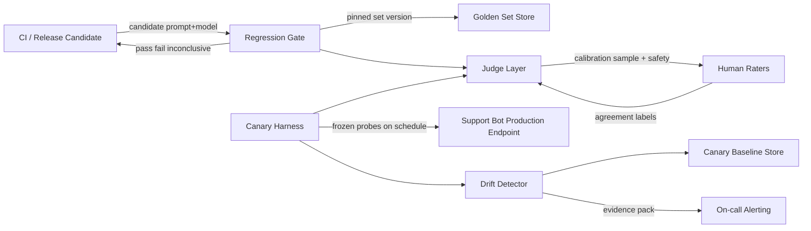
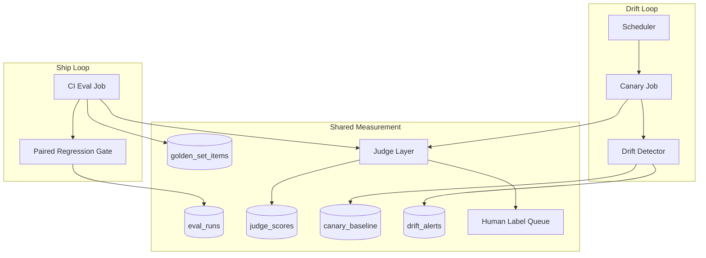
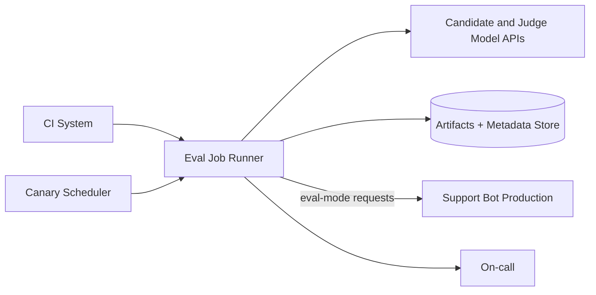

# Support Bot Eval Harness — Architecture Document
> - **Document Status**: Draft
> - **Last Updated**: 2026 Aug 29
> - **Author**: Paul Serban

An evaluation harness for a customer-support bot whose prompt (or prompt+model pairing) is about to ship. The harness curates a versioned golden set, gates ships on a statistically defensible paired comparison, and keeps a frozen canary pointed at production so a provider swapping the model under the same API name is a detected event rather than a three-week CSAT mystery.

## Overview

**Brief description**: This is not an LLM platform. It is the measurement path that sits beside one support bot so that "we evaluated it" means a named run against a frozen set, and "the model didn't change" is a hypothesis tested on a schedule, not a property of a string in an API request.

**Business Context**
- Owner: the team that owns the support bot's prompt, tools, and model routing (see [Scenario and Requirements](./01_scenario_and_requirements.md)).
- Current state: playground transcripts and a one-time comparison treated as a ship gate. The production `model=` field is treated as a stable identifier.
- Desired future state: two loops. A pre-ship CI gate that can block. A production canary that can page. Both share a frozen probe/golden set and a calibrated judge. Neither is optional if the bot makes promises, handles money-adjacent actions, or is the thing the company will defend in an incident.
- Goal: catch prompt/model regressions before customers do, and catch silent provider-side swaps that no client-side `model=` check can see — at the cost of ongoing judge spend, human calibration time, and an eventual-consistency window on "we noticed."
- Target users: prompt owner/PM, eval engineer, support on-call, trust & safety.

## Requirements

### Functional Requirements

- **Golden set**:
  - The system must store items with provenance, stratum tags, rubric/expected-behavior, safety flag, and a golden-set version id.
  - A ship eval must pin a golden-set version. Mutating items is a new version, not an in-place edit of history.
  - Real-ticket items must be anonymized before persistence.
- **Judging**:
  - Each candidate response is scored on a decomposed rubric (not only a single "good/bad").
  - LLM-judge scores are stored with judge identity, prompt version, and whether a human later agreed.
  - Safety-flagged items require a human label; the LLM judge may propose, not decide.
- **Regression gate**:
  - A candidate run is paired against a declared baseline run on the same golden-set version.
  - The gate emits pass, fail, or inconclusive, with per-stratum breakdowns.
  - CI consumes the gate; a fail blocks the ship of that prompt+model bundle.
- **Canary / drift**:
  - A frozen probe set is replayed against the live production endpoint on a schedule.
  - Scores and behavioral fingerprints are compared to a stored baseline distribution.
  - A drift alert carries an evidence pack; it does not silently auto-rollback in the default design.
- **Failure**:
  - If the judge or the candidate model is unavailable, the gate fails closed (do not ship on a skipped eval).
  - If the canary cannot reach production, that is an eval outage, paged separately from quality drift.

### Non-Functional Requirements

**Performance Requirements:**
- Pre-ship gate: fast enough to run on a PR or a release candidate without becoming the reason people skip it. Design intent: complete a golden-set pass (candidate + baseline if baseline is not cached) in tens of minutes for a set sized to the statistical requirement, not seconds for 10 items. Exact SLA is a Phase 1 measurement, not a guess in this document.
- Canary: a full probe pass on a cadence short enough that a mid-week silent swap is caught before a weekly quality review. Daily is the default design intent; hourly is justified only if the bot is high-stakes *and* the probe set is small enough that cost is acceptable.
- Gate latency must not be "optimized" by shrinking the golden set below the sample size the statistics require. That is not a performance win.

**Service Level Agreement (SLA):**
- System Criticality: quality-adjacent to money and trust. A silent policy-loosening swap or a safety regression is an incident, not a dashboard curiosity.
- The *eval system*'s availability matters at ship time (gate fail-closed) and on the canary cadence (missed runs are blind time). It does not need five-nines. It needs "we did not skip Friday's canary and call it fine."
- Detection lag for a silent swap: bounded by canary cadence × number of runs required for the shift test to fire. This lag is a product fact. Claiming "we detect immediately" is a lie unless the probe is continuous and the shift is large.

**Infrastructure Constraints:**
- Technology shape (not an implementation mandate): object store or table for golden items and run artifacts, a job runner for eval and canary passes, a CI integration, a secrets store for model API keys, a scheduler, an alerting path into the existing on-call tool. This is not an excuse to buy an "LLM eval platform" on day one ([ADR-001](./04_architecture_decision_records.md#adr-001) is about the *gate math*, not the vendor).
- Candidate traffic for canaries must not mutate real customer state. Tool-calling bots need a non-mutating eval mode or a shadow environment that still uses the production *model routing*.

## Executive Summary

The architecture is **Golden-Set Regression Gate + Continuous Production Canary**. Two loops, same measurement machinery, different triggers.

1. **Ship loop (offline, fail-closed):** prompt or model change → run candidate against frozen golden set → judge → paired comparison vs baseline → pass / fail / inconclusive.
2. **Drift loop (online, always-on):** scheduler → replay frozen probe set against live production endpoint → compare score distribution and behavioral fingerprints to stored baseline → alert or stay quiet.

The ship loop cannot see a change the team did not initiate. The drift loop cannot, by itself, be a ship gate (it is too slow and too noisy for PR-by-PR use). **Both are required** for the scenario as stated. Building only the gate leaves the "same API name, different model" case unsolved. Building only the canary leaves you shipping on vibes and noticing later.

**Architecture Style:** Offline paired-comparison CI gate plus scheduled production probing, with a calibrated judge layer shared by both.

**Key Components:**
- **Golden Set Store**: versioned, stratified items; freeze policy.
- **Judge Layer**: rubric scoring, LLM judge, human calibration sample, mandatory human on safety.
- **Regression Gate**: paired stats, CI-integrated, three-way outcome.
- **Canary Harness**: frozen probe replay against production routing.
- **Drift Detector**: distributional shift + behavioral fingerprints.
- **Alerting / Escalation**: evidence pack, on-call, no silent auto-rollback by default.

**Architecture Principles:**
- **A named run is the unit of evidence.** "We looked at it" is not a run.
- **Pair against a baseline; do not worship a magic percentage.** Absolute scores drift with the judge and the set.
- **Inconclusive is a legal gate output.** Rounding it to pass is how you ship noise.
- **The API name is not a version.** Production must be probed as if the vendor might lie by omission.
- **Safety is not averaged.** A stratum can fail the ship while the mean looks better.
- **Judges are instruments.** Instruments are calibrated. Uncalibrated instruments are decoration.

**Key Architectural Decisions:**
1. Statistical paired comparison over a simple threshold-diff on the mean ([ADR-001](./04_architecture_decision_records.md#adr-001)).
2. Frozen, versioned golden set with an explicit refresh cadence, not a living set edited daily ([ADR-002](./04_architecture_decision_records.md#adr-002)).
3. Calibrated LLM-judge plus sampled (and safety-mandatory) human review, not pure-human or pure-rules ([ADR-003](./04_architecture_decision_records.md#adr-003)).
4. Continuous production canary as the silent-swap detector, not vendor changelogs ([ADR-004](./04_architecture_decision_records.md#adr-004)).
5. Behavioral fingerprints as a supplement to score-based drift, not a replacement ([ADR-005](./04_architecture_decision_records.md#adr-005)).

### The Anti-Pattern This Design Exists to Kill

This fails because:

- The sample is selected after the author knows the answer.
- Grading is unblinded and usually the author.
- There is no baseline run to pair against, only a feeling.
- After ship, nothing queries production with a frozen input set. A same-name swap is invisible until humans or CSAT move — both lag, both confound.

### Context Diagram

## Runtime Architecture

1. **Ship-time (synchronous with the release, async with the customer)**
   - Resolve golden-set version pin and baseline run id.
   - Generate candidate responses (or reuse cache if the candidate artifact is unchanged).
   - Judge all items; force human path on safety flags.
   - Paired comparison; write `eval_runs`; emit gate result to CI.
2. **Steady-state canary**
   - Scheduler fires.
   - Replay probe set through production routing in non-mutating eval mode.
   - Record scores + fingerprints; compare to `canary_baseline`.
   - Alert or record a quiet run.
3. **Calibration loop (slower cadence)**
   - Sample judged items (and all safety items) for human labels.
   - Recompute agreement; if below floor, mark the judge untrusted (gate fail-closed on judge-trust, not on quality).

## Components

### 1. Golden Set Store

**Purpose**: Be the system of record for "what we claim to test." A git repo of JSONL can be this store in Phase 1. A table with artifact blobs can be it later. The architecture cares about versioning and freeze, not the vendor.

**Responsibilities:**
- Persist items: input (and conversation prefix for multi-turn), tool-context stubs, rubric / expected-behavior notes, stratum tags, safety flag, provenance, anonymization status.
- Version the *set*, not only the items. An eval run records `golden_set_version`.
- Enforce freeze: a version used by a baseline run is immutable. Fixes are a new version.
- Serve the canary probe set, which is a named, usually smaller, *frozen subset or sibling set* — not "whatever is in the latest draft."

**Interactions:**
- Read by: gate, canary, humans (for labeling UI).
- Written by: curation process (see [System Design — Curation](./03_system_design.md#2-golden-set-curation-pipeline)), version-bump review.

**Honesty about this component:** a golden set is a biased sample of yesterday's tickets plus the adversarial cases someone was clever enough to write. It will not contain the failure mode you have not imagined. Treating a high score as "the bot is good" is the same category error as treating unit-test pass as "the product is correct." The set is a regression instrument. Coverage is a claim that needs a stratification argument, not a row count.

### 2. Judge Layer

**Purpose**: Turn a (item, response) pair into rubric dimension scores that a statistic can consume.

**Responsibilities:**
- Apply a decomposed rubric (e.g. policy-correctness, factuality vs retrieved context, tool-use appropriateness, tone, harmful-content refusal). Exact dimensions are product-specific; the architecture requires dimensions, not a vibe.
- LLM-judge: structured output per dimension, with a short evidence span. Store judge model id and judge-prompt version — judge changes *are* eval-system changes and can create false regressions.
- Mitigate known biases: randomize pairwise order when comparing candidate vs baseline; do not let "longer" win by default; never let the candidate model grade itself as the sole judge.
- Route safety-flagged items to humans; LLM output is advisory.
- Track human agreement on a sampled subset as a first-class metric.

**Interactions:**
- Reads: responses, items, judge prompt, human labels.
- Writes: `judge_scores`.

**Honesty about this component:** published LLM-as-judge agreement with humans is often in a range that would be embarrassing for a unit test. 70–80% agreement on a coarse rubric is a *good* day, not a failure of your implementation. That means a 2-point mean shift on a 5-point scale can be judge noise. Calibration does not make the judge true; it tells you how much of the gate is fiction. If you cannot staff human labeling, you do not have a calibrated judge. You have a second model agreeing with the first. [ADR-003](./04_architecture_decision_records.md#adr-003).

### 3. Regression Gate

**Purpose**: Decide whether this candidate may ship, in language CI can consume, without laundering noise into a pass.

**Responsibilities:**
- Load paired per-item scores for candidate vs baseline on the same `golden_set_version`.
- Compute overall and per-stratum deltas with a paired method (bootstrap CI or equivalent — [System Design](./03_system_design.md#4-regression-detection-across-model-version-upgrades)).
- Apply ship policy: e.g. fail if safety stratum regresses significantly *or* if overall quality regresses beyond the agreed minimum detectable effect; inconclusive if CIs include both harm and noise; pass only if no fail-rule trips *and* the run is complete (no skipped items beyond a tiny budget).
- Fail closed on harness errors (candidate 5xx, judge outage, too many parse failures).
- Publish an artifact: run id, set version, baseline run id, tables, example regressions. A binary CI status without the artifact is how people re-run until green.

**Interactions:**
- CI, store, judge, eval_runs.

**Honesty about this component:** a "pass" is "we did not detect a regression of size X on this set," not "the prompt is better." Teams will still present passes as proof of improvement. The gate's job is to make that misread harder, not to prevent humans from lying to themselves. Also: if the team is allowed to re-run the candidate with temperature noise until the gate passes, you have p-hacked the ship. One pre-registered run per candidate artifact, or a locked seed plus a documented re-run policy.

### 4. Canary Harness

**Purpose**: Exercise the *production path* — the actual router, the actual `model=` string, the actual prompt currently loaded — with inputs whose expected behavior is known.

**Responsibilities:**
- Hold a frozen probe set (often a subset of the golden set plus a few production-shaped items that must not be in the set the prompt is tuned on, if that split is maintained).
- Call production in eval mode: tagged, non-mutating, isolated from CSAT and ticket creation.
- Record full response, latency, token usage, finish reason, any provider headers (`system_fingerprint` or equivalent), and judge scores.
- Run on a schedule independent of deploys. Deploys also *may* trigger an extra canary; they do not replace the schedule. The silent swap does not happen on your deploy.

**Interactions:**
- Production endpoint, judge, drift detector, baseline store.

**Honesty about this component:** if "production" for the canary is a staging replica that still points at a pinned model while real users hit an unpinned name, the canary is theater. The probe must share the model-routing configuration users share. That is inconvenient (eval traffic on the prod account, prod keys, prod rate limits). It is the requirement. Staging-only canaries catch *your* deploys, not *their* swaps.

### 5. Drift Detector

**Purpose**: Decide whether the latest canary distribution is still the same process as the baseline, in scores and in behavior.

**Responsibilities:**
- Maintain a baseline: typically a window of canary runs after a known-good ship (not a single run — one run is noise).
- Compare latest run (or a short rolling window) to baseline on: per-dimension score distributions, per-stratum means, and fingerprint features (latency quantiles, output length, tool-call rate, refusal rate, JSON/schema validity rate).
- Use a change-detection rule that is allowed to be conservative (CUSUM-style or sequential testing / distributional tests with a pre-registered false-positive budget). Page on-call for a living product is expensive; a detector that cries daily will be muted, which is worse than a slower detector.
- Incorporate vendor signals when present (changelog scrape, fingerprint header change) as *corroboration*, never as the sole trigger and never as a veto that prevents score-based alerts.

**Interactions:**
- Canary results, `canary_baseline`, `drift_alerts`, alerting.

**Honesty about this component:** this is the part of the design that answers the exam question, and it is also the part that cannot be made certain. A small swap that preserves style and mean quality will not fire. A gradual drift over weeks can be absorbed into a sliding baseline if you are sloppy about *when* the baseline is allowed to update. Baseline updates must be explicit (after a human-accepted ship or a documented "re-baseline after false alarm"), not "always blend last 30 days." Blending is how you train the detector to ignore the incident.

If the provider exposes **zero** version or fingerprint signal, statistical detection on a finite probe set is the *only* client-side signal. State that in the runbook. Do not write "we will detect all silent swaps."

### 6. Alerting / Escalation

**Purpose**: Turn a detector output into a human process that can freeze ships, sample live traffic, and decide whether to pin, roll back, or accept.

**Responsibilities:**
- Page with an evidence pack: which strata moved, fingerprint deltas, three example transcripts (baseline vs current), whether a vendor fingerprint changed, last known-good run id.
- Distinguish eval-harness outage (canary didn't run) from quality drift (canary ran, distribution moved).
- Default: **no automatic production rollback.** Automatic *block of new prompt ships* once Phase 4 is on is reasonable. Yanking prod because a judge hiccuped is how you create a worse incident.

**Honesty about this component:** if on-call does not own this, the canary is a nightly email nobody reads. That is the DLQ-nobody-pages failure mode from every other project in this workbook, with a different payload.

### Communication Patterns

**Synchronous:**
- CI ↔ gate: start run, wait for pass/fail/inconclusive (or a timeout that is treated as fail-closed).
- Gate/canary ↔ model APIs: generate responses; judge calls.

**Asynchronous:**
- Scheduled canary.
- Human labeling queue.
- Alerting.

There is no synchronous "ask the vendor if they swapped the model" as a control-plane dependency. When a fingerprint header exists, read it. When it does not, the canary still runs.

## Brutal Honesty

This pattern is **materially more expensive** than a notebook and a vibe:

- A second product (the harness) with its own outages, costs, and on-call.
- Human labeling budget that does not go to zero after launch.
- Judge-model token cost that scales with `items × dimensions × (candidate + baseline) × runs`, plus canary frequency.
- A golden set that is a standing editorial process, not a file you write once.
- An inconclusive gate that will infuriate a PM who wanted a green check. That outcome is the design working.
- A detection lag on silent swaps measured in hours to days, not seconds.
- False alarms that will train people to ignore the page if you tune aggressively.

**When this is justified:** the bot can issue refunds, change orders, quote policy that legal will be asked about, handle abuse/self-harm adjacent content, or is the public face of support at a volume where a quiet Tuesday swap is a real money or trust event. Also justified when you are about to change model families or providers and need a gate that is not the prompt author's preference.

**When this is overkill:** an internal FAQ bot with a human in front of every action, or a prompt tweak that cannot change tools or policy (typos, obviously equivalent rephrasing) where a cheap smoke subset is enough. Shipping this whole machine for a 20-ticket/week bot with no tools is architecture theater. A frozen 30-item set, a cheap rubric, and a weekly manual canary can be the *correct* design there — with the failure modes documented, not ignored.

**The consistency window is a product fact.** After a silent swap, you are blind until the next canary completes and the shift test has enough evidence. If the business requirement is "we never serve a swapped model even for one request," this architecture **cannot meet that requirement**. That requirement needs a vendor pin (model-version-id, dedicated deployment, or on-prem weights). If the vendor will not pin, you do not have that guarantee. The canary is residual-risk management, not a time machine.

**Complexity you will actually pay:**
- Judge-prompt changes will look like candidate regressions. Version the judge; do not "improve the judge" on a Friday and ship a prompt on the same Friday.
- Golden-set refresh will break comparability. You will be tempted to edit items in place so the graph looks continuous. That is how you lose the audit trail. New version, overlap items for bridging, or accept a break in the chart.
- Temperature and non-determinism: a single-sample-per-item eval will flap. Either run with temperature 0 / seeded decoding where the API allows, or sample n times and compare distributions — which multiplies cost.
- Tool-using bots: the golden item must stub tools or hit a fixture sandbox. Otherwise you are eval-ing the CRM's availability.
- Canary traffic that creates real tickets is a support incident you caused. Eval mode is not optional.

## Scaling Strategy

**Current (Phase 1–4):** one bot, one golden set, one canary, batch jobs, CI integration. Horizontal scale is "more judge calls," which is a bill, not a distributed-systems problem.

**Bottlenecks:**
- Primary: human calibration throughput. The judge cannot be trusted faster than humans can label.
- Secondary: candidate+judge token cost at large sets × frequent canaries.
- Tertiary: CI wait time; people will skip the gate if it is an hour on every PR. Mitigate with a cheap smoke subset on PR and the full paired run on the release candidate — *without* letting the smoke subset become the only gate for model/provider changes.

**Scale-out (Phase 5, conditional):** multi-judge ensemble, active learning to grow the set where disagreement is high. Triggered by measured need, not by a desire to look like a paper. See [Phased Implementation Plan — Phase 5](./05_phased_implementation_plan.md#phase-5--conditional-ensemble-and-active-set-growth).

### Component Diagram (Logic View)

### Deployment Diagram (Physical View)

The job runner may start as a CI workflow plus a cron on the same workers. Splitting canary onto a dedicated schedule is operational hygiene so a CI outage does not also stop drift detection. The [phased plan](./05_phased_implementation_plan.md) keeps them logically separate from Phase 3 even if they share a runtime.

## Data Architecture

See [System Design](./03_system_design.md) for field-level description. Summary:

- **Golden set items** are the test cases. Versioned as a set.
- **Eval runs** are the immutable evidence of a comparison.
- **Judge scores** are per-item, per-dimension, with judge identity.
- **Canary baseline** is a frozen statistical snapshot plus fingerprint moments, updated only by explicit re-baseline.
- **Drift alerts** are durable incidents, not log lines.

The platform does not treat a high mean score as production truth. Live-ticket QA remains a separate stream.

## Cost Analysis

This is not an AWS bill exercise. The costs that matter:

- **Judge and candidate tokens:** roughly `2 × items × (candidate tokens + judge tokens)` per paired ship run, plus `items_probe × (prod tokens + judge tokens)` per canary. Daily canary on a 80-item probe is a standing tax. Price it. If you cannot afford the canary, you cannot afford the claim that you detect silent swaps.
- **Human labeling:** hours per week, forever, if you want the agreement metric to mean anything. Unpaid "we'll label when we can" becomes never.
- **On-call:** drift pages. If you will not staff them, do not run the detector.
- **Opportunity cost:** slower ships. That is the point.

The notebook is cheaper until the first silent policy regression or the first model upgrade that looks fine on five tickets. Price the architecture against that incident, not against "one extra CI job."

## Risks and Mitigation

| Risk | Likelihood | Impact | Mitigation | Owner |
| --- | --- | --- | --- | --- |
| Golden set is the author's favorites | High | High | Stratified sampling from real tickets *before* knowing model performance; adversarial/safety slice owned by T&S ([ADR-002](./04_architecture_decision_records.md#adr-002)) | Eval engineer + T&S |
| Sample size too small; noise shipped as pass | High | High | Pre-register MDE and n; inconclusive is allowed ([ADR-001](./04_architecture_decision_records.md#adr-001)) | Eval engineer |
| LLM judge disagrees with humans / prefers verbose answers | High | High | Calibration subset, pairwise order randomization, decomposed rubric ([ADR-003](./04_architecture_decision_records.md#adr-003)) | Eval engineer |
| Judge prompt change masquerades as candidate regression | Medium | Medium | Pin judge version on baseline and candidate; treat judge change as its own eval | Eval engineer |
| Provider swaps model under same API name; nobody notices | Medium | High | Production canary + fingerprints + explicit baseline freeze ([ADR-004](./04_architecture_decision_records.md#adr-004), [ADR-005](./04_architecture_decision_records.md#adr-005)) | Support on-call |
| Canary hits staging, not prod routing | Medium | High | Canary uses production router config; Phase 3 gate | Eval engineer |
| Canary mutates CRM / opens tickets | Medium | High | Non-mutating eval mode; Phase 0 constraint | Prompt owner |
| Sliding baseline absorbs the incident | Medium | High | Re-baseline only on explicit accept | Eval engineer |
| Drift pages muted | High | High | Conservative detector, evidence packs, outage vs drift distinction | Support on-call |
| Team p-hacks the gate by re-running | Medium | Medium | One run per candidate artifact; re-run policy documented | Prompt owner |
| Full harness applied to typo-level prompt edits | Medium | Low (waste) | Smoke subset vs full gate policy in phased plan | Architect |
| Treating detection as certain | Medium | High | Runbook states residual risk; pin/dedicated deployment if certainty is required | Architect + vendor mgmt |

## Future Enhancements

Covered by phases rather than a wishlist: offline gate, judge calibration, production canary, then automation, then conditional ensemble. See [Phased Implementation Plan](./05_phased_implementation_plan.md).

**Known/Accepted Trade-offs:**
- Detection lag vs false-positive rate on the canary.
- Frozen set vs traffic drift (the set rots; refresh is a project, not a background mutate).
- LLM-judge cost and bias vs the impossibility of human-grading every item on every run.
- Fail-closed CI vs ship speed.
- No automatic prod rollback vs longer exposure after a true silent swap.
- Residual undetectable small drifts, forever, if the vendor will not pin.
