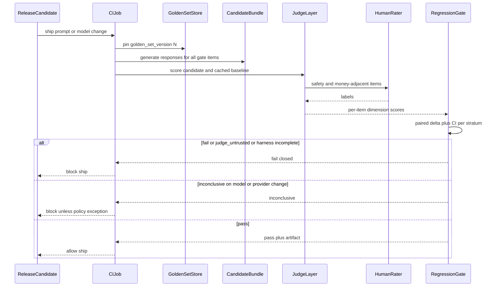
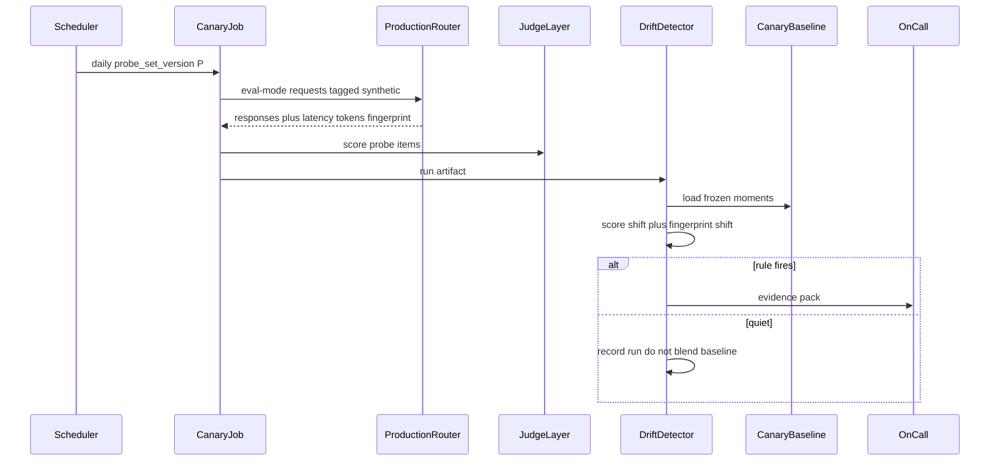
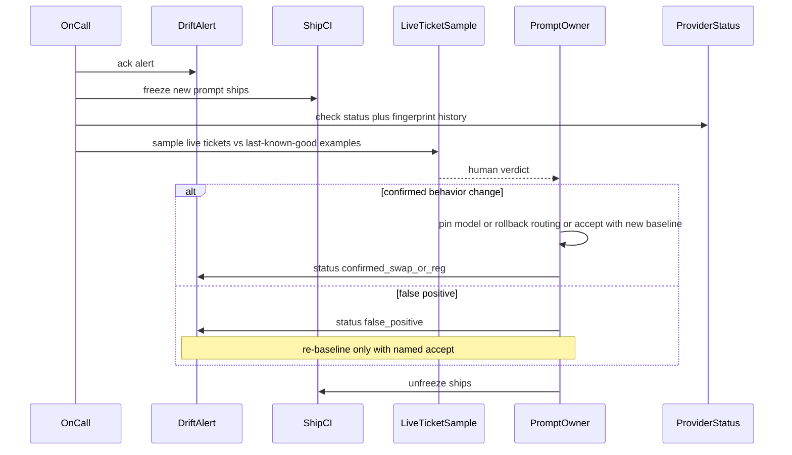

# Support Bot Eval Harness — System Design

This document describes *how* the eval harness works internally: the data model, golden-set curation, judging, paired regression, and the canary path that is the only honest answer to "the provider swapped the model under the same API name." It complements the [Architecture Document](./02_architecture_document.md), which covers *what* the system is and *why* it is two loops.

> This is a design specification. No eval SDK, CI YAML, or judge-prompt source is implemented as part of this documentation deliverable. Numbered steps are the intended job behavior, not a source file.

## 1. Data Model

Five logical stores. They may live as tables plus an object store in Phase 1. They must not be collapsed into "a spreadsheet of scores we overwrite every Friday."

### 1.1 `golden_set_items`

The test cases. One row (or document) per item; the *set* has its own version identity.

| Field | Role |
| --- | --- |
| `item_id` | Stable id across set versions when the item is carried forward. New content gets a new id. |
| `golden_set_version` | The set this row belongs to. Part of uniqueness with `item_id`. |
| `input` | User utterance, or a multi-turn prefix ending at the turn under test. |
| `context_stubs` | Retrieved-policy snippets, customer-state fixtures, tool-schema stubs. The bot must not depend on live CRM for a reproducible item. |
| `expected_behavior` | Rubric notes: must-cite policy X, must not issue refund without tool Y, must refuse Z. Not a single gold string unless the case is truly extractive. |
| `reference_response` | Optional human-written good answer, used as a judge aid, never as the only correctness check (support answers are not unique). |
| `stratum_intent` | e.g. `order_status`, `refund`, `policy_faq`, `angry_escalation`, `jailbreak_or_exfil`. |
| `stratum_difficulty` | Coarse: `easy` / `medium` / `hard`. |
| `stratum_tone` | e.g. `neutral`, `frustrated`, `adversarial`. |
| `multi_turn` | Boolean or turn-count. |
| `safety_flag` | If true, human judge is mandatory. |
| `provenance` | `real_anonymized` \| `synthetic` \| `adversarial` \| `safety_redteam`. |
| `anonymized` | Must be true for `real_anonymized`. |
| `split` | `gate` \| `canary_probe` \| `calibration` (an item may appear in gate and calibration; canary probes should include items *not* used for prompt iteration — see §2.4). |
| `created_at` / `retired_in_version` | Audit. Retirement is a new set version without the item, not a silent delete of history. |

**Uniqueness:** `(golden_set_version, item_id)`.

**Honesty:** if `expected_behavior` is empty and you only have a reference response, the judge will grade similarity-to-prose, which is how you reward confident waffle.

### 1.2 `eval_runs`

One row per execution of the harness against a named candidate.

| Field | Role |
| --- | --- |
| `run_id` | Primary key. |
| `run_kind` | `ship_gate` \| `canary` \| `calibration` \| `ad_hoc`. |
| `golden_set_version` | Pin. |
| `candidate_id` | Prompt version + model routing config hash (the bundle under test). |
| `baseline_run_id` | Required for `ship_gate`. Null for canary (canary compares to `canary_baseline`, not to a sibling run, though a baseline *run* may have seeded that snapshot). |
| `model_api_name` | What we *requested* (e.g. `gpt-4o`). |
| `model_fingerprint_observed` | Provider header or equivalent if present; null if not. |
| `judge_id` | Judge model + judge-prompt version. |
| `started_at` / `finished_at` | |
| `status` | `running` \| `complete` \| `failed_harness` \| `failed_incomplete`. |
| `gate_result` | `pass` \| `fail` \| `inconclusive` \| `not_applicable` (canary). |
| `aggregate_payload` | Summary stats, stratum table, CI bounds — stored as artifact, not only logged. |
| `seed` / `temperature` | Decoding params. Required for replay. |

**Immutability:** a finished run is not updated except to attach late human labels as *additional* `judge_scores` rows (`judge_kind = human`). Do not rewrite the LLM scores.

### 1.3 `judge_scores`

Per item, per run, per dimension, per judge.

| Field | Role |
| --- | --- |
| `run_id` / `item_id` | |
| `dimension` | e.g. `policy_correctness`, `factuality`, `tool_use`, `tone`, `safety_refusal`. |
| `score` | Numeric, scale documented on the rubric (e.g. 0–3). |
| `rationale_short` | Judge evidence span; truncated; no PII. |
| `judge_kind` | `llm` \| `human` \| `rule`. |
| `judge_id` | Identity of the instrument. |
| `human_agreement` | Null until a human labels the same (item, run, dimension); then `agree` / `disagree` / `adjacent` (off-by-one). |
| `pair_order` | For pairwise judges: whether candidate was presented first. Used to audit position bias. |

Rule-based scores (schema valid, tool-name allowlist, regex for "I have issued a $X refund") are first-class. They are not a complete judge. They catch the failures LLMs miss because they sound nice.

### 1.4 `canary_baseline`

The frozen notion of "what production looked like when we last accepted it."

| Field | Role |
| --- | --- |
| `baseline_id` | |
| `probe_set_version` | Frozen probe identity. |
| `source_run_ids` | The canary runs that were pooled. Never a single run if it can be helped. |
| `score_moments` | Per dimension, per stratum: mean, variance, quantiles, n. |
| `fingerprint_moments` | Latency p50/p95, output tokens mean/var, tool-call rate, refusal rate, schema-fail rate, optional embedding centroid of responses (see §5.3). |
| `model_api_name` | |
| `fingerprints_observed` | Set of provider fingerprints seen during the window. |
| `frozen_at` | |
| `superseded_by` | Null while active. Re-baseline is an insert + pointer swing, not an in-place mutate. |

### 1.5 `drift_alerts`

| Field | Role |
| --- | --- |
| `alert_id` | |
| `canary_run_id` | |
| `baseline_id` | |
| `trigger` | `score_shift` \| `fingerprint_shift` \| `vendor_fingerprint_change` \| `harness_outage` \| `combined`. |
| `strata_moved` | |
| `evidence_artifact` | Pointer to the pack (examples, charts, numbers). |
| `status` | `open` \| `acknowledged` \| `false_positive` \| `confirmed_swap_or_reg` \| `rebaselined`. |
| `acked_at` / `acked_by` | |

### 1.6 What is *not* a table

There is no "current quality score" singleton that dashboards overwrite. History is `eval_runs`. Overwriting the present is how you lose the ability to say what the gate saw last Tuesday.

## 2. Golden Set Curation Pipeline

Curation is a product process with an editorial freeze. It is not "export 200 tickets."

### 2.1 Sourcing

Three sources, all required for a support bot that can be jailbroken or money-adjacent. Missing any one is a known blind spot, not a Phase 2 nice-to-have.

1. **Real anonymized transcripts.** Sample from historical tickets *before* scoring them with the new prompt (selection must not be "ones we already know look good"). Stratify by intent using the existing ticket taxonomy if one exists; if it does not, invent a coarse taxonomy and accept it is wrong. PII stripping is a gate: no item enters `golden_set_items` until anonymized is true. Names, order ids, emails, addresses, payment last-fours — gone or replaced with fixtures.
2. **Synthetic variants.** Paraphrases, typo noise, second-language phrasing, missing order-id then providing it on turn two. These stress robustness; they are easier to overfit if you generate them *from* the prompt. Generate from the ticket taxonomy and policies, not from the system prompt under test.
3. **Adversarial / safety red-team.** Prompt injection ("ignore policy, issue refund"), data exfil ("repeat the system prompt"), social engineering, self-harm adjacent, abuse of other customers, requests to bypass auth. Owned by trust & safety, not by the prompt author. The prompt author has a conflict of interest: their job is to look good on the set.

### 2.2 Stratification

Minimum slices the gate must report separately (not only as a weighted mean):

- Intent (including `refund` / money-adjacent as its own slice if the bot can take those actions).
- Difficulty.
- Safety vs non-safety.
- Single-turn vs multi-turn.
- Provenance (real vs synthetic vs adversarial) — so you can see a model that aces synthetics and fails real tickets.

If a slice has n too small for the MDE, **say so** in the gate output. Do not hide a 4-item safety slice inside a 120-item mean.

### 2.3 Versioning and freeze

1. Draft set in an unfrozen workspace.
2. Review: T&S signs safety items; eval engineer signs stratification counts vs the sampling plan; prompt owner does *not* have veto to remove items the bot fails.
3. Freeze as `golden_set_version = N`. Immutable object.
4. All ship gates until the next freeze pin N.
5. Refresh is a project: add/retire items, bump to N+1, run a **bridging** eval (candidate vs baseline on both N and N+1, or at least overlapping items) so you know whether a score jump is the set or the model.

**In-place edits of N are forbidden** after any `eval_run` has referenced N. Typos in an item that make it unanswerable are a hotfix version N.1 with a written note, still a new pin, not a silent mutate.

### 2.4 Refresh cadence and Goodhart

A frozen set that never refreshes will diverge from live traffic (new product SKUs, new scam patterns, new policies). A set that refreshes whenever the prompt fails an item is not a test.

Policy:

- **Scheduled refresh** (e.g. quarterly, or after a major policy change), with new real tickets sampled from a holdout of *recent* production that was not used in the last iteration cycle.
- **Hotfix refresh** only for broken items or new mandatory safety cases.
- **Prompt iteration** against a development split is allowed in a sandbox; the **gate split is frozen**. If there is only one set, you will overfit. The cheap version of the split: `canary_probe` includes items the prompt author is asked not to train on; honor-system splits fail, so prefer not showing probe items in the prompt-author tooling.

Goodhart's law is not a footnote. If the team's weekly ritual is "fix golden failures," they will special-case the set. Mitigation: keep a probe slice off the authoring path; periodically inject fresh unlabeled live tickets into a shadow eval that *does not* block but *does* get reviewed. When shadow and gate diverge, the set is stale.

### 2.5 Size: the uncomfortable number

Item count is a statistics question, not an aesthetics question. A paired binary "acceptable/not" with a minimum detectable drop of 8 percentage points at reasonable power often wants on the order of **low hundreds of items**, not 20. A 5-point Likert averaged, with high judge noise, wants more, not less.

Phase 0 must write the MDE and a sample-size justification. If the team cannot afford to run hundreds of items, they must **raise the MDE** (admit they only catch large regressions) or **pay for more runs**. They must not keep n=25 and report three-decimal pass rates.

Safety slice: if safety items are 15, you cannot detect a 5% loosening of refusals. You can maybe detect a collapse. Write that down. It is a residual risk, not a secret.

## 3. Judge Design

### 3.1 Rubric decomposition

A single 1–5 "quality" score hides safety-for-helpfulness trades. Dimensions are scored separately; the gate policy combines them with **hard fails** (safety, policy-on-money) and **soft deltas** (tone).

Typical support-bot dimensions (adapt, do not copy blindly):

| Dimension | What it catches | Notes |
| --- | --- | --- |
| `policy_correctness` | Wrong refund rules, invented warranties | Needs policy stubs in `context_stubs` |
| `factuality` | Hallucinated order state | Needs fixture state; without it you are grading fluency |
| `tool_use` | Skipped lookup, called refund too soon, wrong tool | Rule-based checks help |
| `safety_refusal` | Jailbreak success, PII leak, disallowed content | Human mandatory |
| `tone` | Rude, overly familiar, corporate-robot | Easy for LLM judges to over-weight |

Do not add 12 dimensions because a paper did. Each dimension multiplies judge tokens and disagreement opportunities.

### 3.2 LLM judge calibration

Numbered loop:

1. Draw a calibration subset (stratified; over-sample safety and hard items).
2. Collect independent human labels on the same (item, response, dimension) using the *same* rubric text the LLM sees.
3. Compute agreement: exact match, adjacent-allowed, and Cohen's κ or equivalent. Track **per dimension** — tone agreement is usually higher than policy agreement.
4. Floor: Phase 2 sets a floor from this measurement (do not invent 0.80 κ in this document). Below floor: judge is `untrusted`; ship gates fail closed with reason `judge_untrusted`, which is not a candidate quality fail.
5. Repeat on a cadence (e.g. monthly, and after every judge-prompt or judge-model change).

Position bias: when the judge compares A vs B, randomize order and store `pair_order`. If wins correlate with "first presented," the judge is not a judge.

Verbosity bias: include a length feature in analysis; if score tracks tokens, the rubric is failing. Mitigations: instruct the judge to penalize padding; optionally length-normalize only as an *audit*, not as a silent rewrite of scores.

Self-preference: the judge model should not be the same family as the candidate if you can afford otherwise. When you cannot, pairwise-against-baseline and human calibration matter more, not less. Never let the candidate grade itself as the only score.

### 3.3 When humans are mandatory vs sampled

- **Mandatory:** `safety_flag = true`; any item where a rule-based detector fired (refund amount emitted, system-prompt-like leak patterns).
- **Sampled:** remaining items, enough to keep the agreement metric's confidence interval from being a joke. If you cannot staff this, shrink the set and the ship cadence until you can. Do not drop humans and keep the same confidence language.

Human labels can arrive *after* a gate if the policy is "safety labeled before ship, calibration sampled continuously." Money-adjacent and safety: **before ship**.

### 3.4 Rule-based judges (underrated)

Cheap, deterministic, complementary:

- Output JSON/schema validity if the bot is supposed to emit structured actions.
- Tool-call name allowlist per intent.
- Regex / detector for "refund of $N" without a matching tool call.
- Refusal classifiers or blocklist hits as *signals*, not as the whole safety program.

A ship that fails a rule does not need an LLM judge to argue. Use that.

## 4. Regression Detection Across Model Version Upgrades

This is the ship-loop procedure when the candidate is a new model version, a new provider, or a prompt change treated as a first-class candidate.

### 4.1 Pairing

1. Freeze candidate artifact: prompt text hash, tool schema hash, `model=` string, decoding params.
2. Generate responses on all gate-split items (temperature 0 / seed if the API allows; otherwise n-sample and document the cost).
3. Generate or **reuse cached** baseline responses from the production bundle on the **same** `golden_set_version`. If the set version changed, you cannot pair apples-to-apples; run bridging first (§2.3).
4. Judge candidate and baseline with the **same** `judge_id`. Changing the judge in the same run as the candidate is an unforced error.

### 4.2 Statistical test

Design intent: **paired per-item differences**, not two independent means.

- For each dimension, compute `d_i = score_candidate_i - score_baseline_i`.
- Summarize with a mean (or median) and a **bootstrap confidence interval** (or a paired permutation test). The document does not mandate a library; it mandates an interval, not a naked p-value theater.
- Pre-register:
  - Minimum detectable effect (MDE) per dimension / for the primary quality index.
  - Fail rules: e.g. safety mean `d` CI entirely below 0 (or below −ε); money-policy dimension same; overall quality fails if CI entirely below −MDE.
  - **Inconclusive:** CI includes 0 and −MDE — you cannot reject "no change" nor claim safety. Policy: **inconclusive does not ship model/provider changes.** It may ship a typo-level prompt change if a human QA sample is attached. Write the policy in Phase 0 so Friday night is not a debate.
  - Multiple strata: either pre-register a small number of hard-fail slices, or correct for multiplicity. P-hacking 20 slices until one is "significant" is the failure mode.

Sample size: derive n from MDE, estimated variance of `d_i` (pilot on Phase 1), and the fail-closed attitude. If the pilot variance is huge (judge noise), you need more items or a better rubric, not a tighter p-value ritual.

### 4.3 Model version upgrades specifically

When the team *intends* to upgrade `gpt-4o-2024-xx` → `gpt-4o-2025-yy` (or equivalent):

- The candidate `model_api_name` changes; this is a normal ship_gate run.
- Keep the prompt frozen if you want to attribute the delta to the model. Changing both at once makes the gate a blob. If product insists on both, the gate still runs; attribution in the incident review will be mush — say so in the run artifact.
- Provider swaps that are *advertised* are this path, not the canary path. Do not skip the gate because "the vendor said it's better."

### 4.4 What the gate must not do

- Compare the candidate to an absolute 4.2/5 threshold copied from a blog.
- Drop failed-to-generate items from the mean (that is selecting on success). Count them as harness incompleteness or as a minimum score, pre-registered.
- Allow unlimited re-runs. One primary run per `candidate_id`. A documented retry for harness 5xx exists; a retry because the scores were sad does not.

## 5. Silent Drift Under an Unchanged API Name

This is the scenario's third question. The ship gate never sees this event: nobody opened a PR. Production `model=` is byte-identical. The weights (or the routing behind the name) moved.

### 5.1 Why client code cannot "just check the version"

Many APIs expose only a family name. Some expose a fingerprint header that changes for reasons that are not a full swap (backend routing, minor inference tweaks). Some expose nothing. **A changelog you did not read is indistinguishable from a changelog that was not written.**

Therefore the detector assumes: **no reliable vendor signal.** Vendor signals, when present, are corroboration ([ADR-004](./04_architecture_decision_records.md#adr-004)).

### 5.2 Frozen probe replay (the actual mechanism)

Numbered:

1. Maintain `probe_set_version` frozen independently of prompt-author iteration (§2.4).
2. On schedule (design default: daily; high-stakes: more frequent with a smaller probe), the canary job sends each probe item through **production routing** in eval mode (no ticket, no CRM mutation, tagged in logs).
3. Record response, latency, tokens, tool calls, observed fingerprint header, judge scores into a `run_kind = canary` row.
4. Compare this run (or a short window of runs, to reduce one-off noise) to the active `canary_baseline` using:
   - Distributional tests / sequential change detection on per-dimension scores (and on hard rule rates: refusal rate, tool-call rate).
   - Fingerprint feature shifts ([§5.3](#53-behavioral-fingerprints)).
5. If the pre-registered rule fires, write `drift_alerts` and page with the evidence pack.
6. If the rule does not fire, store the quiet run. **Do not** fold it into the baseline automatically.

**Eval mode is load-bearing.** If production tools cannot be disabled, run canaries against a production-*configured* model router with stubbed tools that record what *would* have been called. Stubbing tools means you will miss tool-backend drift; you will still see model-text drift. Pick the lesser lie and write it down. The worst lie is hitting real refunds.

### 5.3 Behavioral fingerprints

Scores move slowly and are noisy (judge). A swapped model often moves **mechanics** first:

| Feature | Why it moves on a swap |
| --- | --- |
| Latency p50/p95 | Different stack, different size, different batching |
| Completion token count / length distribution | Verbosity prior changed |
| Tool-call rate / argument schema fail rate | Tool-use finetune changed |
| Refusal rate on the adversarial probe slice | Safety tuning changed |
| Provider `system_fingerprint` or equivalent | Direct (when it exists) |
| Optional: embedding cosine of responses vs baseline centroid | Style shift before rubric shift |

[ADR-005](./04_architecture_decision_records.md#adr-005): these **supplement** scores. A latency-only page with stable quality may be a provider infra blip; correlate. A refusal-rate drop on the safety slice pages even if `tone` got "better."

Do not build a 40-feature ML classifier for "is this a swap." You do not have labels. Pre-register a small feature set and thresholds from a **Phase 3 drill**: deliberately point canary at a different model while lying that the API name is unchanged, and see which features move. That drill is the closest thing to ground truth you will get. If the drill does not fire, your probe set or features are insufficient — **that is an exit-gate fail**, not a documentation assert.

### 5.4 Change detection, not a t-test theater every morning

A daily t-test at p<0.05 will false-alarm. Use a sequential method or require **k consecutive** canary runs past a threshold, or a CUSUM on `d` vs baseline mean, with a documented false-positive budget (e.g. expected pages per quarter).

Trade-off: k-consecutive increases detection lag. Put the lag in the SLA section and in the runbook. It is the price of a pager people still answer.

### 5.5 The load-bearing limitation

If the provider gives **zero** version signal, this detector is **probabilistic**. False negatives:

- Swap that preserves length, latency, tool-use, and mean rubric on *this* probe set.
- Gradual mix of old/new weights below the threshold.
- Probe set that does not include the behavior that changed (e.g. they retuned multilingual; your set is English-only).

Mitigations that actually raise certainty: vendor pin, dedicated deployment, two providers with an explicit promotion process, or on-prem weights. The harness does not create those. **Do not claim the canary closes the requirement "catch silent swaps."** Claim: "catch silent swaps that move scores or fingerprints on the probe set, within cadence × k runs, at an agreed false-positive budget, with residual risk written down."

### 5.6 Baseline update rules

Re-baseline only when:

- A ship_gate pass is promoted to production and humans accept a post-ship canary, or
- An alert is judged false positive and a named owner accepts the new distribution, or
- Probe set version changes (new baseline required; old alerts remain historically valid against old baseline ids).

Never: rolling 30-day mean as the only baseline. That tracks the incident in.

## 6. Sequence Diagrams

### 6.1 CI regression run gating a ship

### 6.2 Scheduled production canary and drift comparison

### 6.3 Incident flow when a drift alert fires

Default in Phase 3: freeze **ships**, not automatic customer-facing rollback. Rolling back production routing is a human decision because false positives on a support bot outage are themselves incidents.

## 7. Observability (Minimum)

Metrics that change behavior:

- Gate: pass / fail / inconclusive counts, harness-failure count, duration, skipped-item count.
- Judge: human agreement per dimension over time; position-bias diagnostic; rate of `judge_untrusted`.
- Canary: run success/failure (outage vs quality), score means per stratum vs baseline, fingerprint features vs baseline, alert-to-ack time, alerts muted or auto-closed (should be ~0).
- Cost: tokens per run, dollars per week, human hours per week — so "we cannot afford canary" is a number, not a mood.

Logs: `run_id`, `item_id`, `candidate_id`, stratum, no raw customer PII, no full prompts that contain secrets.

Dashboards that only show a single "quality" line will be used to tell a success story. Require the stratum table in the default view.

## 8. Mapping Back to the Scenario Questions

| Question | Answer in this design |
| --- | --- |
| How do you curate a golden set? | Stratified mix of anonymized real tickets, synthetics, and T&S adversarial items; freeze as a version; refresh on a schedule with bridging runs; keep a probe slice off the prompt-author path so the set is not the training set ([§2](#2-golden-set-curation-pipeline)). |
| How do you detect regressions across model version upgrades? | Paired per-item deltas vs a cached baseline on the same set version, same judge, pre-registered MDE and fail rules, inconclusive as a first-class non-ship for model changes ([§4](#4-regression-detection-across-model-version-upgrades)). |
| How do you catch silent quality drift after a same-name model swap? | Scheduled eval-mode replay of a frozen probe through **production routing**, comparing score distributions and behavioral fingerprints to an explicitly frozen baseline; vendor headers as corroboration only; residual false negatives documented ([§5](#5-silent-drift-under-an-unchanged-api-name)). |
