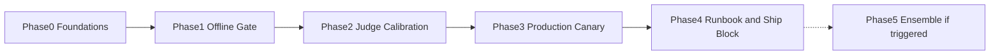

# Support Bot Eval Harness — Phased Implementation Plan

Each phase has an **Objective**, **Deliverables**, and an **Exit Gate** that must pass before the next phase begins. Phases 0–4 are sequential. Phase 5 is conditional and may never trigger.

The order is load-bearing: **Phase 1 is an offline gate only.** If Phase 1 is skipped ("we'll monitor production and skip the CI gate") you cannot block a bad model upgrade. If Phase 3 is skipped ("the gate is enough") you cannot see a silent same-name swap. Both skips fail the scenario. Do not collapse Phase 1 and Phase 3 into one deploy that first sees production traffic without a frozen baseline.

## Phase 0 — Foundations

**Objective**: Freeze the rubric, the sampling/MDE math, safety ownership, and eval-mode constraints **before** anyone treats a notebook as a gate.

**Deliverables**:
- Rubric text for the agreed dimensions, including which dimensions are hard-fail (safety, money-policy) vs soft (tone). Same text will be given to humans and to the LLM judge.
- Sampling plan: strata, target n, MDE, and a written sample-size justification. If n cannot support the MDE, the MDE is raised in writing (we only catch large regressions) — not silently.
- Policy: `inconclusive` on model/provider changes does not ship. Exception path (if any) named.
- Safety slice owned by T&S, not by the prompt author. Anonymization standard for real tickets.
- Eval-mode requirement: canary and gate traffic cannot mutate CRM, issue refunds, or create real tickets. If tools cannot be stubbed, say how production routing is still exercised.
- Judge-model candidate and human-labeling staffing (hours/week) committed. If hours are zero, stop; later phases will be theater.
- Re-run policy: one primary `eval_run` per `candidate_id`; harness-5xx retry only.

**Exit Gate**:
- [ ] Rubric signed by prompt owner, eval engineer, and T&S (safety dimensions).
- [ ] MDE + n written; a second person has reviewed the statistics, not only the prose.
- [ ] Eval-mode / non-mutation constraint written as a test requirement for Phase 3 (and for any tool-using gate items in Phase 1).
- [ ] Human labeling hours exist on a calendar, not as a wish.

**Honesty gate:** if product wants "just a quick eval so we can ship the prompt this week," they are asking to skip to a notebook. The compromise is a **smoke subset** explicitly labeled non-gate, not calling Phase 0 done.

## Phase 1 — Offline Golden Set + CI Regression Gate

**Objective**: Prove that a named, frozen set plus a paired comparison can block a ship — **without** production monitoring. Canary absence is success for this phase, not an incomplete feature. The gate is the feature.

**Deliverables**:
- Golden set v1 frozen: real anonymized + synthetic + adversarial, stratified, `item_id`s stable. Prompt author cannot silently delete failing items.
- Response generation for candidate and baseline (production bundle) with pinned decoding params.
- Judge v1 (LLM + rules). Safety items queued to humans **before** a pass is allowed.
- CI job: pin `golden_set_version`, write `eval_runs` + `judge_scores`, emit pass/fail/inconclusive artifact. Fail-closed on harness errors.
- Baseline cache for the current production bundle on v1.
- Tests (not production traffic): fixture items including a known-bad candidate that must `fail`; a harness outage (judge 5xx) that must not `pass`.

**Exit Gate**:
- [ ] A deliberately worsened prompt or weaker model fails the gate (or returns `inconclusive` that still blocks a model change — both are acceptable if documented). A "gate that never fails" is not passing this phase.
- [ ] Duplicate CI run of the same `candidate_id` does not count as independent evidence (re-run policy enforced).
- [ ] Safety-flagged items without human labels cannot produce `pass`.
- [ ] Artifact includes per-stratum table, not only a headline mean.
- [ ] No canary, no production probes. Confirm this so Phase 3 is not accidentally considered "already done."

**Honesty gate:** n in v1 may be smaller than the Phase 0 MDE requires if labeling is slow. Then the gate must use the **raised** MDE (only large drops fail) and `inconclusive` must remain common. Do not fake power with n=20.

## Phase 2 — Judge Calibration and Statistical Rigor

**Objective**: Make the LLM judge an instrument with a measured agreement rate, and freeze the fail rules that Phase 1 may have implemented as "mean went down."

**Deliverables**:
- Calibration subset labeled by humans on the same rubric; κ (or equivalent) **per dimension**.
- Agreement floor documented from this measurement (not copied from a paper). Below floor → `judge_untrusted` fail-closed.
- Position-bias audit (pairwise order randomization + report).
- Bootstrap (or equivalent) intervals on paired deltas; fail rules pre-registered; multiplicity policy for strata.
- Judge-prompt / judge-model versioning: changing the judge requires a re-calibration, not a silent swap.

**Exit Gate**:
- [ ] Documented human/LLM agreement per dimension; floor set; a simulated drop below floor marks judge untrusted and blocks pass.
- [ ] Position-bias diagnostic exists; if first-position win rate is badly skewed, pairwise procedure is fixed before calling the judge calibrated.
- [ ] At least one dimension (expect: safety or policy) may fail the floor — that dimension is then human-only for ship, per [ADR-003](./04_architecture_decision_records.md#adr-003) revisit. That is an acceptable exit if written down; pretending κ is fine is not.
- [ ] Sample-size vs MDE updated with **observed** variance of paired `d_i`. If variance kills power, either grow n or raise MDE in the ship policy.

## Phase 3 — Production Canary and Drift Detection

**Objective**: Answer the silent same-name swap question. This phase is the first that *can*. Offline gates continue; they are not a substitute.

**Deliverables**:
- Frozen `probe_set_version` (including items not used for prompt-author iteration).
- Canary job on a schedule against **production routing**, eval-mode, tagged, non-mutating.
- `canary_baseline` from a window of post-Phase-2 known-good canary runs (not one run).
- Drift detector: score shift + fingerprint features; vendor fingerprint as corroboration only ([ADR-004](./04_architecture_decision_records.md#adr-004), [ADR-005](./04_architecture_decision_records.md#adr-005)).
- **Drill**: route canary at a different model while recording the same API name in the candidate field; detector must fire within the documented k runs / CUSUM bound — or the probe/features fail the gate.
- Alert → on-call with evidence pack. Distinguish harness outage from drift.
- Re-baseline is an explicit action; rolling blend is not implemented.

**Exit Gate**:
- [ ] Canary shares production model routing (config reviewed). Staging-only is a fail.
- [ ] Induced mutation attempt (if tools exist) does not mutate; eval-mode proven.
- [ ] Silent-swap drill fires, or residual blindness is written with the sample size and features that missed — and a named owner accepts that residual **or** the probe is fixed and the drill re-run. No "we'll catch it in production."
- [ ] A false-positive budget is written (pages per quarter). Sequential / k-consecutive rule matches that budget.
- [ ] Quiet canary runs do **not** update the baseline automatically (test this).

**Honesty gate:** if production eval-mode is politically impossible, this phase is blocked. The honest fallback is: pin the model version (vendor product) or accept you **cannot** detect same-name swaps. Do not run a staging canary and claim the scenario is solved.

## Phase 4 — Full Gating and Rollout Automation

**Objective**: Make the loops operational defaults: ships cannot sneak around the gate; drift has a runbook people have drilled; dashboards show strata.

**Deliverables**:
- Release policy: model/provider/policy-prompt changes require Phase-2-quality gate `pass`. Typo-level changes may use a documented smoke subset.
- Automatic **block of new ships** while a drift alert is `open` (not automatic customer-facing rollback).
- Dashboards: gate history, agreement trend, canary vs baseline strata, alert-to-ack SLO.
- Runbook drill: page, freeze ships, sample live tickets, decide pin/rollback/accept, unfreeze.
- Cost report: tokens + human hours vs the Phase 0 budget; if canary is being skipped to save money, that is a policy incident, not an optimization.

**Exit Gate**:
- [ ] A PR that changes `model=` without a gate artifact cannot merge (or cannot deploy — pick the actual control point and test it).
- [ ] Open drift alert blocks new ships in a drill.
- [ ] On-call drill completed once; evidence pack was sufficient without the eval engineer on the call.
- [ ] Smoke-vs-full policy written so not every comma pays full n.

## Phase 5 — Conditional Ensemble and Active Set Growth

**Objective**: Add multi-judge ensemble and/or active-learning growth of the golden set **only** when measured disagreement or staleness says the current instrument is the bottleneck — not because ensembles look like papers.

**Entry Gate (any one of):**
- [ ] Judge/human agreement on a hard-fail dimension stays below floor after rubric revision (ensemble as an attempt to raise agreement — must re-measure, not assume).
- [ ] Shadow eval on fresh live tickets diverges from the frozen gate split (set staleness); active sampling of disagreement / live-failure regions is cheaper than a full untargeted refresh.
- [ ] Silent-swap drill still misses a model pair you care about after probe expansion; a second judge or embedding fingerprint is hypothesized to help — **re-run the drill**, do not add complexity on taste.

**Deliverables**:
- If ensemble: independently versioned judges; combination rule pre-registered; calibration repeated; cost model updated.
- If active growth: new items from live-ticket / disagreement regions, anonymized, version bump N+1, bridging run. Prompt author still cannot cherry-pick.

**Exit Gate**:
- [ ] Entry-gate metric actually moved (κ, drill detection, or shadow-vs-gate gap). If it did not, revert the complexity.
- [ ] Phase 1–4 gates still pass (ensemble must not become a way to average a safety fail into a pass).

This phase can be deferred indefinitely. A calibrated single judge, a frozen set with scheduled refresh, and a canary that survived the swap drill will carry a surprising amount of "are we safe to ship." Shipping a multi-agent eval platform on day one for one support bot is usually costume.

## Phase Dependency Graph

Phases 1–2 may be compressed in calendar time on a small team; they must not be collapsed into one PR that both invents the rubric and ships the model upgrade. Phase 3 should take a **drill** on production routing before anyone claims silent-swap coverage. Phase 5 stays dotted.

## Kill Criteria for the Harness Program

Stated in advance so a bad harness does not linger as decoration:

- **Safety incident attributed to a ship the gate passed** because safety was averaged away or humans were skipped — pause ships, fix the hard-fail path, do not "tune the mean."
- **Canary pages ignored for a sprint** — the detector is worse than nothing (alert fatigue). Turn it off or staff it; do not leave it red.
- **Human labeling defunded** while still reporting LLM-judge scores as quality — the gate is uncalibrated; mark it untrusted.
- **Cost of canary + gate exceeds the incident cost it is supposed to prevent**, sustained, with no detection drill success — legitimate reason to shrink to a smoke set and a vendor pin, not to keep a theater platform.

None of these are "tune and continue by default." A measurement system that is untrusted should have to earn operation again, the same way a flaky CI suite should not be the merge requirement until it is fixed.
