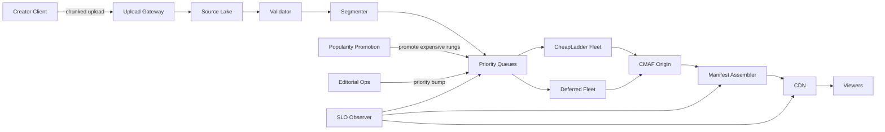
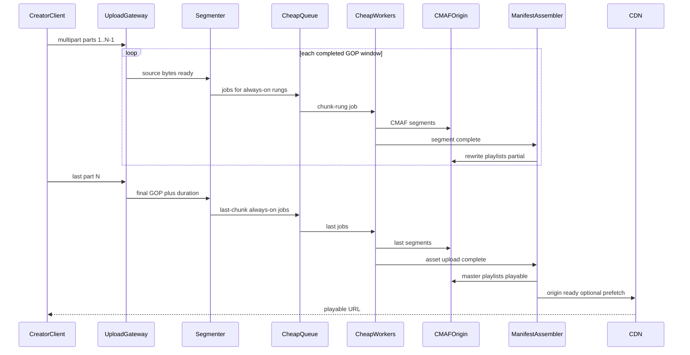
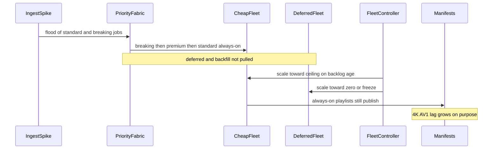

# Distributed Video Transcoding Pipeline — Architecture Document
> - **Document Status**: Draft
> - **Last Updated**: 2026 Aug 29
> - **Author**: Paul Serban

A VOD ingest and packaging stack that accepts on the order of **1,200 hours of source video per minute**, publishes a **playable adaptive ladder within 2 minutes of upload completion**, and does not encode the naive 12-rung matrix for every asset on a fixed EC2 pool. This document covers *what* the system is and *why* it is shaped this way; see [System Design](./03_system_design.md) for *how* chunking, progressive manifests, priority draining, and compute tiering actually work, and [Trade-offs and Honest Assessment](./05_tradeoffs_and_honest_assessment.md) for what is abandoned and why adding workers is not a strategy.

## Overview

**Brief description**: Internal media-pipeline infrastructure, scoped on purpose: validate uploads, segment GOP-aligned chunks, transcode a policy-selected ladder, assemble HLS/DASH from shared CMAF segments, put bytes where a CDN can serve them. It is not a player product, not a live linear encoder, and not "FFmpeg on Kubernetes with HPA."

**Business Context**
- See [Scenario and Requirements](./01_scenario_and_requirements.md) for the full framing. In short: 1,200 hours/minute is ~2.4× YouTube's public upload figure; a full 12-rung managed-transcode ladder is on the order of **$30 per source hour / ~$50M per day**; the 2-minute clock only survives as a **post-completion tail** on work that overlapped the upload; viral 5-hour backlogs are a **priority and ladder-policy** failure, not only an ASG size failure.
- Target users: pipeline engineers, on-call, capacity/finance. Creators and viewers consume "playable" and "complete"; they are not operators of this design.

## Requirements

### Functional Requirements

- **Ingest / validate**: the system must accept chunked or multipart uploads, persist source bytes immutably, and reject non-video, truncated, or undecodable input **before** transcode workers see it. Failed validation is an explicit asset state, not a silent empty manifest.
- **Segment**: the system must split source into **GOP-aligned** media segments of a versioned target duration (working: ~6s). Segment IDs must be stable so retries are idempotent.
- **Always-on transcode**: every accepted asset must be encoded into the cheap ladder selected by [ADR-002](./04_architecture_decision_records.md#adr-002), without upscaling past source resolution.
- **Deferred transcode**: 4K / HEVC / AV1 (and any other expensive rung) must be enqueueable as separate jobs, promoted by policy, and skippable without blocking playable-start.
- **Package**: the system must publish HLS and DASH manifests that reference a **shared CMAF/fMP4 segment store**, updated as segments and rungs complete. See [ADR-006](./04_architecture_decision_records.md#adr-006).
- **Distribute**: origin must be CDN-reachable; priority/hot assets may be pre-positioned. The 2-minute SLO includes a **cache-miss fetch from origin**, not only "we wrote the object."
- **Schedule**: work must drain from **priority classes**, not a single FIFO. See [ADR-004](./04_architecture_decision_records.md#adr-004).
- **Retry**: a failed chunk/rung job retries that job. The asset does not restart. See [ADR-005](./04_architecture_decision_records.md#adr-005).
- **Observe**: backlog age per class and per rung, playable-start lag, cost per source hour, dead-letter rate. An origin that cannot report these does not take production ingest. See [System Design §8](./03_system_design.md#8-observability-minimum).

### Non-Functional Requirements

**Performance Requirements:**
- Playable-start p99 ≤ 2 minutes after upload completion, at the ingest mix Phase 0 measures, **for the always-on ladder**. Deferred rungs have a separate freshness target (working: minutes to hours, product-chosen).
- Ingest and transcode are **throughput** problems. The only p99 on the critical path is the **tail after last byte**: last chunk + manifest + origin/CDN.
- Encode speed is a function of codec, preset, resolution, fps, and hardware class. Designing as if every job is 1× realtime on `c6i.large` is how the backlog returns.

**Reliability Requirements:**
- Chunk jobs are at-least-once with idempotent writes to origin (`(asset_id, chunk_index, rendition_id)` is the key). Duplicate encodes are a cost problem; missing segments advertised in a playlist are a player-breakage problem.
- Spot/preemptible interruption is a normal completion path for the deferred tier.
- Manifest publish is atomic per rewrite (new playlist object or atomic swap). Players must never observe a playlist that lists a 404 segment.
- A single worker, AZ, or spot pool loss must not stall the always-on ladder. Deferred rungs may pause.

**Infrastructure Constraints:**
- Technology stack is vendor-agnostic at the architecture layer: object store for source and CMAF origin; a metadata store (Postgres or equivalent) for asset/job state; a queue fabric that supports **multiple priority channels** (not a single SQS queue with a hope); worker fleets that can be distinct instance classes; a CDN with origin-pull and optional push/prefetch.
- Hosting: a real encode plant, not a laptop, and not "MediaConvert for 1.7 million hours/day." Managed transcode is allowed for **prototypes and overflow of tiny volume**, not as the system of record at this ingest rate. See [Cost Analysis](#cost-analysis).
- Compliance: UGC may contain illegal content, PII in audio, or copyrighted material. Validation and any mandated scan inherit that. This design does not implement Content ID; it must not pretend encoding is moderation.

**The defining constraint:**
- `1,200 hours/min × ~$18–$30 of naive managed full-ladder cost ≈ $31M–$52M/day`. Architecture that sizes a fleet to encode that ladder, then "autoscales," is not architecture; it is a plan to idle a supercomputer all week and still miss the SLA on the file that matters. The scarce resources are **encode minutes of expensive codecs, always-on-ladder latency under spike, and origin/CDN correctness**.

## Executive Summary

The system is a **three-plane media pipeline** plus a small control plane:

1. **Ingest plane** — accept, persist, validate, GOP-segment, emit chunk-available events *during* upload.
2. **Transcode plane** — priority-scheduled, chunk-granular jobs onto **tiered** compute (warm CPU/ASIC baseline for cheap rungs; GPU/ASIC/spot burst for expensive rungs).
3. **Distribution plane** — write CMAF segments, rewrite HLS/DASH manifests progressively, expose origin, let CDN pull (push only when the popularity/priority plane says the bytes will be fetched everywhere at once).
4. **Control plane** — rendition-ladder policy, priority assignment, popularity-driven promotion, fleet autoscaling signals, kill-switches.

The scarce resources are **expensive-codec minutes**, **always-on-ladder queue delay under spike**, and **manifest correctness**. VM count is a derived quantity.

**Architecture Style:** Event-driven fan-out of idempotent chunk jobs; progressive packaging; not a batch "one FFmpeg per file"; not a live linear encoder farm.

**Key Components:**
- **Upload Gateway / Chunk Ingest**: multipart or chunked upload into the source lake; emits per-part/per-chunk events.
- **Validator / Probe**: container, codec, resolution, duration, integrity; writes `source_profile`.
- **Segmenter**: GOP-align, write mezzanine chunks (or transmux if already well-segmented).
- **Priority Queue Fabric**: separate channels (or strictly priority-aware) for breaking / premium / standard / backfill, and a split between always-on vs deferred rungs.
- **Transcode Worker Fleets**: at least two hardware classes. See [ADR-007](./04_architecture_decision_records.md#adr-007).
- **Manifest Assembler**: progressive HLS + DASH from shared CMAF.
- **Origin Store**: immutable segments + mutable playlists.
- **CDN Orchestrator**: pull by default; prefetch/push for priority/hot.
- **Popularity / Promotion Service**: raises an asset into deferred rungs when watches, creator tier, or editorial flags justify the encode minutes.
- **Fleet Controller**: scales each worker class on **that class's** backlog age and depth, with a cost ceiling and a warm floor.
- **Quality / SLO Observer**: playable-start canaries, backlog, dead-letters, $/source-hour.

**Technology Stack (illustrative):**
- Object store: S3-compatible (source lake + CMAF origin).
- Metadata: Postgres (or equivalent) — asset state machine, job idempotency keys.
- Queue: a system that can isolate priority (multiple topics/queues, or a broker with consumer-side weighted drain). A single FIFO SQS is how AV1 starves 360p.
- Compute: Kubernetes or equivalent **with separate node pools**; reserved/baseline for always-on; Spot/preemptible for deferred; GPU or encoder ASICs where measured cheaper than CPU for HEVC/AV1/4K.
- Packaging: CMAF/fMP4 + HLS `m3u8` + DASH `mpd`.
- Observability: histograms of playable-start, backlog age by class, encode-minutes by rung, CDN origin latency.

**Architecture Principles:**
- **The chunk-rung is the work unit; the asset is the mutation unit.** Capacity math uses `(chunk × rendition)`. SLO math uses **playable asset**.
- **Cheap work must never wait behind expensive work.** Isolation in the queue fabric is a correctness requirement for the SLA.
- **Do not encode what you will not serve, and do not serve what you have not encoded.** Manifests are a subset of origin, never a wish list.
- **Overlap with upload, or admit the 2-minute SLO is only for short clips.** See [ADR-001](./04_architecture_decision_records.md#adr-001).
- **More workers is a throughput knob, not a policy.** Unbounded ladder × unbounded workers is how you buy a plant you cannot staff. See [Scaling Strategy](#scaling-strategy).
- **Spot death is expected; 404-in-playlist is not.**

**Key Architectural Decisions:**
1. **Pipeline overlap with upload over post-completion batch.** [ADR-001](./04_architecture_decision_records.md#adr-001).
2. **Progressive / policy-gated ladder over full 12 rungs for every asset.** [ADR-002](./04_architecture_decision_records.md#adr-002).
3. **Warm baseline + event-driven burst over fixed EC2 pools.** [ADR-003](./04_architecture_decision_records.md#adr-003).
4. **Priority-class weighted draining over FIFO.** [ADR-004](./04_architecture_decision_records.md#adr-004).
5. **Chunk-level idempotent jobs + progressive manifests over whole-file retry.** [ADR-005](./04_architecture_decision_records.md#adr-005).
6. **Shared CMAF origin for HLS and DASH over dual encode.** [ADR-006](./04_architecture_decision_records.md#adr-006).
7. **Hardware mapped to job cost over one instance type.** [ADR-007](./04_architecture_decision_records.md#adr-007).

### Context Diagram

## Runtime Architecture

Four loops, deliberately decoupled.

1. **Ingest loop** (during upload): part lands → validate incrementally where possible → GOP-segment completed GOPs → enqueue always-on jobs for those chunks. Completeness of this loop is what makes the 2-minute tail feasible for long files.
2. **Always-on transcode loop** (SLO-bound): drain high-priority cheap jobs → encode → write CMAF → notify assembler. This loop has a **warm floor**. It does not share a queue with AV1.
3. **Deferred transcode loop** (throughput- and cost-bound): drain promotion/backfill jobs onto burst/spot/GPU/ASIC. Allowed to go idle. Allowed to lag. Not allowed to steal always-on workers.
4. **Degraded modes** (explicit): shed deferred entirely; shed 1080p always-on if even 360p/720p p99 is red; skip CDN push and rely on pull; pause backfill/reprocess. FIFO-everything-because-we-are-on-fire is **forbidden** — that is the old 5-hour backlog.

### Steady state: long-form upload, playable at T+2m

The last-part arrow is the only work inside the 2-minute budget **if** the loop ran during upload. If the client used a single PUT of a 3-hour file, the overlap is zero and the SLO is on that asset **missed by construction**. Upload protocol is therefore part of this architecture, not a sibling team's problem. See [ADR-001](./04_architecture_decision_records.md#adr-001).

### Viral spike: priority drain, deferred shed

A green always-on p99 and a red deferred freshness metric **at the same time** is the system working. A single "transcode queue depth" dashboard that pages on the sum is how on-call "fixes" this by mixing the queues.

## Components

### 1. Upload Gateway
**Purpose**: Get bytes into the source lake in **chunk-sized pieces** the rest of the pipeline can start on. Without this, overlap is a slide.

**Responsibilities:**
- Authenticate the creator; mint `asset_id` and object keys; never let the client choose the source key.
- Prefer multipart / chunked upload with part sizes compatible with GOP windows (see [System Design §2](./03_system_design.md#2-chunking)).
- Emit `part_available` / `upload_completed` / `upload_aborted` with `source_bytes_at`.
- Enforce size/type quotas at issue time.

**Interactions:**
- Writes: source lake. Emits: ingest events. Does not transcode.

### 2. Validator / Probe
**Purpose**: Stop garbage from occupying encode cores. A 3-hour "mp4" that is random bytes is a denial-of-wallet attack if it reaches the GPU pool.

**Responsibilities:**
- Probe container, video/audio codecs, resolution, fps, duration, rotation, HDR flags.
- Integrity: size vs declared, last-part truncation, unreadable last GOP.
- Write `source_profile` used by the ladder policy (cannot upscale; cannot request 120fps output from 24fps source without an explicit, expensive conversion path — default: **preserve or sane down-convert, never invent frames as a product feature**).
- Optional malware/policy scan: if legally on the playable path, it is in the 2-minute budget; otherwise async and the asset may be pulled later. Product must pick. Default in this design: **not on the playable critical path** unless Phase 0 says legal requires it.

**Interactions:**
- Reads: source lake. Writes: metadata. Emits: `accepted` / `rejected`.

### 3. Segmenter
**Purpose**: Produce the work units. This is an architectural component, not an FFmpeg one-liner. Re-segmenting later is a migration.

**Responsibilities:**
- GOP-aligned split at the versioned target duration; handle streams with long GOPs (re-encode mezzanine I-frames if required — this is CPU and must be in the always-on budget for those files).
- Assign `chunk_index` stable for the asset version.
- Enqueue always-on jobs as soon as a chunk is closed; do not wait for EOF except for the last chunk.
- On abort: cancel outstanding jobs; do not publish a playable master for a non-asset.

**Interactions:**
- Reads: source / mezzanine. Writes: mezzanine chunks if needed. Emits: jobs.

### 4. Priority Queue Fabric
**Purpose**: Make "cheap work never waits behind expensive work" true under saturation. A queue that cannot express this is the old architecture.

**Responsibilities:**
- Channels (logical, at minimum): `always_on.breaking`, `always_on.premium`, `always_on.standard`, `deferred.hot`, `deferred.backfill`.
- Weighted drain with starvation bounds for standard/backfill. See [System Design §4](./03_system_design.md#4-priority-scheduling).
- Visibility timeouts compatible with **worst-case chunk encode on that tier**, not with a 30-second HTTP handler.
- Dead-letter after N failures with the job key intact.

**Interactions:**
- Written by segmenter and promotion service. Read by worker fleets. Never a single shared consumer group across cheap and deferred.

### 5. Cheap-Ladder Fleet (warm)
**Purpose**: Protect the SLO. Throughput and p99 of playable-start live here.

**Responsibilities:**
- Encode always-on rungs (working: H.264 360p, 720p, and 1080p when source allows) per chunk.
- Idempotent PUT of CMAF segments; ack job only after origin durable.
- Horizontal scale from a **warm floor** (p50) to a **ceiling** (budgeted). Cold-start of this fleet is an SLO miss; that is why the floor exists — idle cost is the price of the 2-minute claim.
- Never pull deferred jobs, even if idle, unless a documented overflow policy is on (default: **off**. Idle cheap workers costing money is better than a 5-hour 360p backlog because they were "helping" with AV1).

**Interactions:**
- Reads: mezzanine, cheap queues. Writes: origin, job state.

### 6. Deferred Fleet (elastic / spot / GPU / ASIC)
**Purpose**: Spend remaining encode minutes where they pay back (CDN bits, premium playback, editorial).

**Responsibilities:**
- HEVC, AV1, 4K, high-fps, reprocess, backfill.
- Tolerate preemption: release job to retry.
- Scale toward zero. Cost ceiling: if $/source-hour or deferred spend exceeds budget, **do not encode**, update freshness metric, do not silently steal cheap capacity.

**Interactions:**
- Reads: deferred queues. Writes: origin.

### 7. Manifest Assembler
**Purpose**: The player-facing truth. A playlist is a contract with millions of clients.

**Responsibilities:**
- Maintain per-asset master + variant playlists (HLS) and MPD (DASH) over the same CMAF objects.
- Publish **only** segments known durable in origin. Partial last-GOP is omitted until complete.
- Rewrite when a new rung's first segments exist (add variant) and when the last always-on chunk lands (playable-complete for SLO).
- Version or cache-bust playlists so CDN TTL cannot pin a pre-playable empty master past the SLO. Playlist TTL is **short**; segment TTL is **long**. This split is load-bearing.

**Interactions:**
- Triggered by segment-complete events. Writes: origin playlists. Notifies: CDN orchestrator.

### 8. Origin + CDN Orchestrator
**Purpose**: Make "distributed to edge within 2 minutes" mean something if the first viewer is not in the encode region.

**Responsibilities:**
- Origin is a highly available object store (or packing cache in front of it). Workers never serve viewers.
- Default: CDN **origin pull**. First viewer in a POP pays fetch latency; that fetch must fit the remaining SLO slack **or** the SLO is regional, not global — Phase 0 must pick. Working default: **global playable-start includes one origin-fetch in a well-connected POP; worst-earth-POP is best-effort** unless push is funded.
- Prefetch/push: breaking and already-hot assets. Push-all-assets is another finance incident (egress to every POP of every 15-second clip).
- Cache-control as above (short playlist, long segment, immutable segment keys).

### 9. Popularity / Promotion + Fleet Controller + Observer
**Purpose**: Decide which expensive encodes happen, how many machines exist, and whether we are lying about the SLO.

**Responsibilities:**
- Promotion signals: watch starts in first N minutes, creator tier, editorial pin, source is actually 4K.
- Fleet: separate autoscalers; signals are **backlog age** first, depth second, never CPU of a mixed pool.
- Observer: see [System Design §8](./03_system_design.md#8-observability-minimum). Canaries: inject a 15s clip and a long-form fixture on a clock; assert playable-start.

**Interactions:**
- Reads: everything. Writes: extra jobs, scaling deltas, alerts.

### Communication Patterns

**Synchronous (small):**
- Upload part PUT to storage; control-plane APIs (create asset, complete upload, read status). Deadlines in seconds. No encode on this path.

**Asynchronous (the product):**
- Part-available, chunk-ready, job, segment-complete, promote, scale. At-least-once. Queues may be deep **in deferred**. Always-on queues may not be hours-deep; that is a page.

**Control-plane:**
- Policy changes (ladder, weights, ceilings) are config deploys with a kill-switch, not in-band with each job.

## Scaling Strategy

**Current Scale Requirements (working assumptions, Phase 0 must replace):**
- 1,200 hours/minute ingest **if the prompt is literal**. Mix unknown; encode-minutes are dominated by long and high-resolution sources.
- Playable-start p99: 120 seconds after last byte, always-on ladder.
- Viral peak: 5–10× p50 ingest for hours (working). The old system missed this with a **fixed** pool. The new system must miss **only deferred work** if the cheap ceiling is hit.

**What horizontal workers actually buy:**
- More chunk-rungs completed per second on that hardware class.
- Shorter **queue wait** when the plant is below ceiling.

**What they do not buy:**
- **A 2-minute full-ladder encode of a 3-hour 4K 120fps file that started at EOF.** Parallelism cannot create a last-chunk that was not uploaded, and cannot make AV1 cheap.
- **Correctness of mixed queues.** 10,000 extra workers on a FIFO that prefers long AV1 jobs still starve clips.
- **CDN physics.** Encoding in one region does not put bits in another POP.
- **Source that was a single non-chunked PUT.** Overlap is zero; workers sit idle during the upload then stampede.
- **A ladder policy that encodes 12 rungs × every hour.** You will scale until the bill or the GPU quota stops you, then backlog. That is the current incident with more YAML.

See [ADR-003](./04_architecture_decision_records.md#adr-003) and [Trade-offs §4](./05_tradeoffs_and_honest_assessment.md#4-why-just-add-more-workers-is-not-a-full-answer).

**Preferred scale order (do not skip):**
1. Measure mix, overlap-able upload fraction, and what product actually means by 2 minutes (Phase 0).
2. Shrink work: always-on ladder only; cap by source resolution; no dual HLS/DASH encode.
3. Overlap ingest and cheap encode.
4. Isolate queues; warm-floor the cheap fleet to p50.
5. Burst the cheap fleet to a **budgeted ceiling** on backlog age.
6. Deferred on spot/GPU/ASIC with a spend cap; promote only when it pays.
7. Custom silicon / reserved dense encode when the reserved-vs-spot math and quota say VMs are the expensive joke. At 2.4× YouTube-public, assume this conversation happens **early**, not as a 2029 epilogue.

**Bottleneck Analysis:**
- Primary **SLO** bottleneck: last-chunk cheap encode + playlist TTL + origin fetch — or cheap-queue wait if isolation fails.
- Primary **cost** bottleneck: 4K / high-fps / AV1 / HEVC minutes, and encoding rungs nobody plays.
- Primary **correctness** bottleneck: manifests listing missing segments; non-idempotent retries; GOP misalignment causing decode glitches at boundaries.
- Primary **operational** bottleneck: one mixed pool, one depth metric, humans scaling it.

## Data Architecture

### Data Model

**Key Entities:**
- **Asset**: `asset_id`, creator, priority class, `source_profile`, state (`uploading` / `playable` / `complete` / `rejected` / `aborted`), timestamps (`upload_started_at`, `upload_completed_at`, `playable_at`, `complete_at`).
- **SourceObject**: immutable `(asset_id, source_version, part_or_byte_range)`.
- **Chunk**: `asset_id`, `chunk_index`, time range, GOP ids, mezzanine locator.
- **RenditionPolicy**: which `rendition_id`s are always-on vs deferred vs skipped for this `source_profile`.
- **Job**: `(asset_id, chunk_index, rendition_id)`, attempts, worker class, state.
- **SegmentObject**: immutable CMAF object key derived from the job key; checksum.
- **Playlist**: mutable master/variant/MPD; generation number; must only reference existing SegmentObjects.

**Entity Relationships:**
- One Asset has many Chunks.
- One Chunk has many Jobs (one per selected rendition).
- Playlists point at SegmentObjects, not at Jobs-in-flight.

### Data Lifecycle

**Create**: upload parts → validate → segment → always-on jobs → segments → playable playlists.

**Read**: CDN → origin playlists/segments. Transcode workers never on the viewer path.

**Update**: promotion enqueues deferred jobs; playlists gain variants. `source_version` bump (replace video) is a **new asset or new version** with new keys — in-place rewrite of segments is forbidden (CDN caches).

**Delete / takedown**: remove playlists first (stop advertisement), then lifecycle-expire segments. Inverse order leaves a window of playback after "deleted." Takedown SLO is product/legal, separate from playable-start.

**Reprocess**: new encoder version writes **new object keys** (generation in the path), new playlists, then switch. In-place overwrite of immutable segments is how you cache-poison the planet.

## Cost Analysis

### Cost Components

**Naive managed full-ladder (the number to refuse):**
- Recap from [Scenario — The Math](./01_scenario_and_requirements.md#the-math-the-actual-requirement): ~2,700 NTM/source-hour at 30 fps floor, ~4,500 NTM blended; ~$18–$30/source-hour list; **~$31M–$52M/day** at 1,728,000 hours/day. This is the **do-not-build** baseline.

**Self-hosted always-on ladder only (the number to fund):**
- Work shrinks by dropping HEVC, AV1, and 4K from the default path. For a 30 fps source that is "HD-capped":
  - Always-on H.264 360p+720p+1080p ≈ 60+120+120 = **300 NTM-equivalent** of *work* vs 2,700 — roughly a **9× reduction in encode-minutes** vs full ladder example A, **before** hardware efficiency.
  - If most hours are short 720p phone captures, skip 1080p/4K entirely: **180 NTM-equivalent** (360p+720p H.264). Mix is everything. Phase 0.
- CPU/GPU/ASIC $/hour then replaces NTM list. A reserved encode plant that is **busy** is typically far cheaper than MediaConvert-class list at this volume; a reserved plant that is **idle** recreates today's EC2-pool invoice. Hence warm-floor = p50, not peak, and deferred = spot/zero.

**Burst / spot / GPU:**
- Pays for viral cheap-ladder ceiling and for deferred rungs. Preemption waste (partial encodes thrown away) is a tax; chunk granularity **caps** that tax at one GOP×rung, which is the point of [ADR-005](./04_architecture_decision_records.md#adr-005).

**Storage:**
- Source keep-or-discard policy is a finance decision. Keeping every 4K 120fps original forever may rival transcode. Mezzanine + 12 packed ladders is worse. This design: **keep source until complete + a retention window**; store always-on CMAF; store deferred CMAF only if produced. Lifecycle rules are architecture.

**CDN egress:**
- Often **larger** than transcode over the asset's life. This is why AV1/HEVC exist *at all*. The promotion policy should prefer expensive codecs on **high-watch** hours, not on ingest hours. Encoding AV1 for a clip with 12 views spends transcode to save almost no egress.

**Engineering time:**
- Manifest correctness, GOP edge cases, queue isolation, and canaries. Not "which HPA metric." Year one is dominated by files that do not match the lab's 6s closed-GOP fixture.

### Cost Optimization

- Do not upscale. Do not dual-encode for HLS vs DASH. Do not full-ladder default.
- Overlap so cheap workers are busy *during* 3-hour uploads instead of idle then stampeded.
- Warm-floor to p50 always-on; ceiling with a dollar cap and a shed order.
- Promote AV1/HEVC where watch-hours amortize; skip for long-tail.
- Destroy aborted MPU/source parts; do not keep failed validates.
- Playlist short TTL, segment immutable — reduces both origin load and "wrong playlist" incidents that cause re-encode panic.

## Risks and Mitigation

| Risk | Likelihood | Impact | Mitigation Strategy | Owner |
| --- | --- | --- | --- | --- |
| Prompt volume is literal and mix is 4K-heavy | Medium | Extreme | Phase 0 mix; if unfundable, refuse the 2-minute × full-ladder pairing in writing | Capacity |
| Product reinterprets SLO as all 12 rungs | High | Extreme | ASR-2; playable vs complete states; do not instrument a single "encoded" checkbox | Product + pipeline |
| Upload remains single-PUT long files | High if ignored | High | ADR-001; SLO miss is classified as ingest-protocol defect | Ingest |
| Cheap and deferred share consumers | High under incident | High | Separate fleets; game-day: deferred flood must not move always-on p99 | On-call |
| Autoscaling on CPU of a mixed pool | High | High | Backlog age per channel; ADR-003 | Fleet controller |
| Manifest lists a segment not yet durable | Medium | High | Assembler waits on origin checksum; never on worker "I started" | Manifests |
| Long GOP / open-GOP sources break 6s split | High on UGC | Medium | Mezzanine re-GOP on cheap path; measure in Phase 0 | Segmenter |
| CDN playlist TTL hides new playable master | High | High | Short TTL / cache-bust generation on playlists only | CDN |
| Spot preemption storms during deferred backfill | High | Medium | Chunk retry; do not promote too wide | Deferred fleet |
| Warm floor sized to last viral peak | High politically | High | p50 policy; ceiling is the spike tool; finance sees idle $ as SLO insurance for cheap ladder only | Capacity |
| Managed transcode "just for overflow" becomes 40% of minutes | Medium | High | Quota and unit-cost alert; overflow is a bug at this volume | Finance + pipeline |
| Legal scan forced onto playable path | Medium | High | Recalculate 2-minute budget; may be infeasible for long files without overlap *and* inline scan capacity | Legal + pipeline |
| First-byte 4K 120fps is treated like 15s 720p in capacity models | High | High | Job cost weights; source_profile in scheduling | Scheduler |

## Future Enhancements

### Phase 1 (current design)
**Focus**: Overlap, always-on ladder, isolated queues, progressive CMAF, playable-start SLO. See [Phased Implementation Plan](./06_phased_implementation_plan.md).

### Phase 2 (after playable-start is real)
**Focus**: Promotion analytics that actually save CDN $; prefetch only when hit-rate data exists; encoder-preset autotune per source class.

### Phase 3 (conditional)
**Focus**: Reserved ASICs / dense encoder appliances when VM-hour math loses; per-title encoding (crf/bitrate ladders per complexity) — a second policy engine, not v1; AV1 as always-on **only** if silicon makes it as cheap as H.264 (it will not, on generic CPU).

### Technical Debt (accepted)

- Two (or more) worker classes to staff. Isolation's bill.
- Viewers of long-tail 4K sources may never get 4K/AV1. That is the cost win.
- Progressive playlists mean a player that started at 720p may see 1080p appear later; some clients handle this poorly. Client bugs are not solved by blocking playable-start until 12 rungs exist.
- Global 2-minute playable-start at a worst-case POP may need push, which we will not do for every asset. The SLO may be **regional** in v1 if Phase 0 CDN measurements say so. Lying is worse.
- Warm idle capacity on the cheap fleet. We pay it. Fixed peak-sized pools for *everything* are the rejected alternative.
