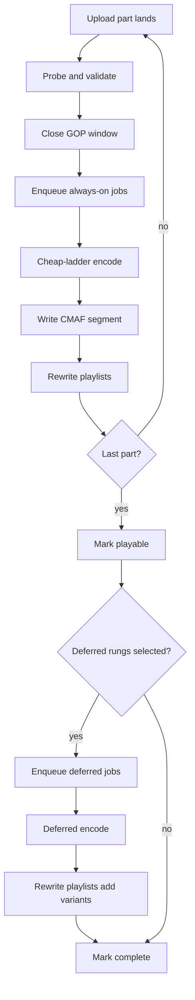

# Distributed Video Transcoding Pipeline — System Design
> - **Document Status**: Draft
> - **Last Updated**: 2026 Aug 29
> - **Author**: Paul Serban

This document is the mechanical *how* for the system described in the [Architecture Document](./02_architecture_document.md). It specifies GOP chunking, the rendition-ladder policy, priority draining, chunk-level fault tolerance, the 2-minute tail budget, and compute tiering. It does not specify code or encoder flags.

Working capacity numbers (1,200 hours/minute, ~$30/source-hour naive full ladder, ~6s segments) are **assumptions** until Phase 0 replaces them. Mechanics do not depend on the exact ingest rate; fleet size and the "is this feasible" call do.

## 1. Control Flow

Two work loops. Coupling them — one FIFO, one encode-after-EOF, one fleet — is how the 2-minute SLO dies and how the 5-hour backlog is reborn.



**Invariant:** the viewer path never waits on the deferred loop. If deferred is twelve hours deep, **expensive-rung freshness** is red; **playable-start can still be green**. That split is load-bearing.

## 2. Chunking

Chunking is a versioned compiler from a source bitstream to work units. Changing target duration or GOP policy is a pipeline migration, not an encoder preset tweak.

### 2.1 Target duration (v1)

Working default: **~6 seconds**, aligned to the next keyframe at or after the target.

| Concern | Shorter (~2s) | Longer (~10s) |
| --- | --- | --- |
| ABR switching / seek | Finer | Coarser |
| Job count (queue, retries, origin PUTs) | Higher | Lower |
| Spot-preemption waste | Lower | Higher |
| Manifest size / player playlist churn | Worse | Better |
| Overlap granularity during upload | Better | Worse |

6s is a compromise used across much of the HLS/DASH industry, not a quality discovery. Phase 0 may pick 4s for short-form-heavy mix (better overlap on 15s clips: 2s leaves ~7–8 jobs; 6s leaves ~3) or 8–10s for long-form-heavy mix (fewer jobs). **Do not pick 2s and 10s per asset in v1** unless the assembler and CDN cache keys are proven — mixed durations in one master are legal but operationally messy.

### 2.2 GOP reality (UGC will not cooperate)

Lab files have closed 2s GOPs. Production UGC has:

- 10–30s GOPs from some phone encoders.
- Open GOPs, B-pyramid, missing duration in containers.
- Variable frame rate, rotation metadata, edit lists.
- "MP4" that is MPEG-TS in a trench coat, or a file whose `moov` is at the end (the overlap-killer: you cannot probe duration until EOF unless the client uploads `moov` first or uses a fragmented source).

v1 rules:

1. Prefer **fragmented / CMAF-friendly ingest** (client or gateway writes fMP4 fragments). If the client only gives a progressive MP4 with `moov` at the end, **overlap is degraded**: the segmenter may only safely start after enough bytes *or* after a faststart rewrite. Treat "moov-at-end single PUT" as a **known SLO risk class**, metriced (`assets_no_overlap`).
2. If GOP > target duration, **mezzanine re-key** on the cheap path (insert IDR, write aligned chunks). This costs CPU and is why "segmenting is free transmux" is a lie for UGC. Budget it in the always-on fleet, not as a surprise.
3. Never split inside a coded picture. A misaligned cut is a video glitch at every ABR switch — users will call it "your player is broken."

### 2.3 Identifiers

```
job_id       = (asset_id, source_version, chunk_index, rendition_id)
segment_key  = origin/{asset_id}/{source_version}/{rendition_id}/{chunk_index}.m4s
init_key     = origin/{asset_id}/{source_version}/{rendition_id}/init.mp4
playlist_key = origin/{asset_id}/{source_version}/master.m3u8   (and analog MPD)
```

- `chunk_index` is ordered in decode/presentation time.
- Retries **overwrite the same `segment_key`** only after a successful complete PUT (or write to a temp key and swap). Partial PUTs must not become world-readable.
- `source_version` increments on replace; old keys remain until lifecycle. CDN caches make in-place mutation of `chunk_index=0` a global poison.

### 2.4 What chunking will not fix

- A client that uploads the 3-hour file as one object after encoding locally. The pipeline can still chunk **after** EOF; it cannot invent overlap.
- Audio/video drift, variable fps, broken timestamps. Those become reject or a "best-effort restamp" path with a quality flag — not a silent happy encode.
- DRM packaging, thumbnails, timed text. Separate jobs, not extra rungs in the always-on video ladder.

## 3. Rendition Ladder Policy

### 3.1 Always-on vs deferred vs skipped

Working v1 matrix. **Skipped** means never queued, not "queued at lowest priority."

| Rendition | When selected | Tier |
| --- | --- | --- |
| H.264 360p | Source height ≥ 360 (else encode at source height, still labeled honestly) | Always-on |
| H.264 720p | Source height ≥ 720 | Always-on |
| H.264 1080p | Source height ≥ 1080 **and** cheap-fleet budget allows (first shed under spike after 360/720 are healthy) | Always-on (shed-able) |
| H.264 4K | Source height ≥ 2160 **and** (priority ≥ premium **or** promotion) | Deferred |
| HEVC any rung | Promotion or premium/breaking **and** source justifies the rung | Deferred |
| AV1 any rung | Promotion with a watch-hour threshold **or** explicit editorial | Deferred |
| Any rung above source resolution | **Never** | Skipped |

"Encode 4K AV1 for a 15-second 720p story" is a policy bug. The scheduler should not need to be smart enough to skip it; the **policy must not emit the job**.

### 3.2 Promotion rule (v1, deliberately dumb)

Promote deferred rungs when **any** of:

1. Editorial / breaking flag (immediate, includes 4K H.264 if source is 4K; HEVC/AV1 still hardware-gated).
2. Creator tier in a paid/partner class (product list).
3. **Watch starts in a short window** (working: ≥ N unique starts in T minutes, T on the order of 10–30 min). N is a Phase 0/4 number; guessing N=1000 in this doc is folklore — the **mechanism** is required in v1, the threshold is config.

Demotion (stop encoding remaining deferred chunks for an asset that did not take off) is allowed. **Do not delete already-published deferred variants** unless legal takedown; cache and players already have them.

### 3.3 Audio

v1: one stereo AAC (or the platform's existing audio codec) muxed or as a CMAF audio adaptation set, produced on the always-on path with the first video rungs. Multi-language and immersive audio are out of v1 unless Phase 0 shows they are already the product. They multiply jobs the same way extra video rungs do.

## 4. Priority Scheduling

### 4.1 Classes

| Class | Who | Always-on | Deferred |
| --- | --- | --- | --- |
| `breaking` | Editorial, live-adjacent news, officially viral | Highest | Highest among deferred |
| `premium` | Paying creators, contracted media | High | High |
| `standard` | Default UGC | Normal | After hot deferred |
| `backfill` | Encoder upgrades, missing rungs, reprocess | Lowest; **must not** occupy cheap floor | Default home |

Assignment happens at asset-create and can be **raised** (never silently lowered below "we already advertised breaking" without a runbook). Popularity service may raise `standard` → a virtual `hot` that shares deferred priority with premium but does not skip the always-on line.

### 4.2 Weighted drain (always-on consumers)

Working weights when all channels have work (calibrate in Phase 2):

- `breaking`: 50%
- `premium`: 30%
- `standard`: 18%
- `backfill`: 2%

**Starvation bound:** if `standard` backlog age > `S` (working: 5 minutes), temporarily boost standard until age < `S/2`, even if breaking is non-empty — otherwise a news day **never** publishes ordinary creators and you have a different incident. Breaking still wins **head-of-line per pull batch**, but not 100% of cores forever.

`backfill` has no such boost on the cheap fleet during a spike. That is the point.

Deferred consumers use a similar scheme on their own channels and **do not** read always-on queues.

### 4.3 Shed order (ceiling hit)

When cheap fleet is at ceiling and backlog age of always-on `standard` exceeds the SLO projection:

1. Pause `backfill` (already paused).
2. Pause deferred **even if those workers are a different fleet** — already isolated; this step is for any mistaken overflow valve.
3. Stop **new** H.264 1080p always-on jobs; finish in-flight; manifests stay 360/720.
4. Page. Do not merge queues.

If after (3) 360/720 p99 is still dying, ingest is above the **funded** plant. The honest output is "we are dropping playable-start SLO" or "we reject/defer ingest for `standard`" — a product circuit breaker. Silently queueing for 5 hours is the system we are replacing.

## 5. Chunk-Level Fault Tolerance

### 5.1 Job state machine

```
queued → running → succeeded
                → failed → queued (attempt++)
                → dead_letter (attempt > N)
running → queued  (visibility timeout / preemption / worker death)
```

Ack **only** after the CMAF object is durable (checksum recorded). Losing an ack and re-encoding the same `segment_key` is acceptable (cost). Advertising in a playlist before durable is not.

### 5.2 N and poison

Working: N = 3 for cheap, N = 5 for deferred (spot). Poison (decode crash on this chunk) goes to DLQ with `chunk_index` preserved. Options: skip rung for that chunk (gap — usually **unacceptable** for always-on; creates a hole in the timeline), transcode that chunk at a lower rung only, or fail the asset's remaining always-on and mark `playable_degraded` if earlier chunks exist. v1 for always-on holes: **do not publish a master that jumps time**. Prefer fail-asset-playable-false if chunk 0 dies; if a middle chunk dies after playable, **stop extending** the playlist rather than skip — players tolerate "VOD shorter than source" better than a 6s freeze hole. This is brutal and correct. A "skip missing" option is a Phase 2 experiment with a test matrix of real players.

### 5.3 Progressive manifests

- While `uploading`, optional **event-style** playlists (growing VOD) if the player app supports them; many consumer VOD players want a complete VOD playlist. Working v1: **do not expose public playable URL until always-on segments 0..last_closed exist after EOF**, except for an internal preview. Overlap still **computes** during upload so EOF→playable is the tail.
- After EOF: write complete VOD playlists for existing rungs; add variants as deferred completes.
- **Never** list `chunk_index=k` until `succeeded` for that job.
- Playlist generation number in query string or filename for cache bust on each rewrite that adds the playable flag.

### 5.4 Idempotency

The metadata unique key is `job_id`. Two workers racing (visibility timeout too aggressive) must both try to write the same object; last-success wins if checksums match the encoder contract (same encoder version + same mezzanine ⇒ same checksum, or accept either if bitexact is not guaranteed — then **first durable wins**, second worker checks origin exists and acks). Non-bitexact encodes (threads, GPU) mean **do not compare checksums across attempts**; compare `job succeeded` flag. Bitexact is a CPU-x264-maybe; it is not AV1-GPU.

## 6. Latency Budget (the 2-minute tail)

SLO: **playable-start p99 ≤ 120,000 ms** after `upload_completed_at`, measured at "CDN in a well-connected POP can GET a master playlist that lists the always-on ladder through the last chunk, and GET segment 0." Generation of deferred rungs is **out of that budget**.

The budget **assumes overlap did the rest**. If `assets_no_overlap` is high, this ledger is fiction and the SLO must be scoped to short files or the ingest protocol must change.

Working ledger for the **last chunk + publish** (allocations, not measurements — calibrate in Phase 2):

| Stage | p50 target | p99 allocation | Notes |
| --- | --- | --- | --- |
| Complete last part, close last GOP, probe | 200 ms | 2 s | moov-at-end rewrite can blow this — that is a protocol bug |
| Enqueue + wait in always-on (healthy) | 50 ms | 5 s | If this is minutes, isolation or floor failed |
| Mezzanine re-GOP of last window if needed | 200 ms | 8 s | Long GOP on last 6s |
| H.264 360p last chunk | 0.5–3 s | 15 s | Hardware-dependent; 1× realtime on 6s = 6s |
| H.264 720p last chunk (parallel with 360p) | 1–6 s | 25 s | Wall clock ≈ max(rungs), not sum, if parallelized |
| H.264 1080p last chunk (parallel, shed-able) | 2–10 s | 40 s | May skip under shed; SLO does not require it |
| Origin PUT + checksum | 50 ms | 2 s | |
| Playlist rewrite + durable | 50 ms | 2 s | |
| CDN cache miss of playlist + segment 0 | 100 ms | 15 s | **Regional**; transoceanic + cold POP can exceed — see below |
| **Slack** | | **remainder to 120 s** | Queue wait eats slack first in incidents |

Wall clock of parallel last-chunk rungs is the max. 360p+720p in parallel on two encode slots is the SLO shape; serializing them on one core is how a "small" last chunk misses.

**CDN honesty:** 15s p99 for origin-pull in-region is plausible. A first viewer in a distant POP on a bad path may see more. v1 SLO is **playable at origin + in-region CDN**. Global worst-POP is a Phase 4 measurement; if product demands it, **prefetch breaking** and accept that `standard` is origin-pull. Do not hide this in "distributed to edge CDNs within 2 minutes" without a POP definition.

**Where margin actually lives:** overlap (so last chunk is ~6s of source, not 3 hours), parallel cheap rungs, warm workers (no cold pull of a 4-minute container image), short playlist TTL already primed by **internal** HEAD/GET after publish (origin toaster: the assembler fetches its own playlist through the CDN or a warm cache — optional, cheap).

If cheap queue wait is 90s, encoder quality is irrelevant. Instrument wait vs encode vs CDN separately or the dashboard will lie.

## 7. Compute Tiering

### 7.1 Mapping (v1)

| Job class | Hardware | Scaling signal | Floor | Ceiling |
| --- | --- | --- | --- | --- |
| Always-on H.264 ≤1080p, 30 fps | Dense CPU or dedicated encoder ASIC/NVENC if cheaper at Phase 3 bake-off | Backlog **age** of always-on channels (p95), then depth | Sized to **p50** always-on encode-minutes | Budgeted $ and quota; SLO shed order before raising |
| Always-on high fps (60/120) H.264 | Same pool or a "fast" CPU/GPU subset | Same queues, **weighted job cost** so one 120fps 1080p chunk counts as multiple tokens | Included in floor via cost-weighted p50 | Same |
| Deferred HEVC/AV1/4K | GPU or ASIC; Spot/preemptible VMs acceptable | Deferred backlog age; **spend cap** | **Zero** | Spend cap; GPU quota |
| Mezzanine re-GOP | Cheap fleet | Bundled with always-on | In floor | In ceiling |

**Job tokens:** a 6s 360p 30fps H.264 job = 1 token; 1080p 30fps ≈ 4; 1080p 120fps ≈ 12; 4K 120fps AV1 ≈ a large number measured in Phase 0, not guessed in a table. Scheduling without tokens is how one 4K file looks like "12 jobs" and starves 2,000 clips that were also "12 jobs."

### 7.2 Autoscaling mechanics

- **Do not scale on average CPU** of a mixed cluster.
- Scale-up cheap fleet when always-on `standard` **age** > `A_up` (working: 30s) for `T` (working: 2 min), capped by ceiling.
- Scale-down only when age < `A_down` and depth low for a **long** window (working: 20–30 min), never below floor. Oscillation is a cost and SLO tax.
- Spot deferred: aggressive scale-up is fine; preemption is expected. Do not scale deferred because always-on is in trouble.

### 7.3 Cold start

A worker image that takes 3 minutes to become useful cannot participate in a 2-minute SLO. Cheap-fleet scale-up is only useful for **the next** files if the image is pre-cached and the process is hot (floor). Burst that is "launch 2,000 nodes from AMI" is for a **sustained** spike (tens of minutes), not for the file that completed 30 seconds ago. This is why the floor exists and why "elastic" is not "from zero."

## 8. Observability Minimum

If these do not exist, the system is not in production; it is a demo that got 1,200 hours/minute of hope.

- `playable_start_ms` histogram (p50/p95/p99) sliced by priority class, duration bucket, `overlap=true/false`.
- Always-on vs deferred **backlog age** and depth, per class.
- Job wait vs encode vs PUT time, per `rendition_id` and hardware class.
- `assets_no_overlap`, `assets_shed_1080p`, `jobs_dead_letter`, `jobs_preempted`.
- Encode-minutes and **$** per source hour, per rung (actual).
- Promotion rate and deferred freshness (`promoted_at → variant_in_playlist`).
- CDN: origin 4xx/5xx on segment GETs (playlist advertised missing file), playlist TTFB by POP.
- Canaries: 15s clip and 3-min fixture uploaded on a clock; page if playable-start misses.

Logs of source bytes are **content**. Sample metadata; do not dump bitstreams into the log pile.

## 9. Error Handling

- **Part upload fail:** client retries part; no job for incomplete GOP.
- **Validate fail:** `rejected`; no jobs; source lifecycle-expire.
- **Encode fail:** retry then DLQ; always-on hole policy in §5.2.
- **Origin PUT fail:** do not ack; retry job.
- **Assembler fail:** do not flip `playable`; page. Stale last-good playlist is OK if it does not list new missing segments.
- **CDN 404 on listed segment:** SEV — halt promotions, freeze assembler deploys, compare playlist generation vs origin. This is worse than a backlog.
- **Priority subsystem fail:** **fail closed to isolated default** (`standard` always-on only), never "open the FIFO to all jobs including backfill."
- **Spend cap hit on deferred:** stop pulling deferred; metric red; always-on untouched.

## 10. Caching (CDN and origin)

Allowed:

- Immutable segment objects, long TTL, key contains version.
- Short TTL or must-revalidate on master/variant/MPD.
- Optional internal warm GET after playable flip for in-region POP.

Forbidden:

- Caching playlists for hours (hides playable flip; also hides emergency takedown).
- Mutating a segment key's bytes in place.
- Pushing every asset to every POP.
