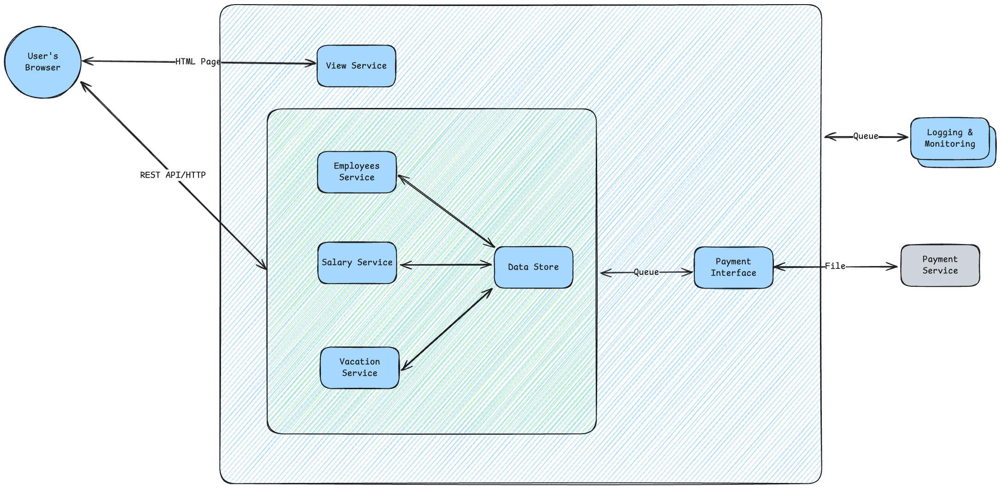
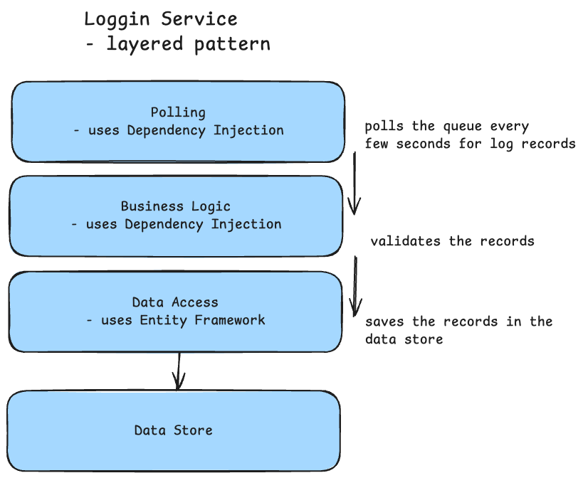

# Dunderly - Your Paper Source
- this business sales paper supplies such as printer paper, envelopes, and notepads, as well as office supplies like pens, staplers, and organizers.
- the business expands and needs a new HR system to manage employee records, payroll, vacations, and benefits.

## Requirements
### Functional Requirements (What the system should do)
- web based
- perform CRUD operations on employee records
- manage salaries
  - asllow manager to ask for employee's salary change
  - allow HR manager to approve / reject requests
- manage vacation days
- use external payment system to process payroll
- generate reports for management

Functional Requirements Summary
- Web based
- Perform CRUD operations on employee records
- Manage salaries
  - allow manager to ask for employee's salary change
  - allow HR manager to approve / reject requests
- Manage vacation days
- Use external payment system to process payroll
- Generate reports for management

### Non-Functional Requirements (What the system should deal with)
What we know:
- classinc information system
- not a lot pf users
- not a lot of data
- there should be an interface to external system

What we ask?
- How many users will use the system concurrently?
  - ~10 users
- How many employees will be managed in the system?
  - ~250 employees
- What is the expected data growth over time?
-  - low growth rate
- What we know about the external payment system?
  - Legacy system, written in C++
  - Hosted on the company's own servers
  - Input - only via files (CSV) - no API, no DB connection
  - Files are received once a month

Data Volume
  - 1 employee record =~ 1 Mb
  - Each employee has =~ 10 scanned documents (contracts, certificates, etc.)
  - 1 scanned document =~ 5 Mb
  - Total storage per 1 employee =~ 1 + 10 * 5 = 51 Mb
  - Company expects to grow to 500 employees in the next 5 years
  - Total storage for 500 employees =~ 500 * 51 Mb = 25500 Mb = ~25 Gb
  - Not a lot of data, but:
    - Need to consider document storage and backup strategy

SLA (Service Level Agreement)
  - How critical is the HR system for the business operations?
    - Not critical, but important
  - What is the acceptable downtime for the system?
    - Max 4 hours per month
  - What is the acceptable response time for user actions?
    - Max 2 seconds for any action
  - What are the backup and recovery requirements?
    - Daily backups
    - Recovery time objective (RTO) - max 4 hours
    - Recovery point objective (RPO) - max 1 hour

Non-Functional Requirements Summary
  - Low number of concurrent users (~10)
  - Management of ~500 employees
  - Low data volume (~25 Gb in 5 years)
    - Relational & Unstructured data (documents)
  - Not mission-critical system
  - File-based integration with legacy payment system

## Executive Summary
- Web-based HR system for managing employee records, salaries, and vacations.

## Components
Based on [the requirements](#requirements), the following components can be identified for the HR system:

1. Employees Service
   - performs CRUD operations on employee records
   - manages employee documents
2. Salary Service
   - salary approval workflow
   - salary management
3. Vacation Service
   - employee's vacation management
4. View Service
   - returns static files to the browser (HTML, CSS, JS)
5. Payment System
6. Payment Interface
   - sends data to the payment system in the required format (CSV files)
7. Data store
  - Q: single or per service data store?
  - A: data is shared between services, so a single data store is preferred
8. Loggning & Monitoring Service
  - collects logs from all services

### Messaging System

### Scalling

## Services Drill Down

### Logging & Monitoring Service
Questions:
- Is there an exiting logging mechanism in the company? - No
  - The company so far designed silo systems that do not share logging mechanisms
- Should we develpo a custom logging solution or use an existing one? - Design a custom solution
  - Steps:
    - Decide an Appliation Type
    - Decide on Technology Stack
    - Design the Architecture
  - Application Type
    - What it does:
      - Read log records from queue
      - Handle the records (store, analyze, alert)
      - Save logs to persistent storage (database, file system, etc.)
    - Console OR Service
      - Console - NO GO - not suitable for production systems
      - Service - YES - suitable for production systems
  - Technology Stack
    - Programming Language / Components Code
      - What should the code do? - .NET Service - YES - already used in the company
        - Access Queue's API to read log records
        - Validate log records
        - Store log records in persistent storage
      - What us the curret technology stack in the company?
        - Backend - Microsoft stack (.NET, SQL Server)
    - Data Store - SQL Server - YES - already used in the company
      - What type of data store?
        - Relational Database - YES - suitable for structured log records
        - NoSQL Database - NO GO - not suitable for structured log records
  - Architecture Design
    - Long runnig process with no UI and no API exposed to the outside world.
    - Suggestion: Tweak the classic layered pattern
    - Layers:
      - Polling Layer
        - Responsible for reading log records from the queue system.
        - Should implement a polling mechanism to continuously check for new log records.
      - Business Layer
        - Responsible for processing log records.
        - Should perform record validation and any necessary transformations.
      - Data Access Layer
        - Responsible for storing log records in the database.
      - Data Store Layer
        - Represents the SQL Server database where log records are stored.
  - Redundancy & Scalability
    - Redundancy
      - Deploy 2 instances of the logging service.
      - Use Active-Active configuration.
      - Use Is-Alive mechanism to monitor instances and switch traffic if one instance fails to avoid duplicate log records.
    - Scalability
      - Use Queue system to decouple log producers from log consumers.
      - Scale out by adding more instances of the logging service as needed.

#### Logging - Alternative
- ELK Stack (Elasticsearch, Logstash, Kibana) - NO GO - it is an overkill for this case
  - Pros:
    - Powerful search and analytics capabilities (Elasticsearch)
    - Import log from many sources (Logstash)
    - Great viewer with filter capabilities (Kibana)
    - Scalable and flexible architecture
    - Open-source with a large community
  - Cons:
    - Requires setup and maintenance
    - Quite complicated to install and setup
    - Can be resource-intensive
    - Suitable mainly for large, data-intensive applications