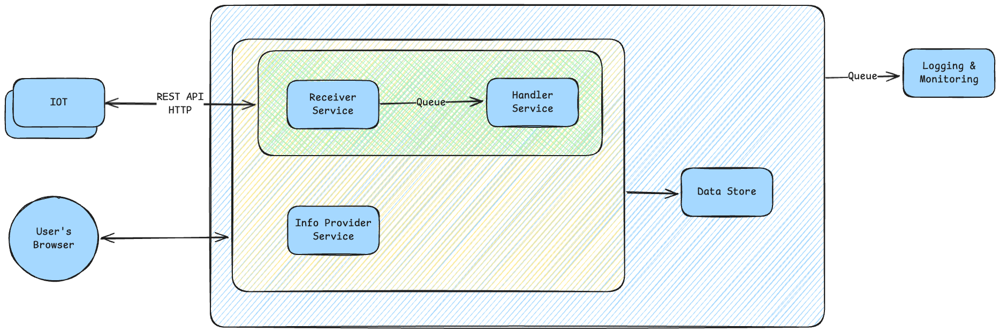
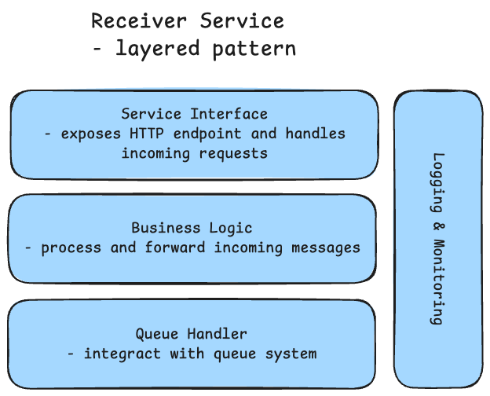
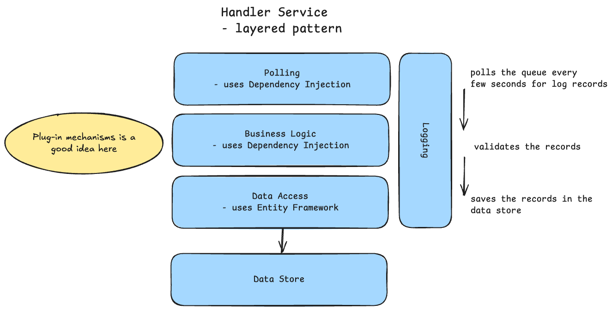

# IOToo - IOT. Controled

> FROM: "The Complete Guide to Becoming a Software Architect" on Udemy

## Overview

IOToo developes a dashboard system that reports in real-time various sensor data from multiple IoT devices that are managed by the users.

> IOT stands for Internet of Things and refers to the network of physical objects (devices, vehicles, buildings, etc.) that are embedded with sensors, software, and other technologies to connect and exchange data with other devices and systems over the internet.
> Example: Smart Home monitoring system that tracks temperature, humidity, air quality, and energy consumption from various sensors placed around the house. The dashboard provides real-time updates and historical data analysis to help users optimize their home's environment and energy usage.

Each on of the devices has it's pwn app, and can be managed from smartphone. This creates a problem for the users, as they have to switch between multiple apps to monitor and control their devices - IOToo solves this problem by providing a unified dashboard that aggregates data from all devices and presents it in a user-friendly interface.

In addition to real-time monitoring, IOToo allows users to set up alerts for specific conditions (e.g., high temperature or low air quality) and provides recommendations for improving energy efficiency based on the collected data. The system is designed to be scalable, allowing for easy integration of additional sensors and devices as needed.

## Important Aspects

- Phase 1:
  - Read only dashboard with real-time data visualization.
  - The launch customers will be entered manually in the database by the sales team followin an intensive verification process.
  - The system does not have a verification process and you can assume that the devices are already registered and verified.

> This document describes the systems architecture and design for the IOToo dashboard system, focusing on the key components, interactions, and technologies used to meet the functional and non-functional requirements.
> The architecture comprises of technolohy and modeling decisions, that will ensure the final product, assuming the architecture is followed, will be fast, reliable, scalable and maintainable.

## Requirements

### Functional Requirements (What the system should do)

- Receive status updates from multiple IoT devices.
- Store sensor data in a database for historical analysis.
- Allow users to view real-time data on a dashboard.
- Provide ways to query historical data based on time ranges and sensor types.

### Non-Functional Requirements (How the system should perform)

- What we know
  - Messages are reveived from IOT devices
  - Probably there are a lot of messages - How many devices are we talking about?
  - Affects the load - How many concurrent messages should we expect?
  - Affects the data volume - Hoe many messages should be stored in the database?

- What we ask?
  - How many concurrent messages should we expect in peak times? ~ 500
  - What is the total number of expected messages per month? ~ 15 million
  - What is the average size of a message? ~ 300 bytes
  - How long should the data be stored in the database? ~ 2 years
  - What is the expected response time for real-time data on the dashboard? ~ 2 seconds

- Calculations
  - Data volume per month: 15 million messages \* 300 bytes = 4500 Mb
  - Data volume for 1 years: ~ 4500 Mb \* 12 = 54 Gb / year
  - Data volume for 2 years: ~ 54 Gb \* 2 = 108 Gb
  - Peak load: 500 messages / second \* 300 bytes = 15000000 bytes/second = ~15 Mb/second

- Message Loss
  - The system should be designed to handle message loss gracefully, ensuring that critical data is not lost during peak times or network issues.
  - Messages can be lost as long as the system is up to receive new messages and process them in real-time.
  - The system is tolerant to message loss, but it should implement mechanisms to minimize data loss during peak loads or network disruptions.

- Users
  - How many users will the system have? ~ 2 million users
  - How many concurrent users should we expect? ~ 40 concurrent users
  - How many concurrent requests should we expect on the dashboard? ~ 540 requests/second
  - What is the expected response time for historical data queries on the dashboard? ~ 5 seconds

- SLA (Service Level Agreement)
  - What is the maximum downtime allowed per month? ~ 99.9% uptime (100% is an impossible idealSS)
  - What is the maximum response time for real-time data on the dashboard? ~ 2 seconds
  - What is the maximum response time for historical data queries on the dashboard? ~ 5 seconds
  - Shold have the SLA Software Levels
    - Silver
    - Gold
    - Platinum
      - fully stateless, easily scaled out, logging & monitoring

## Executive Summary
This document describes the  architecture of yhe IOToo application, an innovative breakthrough in the IoT industry that provides a unified dashboard for monitoring and controlling various IoT devices. The architecture is designed to meet the functional and non-functional requirements, ensuring scalability, reliability, and maintainability.

For example, using IOToo application, the user can find whether all the cameras in his smart home are functioning correctluy, and if not - whta is the reason for that.

When designing the architecture, a strong emphasis was put on two major features:
- the application should be reliable
- the application should be extremely fast

To achieve these features, the architecture is based on the most up-to-date practices and methodoligies, ensuring high availability and performance.



As can be seen in the diagram, the applicatino is comprised of four separate independent, loosly coupled services, each has it's own task, and each communicates with the other services using standard protocols and well-defined APIs.

All the services are built as stateless services, meaning - no data is lost if service is suddenly shutting down. The only places for data in the application are the Queue and the Data Store (Database), both of them serializes the data to the disjm thus protecting it from cases of sudden shutdowns.

This architecture in conjunction with modern development platform (.Net Core), will help create a modern, robust, easy to maintain, and reliable system that can serve the compny successfully for years to come, and helps it to achieve it's business goals.

## Components

> what are the components that are part of the system while rememebering that each component is an autonomous piece of code that runs in its own process and communicates with other components via well-defined APIs.

Based on [the requirements](#requirements), the following components can be identified for the IOToo system:

1. Receiver Service
   - Responsible for receiving messages from IoT devices.
   - Handles high throughput and ensures messages are processed in real-time.
   - Receives the status updates from various devices, and adds them to the Queue system for further processing by the Handler Service. The Receiver Service puts a strong emphasis on performance, and its main task is to make sure the update was received and stored. It does not make any action on the update, this is the role of the Handler Service.

2. Handler Service
   - Handles different formats from various IoT devices.
   - Validates, processes and parses, and saves incoming sensor data in the database.
   - Will receive messages from 4 types of devices (& formats): 3 use JSON, 1 uses fixed-format strings - VALIDATION is required.
   - Data in database should be indepented ot the device type and format, fully accessible, extremely important when data is received from multiple sources.

3. Info Provider Service
   - Waits for user requests from the dashboard.
   - Queries the database for historical data based on user-defined time ranges and sensor types.

4. Logging and Monitoring Service

   - Monitors the health and performance of the system.
   - Logs important events and metrics for analysis and troubleshooting.
   - Aggregates all the logs genertaed by the various services to enable a unified view of all event in the system.

5. Database
   - Stores sensor data for historical analysis.
   - Optimized for read and write operations to handle high throughput and low latency requirements.
   - Communicates with both the Handler Service and Info Provider Service.

### Messaging System

- Note: The IOT devices communicate via HTTP REST API with POST requests.
- The various services communicate with each other using various messaging methods. Each method was selected based on the specific requirements from the services.
- The **Receiver Service** exposes REST API/HTTP endpoint to receive messages from IoT devices - the reason for tha is quite simple: IoT devices are limited in their capabilities, and REST API is a widely supported protocol that is easy to implement on various devices.
- The **Receiver Service** will then forward the messages to the **Handler Service** for processing via a Queue system (e.g., RabbitMQ, Apache Kafka) to handle high throughput and ensure message durability.
  - REST would cause a lot of work on the Handler Service side if it gets overwhelmed with messages.
  - Using a messaging system allows for better load balancing and decouples the Receiver Service from the Handler Service.
  - The queue uses a fire and forget mechanism, meaning that once a message is sent to the queue, the Receiver Service does not wait for an acknowledgment from the Handler Service.
- The **Info Provider Service** will communicate directly with the Database to fetch historical data based on user requests from the dashboard.
- The **Info Provider Service** will be accessed by the end-users via a Web UI (dashboard) and will expose RESTful APIs for the dashboard to interact with.
- The **Logging and Monitoring Service** will collect logs and metrics from all other components via RESTful APIs or other suitable protocols.
  - Logs can be heavy, so it's important to ensure that the **Logging and Monitoring Service** can handle high volumes of log data without impacting the performance of other components.
  - Options: Database or queue system for log storage and processing.
  - Consider using a Queue system for log processing to handle high volumes of log data efficiently.
    IMPORTANT: Ensure that the IT departmante is aware of queues systems and are able to maintain them.

### Scalling
This architecture allows for easy scaling of individual components as needed. Since each service is laser-focused on a specific task, single task, each can be scaled independently, either automatically (by service managers such as Kubernetes) or manually (by IT department).

In addition, the service's inner code is fully stateless, allowing scaling to be performed on a live system, without chaning any lines of code or shutting down any services.

## Services Drill Down
### Logging and Monitoring

- very important for SLA compliance and system health.
- it is worng to leave logging and monitoring as an afterthought.
- should be designed from the beginning as a core component of the system.
- all the other built services shold be built in way that includes logging and monitoring capabilities.
- the logging service reads from a queue system to avoid overloading the other services.

Steps:

- decide on the application type
- decide on he technology stack
- design on the architecture pattern

What it does:

- read log records from the queue system
- should perform record validation
- should store the log records in a database

- Application Type: Service (no UI and managed by some service manager) (can also be a Console Application)
- Technology Stack:

  - Team is familiar with C# and .NET Core.

  - Code:

    - Shold be able to access Queue's API and store data in a database.
    - Decided to use C# and .NET Core for the Logging and Monitoring Service.

  - Database:
    - Team is familiar with SQL Server.
    - Decided to use SQL Server for storing log records.

Architecture Pattern:

- Long runnig process with no UI and no API exposed to the outside world.
- Suggestion: Tweak the classing layered pattern
- Layers:
  - Polling Layer
    - Responsible for reading log records from the queue system.
    - Should implement a polling mechanism to continuously check for new log records.
  - Business Layer
    - Responsible for processing log records.
    - Should perform record validation and any necessary transformations.
  - Data Access Layer
    - Responsible for storing log records in the database.
  - Data Store Layer
    - Represents the SQL Server database where log records are stored.


### Receiver Service

- What it does:

  - Receoives messages from IoT devices via HTTP POST requests.
  - Forwards messages to the Handler Service via a Queue system.

- Application Type: Web API
- Technology Stack:
  - Team is familiar with C# and .NET Core.
  - .NET Core is well-suited for building high-performance web APIs.
  - Decided to use C# and .NET Core for the Receiver Service.

Architecture Pattern:

- Classic layered pattern for Web APIs with well-defined layers.
- Layers:
  - Service Interface Layer
    - Exposes HTTP endpoints to receive messages from IoT devices.
    - Handles incoming HTTP POST requests and extracts message data.
  - Business Layer
    - Responsible for processing incoming messages.
    - Forwards messages to the Handler Service via the Queue system.
  - Queue Handler Layer
    - Responsible for interacting with the Queue system.
    - Implements logic to send messages to the Queue.
  - Logging Layer (Cross-cutting Concern)
    - Responsible for logging important events and metrics.
    - Sends log records to the Logging and Monitoring Service via the Queue system.

Non-Functional Requirements:

- Load: 500 messages/second during peak times.
  - Complaint: Yes - Architecture is stateless, easily scaled out horizontally, service is lightweight and simple.
- Message loss: Tolerant to message loss, but should minimize data loss during peak loads or network disruptions.
  - Complaint: Yes - REST API is quire reliable, very low chance of errror in such simple service.



### Handler Service

- What it does:
  - validates messages, paarses messages, stores messages in data store
  - messages wait in a queue system to be processed
- Application Type: Service (no UI and managed by some service manager) (can also be a Console Application)
- Technology Stack:
  - Team is familiar with C# and .NET Core.
  - Decided to use C# and .NET Core for the Handler Service.
- Database:
  - Team is familiar with SQL Server.
  - Decided to use SQL Server for storing sensor data.
    Architecture Pattern:
- Long running process with no UI and no API exposed to the outside world.
- Suggestion: Tweak the classing layered pattern
- Layers:
  - Service Interface Layer
    - Polling Layer
      - Responsible for reading messages from the Queue system.
      - Should implement a polling mechanism to continuously check for new messages.
  - Business Layer
    - Responsible for processing messages.
    - Should perform message validation, parsing, and any necessary transformations.
  - Data Access Layer
    - Responsible for storing sensor data in the database.
  - Data Store Layer
    - Represents the SQL Server database where sensor data is stored.
  - Logging Layer (Cross-cutting Concern)
    - Responsible for logging important events and metrics.
    - Sends log records to the Logging and Monitoring Service via the Queue system.



### Info Provider Service

- What it does:
  - allows end-users to query historical data
- What it does not:
  - it does not display the data - that is the dashboard's responsibility
- Application Type: Web API
- Technology Stack:
  - Team is familiar with C# and .NET Core.
  - .NET Core is well-suited for building high-performance web APIs.
  - Decided to use C# and .NET Core for the Info Provider Service.

Architecture Pattern:

- Classic layered pattern for Web APIs with well-defined layers.
- Layers:
  - Service Interface Layer
    - Exposes HTTP endpoints to allow users to query historical data.
    - Handles incoming HTTP requests and extracts query parameters.
  - Business Layer
    - Responsible for processing user requests.
    - Validates query parameters and implements business logic for data retrieval.
  - Data Access Layer
    - Responsible for interacting with the database.
    - Implements logic to query historical data based on user-defined time ranges and sensor types.
  - Data Store Layer
    - Represents the SQL Server database where sensor data is stored.
  - Logging Layer (Cross-cutting Concern)
    - Responsible for logging important events and metrics.
    - Sends log records to the Logging and Monitoring Service via the Queue system.


API Architecture:

- Get current status of devices for specific device and entire house.
- Past events for specific device and entire house.

- Required functionality:

  - Get all the **updates** for a specific **house's devices** for a given **time range**.
  - Gte the updates fir a specifc device for a given time range.
  - Get the current status of all devices ina specifc house.
  - Get current status of a specific device.

- API Design:

| Endpoint                 | Method | Description                             | Parameters      | Return Code   |
| ------------------------ | ------ | --------------------------------------- | --------------- | ------------- |
| /api/device/`{deviceId}` | GET    | Get current status of a specific device | deviceId (path) | 200, 404, 500 |
```json
{
  "deviceId": "string", // ("17", "sensor-xyz")
  "type": "string", // ("thermostat", "humidity-sensor", "air-quality-monitor", "energy-meter")
  "houseId": "string", // ("house-123", "home-456")
  "value": "number", // (e.g., 22.5, 45, 300, 1500)
  "timestamp": "string" // ("2023-01-31T12:34:56Z")
}
```

| Endpoint                                                       | Method | Description                                                  | Parameters                               | Return Code   |
| -------------------------------------------------------------- | ------ | ------------------------------------------------------------ | ---------------------------------------- | ------------- |
| /api/house/`{houseId}`/devices/updates?from=`{from}`&to=`{to}` | GET    | Get all updates for a house's devices for a given time range | houseId (path), from (query), to (query) | 200, 404, 500 |
```json 200
{
  "houseId": "string", // ("house-123", "home-456")
  "from": "string", // ("2023-01-01T00:00:00Z")
  "to": "string", // ("2023-01-31T23:59:59Z")
  "updates": [       // Array of device update objects
    {
      "deviceId": "string", // ("17", "sensor-xyz")
      "type": "string", // ("thermostat", "humidity-sensor", "air-quality-monitor", "energy-meter")
      "value": "number", // (e.g., 22.5, 45, 300, 1500)
      "timestamp": "string" // ("2023-01-31T12:34:56Z")
    }
  ]
}
```
- houseId, devices and updates are actual entities in the database
- from and to are time-range parameters, not entities

```json 404
{
  "error": "House not found"
}
```

```json 500
{
  "error": "Internal server error"
}
```

| Endpoint                                      | Method | Description                                           | Parameters     | Return Code   |
| --------------------------------------------- | ------ | ----------------------------------------------------- | -------------- | ------------- |
| /api/house/`{houseId}`/devices/status/current | GET    | Get current status of all devices in a specific house | houseId (path) | 200, 404, 500 |
```json
{
  "houseId": "string", // ("house-123", "home-456")
  "status": [         // Array of device status objects
    {
      "deviceId": "string", // ("17", "sensor-xyz")
      "type": "string", // ("thermostat", "humidity-sensor", "air-quality-monitor", "energy-meter")
      "value": "number", // (e.g., 22.5, 45, 300, 1500)
      "timestamp": "string" // ("2023-01-31T12:34:56Z")
    }
  ]
}
```

```json 404
{
  "error": "House not found"
}
```

```json 500
{
  "error": "Internal server error"
}
```